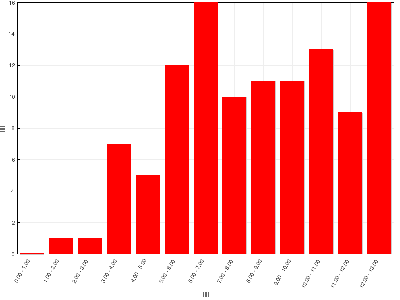

习题讲解
========================

本章内容相对简单，在线习题的难度也不算大，但错误率不低。大家在线学习时请一定注意细节，
遇到不太明白的地方一定多讨论，多沟通。

=======   =============
总分        13
平均分      7.91(60.8%)
最高分      13(100.0%)
=======   =============

  成绩分布

这里稍稍讲解一下在线习题中错误率较高的，以及课本习题中相对比较有意思的题目。

在线习题
------------------

题2：命名（错误率58.0%）
  .. image:: ../../images/C02-Exercises/A02_00.png

  严格意义上是个环烷烃（有个小三元环），但环特简单而链特复杂，因此这里明显应反其道而行之，以最长碳链作为母体，按开链烷烃的原则进行命名。

  最长碳链的编号方式，无非从左向右（棕色）从右向左（绿色）两种，如下图：

  .. image:: ../../images/C02-Exercises/A02_01.png

  这两种编号方式侧链取代基分别在3,7,8-位与6,7,11-位，明显应当取前者，自左向右的编号。3-位乙基、8-位甲基都好办，7-位有一个比较大的
  复杂取代基，没法儿直接称呼出来。按照系统命名法的原则，把这个取代基单抽出来，从与母体相连的碳开始，找一条最长碳链并编号，如下图：

  .. image:: ../../images/C02-Exercises/A02_02.png

  易得此复杂取代基应称为1-甲基-3-环丙基戊基。最终整个分子命名为：\ **8-甲基-3-乙基-7-(1-甲基-3-环丙基戊基)十三烷**\ 。注意
  这里列出取代基的次序：先小后大。

  .. image:: ../../images/C02-Exercises/A02_03.png

题3：命名（错误率63.4%）
  .. image:: ../../images/C02-Exercises/A03_00.png

  典型的取代螺环烷烃。固定的编号原则：从小环螺原子\ **旁侧**\ 的原子开始，绕小环一周至螺原子，再绕大环一周。
  满足这一原则的前提下，尽量使取代基位次较小。对于这个分子，明显应当取如下编号方式：

  .. image:: ../../images/C02-Exercises/A03_01.png

  注意这里5-6的编号。小环编完，进入大环时并无方向上的要求，向左上或向左下走都可以，但需满足取代基位次最小的原则。
  事实这两个环并非在同一平面，而是互相正交，这种编号的随意性也就不难理解了
  （详见 :doc:`立体化学一章重点小结：无手性中心的手性分子<../C03/KeyPoints07-ChiralMoleculesWithoutChiralCenter>` ）。

  最终，整个分子名称为：\ **6-甲基-8-异丙基-2-叔丁基螺[4.5]癸烷**\ 。
  各取代基仍旧需要按优先级从小到大列出。此外，方括号分隔数字的应是\ **点号**\ 而非逗号。

  .. image:: ../../images/C02-Exercises/A03_02.png

题4：命名（错误率65.2%）
  .. image:: ../../images/C02-Exercises/A04_00.png

  典型的取代桥环烷烃。这类分子依然有固定的编号原则：从某一桥头碳开始，先沿最长边至另一桥头碳，再顺次走过次长边，最后是最短边。
  满足这一原则的前提下，同样需要尽量使取代基位次较小。于是我们易得如下的编号方式：

  .. image:: ../../images/C02-Exercises/A04_01.png

  最终，整个分子命名为：\ **2,8-二甲基-6-乙基二环[3.2.1]辛烷**\ 。

  .. image:: ../../images/C02-Exercises/A04_02.png

.. note::

  烷烃的命名是整个有机化合物系统命名的基础。关于命名的更多讨论，请见 :doc:`重点小结：系统命名<KeyPoints01-Naming>` 。

题7：排序（错误率25.9%）
  请按沸点由高至低顺序排列下列化合物：

    (A) 3,3-二甲基戊烷

    (B) 2-甲基己烷

    (C) 正庚烷

    (D) 正戊烷

  开链烷烃的熔沸点变化非常有规律，尤其沸点。一般来说，碳原子数目越多、分子量越大的烷烃，由于分子间范德华力增强，沸点会越高。而
  同碳数的烷烃，通常支链越多，分子间距离增大，沸点会越低。

  依据这两个原则，回头看这四个分子，A、B、C都是七碳，D是五碳，因此D的沸点应当最低。至于A、B、C，分子量相同而支链数目不同。
  我们易得这四个分子沸点由高至低次序应为：\ **C > B > A > D**\ 。

题9：排序（错误率55.4%）
  请按熔点由高至低顺序排列如下化合物：

    (A) 2,2-二甲基丙烷
    (B) 2-甲基丁烷
    (C) 戊烷

  和前一题有点儿类似，只不过考察的是熔点而非沸点。基本规律还是相仿：分子量越大一般熔点越高、同分子量支链越多一般熔点越低。但需要特别
  留神，对于某些对称性特别好的多支链烷烃，其分子晶体内晶胞可以堆积地更紧密，熔点反而要比直链烷烃来得更高。本题中A就是典型的这么一个
  对称性特好的分子。因此本题答案应为：\ **A > C > B**\ 。

.. note::

  关于烷烃的熔沸点的更多讨论，尤其对称性对熔点的影响，请见 :doc:`重点小结：开链烷烃的物理性质<KeyPoints02-PhysicalProperties>` 。

题10：反应（错误率44.6%）
  .. image:: ../../images/C02-Exercises/A10_00.png

  环烷烃与溴加热条件下的反应。不少同学认为会开环，发生加成。但注意到底物分子中是个比较稳定的五元环，除非在特别高的温度下，否则这个环不容易打开。
  因此实际进行的主要反应，是加热条件下溴生成自由基，而后引发自由基卤代。

  确定了基本的反应走向后，我们还需要解决一个问题：底物分子中有一大堆化学环境不同的氢，这里溴究竟主要会取代哪一个。这个问题其实也很明晰，我们知道
  自由基卤代时，三种氢的活性规律是\ **叔>仲>伯**\ ，尤其溴代选择性较高，三种氢的活性相差更为悬殊。因此咱们这儿确定，主要取代的一定是整个分子里
  唯一的一个叔氢。于是得到解答：

  .. image:: ../../images/C02-Exercises/A10_01.png

.. note::

  看到有同学提交的答案里产品中有好些个溴原子，觉得自由基溴代时会不会出现多取代的产物。
  这里答案实际是肯定的，该反应总会有多溴代产品生成。但平时练习或者考试时，如果没有特别指出反应物的量的话，
  我们一般认为这两者就是1:1的反应，也就是认为主要发生单次取代。类似这样的反应题，我们只需要写出主要产物就成，
  次要或者副产物通常都不用多管。

题11：反应（错误率35.7%）
  .. image:: ../../images/C02-Exercises/A11_00.png

  和前一题有点儿类似，又是环烷烃，这次是与HBr反应，而且是在常温进行。常温下，尤其HBr分子，一般不会产生卤素自由基了，我们这儿确定，一定发生的
  是开环加成。

  底物分子中两个环：三元与六元。六元环又是比较稳定，常温下一定不会发生变化，这儿肯定是小环三元环打开。主要产品的断键方向，包括H/Br各自加成的位置
  皆遵循马氏规则，我们将得到如下结果：

  .. image:: ../../images/C02-Exercises/A11_01.png

题12：反应（错误率45.5%）
  .. image:: ../../images/C02-Exercises/A12_00.png

  催化氢化反应。明显，这里稳定的五元环还是不发生变化，依然是小三元环开环。值得注意的是，小环烷烃催化氢化时断键方向基本没有区域选择性，
  叔碳与仲碳间、仲碳与仲碳间的共价键断开均有可能，各自生成的产品量都不少，需要全部写出（本题也是特地给了两个空）。

  .. image:: ../../images/C02-Exercises/A12_01.png

.. note::

  关于小环烷烃的反应，尤其是一系列开环反应的详细讨论，请见 :doc:`重点小结：小环烷烃的反应<KeyPoints04-ReactionOfSmallCyclanes>` 。

课本习题
------------------

第二章习题2(9)：命名
  .. image:: ../../images/C02-Exercises/C01_00.png

  简单的开链烷烃的命名，只不过题干给了一个纽曼投影式，如果大家觉得看不清楚，可以先转化成更清晰的锯架式：

  .. image:: ../../images/C02-Exercises/C01_01.png

  整个分子应称为：\ **2-甲基-4-乙基己烷**\ 。

第五章习题4(1)：反应
  .. image:: ../../images/C02-Exercises/C02_00.png

  类似在线习题中的最后一道反应题，催化情况开三元环，无区域选择性，得到两个主要产品。

  .. image:: ../../images/C02-Exercises/C02_01.png

第五章习题4(3)：反应
  .. image:: ../../images/C02-Exercises/C03_00.png

  两个三元小环相连的螺环烷烃，与氯气反应。很多同学第一感觉是开三元环。但注意这里300度的高温。
  这样高的温度下，还没等氯分子和三元环发生加成，自身就已经被解离成了氯自由基，进而引发自由基卤代。

  因此本题相当于开环加成与自由基卤代的竞争，高温下偏向于后者。这里我们做题时也是约定发生单取代，
  再加上环上能发生取代的位置极其对称，最终我们将生成单一的产品：

  .. image:: ../../images/C02-Exercises/C03_01.png

第五章习题4(4)：反应
  .. image:: ../../images/C02-Exercises/C04_00.png

  与前一题相比，本题是在常温下进行反应了，没有生成自由基的条件，只能是小环开环。底物分子中
  有三元、四元两种小环，考虑到三元环的张力更大更不稳定，这儿应当是三元环优先与溴反应。

  此外，我们还需注意三元环反应时究竟断那根键，在哪个方向开环。如果断开旁侧桥头碳与仲碳间的
  共价键，我们将得到下图中左侧产品，产品中依然有小环四元环，稳定性不佳。反之如果断开下方
  两个桥头碳原子之间的键，则得到下图中右侧产物，只剩下了五元环，稳定性明显高得多。因此本题
  的主要产物将是右侧那个。

  .. image:: ../../images/C02-Exercises/C04_01.png

.. note::

  上面几道课本中的反应题，在\ :doc:`重点小结：小环烷烃的反应<KeyPoints04-ReactionOfSmallCyclanes>`\ 中也有更详细的讨论。

第五章习题6：问答
  下列各组化合物中哪一个的燃烧热更高？

  .. image:: ../../images/C02-Exercises/C05_00.png

  所谓燃烧热，无非指的是分子充分燃烧过程中放出的能量。对于只含有碳氢的烃类化合物，燃烧后都是生成二氧化碳与水。
  而分子式相同的烃，燃烧后得到产品的量还都一模一样，或者换句话说，反应终点的能量状态相同。既然终点能量没区别，
  我们也很容易想象，起点——也就是燃烧前的烃——如果越不稳定，热力学能量越高，反应过程中跌落的能量差值会越大，燃烧热
  自然也就会越高。

  因此这道题其实说白了，就是在比较分子的热力学稳定性。

  对于(1)，两个分子式相同的开链烷烃，一般来说支链越多热力学能量越低——这与所谓的“\ **超共轭效应**\ ”有关。
  这个效应不在基础有机的考试范围之内，大家也只需要记得结论就成。

  (2)，明显左侧带小环的更不稳定。

  (3)，右侧两个三元环稳定性不及左侧三元+四元。

  因此，本题答案如下：

  .. image:: ../../images/C02-Exercises/C05_01.png

第五章习题7：结构推断
  化合物A (C\ :sub:`6`\ H\ :sub:`12`\ )，在室温下不能使高锰酸钾水溶液褪色，与氢碘酸反应得B (C\ :sub:`6`\ H\ :sub:`13`\ I)。
  A氢化后只生成3-甲基戊烷，推测A和B的结构。

  本题难度不大，但需要注意题中的一句话： A氢化后\ **只**\ 生成3-甲基戊烷。而我们知道小环烷烃的催化情况不具有区域选择性，各根键都可能断开。现在A只生成一种
  产物，意味着分子A的结构非常对称，随便断开哪根键，生成的都是3-甲基戊烷。依据这样的思路，不难得到A与B分别为：

  .. image:: ../../images/C02-Exercises/C06_01.png

