烷烃的系统命名
===================================

开链烷烃
-----------------------

有机化合物的系统命名基本分三步，对于所有的有机分子，概莫能外：

1. 确定母体

2. 母体编号

3. 写出名称

确定母体
+++++++++++

这三步我们依次展开。首先确定母体。对于开链烷烃这样的最简单的有机化合物，母体（主链）可以依据如下规则，依次寻找：

1. 分子中最长碳链

2. 若最长碳链有多种选择，选取连接取代基数目最多者

3. 若连接取代基数目也相同（这种情况在当前的基础有机化学学习中极少见），则继续考虑如下原则：取代基位次小者优先；各侧链碳原子数多者优先；侧链分支少者优先

这些规则\ **从上向下，依次进行**\ 判定。以下是一些具体实例：

.. figure:: ../../images/C02-KeyPoints/naming01.png

  不同长度碳链，取最长者为母体

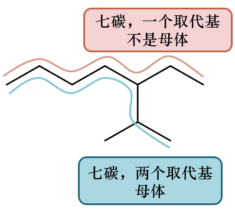

  相同同长度最长碳链，取连接取代基数目多者为母体

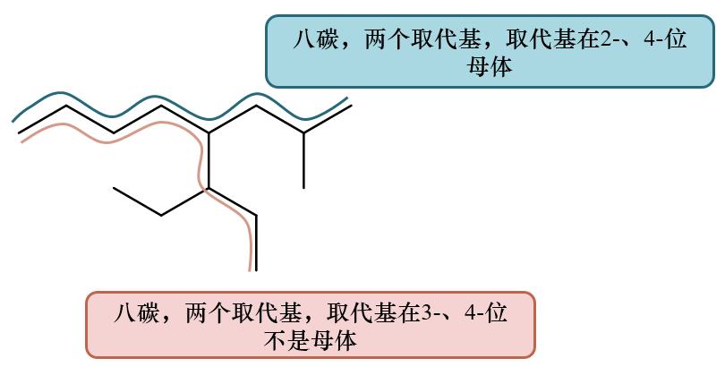

  取代基数目亦相同，取取代基位次小者为母体

确定了母体之后，分子中剩余部分自然就是取代基（侧链）了。常见的八种烷基取代基，其结构、名称、缩写请大家一定牢记，命名包括书写分子结构式时常用到。
不同的取代基有\ **取代基优先级**\ 的区别，具体在课本烯烃一章，教学视频的立体化学一章介绍。
常见的这八种烷基优先级次序如下：甲基<乙基<正丙基<正丁基<异丁基<异丙基<仲丁基<叔丁基。
注意这里正丁基<异丁基<异丙基，不是看取代基碳原子数目！具体原因大家后面就会明白。

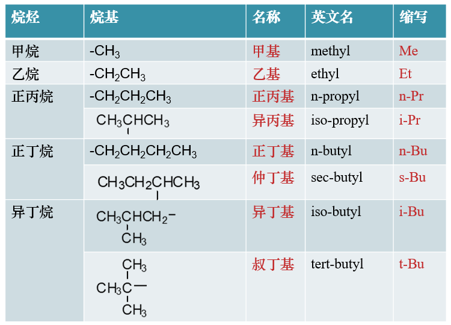

  常见的八种烷基，从相应的烷烃去一氢得到

母体编号
+++++++++++

母体、取代基确定之后接下来需要对母体编号，从母体一端开始，至另一端结束。编号主要是为了说明取代基的位次。
对于开链烷烃，编号时无非就两种可能性，实际我们应当取使\ **取代基编号较小**\ 的一种。这里所谓“较小”大致是如下做法：

::

  * 设母体上连接n个取代基，先将两种母体编号方式取代基位次按升序列出（不管取代基差别，只看位次），形成两个元组：
  (x1,x2,x3…,xn) 、(y1,y2,y3,yn)

  * 依次对比两个元组中的各个元素，若有
  x1 = y1, x2 = y2, xm-1 = ym-1，但xm < ym
  则认定(x1,x2,…,xn)序列较小，换句话说只要有一对编号不同，后面的都不用管它。

以下是一些具体实例：

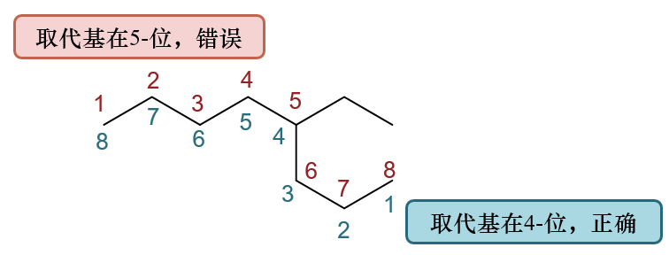

  母体编号例1

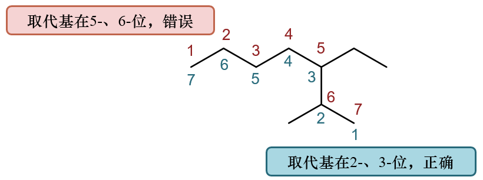

  母体编号例2

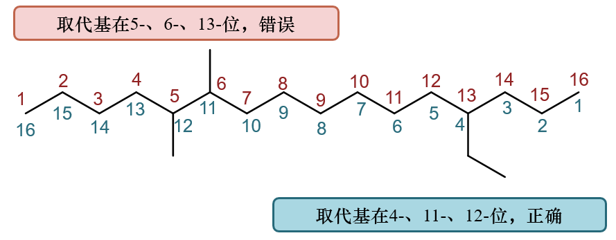

  (5,6,13)与(4,11,12)比较，4<5，直接取后一种编号方式，之后的位次不用管， **更无须求和!**

当然，也有可能全部序号对都一样，xi = yi。若遇到这种情形，再考虑取代基的差别，尽量使优先级较低的取代基位次较小。如：

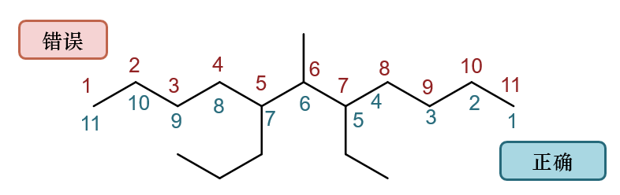

  两种编号方式取代基位次均为在(5,6,7)，其中甲基均在6-，乙基与正丙基有区别，这时应尽量使优先级较低的乙基位次较小

写出名称
+++++++++++++++

确定编号后，最后就可以写出分子名称了。母体名称在后，取代基在前。若有多个取代基，注意书写次序，优先级低者在前（而不是依据位次！）。如前面的例子：

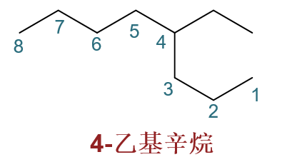

  命名例1

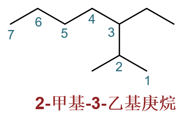

  命名例2

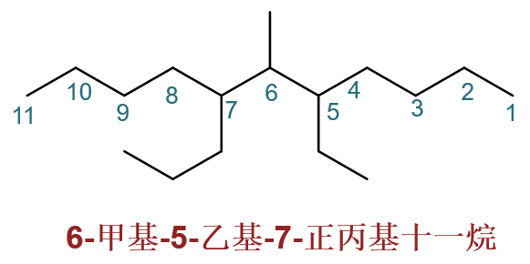

  命名例3

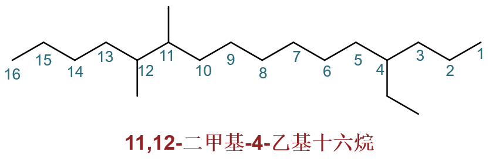

  命名例4

某些分子中取代基特别复杂，不是八种常见的烷基，则可采取\ **递归**\ 的方式去称呼该取代基：把取代基单抽出来，固定以其与母体相连的原子为起始点，
找出取代基中最长碳链并从起始点开始编号：

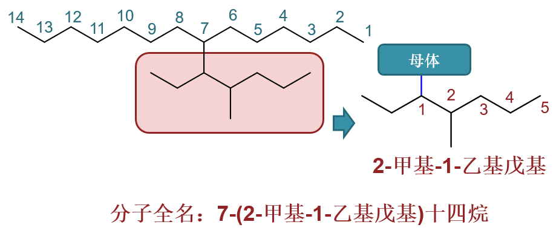

  递归处理复杂取代基

此外，写出名称时请注意标点符号，特别是短横线与逗号的使用。逗号用于分割取代基位次数字，短横线用于隔开数字与汉字。\ **汉字与汉字之间一定不会有短横线**\ 。
常犯的一个错误是用短横线分割取代基与母体，类似：4-乙基-辛烷，这个错误千万别犯，正确名称4-乙基辛烷。

螺环与桥环烷烃
-----------------------

这两种特殊的环烷烃命名时在通则之外，都有\ **特殊**\ 的规则，尤其是编号与写名称的方式。

对于双环螺环分子，母体命名有固定的框架：\ **螺[X.X]某烷**\ 。具体是某烷看母体中碳原子总数；方括号中X.X是两个数字，
中间用\ **点号（不是逗号！）**\ 隔开，标明两个环在螺碳原子之外，还各自还有几个原子。注意这两个数字按\ **从小到大**\ 的次序排列。如：

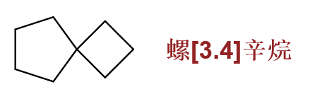

  螺环母体的命名

有取代基时，同样也需对母体进行编号。编号固定从小环螺原子\ **旁侧**\ 的原子开始，绕小环一周至螺原子，再绕大环一周（\ **先小再大**\ ）。
满足这一原则的前提下，再遵循通则，尽量使取代基位次较小。如：

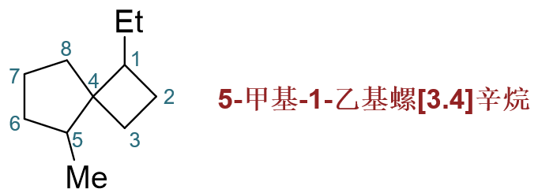

  带取代基螺环烷烃命名1

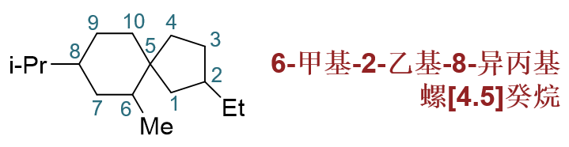

  带取代基螺环烷烃命名2

至于桥环烷烃，母体也有固定的模式。若有两个基本环（基础有机中只会出现这种），则称为：\ **双环[X.X.X]某烷**\ 或\ **二环[X.X.X]某烷**\ 。
方括号中三个数字，分别是两个桥头碳原子之间三条边的碳原子数目（不计桥头碳），注意\ **从大到小**\ 排练，中间同样用点号隔开。如：

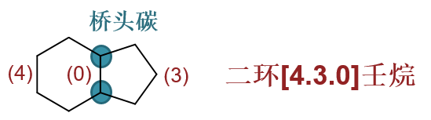

  桥环母体的命名

当然有取代基时又得给母体编号。编号固定从某一桥头碳开始，先沿最长边至另一桥头碳，再顺次走过次长边，最后是最短边（\ **先长后短**\ ）。
满足这一原则的前提下，再遵循通则，尽量使取代基位次较小。如：

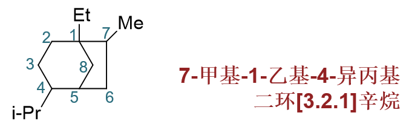

  带取代基桥环烷烃命名

注意标点符号
-----------------------

命名时的标点符号原则上应都是英文半角字符（\ **-,.[]**\ 等而非—，。【】）。不同的符号有着不同的作用。

============  ======================================  =======================================================
符号            作用                                    示例
============  ======================================  =======================================================
逗号（,）       分隔位次数字或不同位次构型信息                2,3-二甲基戊烷
短横（-）       分隔位次数字与汉字                         1-甲基-2,3-二乙基环己烷
短横（-）       分隔构型信息与构造名称                      *(R)*\ -2-丁醇
圆括号（()）     界定复杂取代基范围                             7-(2-甲基-1-乙基戊基)十四烷
圆括号（()）     括起构型标识                              *(2R,3S)*\ -2,3-二羟基丁二酸
方括号（[]）     螺环或桥环化合物环/边信息                   螺[3.4]辛烷
点号（.）       分隔螺环或桥环化合物环/边信息数字             螺[3.4]辛烷
单引号（'）      可用于单层嵌套复杂取代基位次编号              7-2'-甲基-1'-乙基戊基十四烷（同7-(2-甲基-1-乙基戊基)十四烷）
单引号（'）      可用于特定副环位次编号                       4,4'-二乙基联苯
============  ======================================  =======================================================

很多同学常在标点符号上犯些粗心的错误，请大家尽量避免：

===============================   =================================================  ================================
错误名称                              错误原因                                            正确名称
===============================   =================================================  ================================
2,3二甲基丁烷                        取代基位次数字与汉字间遗漏短横                            2,3-二甲基丁烷
2,3-二甲基-丁烷                      用短横分隔了取代基与母体间的汉字                           2,3-二甲基丁烷
7-2-甲基-1-乙基戊基十四烷              未使用括号界定复杂取代基范围，位次含义不清                  7-(2-甲基-1-乙基戊基)十四烷
7-[2-甲基-1-乙基戊基]十四烷            错误使用方括号界定取代基范围                             7-(2-甲基-1-乙基戊基)十四烷
螺(3.4)辛烷                          错误使用圆括号括起桥/螺环信息                            螺[3.4]辛烷
螺[3,4]辛烷                          使用逗号分隔螺/桥环信息数字                              螺[3.4]辛烷
===============================   =================================================  ================================

