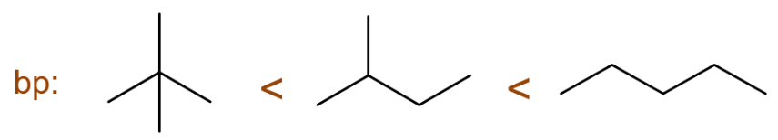
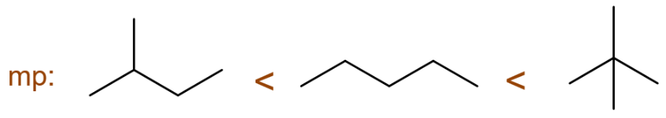
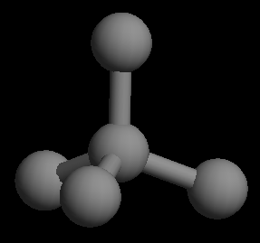
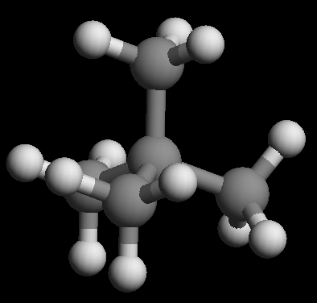

开链烷烃的物理性质
===================================

基础《有机化学》课程中，我们更关注化学性质，物理性质不算特别重要，大多数种类化合物的物理性质考试里也都不会涉及。
但烷烃的物理性质，尤其是熔沸点，非常有规律，因此考试中常会出现。这两个物理性质的变化规律对于开链烷烃而言既有联系，也有不同。

判断一组开链烷烃熔沸点的高低，基本有两个原则：

* \ **同系物**\ ：结构类似（直、支链状况相仿），看碳原子数目（也就是分子量），愈大者熔沸点一般愈高；

* \ **同分异构体**\ ：碳原子数相同，看支链多少，一般支链越多熔沸点越低，但支链如果对称性特别高，熔点（而非沸点）反而要比支链者高（和分子晶体晶胞堆积紧密程度有关）。

尤其是这第二条原则，考试当中出现频率极高，特别小心对称性高的支链烷烃。

如一组很典型的例子：

  沸点比较简单，支链越多越低

  熔点还需要小心分子对称性

至于为什么说2,2-二甲基丙烷（新戊烷）对称性高，
看看 `分子模型 <https://organic.cpu.edu.cn/~partridge/OrgChem/MolModels/molViewer/viewer3D.html?mol=neopentane>`_ 应该就知道了，
其实就相当于把甲烷正四面体顶点的四个氢替换成甲基，对称性也就和甲烷相仿。

  2,2-二甲基丙烷分子立体结构（隐氢）

  2,2-二甲基丙烷分子立体结构（显氢）

