重点小结：构象
===========================

构造、构型与构象
-----------------------

在有机化学中有三个接近的名词：\ **构造**\ 、\ **构型**\ 与\ **构象**\ 。这三个词比较容易混淆，但各自有着完全不同的含义。

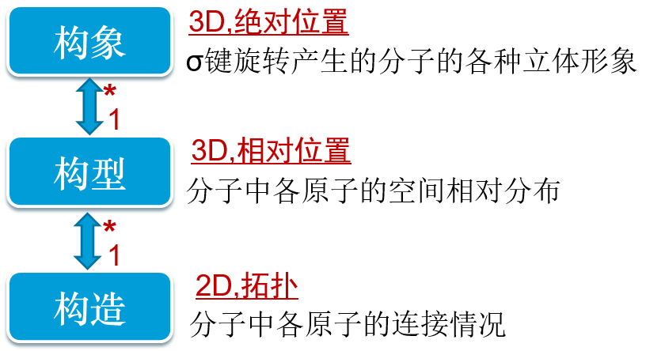

  构造、构型与构象

  * \ **构造**\ ：分子中原子的连接情况，完全不涉及立体情况。比如HCl分子，两个原子只要是连接在一起，不管一个天上一个地上，一个北京一个南京，都算是一个构造。

  * \ **构型**\ ：与立体结构有关，分子中特定原子排布的相对位置。注意，这是个相对的概念。典型的像考察两个原子在一个参考平面的同侧或是异侧。
    若都在同侧，不论两个原子间距离如何，都算作是一个构型。

  * \ **构象**\ ：也与立体结构有关，由于分子中σ键旋转引起的不同的立体样式。这个概念有点儿涉及原子的绝对坐标了，σ键旋转过一个角度，
    各个原子三维坐标发生了变化，我们都算作是不同的构象。

一般来说，一个构造可能存在一个或者数个不同的构型，而一个构型又能产生多个（往往是无穷多个）构象。如2-丁醇，这么一个简单构造的分子实际存在
(R)-2-丁醇与(S)-2-丁醇两种不同的构型（R/S这样的构型标识在立体化学一章中会详述），而任一种构型由于σ键的旋转都又能产生无数的构象。

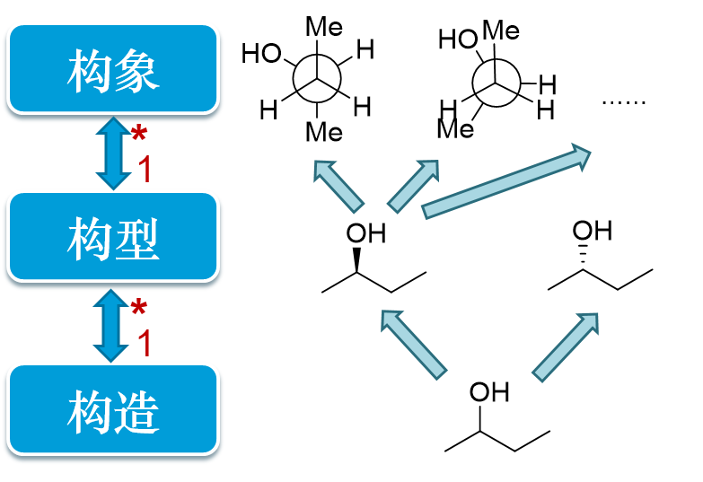

  2-丁醇的构造、构型与构象

分子的构造特别简单，大家一看平面式就能明白；而关于构型，在后面立体化学基础一章中会再进行讨论；烷烃这章中，特别讨论了构象问题。
三个典型烷烃分子的构象相对最为重要：开链烷烃里的乙烷、丁烷以及环烷烃中的环己烷。

开链烷烃的构象
--------------------

乙烷
~~~~~~~~

乙烷的极限构象
++++++++++++++++++

乙烷仅分子中C-C键旋转才可能引起构象变化，相对比较简单。大家需要注意重叠式、交叉式这两种典型的极限构象。
前者两个碳原子上连接的氢原子相对距离最近，斥力最大，能量最高；而后者反之，距离最远能量最低。
水往低处流，根据玻尔兹曼分布，大量分子存在的情况下，同一时刻处于较低能量的交叉式分子的数目一定大于重叠式，也大于其它任何
构象，因而能量最低的交叉式构象被称作\ **优势构象**\ 。

关于乙烷的分子构象变化，大家可以参见 `在线的可交互模型 <https://organic.cpu.edu.cn/~partridge/OrgChem/MolModels/conformation/conformationOfEthane.html>`_ 。
自己旋转一下C-C键，从各个角度观察一下，尤其注意两个碳上氢原子之间距离。必要时可以从球棍模型切换成比例模型，体会氢原子之间的斥力。

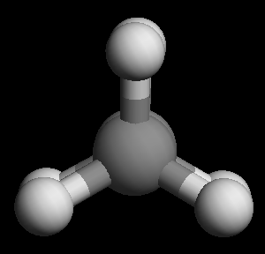

  乙烷重叠式构象（球棍模型从C-C键方向观察）

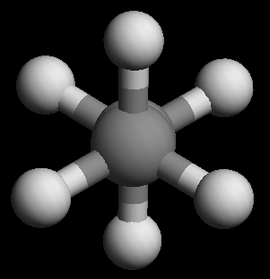

  乙烷交叉式构象（球棍模型从C-C键方向观察）

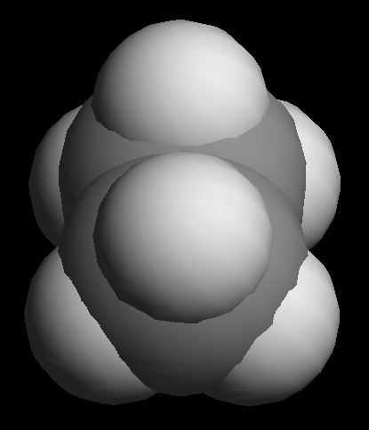

  乙烷重叠式构象（比例模型从C-C键上方观察）

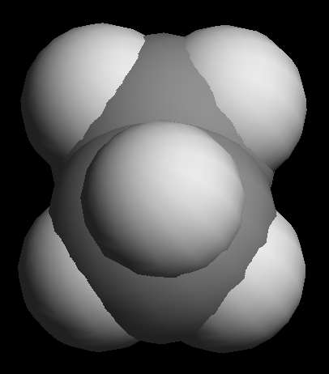

  乙烷交叉式构象（比例模型从C-C键上方观察）

构象的纸面表达
+++++++++++++++++++

此外，表达分子构象经常采用\ **锯架式**\ 与\ **纽曼投影式**\ ，外加之前的\ **楔线式**\ ，目前我们已经至少学习了三种在纸面上
表达分子立体形态的方式。这三种形式说白了，其实就是分子不同角度在纸面上形成的投影，如下图所示：

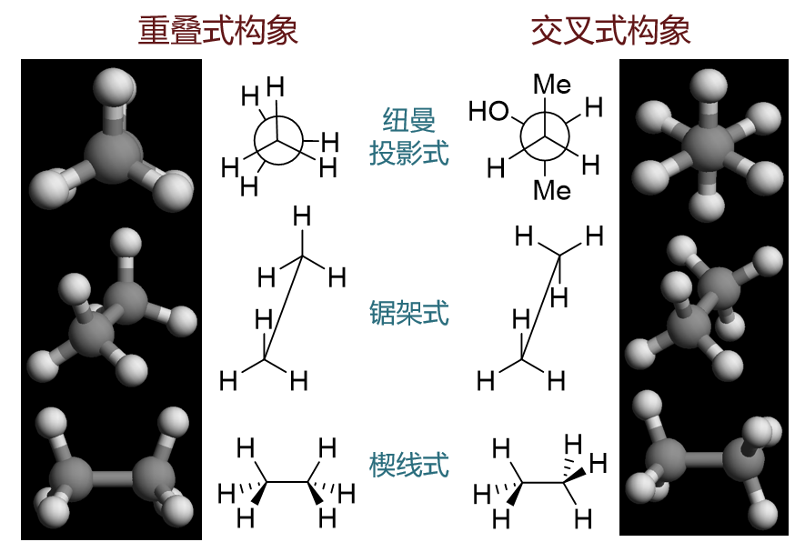

  乙烷两种极限构象的平面画法

丁烷
~~~~~~~~

为简化计，基础有机化学中我们只考虑2,3-位碳原子间C-C键旋转引起的构象变化。其实与乙烷非常类似，只不过把两个碳上各一个氢替换成了体积更大的甲基。
由于甲基的存在，丁烷的重叠式、交叉式不只一种，能量也不尽相同。还是那个基本原则，构象能量高低看相邻碳原子上连接的各原子/基团之间的距离，尤其是
两个较大的甲基之间的距离。大家也可以结合 `丁烷构象示意模型 <https://organic.cpu.edu.cn/~partridge/OrgChem/MolModels/conformation/conformationOfButane.html>`_
来进行理解。

环烷烃的构象
--------------------

环烷烃的构象较开链烷烃复杂得多。受环结构的限制，构象变化时通常需要同时旋转多根σ键。由于过于复杂，因而基础有机中具体怎么一个旋转法
一般不作要求，大家只需要记得一些结论就好，尤其是最常见的环烷烃——环己烷的构象情况。

.. _C02环己烷的构象:

环己烷
~~~~~~~~~~~

椅式与船式构象
+++++++++++++++++

\ **椅式**\ 与\ **船式**\ 是环己烷的两种典型构象，这两种构象C-C、C-H键之间都能满足109.5度的正常sp3键角。
但我们也知道椅式远比船式稳定，其原因……课本的纽曼投影式示意图大家可能看不清楚，也不太容易想象。更简单的理解方式是直接
操作 `环己烷椅式与船式交互模型 <https://organic.cpu.edu.cn/~partridge/OrgChem/MolModels/cyclohexModel/splittedViewer.html>`_ 。
转个角度之后大家可以得到如下的结果：

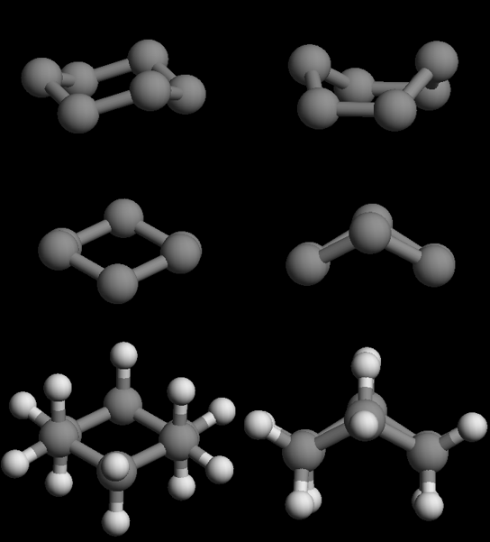

  椅式与船式构象的比较。自上而下：侧面视角、沿C2-C3键方向视角、显氢

尤其是显示氢原子之后，大家一看就能明白，船式相邻碳原子相当于是重叠式，而椅式相邻碳原子相当于是交叉式。如此一来自然椅式
能量更低。

椅式也是环己烷所有构象中能量最低的一种，通常情况下在分子中占了绝对多数。一般提及环己烷的构象，我们也只把目光放在椅式上。

椅式的立体特征
++++++++++++++++++

椅式构象的核心是六个碳原子。为讨论方便，我们不妨逐个编号如下图。平面上表达椅式构象经常画成右侧的形状，\ **默认靠下的2,3-位碳距我们较近
而5,6-位碳距我们较远在纸面后方**\ 。

.. figure:: ../../images/C02-KeyPoints/conformations09.png

  椅式的立体特征

1-6位碳我们可以人为地分成两组，1/3/5与2/4/6，两组各三个碳原子，各自三点决定一个平面，而明显这两个平面相互平行，某种意义上说，
可以将其称为环己烷的环平面。目前1/3/5处于下平面而2/4/6处于上平面。同时各根C-C键之间也有平行关系，如C1-C2平行于C4-C5，C1-C6平行于C3-C4等。

除去C-C键外，每个碳原子上还各自有两根C-H键。观察立体模型，我们不难发现这两根环外的键立体特征也非常明显。总有一根垂直于刚才的环平面，
称为\ **竖直键**\ 或\ **a键**\ （注意，和直接相连的C-C键并不垂直，而是垂直于1/3/5、2/4/6的环平面），图中用红色标出。
此外处于下平面的C1、C3、C5这三个原子，它们的a键都垂直冲下；反之C2、C4、C6的a键都垂直冲上。这一点需要牢记，千万别弄反了。

另一根C-H键和环平面有个较小的角度，仿佛“趴”在环平面上，我们称其为\ **平伏键**\ 或\ **e键**\ ，图中用蓝色标出。
仔细观察我们会发现，e键实际会与环上某根C-C键平行，如3-位碳原子的e键，与C4-C5及C1-C2平行。

这些垂直或平行关系，都可以通过sp3杂化的109.5度键角从立体几何的角度加以证明。

e键伸出环外，e键上连接的原子或基团距其它原子之间距离一般也较大，斥力不大。而a键都垂直于环平面，互相之间都是平行关系，端头的原子/基团
距离较小，可能会存在明显的斥力，这对环己烷衍生物分子的构象能量有着决定性的影响。我们课本中甲基环己烷的例子，包括后面立体化学一章中
多取代环己烷的例子，其实都是在考察a键基团互相之间的斥力大小。

椅式的翻环
++++++++++++++++++

特别值得注意的是，环己烷的椅式在通常情况下会发生所谓的“翻环”，通过一系列C-C键的旋转，得到看起来挺对称的另一个不同的椅式。
翻环具体过程比较复杂，中间会经历一系列其它构象。简单里说，如下图所示，大致是原本处于下平面的C1这个角向上翘，而原本处于上平面的
C4角向下压，最终得到最右侧的一个新椅式。

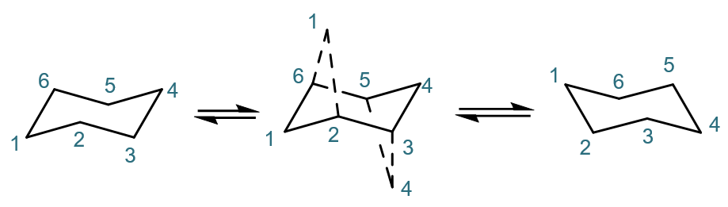

  椅式翻环示意

得到的新椅式构象和原先的椅式相比，各\ **原子的左右、前后关系不变**\ ，如C1依然在最左方，C4依然最右方；C2、C3依然在纸面前，C5、C6依然在纸面后。
但\ **上下关系发生了倒转**\ ，原本处于下平面的C1、C3、C5现在反而处于上平面；反之C2、C4、C6处于了下平面。大家也一定留神这组关系。

除此之外，更重要的，翻环之后\ **a、e键也将发生倒转**\ 。旧的a键翻环后会处于平伏位，反之旧e键翻环后将垂直环平面，如下图所示。具体怎么倒转的，
过程同样复杂，大家也不用多管，记得这么个结论就成。

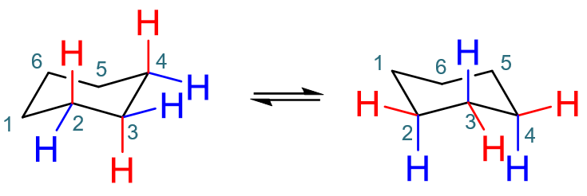

  椅式翻环后a、e键互相转换

如果就是单纯的环己烷，翻环前后不管a、e键，反之都是十二个氢，左右两种构象其实没啥差别，能量也完全相同。但如果环旁侧连接了取代基，情况将会
发生变化。如甲基环己烷的翻环（注意这里的数字并非系统命名里的编号，仅作位置标注之用）：

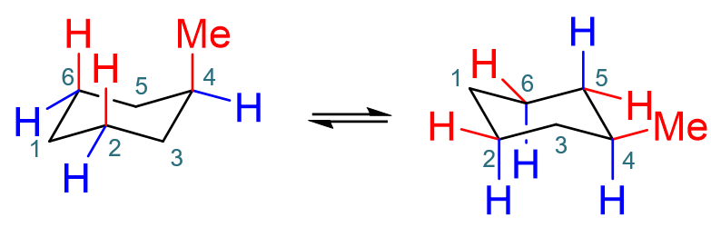

  甲基环己烷的椅式翻环

若旧椅式甲基在a键，翻环后自然将转到e键去。而之前我们就提到，a键基团之间存在明显的斥力。左侧构象是甲基及平行的C2、C6上两个a键氢原子间有明显斥力；
右侧甲基处于e键伸出环外，仅C2、C4、C6上a键的氢原子间有明显斥力。甲基的体积又较氢原子大得多，自然空间位阻更大，斥力更强。于是右侧椅式构象能量
将明显低于左侧，是甲基烷基烷的优势构象。

这是单取代环己烷的情况，优势构象里大基团一般一定处于e键上。如果是多取代环己烷，情况将更加复杂，还同分子的构型有关。这将在立体化学一章中讨论。

.. note::

  分子是动态的，时时发生变化的，构象之间互相转化的能垒一般不高，室温下就可以翻越。因此发生反应时，分子并不见得一定处于优势构象。

椅式在纸面上的画法
+++++++++++++++++++++++

环己烷的椅式构象非常常用，我们在日常学习中经常也有在纸面示意性地画出椅式的要求。挺多同学没掌握窍门，画出的椅式比较难看。
这里顺便提一下通常情况下椅式的画法。

我们之前考察立体模型时已经注意到了椅式的一系列平行关系，实际绘画时，完全可以借助这些平行特征，如下图所示。
通常我们可以先画出C1-C6-C5-C4这三根键，三根键差不多长度，一个Z字形，注意C4-C5这根键的斜率要比C1-C6小一些。
这三根确定后，底下就可以充分利用平行关系了。如从C4开始作一根C1-C6的等长平行线段，得到C4-C3；再从C3起始，作C5-C6平行线段
得到C2，最后连起C1-C2，一个挺漂亮的椅式就出现了。

 .. figure:: ../../images/C02-KeyPoints/conformations13.png

  环己烷椅式的基本画法

至于椅式上的a、e键，作图时依然还是利用几何关系，如下图所示。如C3上的e键，平行于C4-C5；而a键垂直于C1-C3-C5平面且向下，做个向下的垂线就成。
类似的，C6的e键平行于C1-C2，a键则垂直向上。

 .. figure:: ../../images/C02-KeyPoints/conformations14.png

  环己烷椅式a、e键的基本画法

