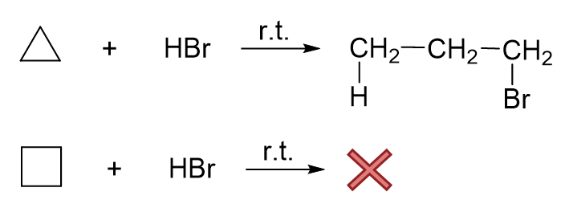
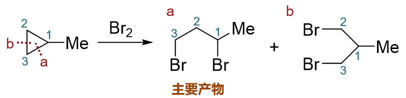
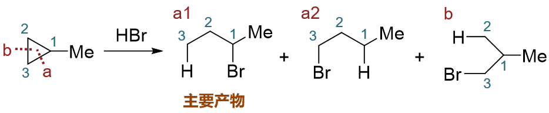
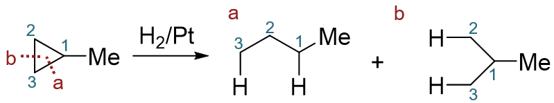
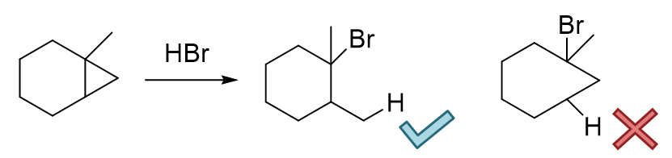
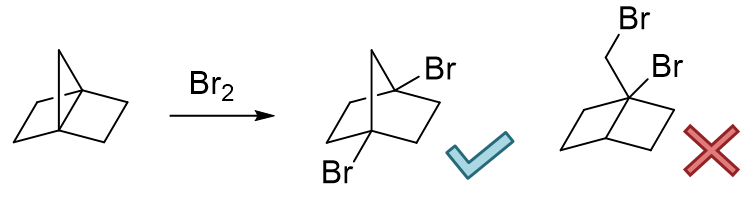
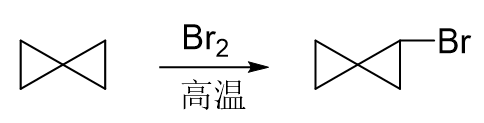
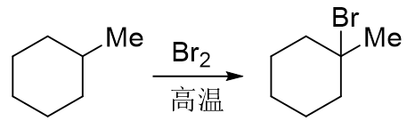
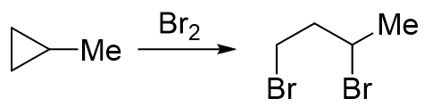

小环烷烃的反应
==============================

我们都知道三四元环的小环烷烃张力较大，这使得它们容易发生开环的加成反应。
基础有机中大家遇到的这类反应基本有三组：\ **加卤素**、 \ **加卤化氢**\ 与\ **催化加氢**\ 。

这三组反应表观上看都不算特别复杂，但有一些小细节需要略微注意一下。

反应物活性
-----------------

环丙烷与环丁烷相比，由于三元环的张力更大，因此前者的开环活性要明显强过后者。如和卤化氢的反应：

  环丙烷、环丁烷与HBr反应对比

环丙烷室温下反应很容易发生，而环丁烷室温下一般无法发生反应，必须稍稍加热才成。这两个化合物与卤素的反应，也是如此。
至于催化氢化，环丁烷需要加热的温度通常也要略高一些。

区域选择性
-------------------

当小环外还存在取代基，结构不对称时，在不同的C-C键上断键开环会生成不同的产物。这些产物常常不会完全按照数学比例等概率生成，
往往是某一种看起来占大多数，是反应的主要产品。表观看起来就是反应更容易在某一个特定键上，一个特定的区域发生，我们称其为\ **区域选择性**\ 。

需要注意的是，三组开环反应的区域选择性不尽相同。其中加卤素与加卤化氢，机理基本一致，因而区域选择性也相同。而催化加氢时情况大不一样。
这些也是考试中时常出现的内容。

小环与卤素、卤化氢反应时的区域选择性
~~~~~~~~~~~~~~~~~~~~~~~~~~~~~~~~~~~~~

简单里说，这两个反应的断键位置可以根据环上碳原子周边连接的烷基数目确定。典型的如取代环丙烷与卤素反应的例子：

  甲基环丙烷与溴反应的区域选择性

明显底物甲基环丙烷开环时存在两种断键的可能，也可能生成两种不同构造的产品（C1-C2之间断键或C1-C3断键生成a，C2-C3间断键生成b）。
单从数学概率上说，a、b两种产物生成比例将是2:1。但实际实验发现，最终产品中a占了绝大多数，远超2/3；当然b也会生成，但量少得多，我们把它看成是副产品。
这就是该反应区域选择性的体现。我们实际做反应题时，一般也只需要写出主要产物，产品b就不必写出了。
一般来说在\ **与卤素或卤化氢加成时，主要的反应位置是连接烷基侧链最多的碳原子旁侧的C-C键**\ ，
而且通常是与另一个连接侧链最少的碳原子之间的键（但并不一定，详见后面的例子）。

当然与卤化氢反应的情况还要更复杂一些。如下图甲基环丙烷与HBr的反应，即便确定的参与反应的C-C键，加成时H与Br加上的方向不同，又会出现a1、a2
两个不同构造的产品。实验中我们也发现，a1的生成量要远比其它的产品多，是主要产物。这个情况实际也就是大家中学化学时可能已经接触到的“\ **马氏规则**\ ”，
表观上看，断开C-C键之后，氢会加在连接烃基较少的碳原子上，而卤素反之，加在连接烃基较多的碳原子上。当然，马氏规则的实质与\ **碳正离子的稳定性**\ 有关，
某些特定的反应光靠数烃基数目会出现判断失误，这在后面烯烃一章当中都会提到，到时候大家会对这类反应的认识继续加深一层。

  甲基环丙烷与溴化氢反应的区域选择性

小环催化氢化时的区域选择性
~~~~~~~~~~~~~~~~~~~~~~~~~~~~~~~~~~~~~

至于小环烷烃的催化氢化反应，比较简单，它的区域选择性不强。如类似的甲基环丙烷的催化氢化，
两种生成的产品量都不少，不太好忽略掉任何一个，因此做题时一般这俩生成物都得写出。

  甲基环丙烷的催化氢化

当然，上面的反应中，事实上C1-C3和C2-C3两个位置断键的几率还是有差别的。与之前卤素或者卤化氢的反应相反，这里
反而是C2-C3间断键与氢加成的几率稍大一些。原因主要是空间位阻，这俩位置旁侧没有大基团，比较空阔——这也和催化氢化的机理有关，
我们同样会在烯烃一章当中学习到。一面是C2-C3之间断键几率略大，另一方面C1-C2、C1-C3这两根键断开都能生成一样的产品，
数学权重更高，两相叠加，最终生成的两种产物的量一般就难分轩轾了。

影响小环开环反应区域选择性的其它因素
~~~~~~~~~~~~~~~~~~~~~~~~~~~~~~~~~~~~~~~~~~~

有时反应的区域选择性还会受其它一些因素的共同影响。以下是两个典型的例子：

  两个稍复杂的小环开环反应

第一例中，底物分子存在两个环，左侧六元与右侧三元。这里我们首先确定，稳定的六元环当前不可能和HBr反应，开环的一定是右侧三元小环。
至于三元小环主要开哪根键，我们可以根据之前叙述的区域原则性判断，多半儿是断开左上角连接烃基较多的季碳原子旁侧的。当然三元环上这个桥头季碳连了两根
化学环境不同的C-C键，具体断哪个，不妨把两种可能的产品都画出来看看。若是断开左侧C-C键，将生成右边的产物。而这个产物里出现了一个
七元环。七元环我们知道，作为中环，稳定性不咋地，比正常环差不少。而反过来如果断开右上角C-C键，将生成左侧的产品，产物里是一个比较稳定的六元环。
因此我们这儿不难得到结论，这个反应的主要产物将是左侧这个。我们很多有机反应都有这样的规律，\ **产物的稳定性时常会决定反应的走向**\ 。注意这里也是
“时常”而不是“一定”，后面的章节里我们也会看到反例。

至于第二例，情况其实也差不多。首先注意到底物分子中有三个小环，两个四元一个三元，我们不难判断这里是更活泼的三元环优先发生反应。
接下来继续考虑断键位置，当然还是断开连接支链比较多的桥头碳旁侧。这里依然存在两种可能：断开与另一个桥头碳之间的键，生成左侧产品；或者
反过来断开与上方仲碳之间的键，生成右侧产品。右侧产品中我们发现，依然存在四元小环，稳定性不佳；而左侧，小环都消失了，只剩下相对稳定的
两个五元环。于是我们可以断言，左侧这个将是反应的主要产物。

反应的竞争
--------------------

我们现在已经很熟悉小环的开环反应了。但咱们课本上有一道题，又和很多同学想象的不太一样：

表面看起来，小三元环，又是卤素分子，第一感觉是开环加成。但答案偏偏并非如此，而是发生了自由基卤代。
挺多同学这里觉得费解，为什么小环在这里反而又不开环了呢？

原因其实也挺简单，这儿存在着两条反应途径的竞争。前面我们学习过烷烃的自由基卤代反应，大家都很熟悉，
烷烃中的氢可以被卤素取代，反应物同样也是卤素分子：

注意这里的条件，一般是光照或者高温。光照或高温加热也是我们在有机反应中产生自由基的常见条件。

而小环的开环反应，通常是在常温或者不太高温度的加热下发生：

大家能体会出这俩条件的区别来了吧。低温下，卤素分子无从产生自由基，对于小环而言，只能发生开环加成，没有别的选择。
而高温下情况大不相同，特别容易产生自由基。我们可以这么理解：大部分溴分子还没来得及与小环发生开环加成，就被高温引发均裂，
生成溴自由基，进而只能发生取代了。这种情况下，这一对竞争反应反而会以自由基卤代为主。

除了小环烷烃和卤素的反应之外，后面我们会看到，很多其它反应中也存在类似的竞争。而这种竞争的走向、主要产物的结构
往往会受到反应条件的影响。浓度、温度、溶剂这些看似与反应不直接相关的因素，往往都会令反应结果发生改变。这也是有机反应
的一个特点。也正因为这个特点，大家记忆反应的时候千万别光盯着反应物生成物，很多情况下反应条件也同等重要。

