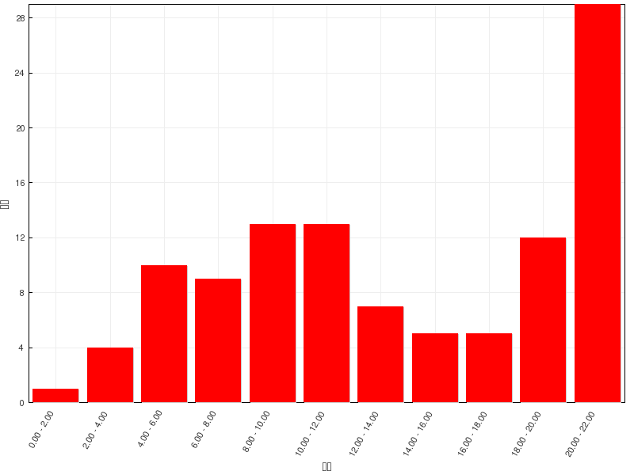

习题讲解：立体化学
========================

在线习题
------------------

本章在线习题难度较前一章明显加大，涉及立体问题，也需要大家更为细心。

=======   =============
总分        22
平均分      13.49(61.3%)
最高分      22(100.0%)
=======   =============

  成绩分布

题1：命名（错误率56.5%）
  .. image:: ../../images/C03-Exercises/A01_00.png

  本章在线习题中有一系列的命名问题。注意，我们目前已经接触了旋光、顺反这样的构型异构形式，
  在对化合物进行命名时，如果题干的结构式给出了明确的构型，一定需要将构型标记出来。

  本题构造很简单，无非是1-乙基-2-氯环己烷，关键是构型。本题的母体是环烷烃，六元环旁侧连接了两个取代基，
  这里存在顺反异构。当前的椅式我们看到乙基与氯都处于a键上，一个冲上一个冲下，明显是一个反式构型。

  于是有同学给出了“反-1-乙基-2-氯环己烷”这样的名称。但很遗憾，这个命名在这里并不适当。原因很简单，这个分子
  没有对称面，没有对称中心，镜像与实物不能重叠，实际是一个手性分子。如果椅式大家看起来比较麻烦的话，改写
  成平面式应该能够看的很清楚（我们之前也提到过假定环上所有原子共面对正确判断分子构型基本无影响），如下图：

  .. image:: ../../images/C03-Exercises/A01_01.png

  这两个分子实际是一对对映异构体，但氯与乙基朝向都是相反，都是反式。你单称为“反-1-乙基-2-氯环己烷”，没法儿
  把这两个分子区分开来，并不充分。

  具体如何在命名上区分开这一对反式的异构体，其实也挺简单。注意到当前环上1-、2-位其实是两个手性碳，而这一对
  对映异构体手性碳构型不同。判定手性中心的R/S构型，情况如下：

  .. image:: ../../images/C03-Exercises/A01_02.png

  .. note::

    环上手性中心构型的判断方法，可参见\ :doc:`重点小结：手性中心构型的判定<./KeyPoints03-RecognizingOfChiralCenter>`\ 中的详细讨论。

  通过R/S构型的前缀，我们终于可以很好地区分开这一对分子了。而且有了R/S，我们也不必再用“反”这个前缀来标明反式，
  (1R,2R)与(1S,2S)这两种构型无论如何氯与乙基都不可能处于环平面同一侧；反之如果是顺式，两个手性中心应当构型是
  (1R,2S)或(1S,2R)。对于取代的环状化合物，手性中心构型确定，顺反也就随之确定。

  综上，最终我们题干里的分子应当称为：\ **(1R,2R)-1-乙基-2-氯环己烷**\ 。

  .. note::

    命名时如果分子里有多个手性中心，为了便于区分，需要在R/S之前标明手性中心所处的位次，按数字编号顺序写出，
    类似这里的(1R,2R)。

  .. note::

    如果使用R/S，包括我们后面将要看到的Z/E标明构型特征，习惯上需要在字母外加括弧。如果使用顺/反这样的汉字
    前缀则相反，一般无需将顺/反括起来。

  .. note::
    手性中心的R/S在命名时需要使用大写字母。小写的r/s另有含义，不能混淆。

题3：命名（错误率35.0%）
  .. image:: ../../images/C03-Exercises/A03_00.png

  当然并不是说所有取代环烷烃的构型情况都必须用手性中心的R/S标记，比如本道命名题。

  这也是个二取代环烷烃，只不过当前两个甲基都在环平面上方，是个顺式。再仔细瞅一眼，这个分子其实存在一个对称面——
  通过2-位碳及4,5-位C-C键中点，垂直于环的平面——因此压根儿不具有手性。顺式也就只有这唯一的一种分子结构。
  在这种情况下，我们也就无需再去判断手性中心的R/S了，直接用个“顺”字已然很充分，不存在歧义。因此该分子我们可以直接
  称为：\ **顺-1,3-二甲基环戊烷**\ 。

题2：命名（错误率48.2%）
  .. image:: ../../images/C03-Exercises/A02_00.png

  本题Fischer投影式的构型大家应该不难判断，反倒是构造名称上很多同学犯了错误。不少同学直接将Fischer投影式的纵键看成是
  分子的母体。但事实上下方手性中心还连接了一个乙基，因此母体最长碳链应当如下图所示：

  .. image:: ../../images/C03-Exercises/A02_01.png

  整个分子应称为\ **(2S,3S)-3-甲基-2-氯戊烷**\ 。注意这里两个取代基的列出次序，优先级较低的甲基在前，较高的氯在后。

题4：命名（错误率42.7%）
  .. image:: ../../images/C03-Exercises/A04_00.png

  题干中给出的是纽曼投影式，由于原子重叠程度较大，很多同学看不太清楚纽曼式的构造构型。一个简单的做法是把分子三维模型稍微扭转
  一个角度，把纽曼式转化为立体感更强的锯架式：

  .. image:: ../../images/C03-Exercises/A04_01.png

  这么一来构造与构型看起来就轻松多了，整个分子应称为\ **(2S,3S)-2-氯-3-溴戊烷**\ 。

题9：排序（错误率47.2%）
  请按取代基优先级次序降序排列以下基团：

    -CH\ :sub:`2`\ Cl、-COMe（乙酰基）、-COOH（羧基）、-Ph（苯基）、-C≡CH、-CH=CHCH\ :sub:`3`\ 、-iPr、-nBu

  基本的判定取代基优先级次序的问题。我们很熟悉，判定这种优先级时，首先看基团的首原子，而后再看首原子的连接原子情况，
  如果还分辨不出来则继续递归。上述基团我们列出首原子及首原子连接情况，大致如下表：

  ===========  ====================  ========  ======= ========= ========  ======================  =========  ========
  基团           -CH\ :sub:`2`\ Cl   -COMe     -COOH    -Ph      -C≡CH      -CH=CHCH\ :sub:`3`\     -iPr        -nBu
  ===========  ====================  ========  ======= ========= ========  ======================  =========  ========
  首原子           C                     C       C       C         C          C                      C           C
  首原子连接       (Cl,H,H)          (O,O,C)   (O,O,O) (C,C,C)   (C,C,C)    (C,C,H)                 (C,C,H)   (C,H,H)
  ===========  ====================  ========  ======= ========= ========  ======================  =========  ========

  通过这张表我们发现，所有这些基团首原子都是C，没区别。再看首原子的连接情况，如上表所示，差异明显。这么一来绝大多数
  基团的优先级都可以区分开来。我们明显得到了如下次序：

    -CH\ :sub:`2`\ Cl > -COOH > -COMe > -Ph/-C≡CH > -CH=CHCH\ :sub:`3`\ /-iPr > -nBu

  这其中还有两组基团（苯基与乙炔基、丙烯基与异丙基）的首原子连接情况相同，暂时无法区分。无妨，我们递归进行，看后继原子的连接情况。

  如丙烯基与异丙基，将是丙烯基优先级更高：

  .. image:: ../../images/C03-Exercises/A09_01.png

  至于苯基与乙炔基，将是苯基优先级更高：

  .. image:: ../../images/C03-KeyPoints/piority06.png

  最终我们得到次序如下：

    -CH\ :sub:`2`\ Cl > -COOH > -COMe > -Ph > -C≡CH > -CH=CHCH\ :sub:`3`\ > -iPr > -nBu

  .. note::

    关于取代基优先级判定的更多讨论，包括苯基与乙炔基比较的讲解，请参见
    :doc:`重点小结：取代基优先级的判定<./KeyPoints02-PriorityOfSubstitudeGroups>`\ 。

题10：选择（错误率33.3%）
  下列化合物中有对映异构体的是：

  .. image:: ../../images/C03-Exercises/A10_00.gif

  判断分子有无手性、存不存在对映异构，我们经常从分子的对称性入手。如果分子中存在对称面或对称中心，则一定是非手性分子；
  反之若这两种对称因素均无，则很可能（注意：不是一定）是手性分子（为准确起见通常可再画出它的镜像，与实物进一步比对）。

  这串分子中有一些是明显存在对称因素的。如分子(1)，螺环化合物，明显存在一个对称面，如下图所示。注意到这里两个环互相
  垂直，右侧五元环所在的面实际就是整个分子的对称面，可以中分左侧的五元环，同时两个取代基甲基也基于这个平面对称分布。
  因而(1)不具备手性。

  .. image:: ../../images/C03-Exercises/A10_01.png

  再如分子(3)，给出的是一个二取代环己烷的椅式构型。还是老办法，如果构象式大家看不清楚，不妨把环上原子视作共面，也能准确
  地判断出分子构型情况来。如我们将六元环化作平面式，如下图，大家一眼就可以发现，通过Me-C1-C4-Me的平面就是整个分子的对称面。
  事实上这个分子还存在一个对称中心。因此(3)同样也没有手性，不存在对映异构体。

  .. image:: ../../images/C03-Exercises/A10_02.png

  更简单的是(6)，1-甲基-1-乙基环己烷，明显通过Me-C-Et的平面垂直于六元环平面，也刚好能中分六元环，是整个分子的对称面。

  .. image:: ../../images/C03-Exercises/A10_03.png

  比较麻烦的是(5)。这个分子看起来有点儿类似于联苯衍生物，两个六元环通过中间一根单键相连，判断构型时我们可以把这两个环
  视作正交，而环与旁侧的取代基，各自在正交的这两个平面上，如下图：

  .. image:: ../../images/C03-Exercises/A10_04.png

  一般情况下联苯分子两个苯环上各自连接不同基团时才会具有手性。手头(5)这个分子乍看似乎环上连接取代基情况是对称的，似乎有对称面。
  但实则不然，注意到六元环上不全是C，而是夹杂了一个N原子（实际是两个吡啶环），这个N原子的存在，使得任何一个环平面
  均无法成为分子的对称面——不管哪个平面切过去，这个N原子都没法儿做到对称。

  没有对称面，也很显见地没有对称中心，如果画出它的镜像，事实上与实物也没法儿重叠。(5)实际是一个手性分子。

  至于剩下的(2)、(4)，情况比较简单，也是不存在对称面与对称中心，而且分子内部还有两个不同的手性中心，它们均为手性分子。

  综上，本题中具有手性、存在对映异构体的化合物为：\ **(2)(4)(5)**\ 。

  .. note::

    关于分子手性有无的判定，特别是不具有手性中心的分子的判定，详见
    :doc:`重点小结：无手性中心的手性分子<./KeyPoints07-ChiralMoleculesWithoutChiralCenter>`\
    中“常见分子出现手性的规律”一段。

题13：选择（错误率50.0%）
  下列分子中, 哪个不具有手性：

  .. image:: ../../images/C03-Exercises/A13_00.png

  与前面的题10类似，也是要求判断手性的有无，我们还是相同的办法。

  这四个分子大致的空间结构如下图所示，两个累积二烯类分子，端头平面互相正交；一个联苯型分子，一个螺环化合物，环平面互相正交。

  .. image:: ../../images/C03-Exercises/A13_01.png

  互相正交的两个面，如果面上有相同基团，如第四个分子，右端H-C-H平面上分布着两个相同的H，则明显存在一个对称面——
  当前就是左侧Ph-C-Me这个平面，也就是纸面，刚好把分子中分。于是明显该分子不具有手性。

  而其它三个分子，互相正交的平面上均分布有不同的基团（分子一的硝基、氯；分子二的甲基、氢；分子三的羧基、氢），实物与
  镜像一定无法重叠，这三个分子均具有手性。

题11：选择（错误率27.8%）
  下面化合物的立体异构体数目为：

  .. image:: ../../images/C03-Exercises/A11_00.png

  我们知道立体异构实际可以分为构型异构与构象异构两大类。因为构象异构体在室温下太容易相互转化，因此通常我们不是特别关心。
  本题也是如此，问立体异构体数目基本就等同于考查构型异构的情况。

  分子中明显存在一个二取代的六元环，这两个取代基显然存在顺反异构。而且注意到两个侧链取代基分处1-、4-位，我们容易发现，
  取代在这俩位置无论是顺式还是反式，不论是什么样的取代基，都不会伴生对映异构，如下图，
  不管是顺反哪个异构体，通过A-C1-C4-B的平面总是分子的对称面：

  .. image:: ../../images/C03-Exercises/A11_01.png

  好，六元环这儿我们首先确定，存在顺反一对构型异构体。

  除此之外，注意到右侧的取代基，与Cl相连的碳原子明显是个手性碳。而单个手性中心，又总是会存在R、S两种可能的构型。
  一边是顺反两个，一边是对映异构R/S两个；这两个因素叠加起来，2X2=4，整个分子实际将具有\ **4个构型异构体**\ ：

  .. image:: ../../images/C03-Exercises/A11_02.png

题12：选择（错误率31.6%）
  下面两个化合物的关系是：
  (A)对映体 (B)非对映体 (C) 同一化合物相同构象 (D) 同一化合物不同构象

  .. image:: ../../images/C03-Exercises/A12_00.png

  我们注意到图中两个分子的表达形式，构造实际是相同的。接下来看构型。这俩表达形式的构型比较，
  最老实的办法是将二者都在脑海里转换成三维模型，两相对照；或者将二者转化成相同的表达形式
  （比如都转化成锯架式）再行比较。

  但一般情况下，我们还有个更简便的方法：直接看分子里手性中心的构型。构造相同，通过手性中心
  构型的比对，我们很容易判断出两者的关系来。

  如左侧的锯架式，我们不难得出与Cl、Br相连的两个手性中心构型分别为R、S。右侧纽曼投影式，
  这俩手性中心构型分别为R、R：

  .. image:: ../../images/C03-Exercises/A12_01.png

  构造一致，俩手性中心构型一个相同一个相反，明显这二者应当是\ **非对映体**\ 的关系。

  .. note::

    关于分子不同表达形式相互之间关系的比较，可参见
    :doc:`重点小结：分子不同表达形式间的关系认定<./KeyPoints04-GetRelationOfMoleculesWithSameConstitution>`\ 。

题14：选择（错误率37.0%）
  与下面化合物（伪麻黄碱）构型相同的Fischer投影式是：

  .. image:: ../../images/C03-Exercises/A14_00.png

  这题与题12类似，也是可以通过判定手性中心构型来确定这组构造相同分子之间的关系。选项及题干各分子手性中心构型情况如下：

  .. image:: ../../images/C03-Exercises/A14_01.png

  易见与题干相同构型的分子为\ **D**\ 。

题17：选择（错误率38.9%）
  下面化合物的优势构象为：

  .. image:: ../../images/C03-Exercises/A17_00.png

  环己烷衍生物，我们知道它的优势构象中六元环一般总是椅式。
  当然，本题题干中取代环己烷的构型已确定，画出构象式时，不是说随便把几个侧链往e键一丢就大功告成，
  务必得保证三个手性中心构型不变！

  我们可以在当前平面构型式的基础上，先画出一个椅式来，具体步骤大致如下：

  .. image:: ../../images/C03-Exercises/A17_01.png

  当然，椅式构象还会翻环，我们可以得到另一个新的椅式：

  .. image:: ../../images/C03-Exercises/A17_02.png

  这俩椅式两相比较，当然是特大的叔丁基处于e键上的能量较低，是整个分子的优势构象。本题答案为\ **C**\ 。

  .. note::

    关于多取代环己烷构型构象，包括基团椅式上a/e键的分布的讨论，请参见
    :doc:`重点小结：多取代环己烷的构型构象<./KeyPoints06-ConformationOfSubstitutedCyclohexane>`\ 。

题18：选择（错误率39.8%）
  下面反应的可能产物共有几种？

  .. image:: ../../images/C03-Exercises/A18_00.png

  自由基卤代反应，氯取代了氢，另外从产物的分子式，我们知道这里是发生了单取代。

  底物分子中化学环境不同的氢其实不多，就三种，取代之后也只能生成三种构造不同的单取代产品。
  但小心，这里如果Cl取代2-位氢，生成2-氯戊烷后，2-位碳原子会变成一个手性中心，加上我们
  知道自由基卤代反应没有立体选择性，这儿的手性中心R与S两种都会生成，会出现两种产品：

  .. image:: ../../images/C03-Exercises/A18_01.png

  至于取代在1-位或3-位，明显产品不会具有手性，各自只有一种。加一起，本反应能够生成
  **4种**\ 可能的产物。

题19：问答（错误率50.3%）
  (S)-(-)-2-甲基-1-氯丁烷与氯气在光照条件下发生氯代反应，假设只发生单取代，
  则总共将有几种产物？若使用蒸馏的方式加以分离，共有几个馏分？其中有旋光性的馏分有几种？

  又是自由基卤代，题干中底物分子有一个手性中心，构型已知为(S)，结构如下图所示。至于(-)，指的是该分子实验中
  发现能使偏振光左旋。

  .. image:: ../../images/C03-Exercises/A19_00.png

  与前一题类似，本题也询问有多少种产物，这里同样也需要综合考虑构造与构型。底物分子中存在4种化学环境不同的氢原子
  （主链1-4位及侧链甲基），单取代后我们易见将生成5种不同构造的产品。当然，这些产物又存在构型问题，有些类似前一题
  的2-位，反应后产生了新的手性中心，具备R/S两种可能的构型；有些可能又会影响旧的手性甚至导致旧手性中心消失。
  各构造化合物的构型情况可列出一张表：

  .. image:: ../../images/C03-Exercises/A19_01.png

  注意，如果取代发生在原手性中心2-位上，由于自由基卤代本身是个外消旋化的反应，生成的产品2-位依然是手性中心但R/S构型都会生成，
  而且是等量生成，得到一对外消旋体。

  如取代发生在1-、3-、4-位，2-位的原手性中心不受影响，依然保持S构型。特别留神如果反应发生在侧链甲基的情况，这时
  原本的侧链甲基将转化为氯甲基，而原手性中心2-位碳将连接两个相同的氯甲基，其手性将消失。

  数一下上表中生成的产品的构型情况，明显我们发现，该反应单取代时将得到\ **7种可能的产物**\ 。

  当然，题干中还有附加的问题，几个馏分，几个旋光性馏分。

  我们知道一对对映异构体物理性质——包括沸点——都相同。因此反应如果生成一对对映异构体，如2-位反应的情况，虽说有两个产物
  但因为沸点相同，一块儿会被蒸出，因此只有一个馏分。而3-位取代的两个产品，一个手性中心构型相同另一个相反，属于非对映异构体，
  物理性质包括沸点存在差异，会成为两个馏分。其它各位置取代各自生成一个馏分。加一块儿，反应将生成\ **6种馏分**\ 。

  至于有几个旋光性馏分，这个也不难判断了。首先侧链甲基取代生成的产品，直接是个非手性分子，自然不具有旋光性。2-位取代生成
  的是外消旋体，当然也不会使偏振光偏转。其它位置的馏分，要么单手性中心纯S构型，要么非对映异构体，都是具有旋光性的。最终
  我们将得到\ **4种旋光性馏分**\ 。

