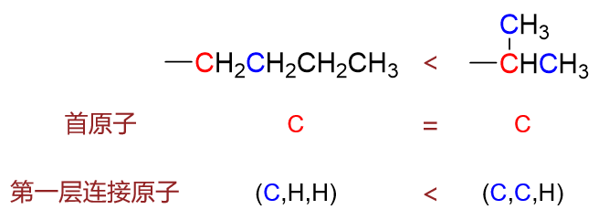
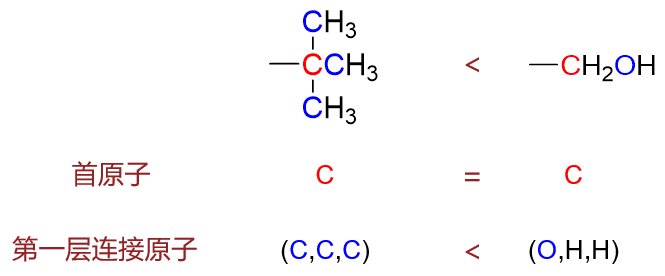
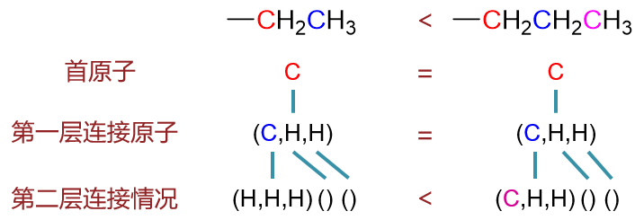
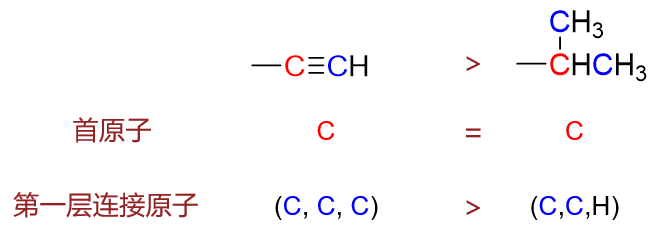
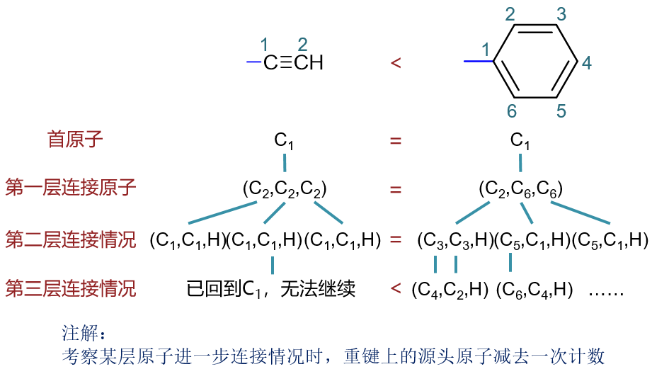

取代基优先级的判定
==========================================

在对分子进行命名以及构型判定时，我们经常需要判定取代基的优先级次序。这种次序的判定一般而言并不困难，但也有一些基团容易导致大家的迷惑。

判定原则
------------------

取代基优先级大小判定的原则很明确也很完备（说真的在有机化学中这么明确有数学风味儿的原则真不多……），
整个规则建立在很明确的在原子优先级的判定上：

原子优先级的判定
  对单个原子，原子序数大者优先级高；若原子序数相同则质量数大者优先级高。

  例如：O > C；D > H；O = O。

确定了原子比较的原则后，基团的优先级比较顺势而行，基本是个递归过程。以下的描述并不完备，但基本够用：

递归判定取代基优先级
  设有两个取代基SubA、SubB，首原子分别是A、B，A/B上又各自连接有其它原子：

  1. 首先比较首原子，若不相同，则直接根据首原子确定基团优先级次序。若相同（A = B），则继续。

  2. 比较与首原子直接连接的原子。与A直接相连的按原子序数、质量数降序排列，有(A1,A2,...,An)；与B相连有(B1,B2,...,Bm)，
     形成两个序列SeqA、SeqB，通过比较这两个序列确定基团的优先级次序。具体做法如下：

     设x=min(m,n)（注意：n与m不一定相等），从1至x依次比较两个序列中的原子Ai,Bi。
     若发现有Ai与Bi原子不同，则判定原子优先级，若Ai>Bi，SeqA>SeqB，也即得到结论SubA>SubB；若Ai<Bi，则SeqA<SeqB，SubA<SubB。

     若对从1至x所有的Ai=Bi，则看两个序列中谁还有剩余未参与比较的原子。若n>x，则SubA>SubB；若m>x，则SubB>SubA。但若m=n=x，
     则认为SeqA=SeqB，取代基优先级的比较还需继续。

  3. 对SeqA、SeqB中的每个原子，继续列出其所连接的全部原子（但不计入SeqA、SeqB的源头原子A/B），
     形成SeqA1,...,SeqAn及SeqB1,...,SeqBm，使用2.中的方式依次比较两个序列组判定大小并以此决定两个基团的优先级次序。
     若对所有的SeqAi=SeqBi且n=m，则继续递归，重复3.中的过程。

这么说有些抽象，以下通过具体的实例演示，大家应该更容易理解。

示例
----------------

羟基与甲基
~~~~~~~~~~~~~

这个最简单了，首原子即不同，O > C，因此-OH > -CH\ :sub:`3`\ 。

正丁基与异丙基
~~~~~~~~~~~~~~~~~

首原子均为C，相同，看连接情况。正丁基中和首原子相连的是(C,H,H)，异丙基为(C,C,H)，则明显异丙基优先级高于正丁基。

  正丁基与异丙基的比较过程

叔丁基与羟甲基
~~~~~~~~~~~~~~~~~

首原子均为C，相同，看连接情况。叔丁基中和首原子相连的是(C,C,C)，羟甲基为(O,H,H)。依次比较各原子，头一个O > C，后面均不用管，羟甲基优先级高于叔丁基。

.. note:: 只要序列中有一个原子有区别，后继的原子情况均无关紧要。

  叔丁基与羟甲基的比较过程

乙基与正丙基
~~~~~~~~~~~~~~~~~~

首原子均为C，首原子连接情况亦皆为(C,H,H)，继续比较下一层连接情况。注意列出连接原子时，均不计入前面的来源原子（当前即首原子）。
H上除开前一原子已无连接，可认为其连接情况为空序列。第二层连接情况两个基团有差别，得出结论正丙基优先级高于乙基。

  乙基与正丙基的比较过程，注意考察第一层原子连接情况时不计入连接第一层的零层首原子

环丙基与环丁基
~~~~~~~~~~~~~~~~~~~

环状基团的比较要较开链者更加麻烦。如下图，环丙基与环丁基，首原子C、第一层连接原子序列(C,C,H)均相同。继续考察第二层连接原子。
对于环丙基，第一层中的C2连接了C1、C3外加俩H，但由于第一层的C2之前是打C1连接过来的，因此其连接序列中不计入C1，得(C3,H,H)。
类似的，C3得到(C2,H,H)。同理对环丁基，C2、C4也分别得到(C3,H,H)、(C3,H,H)两个序列。比较这第二层序列，依然相等。
如是继续进行第三层比较，每层展开时都同样不计入来源原子。第三层事实上也相等，只能继续往下。但对于环丙基，第三层已经是(C1,H,H)，
我们注意到已经回到了首原子，如果强行继续展开会出现无限循环，因此我们这儿人为终止。至于环丁基，第三层还可以继续，至第四层才回到首原子C1。
第四层一边有一边没有，我们自然认为环丁基的优先级高于环丙基。

.. figure:: ../../images/C03-KeyPoints/piority04.png

  环丙基与环丁基的比较过程

乙炔基与异丙基
~~~~~~~~~~~~~~~~~~~~

很多情况下我们还会遇到含有重键（双键、叁键）的基团。标准的做法，按我们课本，应当将重键展开，标出“虚拟原子”来。但实际上有个偷懒的
比较快捷的办法：\ **对重键连接的原子重复计数**\ 。

如乙炔基与异丙基，首原子均为C。首原子连接情况，异丙基(C,C,H)；而乙炔基首原子碳通过叁键连接了另一个碳原子（图中蓝色标出），这里
叁键连接，我们就把连接的这个碳重复计数三次，认为乙炔基当中的第一层连接情况时(C,C,C)，进而得到乙炔基优先级更高的结论。

  乙炔基与异丙基的比较过程

乙炔基与苯基
~~~~~~~~~~~~~~~~~~~~

这也是个经典问题，一边是带叁键的碳原子数较少的取代基，一边是含双键原子数较多的取代基，究竟谁优先级更高。

我们还是采取重键重复计数的老办法。首原子两者都是C，第一层连接情况重键重复计数，乙炔基叁键，(C,C,C)；苯基双键+单键，也是(C,C,C)，第一层相等。

继续看第二层连接情况。对于乙炔基，C2上叁键连接C1，外加单键连接H，如果全部计入的话是(C1,C1,C1,H)，但前面我们提到，源头原子（对于这里的C2而言无疑是C1)
不计入。现在有重键，我们略微加个修正：\ **仅不计入一次**\ 。换句话说(C1,C1,C1,H)的序列里去掉一个C1，得到实际序列是(C1,C1,H)。

类似的，苯基那边，C2的全连接序列是(C3,C3,C1,H)，单键连接C1，不计入，变更为(C3,C3,H)；C6全连接序列(C5,C1,C1,H)，去除源头原子C1一次计数，
变更为(C5,C1,H)。

两相比较，我们发现这第二层序列也都是(C,C,H)X3，也相等。只能继续往下。对于乙炔基，已经回到C1了，无从继续；而苯基明显还能走下去。
于是最终我们认定，苯基优先级高于乙炔基。

  乙炔基与苯基的比较过程

通过以上几个例子，大家应该能够掌握比较取代基优先级的基本方法。有些例子看起来确实比较复杂，但幸运的是我们在实际学习中，通常遇到的情况都比较简明。

取代基优先级的应用
--------------------------

取代基优先级主要是在系统命名法中使用。两个最常见的使用场合：

1. 帮助判定构型。如手性中心R/S、后面双键Z/E构型的标识，都离不开基团优先次序的判断。

2. 帮助确定母体编号及名称中取代基列出次序。
   这个我们也很熟悉，当母体存在多种编号方式取代基位次都相同时，应尽可能使优先级较低的取代基位次较小。
   最后写名称时也应采取类似5-甲基-3-乙基这样，小前大后的次序。

.. note::

  除取代基优先级外，后面我们还会接触命名时用来判定分子中主官能团的“\ **官能团优先级**\ ”。官能团优先级次序
  完全人为规定，与\ **取代基优先级次序**\ 没有任何联系，大家千万别混淆在一起。

.. note::

  中国化学会2017版的系统命名规则中出现了令人遗憾的变化，前述的第二类应用现在改变了规则。当然目前我们学习过程中可以不用理会这个改变。

  题外话，新的系统命名规则中，编号时包括写名称取代基排序时不再依赖于取代基优先级，而是依据取代基的\ **英文**\ 名称字母次序（当然还有很多与之相关的细则）。
  如甲基（methyl）与乙基(ethyl)，写名称时反而需将乙基前置，3-乙基-5-甲基。这条改变目前完全照搬了英文的IUPAC命名法。

  对这项改变个人持极大的保留态度（当然这也没用）。不晓得中国化学会的诸位高层人士们当时是怎么考虑的，使得汉语的命名必须又引入英语单词，
  失去了自洽性。此外英文名称字母顺序这个规则难言严谨，补充细则存在大量非逻辑的主观规定，整个体系漏洞、bug绝非少数。
  放弃了建立在分子结构上的更为严密的规则，转而使用基于特定自然语言的非逻辑规则，在个人看来完全是个退步。“与国际惯例接轨”这一理由也
  完全站不住脚，说得好像你“3-乙基-5-甲基”人家鬼子就能看得懂汉语似得。化学会的衮衮诸公啊……
