重点小结：手性中心构型的判定
==========================================

在基础有机化学的学习中，我们遇到的手性分子多半儿都含有手性中心（绝大多数情况是手性碳）的。手性中心R/S构型的判断也是有机工作者的基本功。
其规则很明晰：手性碳上总会连接四个不同原子或基团，这四个基团形成一个四面体。判定四个基团的取代基优先级次序，而后转动分子，将最小的一个基团
放在视线远端，剩余三个基团形成的平面处于近端，观察平面上三个基团由大到小的方向，顺时针为R，逆时针则是S。

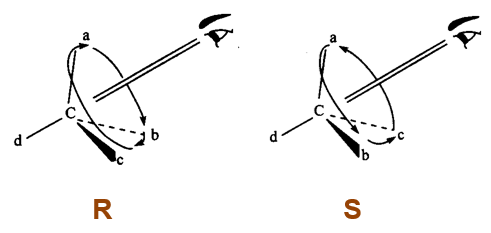

  R/S构型判定规则

要应用这个规则，我们得首先能够在脑海中建立分子的三维形象。目前我们已经学习了一系列在纸面上表达分子的三维形象方式，包括楔线式、纽曼式、锯架式、
Fischer投影式等等。这些平面表达方式大家应该都能自如地想象出其3D模型来。如果觉得有一定困难，观察
https://organic.cpu.edu.cn/~partridge/OrgChem/MolModels/enantiomers/mirrorViewer.html 的分子3D模型在刚开始的阶段也许可以助你一臂之力。

以下我们来看一些具体的实例。

楔线式的判定
----------------

下图中左边的楔线式中心为手性碳，连接了氢原子、甲基、异丙基、正丁基四个原子/基团，不难判断出这四个基团的优先级次序为i-Pr>n-Bu>Me>H。
（基团优先级的判断请见前一节内容）。

接下来依据规则，把优先级最低的氢原子放到视线远处，大家可以在脑海里想象一下，旋转分子把H转到纸面后方去；或者更直接些，从C-H键的背面，整个分子的
下方去观察，这时剩余三个基团在平面上的排布大致如下图右侧所示，逆时针方向。于是得到结论，该手性碳为S构型。整个分子应命名为(S)-2,3-二甲基庚烷。

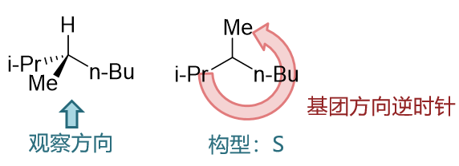

更进一步，下图中的楔线式则存在两个手性中心，我们继续判断其构型。

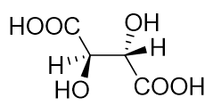

先看左侧。左侧手性碳连接了氢、羟基、羧基以及右边一大块儿。羟基（-OH）首原子是O，明显优先级最高。
氢明显优先级最低。剩余两个基团，羧基优先级高于右边一大块儿，如下图所示。

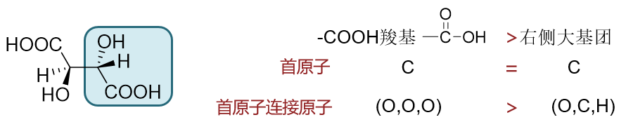

判断四个基团优先级之后，按照规则，接下来应当把H放在纸面后方背离我们的位置了。注意到当前H刚好在虚楔线上，恰好已经处于背离我们的方向了，
咱们基本上不用再作旋转。就在当前这个结构的基础上，从羟基到羧基到右边一块儿，顺时针方向，于是左侧手性中心构型为R。

类似的，右侧手性中心，周边也还是如出一辙的四个基团。当然我们目前看到它连接的氢处于实楔线，朝向我们。这不满足判断RS的规则了，但也好办，咱们
干脆就从纸面背后去观察右侧这个手性中心。从正面看氢朝向我们，反面看自然就背离我们了。从正面看剩余三个基团从大到小顺时针方向，背面看也刚好
逆过来，逆时针方向。于是右侧手性中心构型为S。整个分子系统命名为(2R,3S)-2,3-二羟基丁二酸，也就是内消旋酒石酸。

  很多时候可以从纸面背后观察分子，简化构型判断

锯架式的判定
-------------------

对大多数同学而言，锯架式相对而言显得比较有立体感，判定构型也并不困难。如下图中的以锯架式表达的分子，我们来判定其两个手性中心的构型。

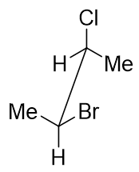

还是老办法，先判断四个基团优先级次序，再把优先级最低的基团（这里都是H）放到视线后方，我们对两个手性中心的观察方向大致如下图所示。
剩余三个基团平面上的方向，大致如右，不难判断这两个手性中心构型皆为S。整个分子应命名为(2S,3S)-2-氯-3-溴丁烷。

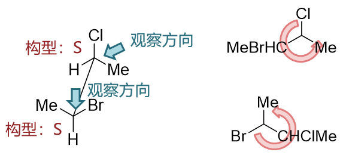

纽曼投影式的判定
---------------------

纽曼投影式由于过于“投影”，两个碳原子叠在一起，挺多同学觉得判定构型的时候略有困难。一个简单的解决办法是将其先转换为更有立体感的锯架式后再行判定。

如下图中的分子，转换为锯架式后，其实与前一例完全相同。

.. image:: ../../images/C03-KeyPoints/configuration08.png

Fischer投影式的判定
-------------------------

含手性中心分子的纸面表达，我们最多见的还是Fischer投影式。拿到Fischer投影式之后迅速判定构型，这也是有机工作者的一个基本功。

Fischer投影式判定构型，最老实的办法也还是在脑海中想象分子立体形状，再旋转放置优先级最低基团。但实际操作中，我们还有更简便的做法。

如下图中分子，我们姑且不去考虑立体形象，不管三七二十一先排出四个基团次序，应当是Br > COOH > Et > Me。

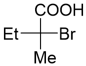

而注意到当前最小的甲基处于纵键，刚好背离我们的视线，满足判定构型的规则。于是就保持目前状态，看剩下三个基团，逆时针方向，直接得出结论，
手性中心构型为S。

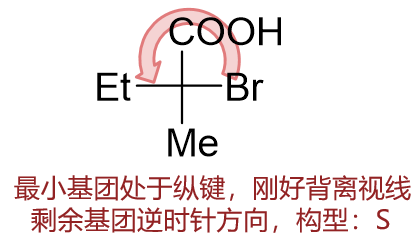

类似的，下图的分子，四个基团与前例相同，但当前甲基在横键，朝向我们，不满足规则。但这也好办，我们直接从背面观察就是了。
剩余三个基团正面看顺时针，背面观察就是逆时针，手性中心依然也是S构型。

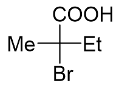

大家也可以注意到，在上面两例中，分子构造、构型均相同，但Fischer投影式基团分布不同。换句话说，Fischer投影式实际不具有唯一性。
同样的构型，我们可以画出多个Fischer式来。

对于多手性中心的Fischer投影式，判定方法也是换汤不换药。如下图中的分子，我们采取同样方法，不难判断出其构型为(2S,3R)。

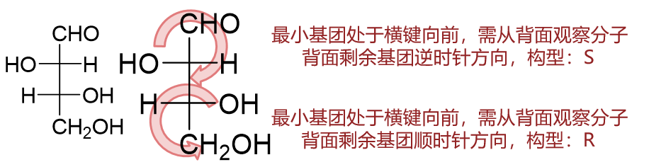

取代环烷烃构型的判定
----------------------------

时常我们也能见到具有手性中心的取代环烷烃。最简单的如二取代环丙烷，如下图所示。

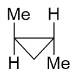

这种把环画得有点儿“扁”的表达方式，意思是把三元环放得与纸面垂直，其中环里靠下方的原子距我们相对较近，上方与甲基相连的两个原子距离我们较远。

先判断左侧手性中心构型。老规矩，依然先给四个基团排序。明显H最小，而剩余连接的三个基团首原子都是C。继续考察各自C原子的连接情况，如下图，
于是易得三个基团优先次序：叔碳>仲碳>甲基。

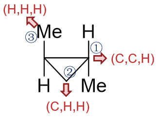

接下来把H放到视线后方。这里需要留神我们当前这个结构是个示意性的画法，实际分子中，C-H与C-Me这两根键无论如何是不可能在一条直线上的，
为保证109.5度的键角要求，总会外张一些，也就是下图中间的图示。从上向下观察手性中心，剩余三个基团平面上大致如下图右示，判定得到构型为R。
类似的，右侧手性中心构型亦为R。整个分子命名为(1R,2R)-1,2-二甲基环丙烷。

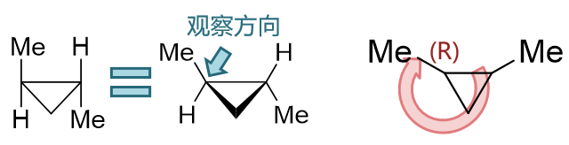

三元环外，更大的环系在表达构型时，我们也可以示意性得把环画在一个平面上，如下图中的六元环分子。判定方法并无区别，将侧链略微外张，
从小基团背面观察如最右图示情况。不难得到该手性中心为R构型。

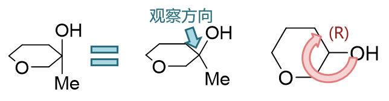

对于六元环，特别是环己烷的衍生物，还经常能见到构象式。在椅式构象的基础上，我们也应能快速判定出构型来。基本方法无非还是在脑海中
构建椅式的立体模型。如下图中左侧分子，两个与羟基相连的碳原子均为手性中心上，且各自连接的最小基团均为氢。剩余三个基团次序不难确定，
再各自从C-H键背面去观察，得到两个手性中心构型均为S。

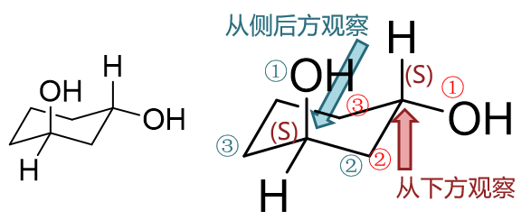

