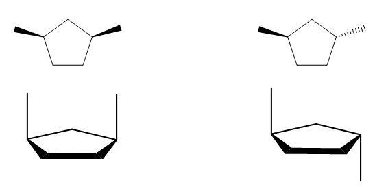
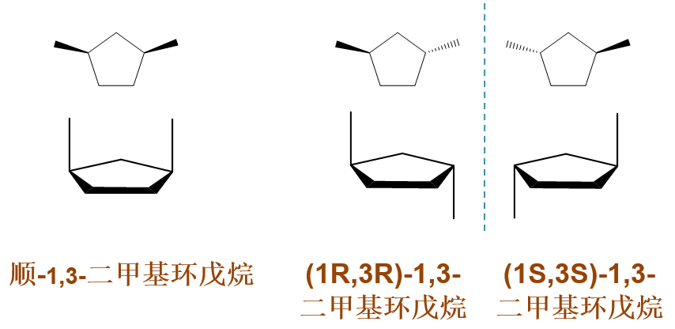
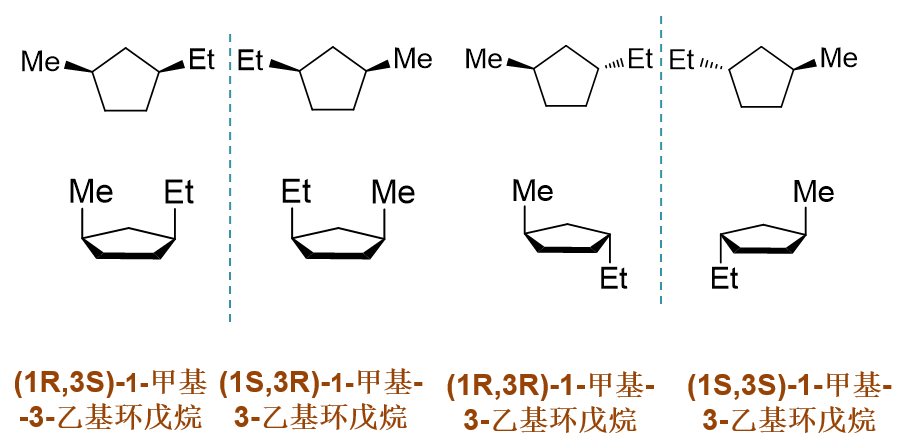

取代环烷烃的顺反与对映异构
==========================================

多取代环烷烃往往存在构型异构问题，而且\ **顺反异构**\ 与\ **对映异构**\ 经常伴生。我们在对化合物进行命名时尤其需要注意这方面的问题。

如1,3-二甲基环戊烷，明显存在顺反异构，两个甲基可以处于环一侧，也可以处于环异侧：

命名时，必须表示出顺反关系来。左侧顺式构型，我们大可以称为\ **顺-1,3-二甲基环戊烷**\ 。而右侧的分子，很多同学容易会犯个错误，
一眼看过去，反式，挺简单，于是直接称为反-1,3-二甲基环戊烷。当然这也不能算全错，但仅称为“反”，对我们当前这个分子并不充分。

仔细看反式的这个结构，明显不存在对称面与对称中心，镜像与实物不能重叠，它其实还存在一个对映异构体，如下图所示：

右侧这一对对映异构体，甲基都处于环平面异侧，光用一个“反”字实际无法区分。再仔细看分子中与两个甲基相连的1,3-位碳原子都是手性碳，
因此命名时我们必须将这两个手性中心的构型都给标记出来，如上图所示。

此外，回到左边顺式的异构体，仔细观察的话我们会发现，它其实也存在两个手性中心，但分子中有对称面，因而不具有手性。这其实就是
我们学习过的具有两个相同手性中心时可能出现的特殊情况：\ **内消旋体**\ 。由于不具有手性，顺式只有这么一个构型，因此命名时我们一般
也就没必要去判断R/S了，直接一个“顺”字就成。

类似的，如1-甲基-3-乙基环戊烷，它也存在一系列顺反、对映异构体，如下图所示。

总之，大家在对取代环烷烃进行命名时一定需要小心，顺反之外，一定得小心还存不存在对映异构。值得注意的是，由于两个侧链取代基不同，
即便是顺式，也存在一对对映异构体。命名时，一般也需要显式标记处两个手性中心的构型来。

最后，有同学还有一点儿担心，按说四元以上的环在优势构象下环上原子都不会共面，而我们刚才判断分子有没有对称面什么的，使用的都是
上面的平面式，假定环处于平面上了。那这样判断出的结论究竟靠不靠谱呢？事实上，大家在这方面不需要有太多顾虑。绝大多数情况下，
我们使用平面式对构型的判断都是没问题的。至于具体原因，有兴趣的同学可以自个儿琢磨一下。
