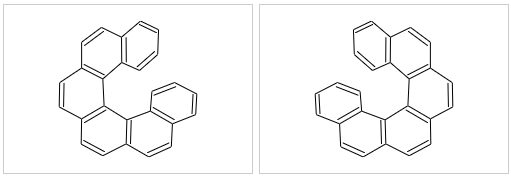
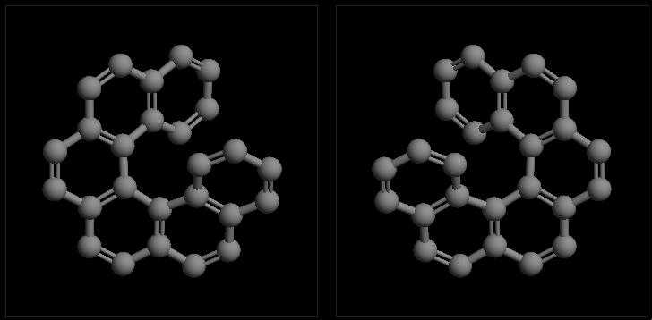
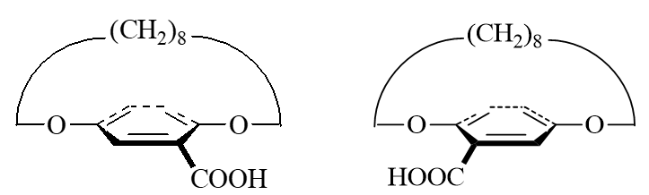
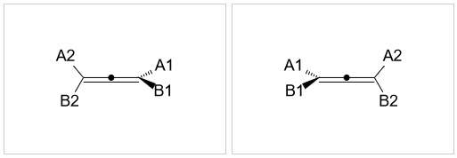
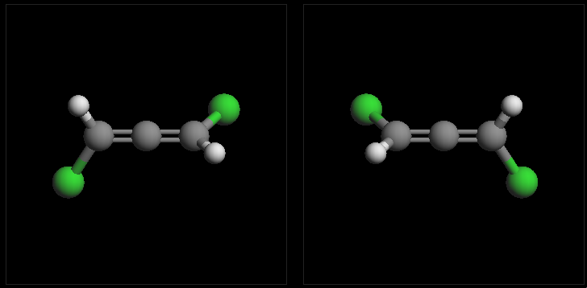
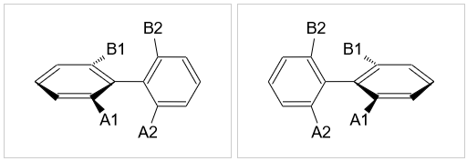
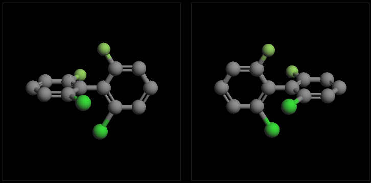
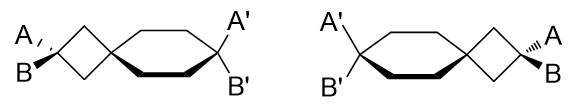
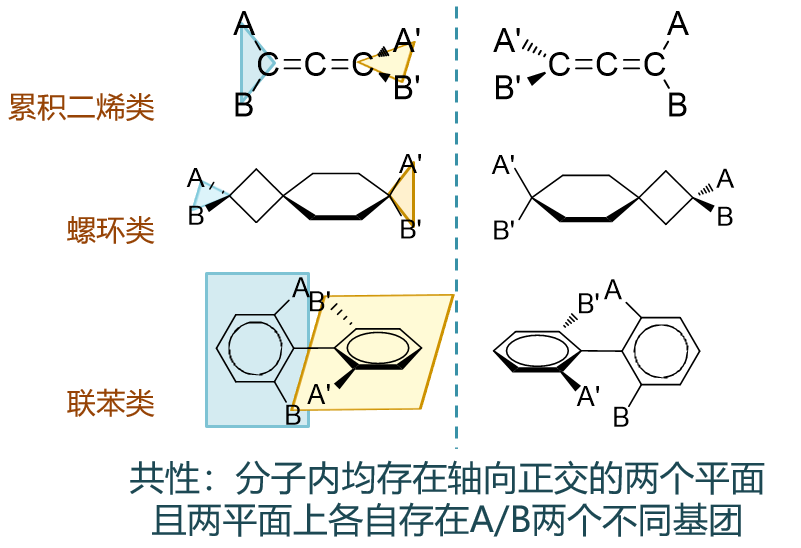
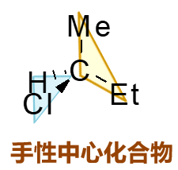

无手性中心的手性分子
==========================================

在基础有机化学的学习中，我们遇到的绝大多数手性分子都是具有手性中心的。但手性中心与手性存在与否并没有必然的联系，
很多手性分子中压根儿就没有手性中心的存在。在立体化学一章中，我们也粗略地接触了部分这样的分子。

无手性中心的手性分子的常见类别
--------------------------------------

我们在基础有机化学中接触的无手性中心的手性分子基本分三大类：螺旋型的、有手性面的、有手性轴的。其中又以具有手性轴的分子相对更为重要。

螺旋型化合物
~~~~~~~~~~~~~~~~~~~~~~

典型的如下图中的分子，一系列苯环拼合在一起。正常情况下，苯环上所有原子应当共面。但下图分子若各环原子共面的话，端头两对碳原子之间距离将极近，
空间斥力极大。因而整个分子的环系实际会扭转开一个角度，像螺旋楼梯似的。而螺旋存在左旋、右旋两种取向，互为镜像但不能重叠，是一对对映异构体。

具有手性面的化合物
~~~~~~~~~~~~~~~~~~~~~~~

典型如下图中的分子，整体形状仿佛是个提篮，下方苯环是篮底，上方长链是篮柄。若篮底苯环上没有侧链取代基，则整个分子存在对称面，无手性。
但若篮底苯环上分布着不对称的取代基，则分子与其镜像不能重叠，手性随之出现。

具有手性轴的化合物
~~~~~~~~~~~~~~~~~~~~~~

这类分子在基础有机的学习中相对较常见，也比较重要。典型的如累积二烯、联苯与螺环衍生物。

累积二烯衍生物
++++++++++++++++++++

所谓累积二烯，指的是两根双键紧邻，连接在同一碳原子上的二烯烃。它的结构如下图所示，中间碳原子已经四价，不会再连接其它基团，
而双键端头两个碳原子，各自还有两根σ键。由于杂化形态的原因（具体在后面二烯烃一节会介绍），端头A1-C-B1平面与A2-C-B2平面
互相正交。若A1≠B1且A2≠B2，则分子与其镜像不能重合，具有手性。但若端头A1=B1或A2=B2，则分子中将出现对称面，手性消失。

取代联苯
++++++++++++++++

两个苯环之间通过一根单键相连，即构成了联苯。需要注意的是，联苯中两个苯环之间不存在共轭，中间单键就是一根可以旋转的σ键。
正常情况下，这根键旋转360度能垒不高，室温下可以完成。但若苯环相去较近的位置上连接有较大的基团（如下图），存在明显的空间位阻，
则旋转能垒大大提高，通常情况下中间σ键无法自由旋转一周。此外，由于空间斥力，我们也很容易想象两个苯环连同其连接的基团不会处于
同一平面上，总会错开一个角度（能量最低时两个苯环一般处于正交状态）。类似累积二烯，当两个苯环上连接的基团各不相同时，分子也将
具有手性。但反过来如果有一对取代基相同，则分子中又将出现对称面，手性消失。

螺环衍生物
+++++++++++++++++

螺环烷烃是我们所熟悉的分子，两个环通过一个螺碳原子相连接。螺碳原子本身sp3杂化，因此其两侧的两个环——如下图中的四元、六元环——
也不会处于同一平面上，而是互相正交。若左右两环上连接了两对各自不同的基团，类似前面累积二烯的倾向，手性又将出现。

.. note::

  对于这些不具有手性中心的手性分子，如果大家在脑海中不易想象出它们的立体形状，可以参考如下地址的分子立体模型：

  https://organic.cpu.edu.cn/~partridge/OrgChem/MolModels/enantiomers/mirrorViewer.html

  在页面中可以选择不同的具备或不具备手性的分子，自己旋转一下模型，看能否把左右的实物与镜像在空间中重叠起来。

常见分子出现手性的规律
--------------------------

螺旋型与手性面类分子相对少见，我们可以姑且放在一边。观察具有手性轴的一系列分子，我们会发现，它们其实都有一个普遍的共性：
**分子中存在非共面（一般是正交）的两个平面，这两个平面上又分布着不同的基团**\ 。

如上图所示，像联苯类的分子，左环与A、B构成一个平面（蓝色），右环与A'、B'构成一个平面（黄色），这两个平面正交。而若A、B及A'、B'各不相同，
分子将具有手性。

类似的，对于累积二烯，两根双键端头同样存在互相正交的A-C-B及A'-C-B'平面。若A、B及A'、B'各不相同，分子也将具有手性。

包括螺环衍生物也是如此。A-C-B平面与四元环垂直，四元环与六元环垂直，六元环又与A'-C-B'垂直，分子里其实有一系列垂直正交关系。我们易得
A-C-B与A'-C-B'平面也正交。

这个规律甚至不仅局限于手性轴类分子。我们最熟悉的具有手性中心的手性分子，某种意义上说，也满足这个共性。

如上图中的单手性中心化合物，手性碳上连接了氢、甲基、乙基、氯四个不同的原子或基团。注意到中心碳原子sp3杂化，我们发现这里用蓝色标记的H-C-Cl平面
与用黄色标记的Me-C-Et平面也是互相正交的。又是有夹角不共面的两个平面，面上各自有两个不同基团。

总之，大凡在分子中看到这么一个典型的结构特征，我们基本就可以判断，该分子实物与镜像不能重叠，具备手性。

在日常练习或考试中我们也经常可以利用这个原则，以下试举数例：

例1
  请判断如下分子有无手性。

  .. image:: ../../images/C03-KeyPoints/nonChiralCenter08.png

  我们注意到分子中存在一根双键。单根双键，两端碳原子均为sp2杂化，与双键碳相连的原子或基团应当共面（注意与之前两根连续双键的累积二烯不同！）。
  于是，左侧Me-C-Et平面、双键、双键右端六元环，这三个部分应当共面。于此同时，六元环最右侧Me-C-Et平面，明显与六元环本身正交。这么一来我们发现，
  分子中左右的两个Me-C-Et平面互相正交，如下图所示。两个正交平面，平面上各自又分布着甲基、乙基两个不同基团，于是整个分子将具有手性。

  .. image:: ../../images/C03-KeyPoints/nonChiralCenter09.png

例2
  请判断如下分子有无手性。

  .. image:: ../../images/C03-KeyPoints/nonChiralCenter10.png

  这也是个螺环衍生物，只不过有三个环，两个螺碳原子。我们依然可以分析分子内的一系列正交关系。最左端H-C-Cl平面与左侧四元环正交，左侧四元环与
  中间六元环正交，六元环与右侧四元环正交，右侧四元环又与右端H-C-Cl平面正交。通过这么一系列正交关系，我们发现，当前左右两端的H-C-Cl平面，
  实际是共面的。虽说两端侧链H与Cl不同，但由于共面，两端H-C-Cl所在的这个平面实际也是整个分子的对称面。分子自然也就不具有手性。

  .. image:: ../../images/C03-KeyPoints/nonChiralCenter11.png

