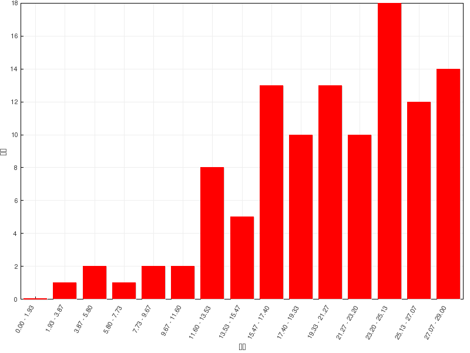

习题讲解：烯烃
========================

在线自动评分习题
---------------------

=======   =============
总分        29
平均分      20.4(70.3%)
最高分      29(100.0%)
=======   =============

  成绩分布

题2：命名（错误率44.8%）
  .. image:: ../../images/C04-Exercises/A02_00.png

  还是那句老话：\ **命名的时候一定注意构型**\ 。本题构造很简单，但注意左侧双键存在顺反异构，而且构型在键线式中
  体现地非常明显，反式或(E)构型。至于右侧双键，右边碳原子上实际连接了两个相同的乙基，无顺反问题。

  最终整个分子应命名为：\ **(E)-7-乙基-2,6-壬二烯**\ 。

题3：命名（错误率33.3%）
  .. image:: ../../images/C04-Exercises/A03_00.png

  当然并不是说所有情况下双键的构型都一定要标记，比如当前这题。母体明显是环己烯，环上双键看起来应当是个顺式或(Z)构型，
  但这个构型在命名时并不用写上。原因也很简单：它在一个不太大的环上。如果双键是反式或(E)构型，大家可以自己画一下，
  整个六元环在空间上就没法儿闭合了。因此类似这样的，\ **非特大环上的烯烃双键，构型一般不用特别标注**\ 。整个分子可
  称为：\ **3-甲基-4-烯丙基环己烯**\ 。

题4：命名（错误率59.5%）
  .. image:: ../../images/C04-Exercises/A04_00.png

  本题稍有难度，出现了我们在课本里没见过的桥环烯烃，有些同学一时摸不着头脑。但其实也不困难，桥环烯烃没见过，可桥环烷烃
  我们已经很熟悉了。比如把题干里的双键都换成单键，如下的桥环烷烃：

  .. image:: ../../images/C04-Exercises/A04_01.png

  编号如上图所示，应称为7,7-二甲基二环[2.2.1]庚烷。

  现在无非就相当于把刚才的桥环烷烃加了两根双键，变成了二烯。对于桥环烯烃而言，编号原则基本与桥环烷烃一致，这里母体编号与之前的烷烃相同，如下图所示。

  .. image:: ../../images/C04-Exercises/A04_02.png

  最终的名称，也就是在烷烃的基础上做一些变化，把庚烷换作2,5-庚二烯，称为\ **7,7-二甲基二环[2.2.1]-2,5-庚二烯**\ 。

题7：名词解释：烯丙基碳正离子（错误率41.4%）
  这题其实很简单，结构大家都知道，无非如下图所示：

  .. figure:: ../../images/C04-Exercises/A07_00.png

    烯丙基碳正离子的键线式与缩写式

  但绘制在纸面上的时候有些同学会犯个小错误，写成如下的形式：

  .. image:: ../../images/C04-Exercises/A07_01.png

  两相比较，明显多了一个小横键。这其实是把\ *烯丙基*\ 与\ *烯丙基碳正离子*\ 弄混了，这两个名词的含义完全不同。
  前者是一个电中性的取代基，如果单抽出来，我们书写结构的时候确实需要这根小横键：

  .. image:: ../../images/C04-Exercises/A07_02.png

  右端这条小横线实际是标识烯丙基与母体相连的位置。从某种意义上说，我们可以把右端这根横线理解成是和母体相连的那根键的一半，
  也就是半根共价键，相当于一个电子（但是千万别画成单电子如\ CH\ :sub:`2`\ =CH-CH\ :sub:`2`\ ·，这又成了烯丙基自由基了）。

  当前题目要求我们书写的是烯丙基碳正离子，是个独立的离子，不与任何母体相连，自然不存在这根连接键。此外正电中心碳上p轨道是空的，
  没有电子，这个短横更是不应当存在。

  离子、自由基、取代基，这三个概念不同，纸面上的画法也各不相同，请大家注意体会其中的区别。

题10：反应（错误率43.2%）
  .. image:: ../../images/C04-Exercises/A10_00.png

  本题具有相当的迷惑性。很多同学给出了如下看起来似乎遵循马氏规则的答案，但很遗憾并不正确：

  .. image:: ../../images/C04-Exercises/A10_01.png

  为何如此，我们还是要通过反应机理来分析。加成第一步，还是先上质子形成碳正离子，无非有两种可能性：

  .. image:: ../../images/C04-Exercises/A10_02.png

  一种形成普通的叔碳正离子，另一种仲碳正离子连接烷氧基。两相比较，这俩碳正离子结构上的差别无非就是一边连接烷基一边连接烷氧基。
  烷基我们很熟悉了，+I，给电子共轭效应可以帮助正电荷分散。关键是烷氧基。

  有的同学第一感觉认为烷氧基这里是吸电子的，毕竟氧的电负性比较大，具有-I效应。但仔细观察底下的这个碳正离子中间体，正电中心碳
  sp\ :sup:`2`\ 杂化，与氧直接相连，而氧原子的p轨道又存在孤对电子，于是C\ :sup:`+`\ 与O之间，实际可以发生p轨道的侧面
  交叠，形成类似共轭的情况，如下图所示：

  .. image:: ../../images/C04-Exercises/A10_03.png

  而且交叠后，C\ :sup:`+`\ 的p轨道是空的，不出电子，O出一根p轨道上的两个电子，会形成两中心两电子的体系，粗略里看，大致相当于
  C、O两个原子差不多能各分到一个电子。共轭前C上p轨道是零个电子，共轭后差不多分到一个，电子云密度实际大大上升了。换句话说这里O实际相当于
  通过共轭，向碳正中心推电子，具有明显的+C效应。

  一面是-I，一面是+C，而一般情况下（注意也并不是所有情况下）杂原子的共轭效应总是明显强于诱导效应，两相叠加的效果，
  甲氧基在这里相当于是个挺强的给电子基团，给电子能力远强于烷基。与氧直接相连的这个碳正离子，稳定性也是远强于另一种叔碳正离子。

  .. note::

    关于诱导、共振效应的更多讨论，请详见
    :doc:`诱导效应与共轭效应、碳正离子的稳定性<./KeyPoints02-InductiveAndConjugatedEffects>`\ 。

  此外，在下一章中我们会接触共振论，如果以共振论的观点，正电碳与氧直接相连的这种中间体，我们还可以画出它的一对共振极限式来，如下图
  左边所示。其中右侧氧上带正电荷的极限式，C、O均满足八隅体规则，稳定性还是不错的。中间体的实际结构相当于这俩共振极限式的平均化，
  大致如下图右侧所示，C、O两个原子都带有部分正电荷，相当于电荷被分散开来了，这无疑也有助于离子稳定性的提高。

  .. image:: ../../images/C04-Exercises/A10_04.png

  .. note::

    关于共振论的讨论，请详见下一章的
    :doc:`重难点小结：共振论(1)<../C05/KeyPoints03-ResonanceTheory1>`\ 、
    :doc:`重难点小结：共振论(2)<../C05/KeyPoints03-ResonanceTheory2>`\ 。

  综上所述，既然我们判断出与氧直接相连的这个碳正离子更稳定，反应也就倾向于朝这个方向走，接下来Br\ :sup:`-`\ 与C\ :sup:`+`\ 结合，
  最终主要生成下图中右下角的产品。

  .. image:: ../../images/C04-Exercises/A10_05.png

  这个反应看起来H加成到了连接支链比较多的碳原子上，表面看起来似乎违背了马氏规则，但实质上正是碳正离子稳定性的体现。
  大家在判断亲电加成区域选择性的时候，也千万别死记马氏规则里的什么氢数支链数什么的。更多的情况下，通过机理，通过中间产品的稳定性去判断
  得到的结论更加稳妥些。

题11：反应（错误率32.4%）
  .. image:: ../../images/C04-Exercises/A11_00.png

  本题看着挺容易，似乎就是个普通的亲电加成，得到遵循马氏规则的产物：

  .. image:: ../../images/C04-Exercises/A11_01.png

  但实际情况没这么简单。注意到质子首先与双键加成后，生成的是一个仲碳正离子，而与此同时旁侧有个季碳，因此很容易发生碳正离子重排，
  生成更为稳定的叔碳正离子：

  .. image:: ../../images/C04-Exercises/A11_02.png

  这种能够增强碳正离子中间体稳定性的重排，相对来说比较容易发生。因此，该反应的主要产品，也是上图中重排之后再与溴负离子结合的产物。

题13：反应（错误率32.4%）
  .. image:: ../../images/C04-Exercises/A13_00.png

  本题也不难，但存在一个小小的陷阱。

  我们注意到反应条件里有个R\ :sub:`2`\ O\ :sub:`2`\ ，很多同学一看这个，立马联想到过氧化物效应，于是给出了反马氏规则的结果：

  .. image:: ../../images/C04-Exercises/A13_01.png

  很遗憾又错了。别忘了，只有HBr与烯烃加成的时候才存在过氧化物效应，才能转变为自由基加成的机理。
  如果我们把题干中的HCl换成HBr，没错儿，确实主要会得到反马氏产品：

  .. image:: ../../images/C04-Exercises/A13_02.png

  然而现在是HCl，氯自由基在当前条件下不易形成，因此本题的反应依然还是普通的亲电加成，生成碳正离子的过程。换句话说，这里有没有过氧化物，
  得到的产品都一样：

  .. image:: ../../images/C04-Exercises/A13_03.png

题17：反应（错误率45.1%）
  .. image:: ../../images/C04-Exercises/A17_00.png

  17-20小题的反应，都涉及立体选择性，题干中也有特别的标注。当然，底物烯烃分子双键附近不对称，往往也同时涉及区域选择性问题。

  本题水溶液中加溴，注意这里水溶液的条件，水本身具有亲核性，可以对正离子进攻，这导致最终的加成产物不是双键碳各加一个溴，而是一边上溴一边上羟基，
  加成时区域选择性上也遵循马氏规则。此外，这里由于是溴的加成，我们也很熟悉，反应中会形成溴鎓离子，导致下一步水只能从溴的背面进攻，最终得到的
  羟基与溴总是处于环平面异侧，立体选择性上是个反式加成。反应过程大致如下图所示：

  .. image:: ../../images/C04-Exercises/A17_01.png

  注意这里第一步生成的溴鎓离子存在两种可能：溴位于六元环上或环下，这导致最终我们也会得到一对主要产品，刚好互为对映异构体。
  最终产物的立体构型，使用上图中的环平面式或者类似下面的楔线式画出，都没问题：

  .. image:: ../../images/C04-Exercises/A17_02.png

题20：反应（错误率35.6%）
  .. image:: ../../images/C04-Exercises/A20_00.png

  底物分子与上题相同，条件上明显是硼氢化-氧化。而硼氢化-氧化我们知道立体或者区域选择性都非常鲜明，区域选择性反马氏，
  立体选择性由于经历四元环状过渡态，总是顺式加成。

  反马氏的区域选择性，意味着我们最终会得到如下构造的产物（这里先不考虑构型）：

  .. image:: ../../images/C04-Exercises/A20_01.png

  而立体选择性的顺式加成，请特别留意，指的是加成过程中新形成的两根键，也就是上图中的C-H与C-OH键，反应结束后是顺式关系，处于环平面同侧，
  并非是说反应结束后取代环烷烃的构型是顺式（请体会这个区别）。像上图的产品，-H、-OH总是处于六元环一侧，而与-H相连的碳原子上原先还有个甲基，
  总是会被挤到环的另一面去。由于新形成的C-H、C-OH键可能处于环上方，也可能处于下方，最终我们还是形成一对对映异构体：

  .. image:: ../../images/C04-Exercises/A20_02.png

题18：反应（错误率46.4%）
  .. image:: ../../images/C04-Exercises/A18_00.png

  这题其实比较简单。看条件，过氧酸氧化，我们知道会把烯烃双键氧化成环氧三元环，相当于单个氧原子与两个双键碳同时成键。这单个氧原子自然可能从
  六元环上方，或者从下方两个方向与双键靠近，于是我们也会生成一对对映异构体：

  .. image:: ../../images/C04-Exercises/A18_01.png

  上面的结构表达中，我们使用楔线式标识氧原子处于六元环上方或下方。这两组楔线画在三元环上，略微显得有些不好看。因此习惯上我们更多场合会换一种
  构型的标识方法。注意到生成的产品实际是个桥环化合物，与O相连的两个原子都是桥头碳，它们各自又连接了Me与H。当前桥头碳与O相连的两根C-O键，无疑总是
  处于六元环一侧，而剩下的Me与H，一定是处于六元环的另外一侧。因此我们用楔线去标记C-Me、C-H键，同样可以起到标识桥环构型的效果，如下图所示：

  .. image:: ../../images/C04-Exercises/A18_02.png

  这两组楔线式，实际结构是等同的。

题19：反应（错误率31.5%）
  .. image:: ../../images/C04-Exercises/A19_00.png

  本题在这一系列涉及立体化学的反应题里应该说是最简单的一道。催化氢化，无所谓区域选择性，立体选择性又是个顺式加成，新形成的两根C-H键将处于六元环的
  同侧，而原本双键碳上连接的甲基、乙基被挤到另一侧，又是生成一对对映异构体：

  .. image:: ../../images/C04-Exercises/A19_01.png

.. note::

  关于烯烃不同种类加成反应区域、立体选择性的讨论，请详见
  :doc:`重难点小结：烯烃的四类加成反应<./KeyPoints04-AdditionReactionsOfAlkene>`\ 。

在线手动评分习题
---------------------

本章中还另有三道手动评分练习题。

名词解释，不用多说。这里完成名词解释题时（包括考试时），大家无需像做政治考卷那样写大段的文字，直接用反应式或结构式表达出题干中的概念即可。
如本题马氏规则，大家只要随便举一个遵循马氏规则的亲电加成反应实例即可。

机理题，实际就是个碳正离子的扩环重排，可参见\ :doc:`重难点小结：碳正离子重排<./KeyPoints03-CarbeniumRearrangement>`\ 中
五元环重排成六元环的例子。

最后合成题值得稍稍讨论一下。

合成：请以环己烯为主要有机原料合成1,2,3-三溴环己烷。
  .. image:: ../../images/C04-Exercises/B02_00.png

  比较起始原料与生成物，我们发现原料中的双键消失了，而多了三个溴原子。双键与溴明显是存在关联的，大家很容易想到烯烃与溴分子的加成：

  .. image:: ../../images/C04-Exercises/B02_01.png

  但这还欠着一个溴。怎么样加上这第三个溴去，很多同学接茬儿想到了烷烃的自由基卤代：

  .. image:: ../../images/C04-Exercises/B02_02.png

  看着挺好，但这步其实存在很大的问题。

  这步自由基取代中，我们的愿望是让溴取代3-位仲碳上的氢原子。但注意到这步的反应物，1,2-二溴环己烷中远不止一个仲碳，3-到6-位，发生自由基取代
  的活性其实都差不多。因此这里我们没法儿保证发生取代的位置，最后会形成1,2,3-、1,2,4-三溴环己烷（甚至1,1,2-三溴环己烷）的混合物，产率不但受影响
  后期分离也困难。

  .. note::

    非但有区域选择性不强的缺点，烷烃的自由基卤代还特别容易发生多取代，导致副产品增多。因此在合成里，请大家尽可能不要使用烷烃的卤代反应。

  既然这条路线行不通，这个合成又该怎么完成呢？说起来其实挺简单：把加成与自由基卤代反应颠倒一下次序：

  .. image:: ../../images/C04-Exercises/B02_03.png

  第一步，先做自由基卤代。注意这里的反应物不是烷烃，而是烯烃。我们知道烯烃的自由基卤代选择性较烷烃强多了，基本总是在双键的α位发生，通过
  控制反应物用量，我们也比较容易保证主要得到单取代产品。接下来的加成反应，更是没有什么其它选择。最终我们将大量得到题目中要求的目标分子。

  .. note::

    NBS/过氧化物是合成中常见的产生溴自由基，引发自由基取代的反应条件。而做自由基氯代时，我们经常会使用Cl\ :sub:`2`\ /\ *hv*\ 。这两个
    条件大家千万别混到一起去，写出NBS/\ *hv*\ 或者Cl\ :sub:`2`\ /R\ :sub:`2`\ O\ :sub:`2`\ 这样的组合。

课本习题
-------------

习题4：下列两对化合物哪一个的偶极矩更大？
  .. image:: ../../images/C04-Exercises/C04_00.png

  .. image:: ../../images/C04-Exercises/C04_01.png

  分子的偶极矩，某种角度上说，相当于各根共价键极性的矢量和。而共价键的极性，又与成键原子的电负性有关。电负性又可以令我们联想到诱导效应。
  题目中两对分子，C-H键我们在讨论诱导效应时提到过，可以看成是考察诱导效应时的标准状态。至于氯与甲基，分别有吸电子与给电子诱导效应。将诱导效应
  的方向在分子中标记出来，再作矢量加和，我们不难得到偶极矩的次序：

  .. image:: ../../images/C04-Exercises/C04_02.png

习题8(2)：机理
  .. image:: ../../images/C04-Exercises/C08_00.png

  本题具有一定难度，也略微有些超纲，但反应历程我们依然是能够理解的。

  首先注意到反应条件是质子性环境，存在大量H\ :sup:`+`\ ，而缺电子的质子明显可以对双键发动亲电进攻，类似我们正常亲电加成的第一步，生成碳正离子。
  底物分子中两根双键对称，随便进攻哪根都一样，这里我们假设质子进攻1-、2-位碳间双键（注意此处编号并非命名编号，仅为说明方便起见）：

  .. image:: ../../images/C04-Exercises/C08_01.png

  接下来一步会略微有点儿出乎意料，但也可以想象。形成碳正离子后，我们右端1-位碳原子明显是带正电荷缺电子的，而与此同时，分子内部还有一根双键，
  电子云密度又比较高。很自然，这时双键与碳正会互相吸引，逐渐靠近乃至于成键，我们把分子弯折成下图，大家看得会比较清楚：

  .. image:: ../../images/C04-Exercises/C08_02.png

  当然，这里其实存在两种可能，5-、6-位双键碳实际都可能与正电子中心成键。但一方面，题干中我们已经知道最终产品是个五元环，另一方面，大家如果有兴趣
  可以自己画一下，6-位于碳正中心成键的话形成新的碳正离子稳定性不及5-位，因此这儿我们可以断定，靠近后5-位碳原子与1-位碳正中心键将形成新键。

  形成新键需要一对电子，1-位碳正中心肯定没电子，这俩电子都来自于5-位。但当前5-位碳也没有未成键电子对，必须拆东墙补西墙，断开旧键解放出电子来。
  明显，5-位旁侧最容易断开的是键能较低的π键，相当于把原本π键断开，两个电子都用来与1-位形成新的σ键。大致下图所示：

  .. image:: ../../images/C04-Exercises/C08_03.png

  而这一对来自于π键的电子原本是5-、6-位碳各出一个形成的，现在两个都被5-位拿去成键，相当于6-位失去了一个电子，将带有正电荷。换而言之，正电荷相当于
  从1-位转移到了6-位，我们得到一个新的叔碳正离子。

  正常亲电加成，这步得到碳正离子后接下来该是卤负离子的进攻了。但当前题干里我们发现，生成的不是卤代烃（条件里也没有卤负离子），而是得到一个新的烯烃。
  对照当前碳正离子的结构，相当于还得形成一根新的双键。这根双键该又如何形成？

  其实也挺简单，我们很熟悉质子加成上双键，形成碳正离子，但别忘了，所有的反应过程原则上都是可逆的，质子加成这步也不例外。如果反方向走，断开C-H键，
  一对电子转移到C-C之间形成π键，碳正离子又可以转变成烯烃的结构：

  .. image:: ../../images/C04-Exercises/C08_04.png

  这个过程我们后面学习到卤代烃一章，大家会发现，实际就是所谓的E1消除。而消除后的产品，恰恰就是题干中的生成物。

  到这儿，我们就可以连缀起来，写出整套反应的历程来：

  .. image:: ../../images/C04-Exercises/C08_05.png

  这个历程看似从没接触过，但从电性反应的本质：正负相吸，再结合题干中的最终产物，我们其实也不难推导出大致流程。还是那句老话，有机反应大家千万
  别去死记，一定要掌握原理掌握规律。一旦理解了规律性的东西，那怕是之前从未见过的反应我们经常也能推断出结果来。

