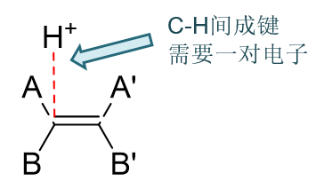
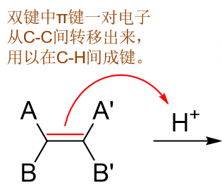
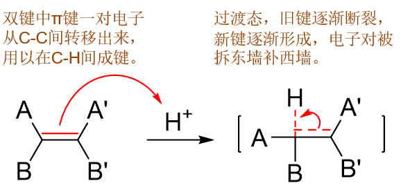
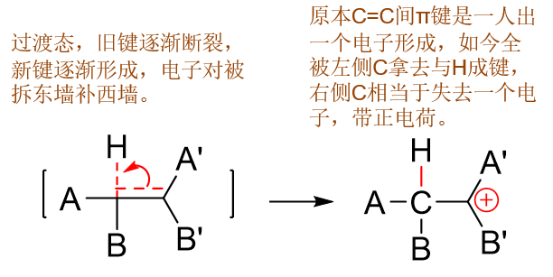
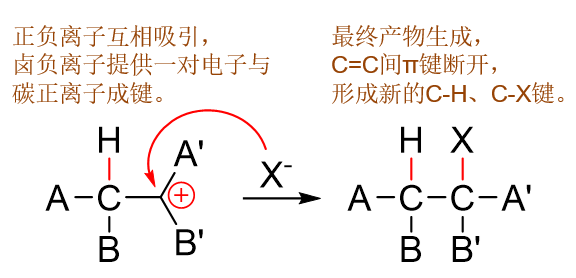

反应机理的理解与运用——以烯烃与卤化氢的亲电加成为例
=================================================================

基础有机化学中的一些比较典型、比较重要的反应，我们经常需要掌握它的机理，能够理解反应步骤，乃至自主写出反应历程。
看似麻烦的反应机理绝非学习时的负担，反过来，它其实能帮助我们记忆反应规律，甚至将多个不同的反应关联起来，织成一张知识点的大网。

在目前的学习阶段，相对而言最重要的一种有机反应类型是所谓的“\ **电性反应**\ ”。名字很直白，反应动力就是正负电荷之间的相互吸引。
电性反应又可以分为两大类：一类是由缺电子试剂进攻富电子底物引发，我们称为“\ **亲电**\ ”反应，进攻试剂奔着电子过去；另一类反之，
富电子试剂进攻缺电子底物，我们称为“\ **亲核**\ ”反应，进攻试剂相当于进攻带正电的原子核。

在烯烃一章中，我们接触到的亲电加成，就是一个很重要的亲电反应。这其中最典型的烯烃与HX的加成，它的机理我们是需要掌握的，考试中也经常出现。
接下来我们不妨看看，怎样理解、怎样书写这个反应的机理，而这个机理又可以为我们掌握反应规律提供怎样的帮助。

理解反应机理
----------------

化学反应从某种意义上说相当于是化学键的重新组合。一般在反应过程中总伴随着旧键的断裂、新键的形成。而对于有机化学反应，断键或者
成键的情况其实异常简单：有机分子中主要是共价键，而一根共价键其实就是一对电子。换句话说，有机反应说白了就是\ **电子的转移与重新配对**\ 。
鉴于电子的转移在有机反应中异常重要，通常在书写反应机理时，我们需要\ **用弯箭头来表达电子转移的方向**\ 。这个要求对很多初学有机的
同学而言显得有些困难，但只要抓住以下两点，其实这些箭头也不难画出：

  * **对于形成的新键，电子从何而来**\ ？

      一根键就是一对电子，一般来说这对电子总是来自于成键的两个原子。这两个原子是各出一个（类似于共价键均裂的逆过程），还是某个原子出倆（异裂的逆过程）？

  * **原子当前有无富余的电子去形成新键？需要影响旧键否**\ ？

      如果没有，势必得拆东墙补西墙，断开旧键，挪用旧键电子去形成新键。这时断开的又是哪一根旧键？

以下我们就以烯烃与HX的反应为例，来理解这么一个典型的亲电加成过程。

首先，我们知道烯烃双键是一个富电子的区域（正常C-C单键两个原子间一对电子，而C=C双键这个区域有四个电子，当然富电子了）。既然是
富电子区，自然能够吸引缺电子的基团与它靠近，靠到足够近，就能形成新的化学键了。

而另一个反应物HX中，明显H-X是极性共价键，卤素原子电负性远大于氢，氢这边会缺电子——事实上我们也很熟悉，很多情况下HX会解离成卤负离子与
质子（氢正离子）。于是我们很容易推断，这个亲电加成反应的起点，应当是C=C双键与氢的互相靠近。而在这个靠近过程中，碳原子将与氢之间逐渐
形成新键。

形成C-H键又需要一对电子。考虑到氢这儿原本就缺电子（基本就是个质子，一个电子都不带），这对电子，无疑只能来自于碳原子。而烯烃中双键碳原子
已经四价，所有的价电子都已经用来成键了，本身也是一个富余的也没有。因此这儿为了形成新键，必须断开碳原子周围原本的一根旧键。
拆开一根旧共价键，两个电子刚好就能腾出来了。

具体断开哪根旧键，我们其实也不难判断。正常烯烃中双键碳周边总是形成三根σ键一根π键，而π键键能又较σ键低，更容易断开，因此我们这儿很容易
理解，断开的应当就是双键里的π键，拆了这个东墙，用原本这根键的一对电子去形成新的C-H键。

确定了断裂的旧键、形成的新键，烯烃与HX加成反应的起始过程我们大致就可以写出了：

.. note::

  注意这里的弯箭头。这个箭头意味着电子的转移方向，而并非试剂的进攻方向——这步亲电反应从一般意义而言实际是质子去进攻双键，而电子却是从双键
  流向C-H之间。我们看到儿箭头起始端刚好也就是π键（而不是某个双键碳原子），终点是氢，意味着拆开旧π键，用这一对电子去和氢形成新的C-H键。
  此外由于是一对（两个）电子的流动，我们这里使用的是双钩箭头。

.. note::

  有不少同学在做机理题画箭头的时候会犯错误，把箭头方向弄反，从氢指向碳。请一定体会试剂进攻与电子流向这两者之间的差别。

这步电子的转移当然也会经历一个过渡态，如下图所示：C-H间在逐渐成键但还没完全形成（我们这儿不妨设左侧碳与氢原子之间成键），
C-C间π键逐渐削弱但还没完全消失。

随着反应的推进，终于C-C间π键完全断开，C-H键正式形成，我们将得到反应的中间产物，碳正离子：

注意这里出现了带电荷的碳原子。有些同学自己在写机理的时候经常弄不清究竟应该哪个碳原子带正电荷。这个事儿其实也很容易判断：
我们刚才看到C-C之间π键断开了，现在这对电子都被左侧碳用来和氢原子间成键。而原本π键是两个碳原子一人出一个形成的，现而今
两个都被左边拿去成键，毫无疑问右侧碳上相当于缺了一个电子，带上正电荷也就不足为奇了。

此外原本进攻过来的质子，我们也注意到它的正电荷消失了。原因就在于新形成的C-H键。正常共价键是每个原子各出一个电子，而现在
这根新形成的C-H键两个电子都来自于C。H一个没出，平白在身旁多出了这么一根键，其实就相当于额外拿到一个电子，刚好把之前的
正电荷给补齐了。H上正电荷消失，另一个碳原子带上正电荷，这步的反应过程实际也发生了电荷的转移。

我们继续往下走，现在已经得到了碳正离子这么一个中间产品，接下来的反应变化就更简单。HX中的氢目前已经参与反应，
而且是以质子的形态，一个电子都没带。既然如此，原本H-X间共价键的电子相当于都留给了卤素，形成了卤负离子。
一边是缺电子的碳负离子，一边是富电子的卤负离子，这两者之间无疑又会相互吸引，靠近过程中又会形成新的C-X键。

形成一根新键还是得有一对儿电子。当前碳上已经带正电荷了，很显然给不出电子来，而卤素那边刚好带负电荷，有富余。于是这根碳卤键
的一对电子应当都是来自于卤素。如是我们可以写出反应的最后一步：

.. note::

  注意到我们又是使用双钩弯箭头标明电子从卤素转移到C-X之间的过程。

整个反应机理我们概况总结起来，基本如下图所示:

.. figure:: ../../images/C04-KeyPoints/AdditionWithHX06.png

  烯烃与卤化氢亲电加成反应机理

基本来说就两步：第一步，质子进攻双键形成C-H键并得到碳正离子中间体；第二步碳正离子与卤负离子结合形成C-X键生成产品。这两步中的第二步，
正负离子结合成键，我们很容易想象它的活化能是不高的，反应起来很快，毕竟正负离子都很活泼，生成的电中性的产物能量下降很多。而第一步，质子进攻这步，需要
断开旧的π键，克服π键的键能，所需要的能量是比较多的，活化能也相应地较高。这第一步慢反应实际也是整套反应的\ **速控步**\ 。
亲电加成中的很多现象都与速控步，包括速控步生成的碳正离子中间体密切相关。

这个反应的机理，我们抓住电子的流动过程，进而考虑到新键形成旧键断裂，大家理解起来应当会觉得并不困难。自己书写反应机理，当然也就可以依据
这个思路进行。

通过机理掌握反应现象
--------------------------

把握了亲电加成反应的机理后，烯烃与HX反应过程中的诸多现象也就可以从机理来进行理解、记忆。

区域选择性
~~~~~~~~~~~~~~

比如结构不对称的烯烃加成时存在区域选择性问题。这个反应的区域选择性，也就是大名鼎鼎的“\ **马氏规则**\ ”，我们现在可以通过反应机理很简单地去解释。

整个反应最关键的一步是生成C-H键，得到碳正离子的第一步，也即反应的速控步。这一步形成与H成键的碳原子其实存在两种可能：两个双键碳都具备成键的能力。
C-H键形成的位置不同，会得到两种结构不同、稳定性也不同的碳正离子中间体，进而在第二步里生成两种结构不同的卤代烃。反应其实存在两种竞争性的走向。

而在很多反应中有这么一个规律：\ **一般来说，生成物的热力学能量越低（稳定性越高），反应的活化能也会越低**\ （注意：这是一般来说，
并不绝对，后面的章节里我们会看到反例）。两种结构不同的碳正离子中间体，其中稳定的那种能量较低，导致这条反应途径的活化能也会较低，反应起来更迅速，
在这对竞争性的反应走向中将占有主导地位。

单纯地这么描述有点儿抽象，结合实例，大家一看就能明白。

例1
  请判断如下反应的主要产物：

  .. image:: ../../images/C04-KeyPoints/AdditionWithHX07.png

  本例挺简单，最老实的办法无非把反应的两条途径都给画出来，如下图所示。第一步如果H先与3-位双键碳成键，则将得到第一行的碳正离子；
  反之若H先与2-位双键碳成键，将得到第二行的碳正离子。两种不同的碳正离子稳定性一望可知，反应也主要沿第一条途径进行，2-甲基-2-氯丁烷
  将是该反应的主要产品。

  .. image:: ../../images/C04-KeyPoints/AdditionWithHX08.png

  .. note::

    虽说2-甲基-2-氯丁烷是主要产物，但这并不意味着2-甲基-3-氯丁烷在反应时就不会生成。作为副产品，反应中同样也会得到2-甲基-3-氯丁烷，
    只是量相对于主产物明显偏少而已。

例2
  请判断如下反应的主要产物：

  .. image:: ../../images/C04-KeyPoints/AdditionWithHX09.png

  与前一例看起来相仿，只不过把原本2-位的侧链甲基换作了三氟甲基，但最终结果却大相径庭。
  我们依然将两种可能的反应途径画出，如下图：

  .. image:: ../../images/C04-KeyPoints/AdditionWithHX10.png

  依然还是比较两种碳正离子的稳定性。下方的看似还是叔碳正离子，但值得注意的是，带电荷的碳原子上当前连接的不是三个烷基，而是有一个三氟甲基。
  而三氟甲基，由于F原子特强的电负性，整体上实际是一个具有强烈吸电子诱导效应(-I)的基团。人家边上碳原子已经带正电荷了，已经缺电子了，你这儿
  还拼命地把电子往自己身旁拉，毫无疑问，这会使得碳正离子的稳定性下降。上方的碳正离子总体上相当于受到两个给电子烷基加一个吸电子基的影响。
  而下方，中心碳原子旁侧只有两个给电子的烷基，三氟甲基离得比较远，影响相对不大。
  两相比较，自然当前是下方的碳正离子稳定性更强。实际反应也将主要沿第二条途径进行，底下这个反倒是反应的
  主要产物。

  这个反应的主要产物氢加在了连接支链比较多的碳上，而氯加在了连接氢原子比较多的碳上，看似违背了马氏规则，但究其本质，恰恰是由于反应机理，
  由于碳正离子的稳定性。因此大家在学习亲电加成的时候，千万别去死记马氏规则，把机理搬出来，比什么都好使。

立体选择性
~~~~~~~~~~~~~~

亲电加成反应有时也会涉及立体选择性问题，我们也来看个具体实例。

例
  请判断如下反应主要生成物的构型：

  .. image:: ../../images/C04-KeyPoints/AdditionWithHX11.png

  该反应的烯烃关于双键对称，因此实际不存在区域选择性问题，H与Br随便加在哪个碳上构造都相同。但值得留意的是生成的产品，明显环上与H/Me乙基Me/Br
  相连的两个碳原子在反应后均转变成了手性碳，而且是两个不同的手性中心。对于这类化合物我们在立体化学一章中就已经了解，它应当存在四种旋光异构体。
  这儿的问题就是，这四种是都会生成，还是只会选择性地生成其中某种。

  我们依然还是可以通过机理去分析这个问题。

  首先第一步，质子进攻，我们不妨设进攻左侧碳原子，如下图中最左列所示。注意这里质子附近的蓝色箭头
  不是代表电子转移，而是示意性地表明质子的进攻方向——这种箭头大家自己书写机理的时候不用画出。由于双键碳本身是平面结构，整个分子也是平面对称，
  因此这儿质子的进攻有可能从环平面上方进行，也有可能从环平面下方进行，两者各占50%的几率。如果从上方进攻，新形成的C-H键无疑冲上，成键之后左侧
  碳原子转变为sp\ :sup:`3`\ 杂化，不再是平面结构了，甲基将会被“挤”到环平面下方去，生成第二列上方的碳正离子。反之如果质子从下方进攻，新形成
  的C-H键冲下，我们将得到第二列下方的碳正离子。仔细观察这两种结构的碳正离子，我们会发现刚好是实物与镜像的关系，两者还不能重叠，某种意义上算是
  一对对映异构体。此外，左侧碳原子连上H后明显转变成了一个手性碳，这两种碳正离子手性碳的构型刚好相反。

  .. image:: ../../images/C04-KeyPoints/AdditionWithHX12.png

  接下来反应第二步，卤负离子进攻碳正离子，形成C-Br键。类似地，碳正离子sp\ :sup:`2`\ 杂化，又是平面结构，因此卤负离子的进攻方向也还是两种：
  环平面上方与下方，分别形成冲上与冲下的C-Br键，概率上也都差不多。两种碳正离子，接下来溴又是两个进攻方向，我们最终将得到四种产品，如上图第三列
  所示。这四种产品产量上悬殊不是特别大，都可以算作主要产物。到这儿我们会发现，这个构造产品的四种旋光异构体都生成了，两个手性中心的构型R与S也都
  有可能。因此，我们说\ **烯烃与HX的亲电加成反应，一般不具有立体选择性**\ 。

  .. note::

    事实上，上边反应的四种旋光异构产品在实验中不会完全等量生成。碳正离子的空间位阻、生成物的热力学稳定性对产品比例具有相当的影响。
    这些影响比较复杂，在基础有机化学的学习阶段我们不作过多讨论。

反应物活性
~~~~~~~~~~~~~~

烯烃的活性
+++++++++++++

在与卤化氢的亲电加成反应中，同等条件下，不同结构的烯烃经常具有不同的活性与反应速度。这里我们也来看两个例子。

例1
  请判断如下烯烃同样条件下与HCl发生加成的反应速率次序：

  .. image:: ../../images/C04-KeyPoints/AdditionWithHX13.png

  这个比较其实也挺简单。我们知道与HCl亲电加成的速控步生成的是碳正离子，正如我们之前提到的，生成的碳正离子越稳定，一般来说这步反应的活化能会越低，
  整体反应速率也就越快。比较这三种烯烃的反应速率，说白了就是在比较碳正离子的稳定性。根据马氏规则，这三者反应时刚好分别会生成伯、仲、叔三种不同结构的碳正离子，
  稳定性，包括反应速率次序一望可知：

  .. image:: ../../images/C04-KeyPoints/AdditionWithHX14.png

例2
  请判断如下烯烃同样条件下与HCl发生加成的反应速率次序：

  .. image:: ../../images/C04-KeyPoints/AdditionWithHX15.png

  这俩的烯烃结构挺类似。按照之前的思路，我们同样还是先考虑反应中生成碳正离子的稳定性。根据马氏规则，
  我们发现它们在反应时主要将生成如下两种碳正离子：

  .. image:: ../../images/C04-KeyPoints/AdditionWithHX16.png

  这下事儿似乎有些棘手。两边都是叔碳正离子，稳定性似乎也差不多，那这个反应速率该怎么比较呢？

  事实上也不困难，影响亲电加成反应活化能的不单单是碳正离子的稳定性。我们还是从机理入手，速控步是缺电子的质子进攻富电子的双键，
  我们很容易想象，如果烯烃双键上电子云密度越高，对质子的吸引力就会越强，反应起来活化能自然会越低。而回过头考察两个烯烃，双键
  旁侧前者连接着三个甲基，后者则是四个。而甲基，明显具有给电子诱导效应，一定程度上会把电子往双键方向推，使得双键上电子云密度提高。
  于是我们容易发现，这儿连接更多甲基的后一种烯烃，双键上电子云密度应当比前一种来得更高一些，反应起来自然也会越快一些。

  .. image:: ../../images/C04-KeyPoints/AdditionWithHX17.png

卤化氢的活性
++++++++++++++++++

除了烯烃，反应中还有另一种反应物：卤化氢。常见的四种卤化氢分子（HF、HCl、HBr、HI）在反应中也会体现出活性差别来。

这四个分子的活性也不难判断，咱们依然通过反应机理。注意到我们反应的第一步，是质子加到双键碳上，这步要想发生，实际意味着原本卤化氢里的H-X键
得先断开。而这根H-X键键能越低，越容易断裂，反应起来应当也就会越容易。基于这样的判定，我们易得四种卤化氢分子在与烯烃发生亲电取代时，
活性应当是 **HF < HCl < HBr < HI**\ 。

.. note::

  HF由于键能较高，反应活性太差，在亲电加成中很少使用。HI反过来活性太高，不易控制，加上价格原因，用得也不多。
  我们最常见的是HCl与HBr与烯烃的反应，尤其是HBr，是活性与成本兼顾的较好的选择。

总而言之，我们在烯烃亲电加成反应中观察到的各种现象、各种规律，都可以使用反应机理去解释、去理解。还是那句话，机理不是我们
学习反应时的负担，反而应当是我们理解反应的强有力的工具。