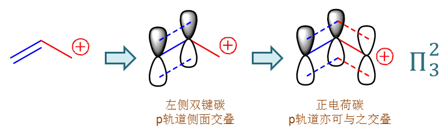
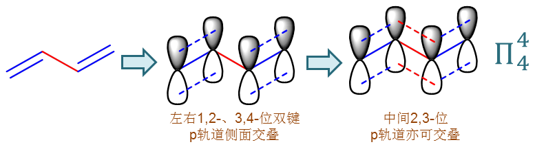

诱导效应与共轭效应、碳正离子的稳定性
================================================

**诱导效应**\ 与\ **共轭效应**\ ，是两种基本的电性效应，影响着基团旁侧位点的电子云密度。
在烯烃这一章中，这两种效应是我们判断碳正离子稳定性时的主要依据。后面章节的一些场合，这两种效应也能够帮助我们对反应活性等其它特性进行判定。

诱导效应
----------------

诱导效应（Inductive effect）相对简单，主要和原子的电负性有关。基团诱导效应的大小、方向大致可以这么来理解（注意这不是严格的定义，只是帮助理解）：

  * 在有机分子中，最常见的原子是碳与氢，最多见的共价键是C-H键；

  * 于是我们就视C-H相连为标准状态，以这个状态下碳原子的电子云密度为基准值；

  * 如果有原子/基团A的吸电子能力比H强（一般来说电负性较H更高），则这个原子/基团和C相连成C-A键时，即相当于将C-H标态中的H替换为A，
    无疑会使得C上电子云密度较基准值下降，我们称之为吸电子诱导效应（-I）；

  * 反之，如果有原子/基团的吸电子能力比H弱（一般来说电负性比H更低），则这个原子/基团和C相连时，无疑会使得C上电子云密度较基准值升高，我们称之为给电子诱导效应（+I）；

.. note::

  注意，这里给/吸电子能力是与H，而非C比较。

究竟哪些基团具有给电子诱导效应，又有哪些具有吸电子诱导效应呢？我们这儿也有个简单的判别原则：在有机化学常见的基团中，具备给电子诱导效应的基本就是烷基。
而其他基团，尤其是杂原子为首原子的基团，由于杂原子电负性高于氢，基本都是具有吸电子诱导效应的，如下表所示：

=====	=============================================================================
效应	   基团
=====	=============================================================================
+I		-R（烷基）
-I		-X、-OH、-OR、-NH\ :sub:`2`\ 、-NO\ :sub:`2`\ 、-SH、-SR、-CX\ :sub:`3`\ 等
=====	=============================================================================

当然我们也很容易想象，杂原子的电负性越高，对应的基团吸电子诱导效应也会越强，如：

..

	(-I) -F > -Cl > -OH > -NH\ :sub:`2`\

此外诱导效应也还与原子的杂化形态有关。从sp\ :sup:`3`\ 到sp\ :sup:`2`\ 到sp，s的成分逐渐增加，杂化轨道也越来越具有s轨道的特征，距原子核距离越来越小，
这使得原子核对电子的束缚能力逐渐增强，换而言之原子核吸引电子的能力增大。如同样是烃基，吸引电子的能力大致有如下次序：

..

	-CH\ :sub:`2`\ CH\ :sub:`3` < -CH=CH\ :sub:`2` < -C≡CH

因此，碳原子sp\ :sup:`2`\ 杂化的烯基与sp杂化的炔基，通常情况下我们也都认为是具有-I效应。

在我们当前的烯烃一章中，尤其是在亲电加成反应的讨论里，基团的诱导效应很显著地影响了碳正离子中间体的稳定性。
正电荷碳周边连接给电子诱导效应的基团，基团往中心碳那侧推电子，能使正电荷得到一定程度的分散，整体稳定性会上升。
反之若连接具有吸电子诱导效应的基团，基团反过来还把电子往自己身边拉，使得中心碳原子上越发地缺电子，整体稳定性自然会下降。

基于以上的讨论，我们也就很容易判定出，以下的一系列碳正离子的稳定性有如下的次序：

..

  Me\ :sub:`3`\ C\ :sup:`+` > Me\ :sub:`2`\ C\ :sup:`+`\ H > MeC\ :sup:`+`\ H\ :sub:`2` > Cl\ :sub:`3`\ CC\ :sup:`+`\ H\ :sub:`2`

共轭效应
-----------------

共轭效应（Conjugated effect）较诱导效应略微复杂一些，它涉及原子间离域的大Π键的形成，涉及多个p轨道侧面的交叠。它对碳正离子稳定性的影响，
从某种意义上说要比诱导效应更显著。

我们不妨先来看个简单的例子，请比较如下两个碳正离子的稳定性（正丙基碳正离子、烯丙基碳正离子）：MeCH\ :sub:`2`\ -CH\ :sub:`2`\ :sup:`+`\ 、CH\ :sub:`2`\ =CH-CH\ :sub:`2`\ :sup:`+`\ 。

前者看起来带电荷中心碳原子旁侧是个乙基，我们已经知道，它具有+I给电子诱导效应，可以使中心碳上电子云密度略有升高，正电荷一定程度得以分散，
整体稳定性上升。后者碳正旁侧则是连接了乙烯基，依据我们之前的讨论，乙烯基应当有一定的-I吸电子诱导效应。两相比较似乎应当是前者稳定性更强。

但事实恰恰相反，后者稳定性实际要比前者强得多。这正是由于共轭效应的缘故。

我们回过头再仔细看一看后一个碳正离子，也就是烯丙基碳正离子的结构。其中左侧两个双键碳，我们很熟悉，都是sp\ :sup:`2`\ 杂化，
各有一个没参与杂化的p轨道侧面交叠成键，没问题。

而第三个碳原子，也就是碳正离子中心原子，它其实也是sp\ :sup:`2`\ 杂化。三根sp\ :sup:`2`\ 杂环轨道分别与两个H及左侧的乙烯基
形成三根σ键，于此同时，它也存在一根未参与杂化的p轨道，当然这个轨道上没有电子，是个空轨道，但也毕竟是个轨道杵在那儿。

我们很容易想象，碳正上的这个空的p轨道，在空间上其实也可以与双键的p轨道互相平行，于此同时，它距离双键p轨道也并不遥远。
你双键碳俩p轨道能侧面交叠在一起，我这第三个p轨道，事实上也具备和你俩侧面交叠的能力。于是烯丙基碳正离子的实际结构中，
这三根p轨道就完全平行，连成一体，如下图所示：

类似这种多个原子间的p轨道侧面交叠形成一个整体的现象，我们就称之为“\ **共轭**\ ”。两个p轨道侧面交叠我们知道形成的是所谓
的π键，现在多个交叠，仿佛是π键的一个扩大化，我们就称之为\ **大Π键**\ 。像上面烯丙基碳正离子形成的这个大Π键，总共是三个原子
三个p轨道，也就是三个中心，而其中有一个是空的p轨道，另两个双键碳的p轨道上各有一个电子，加一块儿两个电子，因此我们可以将这个
共轭的大Π键体系描述为Π\ :sub:`3`\ :sup:`2`\ ，读作“三中心两电子大Π共轭体系”。

这种大Π共轭体系多个p轨道实际会交叠成一个整体，几乎不分彼此，而原本p轨道上的电子可以在这个整体——也就是整个共轭区域自由流动。
正常情况下我们知道一根共价键一对电子，通常是位于两个原子之间的，分布范围比较局限，我们经常称之为所谓的“\ **定域**\ ”。而现在共轭体系
形成之后，p轨道上电子一下子可以在多个原子之间广泛地流动，分布区域一下子扩大很多，我们经常称之为所谓的“\ **离域**\ ”。
这种电子的离域分布带来一个特性，我们其实也很容易想象，它会使得整个共轭体系中各个原子上的电子云密度在\ **一定程度上平均化**\ 。
像这儿的烯丙基碳正离子，从结构式看似乎一个正电荷就分布在最右侧这一个碳原子上，但因为共轭，形成了Π\ :sub:`3`\ :sup:`2`\ ，
粗略里看共轭体系里每个原子大概能平均分到2/3个电子，正电荷相当于被大大地分散开来了，每人都带一点儿。这种分散程度明显
较诱导效应的影响强得多，因而实际烯丙基碳正离子的稳定性将大大高于正丙基碳正离子：

  MeCH\ :sub:`2`\ -CH\ :sub:`2`\ :sup:`+`\ < CH\ :sub:`2`\ =CH-CH\ :sub:`2`\ :sup:`+`

.. note::

  我们这儿只是一个粗略的算法，帮助大家理解。实际在烯丙基碳正离子体系中，电子云的分布并不是完全平均的，中间2-位碳上
  电子云密度较高，而端头1-、3-位电子云密度较低。包括其它很多共轭体系，电子云的分布也都不完全是均匀的。但不管怎么说，
  共轭体系总会带来比较强的电荷分散的效果。

.. note::

  这里我们看到，形成共轭之后，会使得碳正离子的稳定性大大增强。不但对于带电荷的体系是如此，即便是电中性的分子，共轭体系的
  存在往往也能使整个分子体系能量下降，稳定性提升。

在烯丙基碳正离子中的这个共轭体系，整体上相当于乙烯基那侧分担了大量的原本中心碳上的正电荷，或者换一个观点，相当于乙烯基
通过共轭将电子推向了中心碳原子。这种效应我们称为“\ **给电子共轭效应**\ ”，简记为“+C”。当然，后面的学习中我们也能见到
相反的情况，共轭的基团反而会吸引电子，我们称为“\ **吸电子共轭效应**\ ”，简记为“-C”。

.. note::

  不论是+C还是-C，一般情况下对电子云密度的影响程度都要高过+I/-I（往往还是大大高过）。
  但这个事儿也并不绝对，后面的章节里我们也会遇到诱导效应强于共轭效应的实例——但这种情况很少很少。

另外刚才我们在烯丙基碳正离子中，看到的是碳正离子中心原子上单个p轨道与碳碳双键π键的p轨道之间共轭。这种情况相当多见，
我们常称为“\ **p-π**\ 共轭”。

当然，共轭体系还存在其它的样式。如下一章中我们会接触到的一个典型的二烯类的分子，1,3-丁二烯：
CH\ :sub:`2`\ =CH-CH=CH\ :sub:`2`\ 。从经典结构式看，似乎它是左右两根双键外加中间一个单键。
但如果仔细考查它的电子轨道情况，我们发现，分子里所有的碳原子实际都是sp\ :sup:`2`\ 杂化，于是所有四个碳原子上的p轨道
都能侧面交叠成一个整体，形成一个四中心四电子的大Π共轭体系，如下图所示。这种共轭仿佛是由两个或多个间隔的π键
形成，因此被称为“\ **π-π共轭**\ ”。

当然，大家一般情况下也不用在意p-π、π-π这些类型，反正只要在分子中看到有独立的未参与杂化的p轨道（换句话说有sp\ :sup:`2`\ 、sp杂化的原子）
连续地挨在一起，通常都能够形成共轭体系。

.. note::

  注意这里我们用了“通常”一词。并不是所有的sp\ :sup:`2`\ 、sp原子相邻都能形成共轭的，典型的如联苯分子，两个苯环之间不存在共轭。
  但绝大多数情况下，由于能够有效地降低整个分子体系的能量，多个连续p轨道总是倾向于相互平行，形成共轭体系。

共轭与诱导，这两种电性效应极大地影响着分子、离子体系中的电子云密度。而在基础有机化学中，我们接触的大多数比较重要
的反应又都是电性反应，与电子云密度实际有着直接的联系。因此随着学习的深入，大家会逐渐体会到这两种效应更多的应用。

