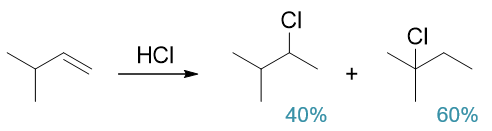
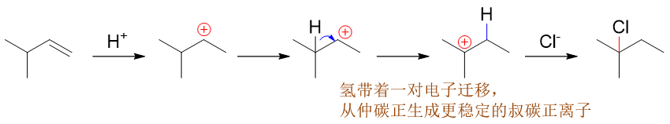
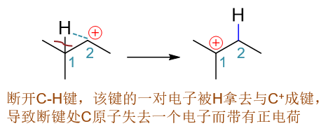
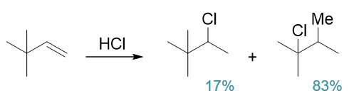
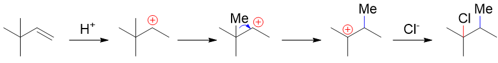
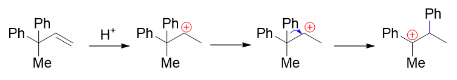
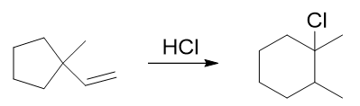
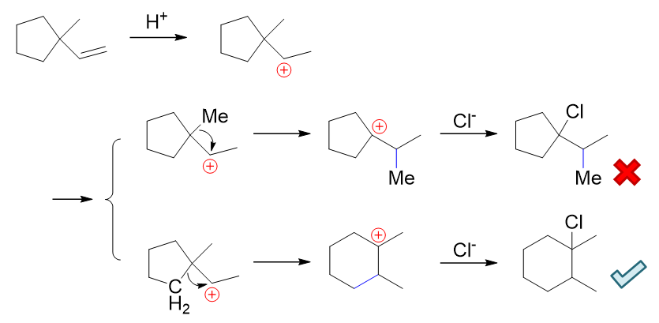
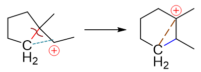
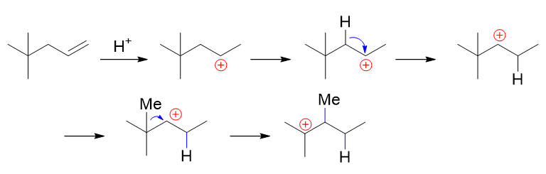

重点小结：碳正离子重排
===================================

在烯烃的亲电加成反应中，一般都会生成碳正离子（与溴分子的加成除外，会生成溴鎓离子）。
而碳正离子又具有一个挺恼人的特性：容易发生重排以生成更加稳定的形式。

如以下的反应，3-甲基-1-丁烯与HCl的加成，根据马氏规则，按说主要生成的应当是2-甲基-3-氯丁烷，但实验中发现
这个产品只占产物总量的四成左右，剩下六成得到的是2-甲基-2-氯丁烷，氯看起来似乎加在了与双键无关的位置上。

之所以出现这种异常的结果，原因就是碳正离子重排，其重排历程如下：

其中最关键的，重排的一步我们可以这么理解：重排时首先H主动断开原先的C-H键（下图左侧结构中棕色波浪线处），
把这根键的一对电子都拿走，而后就利用这一对电子，刚好和隔壁无多余电子的碳正中心形成一根新的C-H键（下图左侧结构中蓝色虚线处）。
正常共价键是每人出一个电子，现在这根新的C-H键一对电子都来自于H，相当于C平白多共享了一个电子，正电荷当然也就随之消失了。
于此同时，断开的旧C-H键原本是由H与C各出一个电子形成的，现在两个电子都被H拿去成新键了，断键一侧的C原子自然相当于少了一个电子，
将带有正电荷。表观看起来，这里正电荷出现了转移，从成新键的碳原子转移到了断旧键的碳原子上。而重排之后，
原本的仲碳正离子转变成了一个新的叔碳正离子，稳定性得到提高。这种稳定性的提升、体系能量的下降实际也就是碳正离子重排的直接动力。

而如果我们将涉及重排的这两个碳原子分别编为1-、2-号（注意这儿不是命名中的编号，只是为了说明原子的相对位置），整个过程
相当于氢原子连同原本C-H间的一根σ键，从1-位转移到了2-位，因此这个重排过程又经常被我们称为“\ **1,2-σ迁移**\ ”。

.. note::

  重排过程中我们还是可以使用箭头来表达电子的转移过程。前面重排历程图中的双钩蓝色箭头就是如此，起点是旧的C-H键，意味着这根键
  的一对电子转移走；终点是原带电荷碳，意味着这对电子往这个原子转移，形成新的C-H键。

能够发生1,2-σ迁移的不单是氢原子，更多的情况下，烃基也会发生迁移。如以下3,3-二甲基-1-丁烯与HCl的反应，正常产物只占17%，
大量得到的又是整个碳架发生改变的重排产品：

其重排反应机理大致如下：

整个过程与前面的1,2-氢迁移如出一辙，只不过把氢原子换做了甲基而已。同样是断开了迁移基团与旧碳原子之间一根σ键，并借用这对电子
与原先正电中心碳原子间形成新键。重排后同样发生了电荷的转移。也一样是由仲碳正离子转变成了叔碳正离子，使得体系稳定性上升。

.. image:: ../../images/C04-KeyPoints/Rearrangement06.png

在上例中，原本烯烃的3-位季碳原子上连接的都是甲基，发生烃基迁移时没有太多选择，只能是甲基迁移。但很多时候，有多种不同的
烃基存在迁移的可能。实验中我们也发现了一个规律：\ **一般来说电子云密度越高的烃基发生迁移的倾向越大**\ 。这个规律咱们
其实很容易理解：你这往缺电子的正电中心去迁移，当然是电子云密度越高越好。

我们目前接触最多的烃基就是烷基，不论是哪种烷基，电子云密度都是相似的，迁移能力一般来说也差不多。而后面的学习过程中我们将
遇到所谓的芳基——典型的像苯基（-Ph）。芳基中因为存在电子离域的环状大共轭体系，电子云的密度相对比烷基高得多，迁移能力一般
也强得多。如以下的碳正离子重排，甲基与苯基都可能发生1,2-σ迁移，但实际反应产物以苯基重排为主：

除了开链分子可能发生重排外，很多环状结构的化合物在特定反应时也会重排，在合成里这往往是扩环（增加环上原子数目）的一个有效手段。
如以下的反应，实验中发现底物五元环状烯烃分子与HCl反应后，会大量得到一个六元环状的新分子：

很明显，碳架发生了改变，又涉及了重排。该反应的历程过程大致如下图所示：

首先，还是质子先与双键反应，根据马氏规则，生成仲碳正离子。而后发生烃基迁移，重排成更稳定的叔碳正离子。值得注意的是，这里存在两条
重排成叔碳正离子的途径。一种是上一行的路线，甲基迁移，但这么一路走下去，我们发现重排后的碳正离子与氯负离子结合后生成的并非我们实验中
大量得到的产物。而下一行的路线，环上的烃基迁移，重排之后我们得到了预期的产品。这意味着因为种种原因，实际的重排以第二条路线为主。

这第二条路线中，环上相当于一个亚甲基发生了迁移，其过程我们大致可以借用下图理解：

环上的亚甲基（图中用CH\ :sub:`2`\ 标出）断开原本与季碳相连的五元环上的一根旧C-C键（图中左侧的棕色波浪线，右侧的棕色虚线处），
带着这对电子与正电中心成新键（左侧的蓝色虚线，右侧的蓝色键线）。一破一立之间，五元环就变成了六元环，正电荷也从仲碳转移到了断键处的叔碳。

当然，类似这样的利用碳正离子的扩环反应其实存在一定的风险。一方面，碳正离子重排过程容易生成副产物（如上例中甲基重排的产品），产率往往会
受影响；另一方面，碳正离子重排是否发生，发生程度如何经常是在纸面上难以预测的，往往纸面上看起来能够提高稳定性的重排，实际实验中就是不发生
或者发生比例很小。因此\ **我们在自己设计合成路线时，通常应尽量避免碳正离子重排这种情况**\ 。

最后还需要说明一点，碳正离子中间体因为特别活泼，因此寿命非常短暂。而在它极其有限的生命周期中，如果发生重排一般来说也只能发生一次。换句话说，
命太短了，不够发生多次重排的。如以下的连续重排，一般情况下不可能发生（当然也不绝对）：

上图中先发生氢迁移，再是甲基迁移，最终看起来从仲碳正离子生成了更稳定叔碳正离子。但正如我们刚才所说，碳正离子太短命了，来不及完成这么复杂的
变化，更何况第一步氢迁移，是从仲碳正离子转变成了另一个稳定性相仿的仲碳正离子，本身动力也不足。因此在反应过程中，绝大多数情况下我们仅需考虑
一次重排即可。

