烯烃的四类加成反应
======================================

加成是烯烃最重要的一组化学反应，其表观特征非常简单，无非是烯烃中双键断开π键，两个双键碳各自连上一个新的原子或基团：

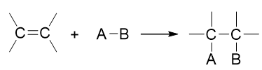

但烯烃加成反应的变化其实很多，不同的种类的加成机理、规律都有差别。在基础有机化学中，我们至少会接触四类：催化氢化、亲电加成、自由基加成与硼氢化反应。

四类加成反应特征一览
------------------------

=============  ==================================   ========================  ====================  =============================
反应种类          常见进攻试剂                            反应中间体或过渡态           区域选择性             立体选择性
=============  ==================================   ========================  ====================  =============================
亲电加成          HX、X\ :sub:`2`                       碳正离子或溴鎓离子          马氏规则                无或反式加成（Br\ :sub:`2`\ ）
自由基加成        HBr/R\ :sub:`2`\ O\ :sub:`2`\        烷基自由基                 反马氏规则               无
催化氢化          H\ :sub:`2`\ /Cat.                    \-                       \-                    顺式加成
硼氢化            BH\ :sub:`3`                         四元环状过渡态             反马氏规则               顺式加成
=============  ==================================   ========================  ====================  =============================

以下我们以反-3-甲基-3-己烯的反应为例，讨论这些不同种类加成的一些典型特征。

亲电加成
----------------

这是我们最熟悉的，也是本章可以说最重要的一类反应。反应经历碳正离子（与Br\ :sub:`2`\ 加成则是溴鎓离子）中间体。各种反应现象基本都与这碳正离子有关联。

如以下与HBr的加成反应：

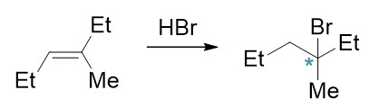

反应历程大致如下图所示：

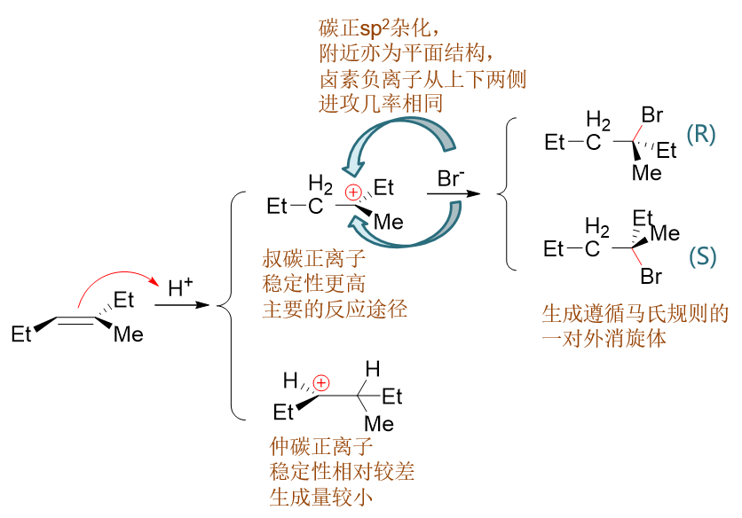

第一步两个双键碳都可能与质子结合，得到两种可能的碳正离子。而这两种碳正离子结构不同，稳定性亦有差异。
这种稳定性的差异决定了反应的区域选择性，也即所谓的马氏规则。而碳正离子的空间结构，又导致反应基本无立体选择性，生成一对外消旋体。

.. note::

  关于烯烃与HX亲电加成的更多讨论，请参见
  :doc:`重点小结：反应机理的理解与运用——以烯烃与卤化氢的亲电加成为例<./KeyPoints01-AdditionWithHX>`\ 。

至于烯烃与溴分子的亲电加成，情况略有不同。如以下反应：

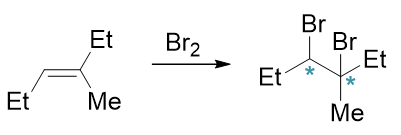

反应过程中生成的不是普通的碳正离子，而是三元环状的溴鎓离子，这导致第二个溴只能从溴鎓离子溴原子的背面进攻（这样空间位阻较小），
反应结束时新生成的两根C-Br键一定是一上一下，方向相反，也即立体选择性为反式加成：

.. image:: ../../images/C04-KeyPoints/Addition05.png

.. note::

  反应第二步，Br\ :sup:`-`\ 进攻溴鎓碳时，这里主要是进攻右侧的叔碳。原因是这个位置可以容纳密度更高的正电荷。
  想象一下普通的碳正离子，也是叔碳正离子比仲碳正离子来得稳定。

自由基加成
----------------

烯烃能够发生自由基加成的情形较少，在基础有机化学中基本就是HBr/过氧化物这个条件，也即所谓的“过氧化物效应”。此反应的
最大特点是区域选择性反马氏。如下面的反应，主要生成物的加成方向与无过氧化物时的亲电加成刚好相反：

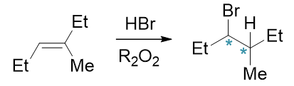

其具体原因也与反应机理有关。过氧化物是良好的自由基引发剂，在有过氧化物的情况下，HBr尚未来得及与双键加成，自身就已发生均裂
生成氢/溴自由基：

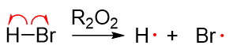

得到的溴自由基继续与双键碳反应成C-Br键，该键由溴自由基出一个电子，双键碳断开π键出一个电子生成。而π键中剩余的一个电子则转移
至另一个双键碳上，形成烷基自由基。由于分子中存在两个化学环境不同的双键碳，皆有可能与Br·成键，这里形成的烷基自由基存在两种不同的构造。
此外由于双键附近原本是平面结构，溴自由基靠近时也存在平面上与平面下两个方向，新生成的C-Br键也可能冲上或冲下，导致烷基自由基
两种不同的构造又各自存在两种不同的构型，如下图所示：

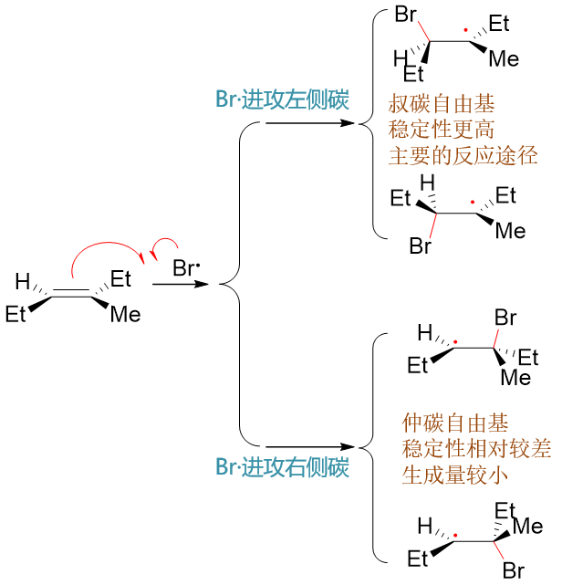

其中下方，Br·进攻右侧双键碳形成的自由基实际为仲碳自由基，稳定性较进攻左侧碳形成的叔碳自由基为差，因此反应过程中生成量较少。
主要反应途径将是生成上方两种自由基中间体。在这步反应中，与Br成键的是连接支链较少的碳原子。区域选择性反马氏，实际就是由于
烷基自由基的稳定性所导致的。

生成叔碳烷基自由基后，接下来烷基自由基又进一步和新的HBr分子反应，旧H-Br键断开，H拿一个电子与烷基自由基形成新的C-H键，而另一个电子
留给Br，生成新的溴自由基。而这新生成的溴自由基又可以继续与烯烃分子反应得到烷基自由基，一路链式反应下去。不去多管新生成的溴自由基，
这步的主要反应情况大致如下图所示：

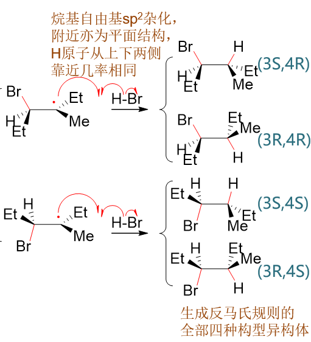

由于烷基自由基也是平面结构，这步与H成键时同样存在两种成键方向：平面上或平面下。之前两个构型的烷基自由基，最终得到四种产品。
产品中3-、4-位其实是两个不同的手性中心，这也意味着这一构造中的四种构型异构体都会生成，自由基加成反应本身不具备立体选择性。

总的反应历程图如下：

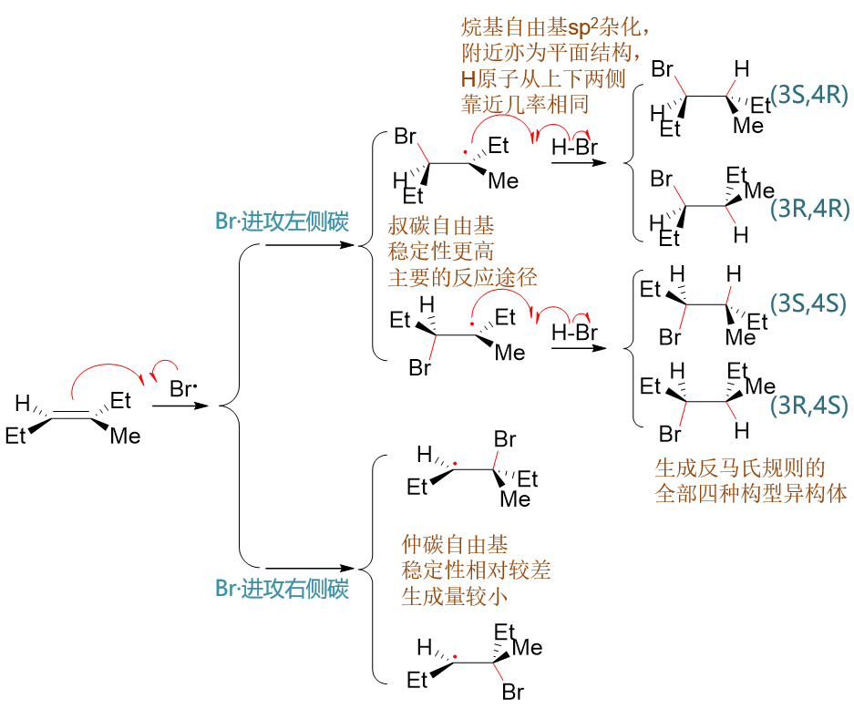

.. note::

  该反应是属于自由基类型的反应，发生的基本都是单电子的转移，我们在书写反应机理时使用的也都是单钩箭头。

我们看到，该反应的特性同样与机理密切相关：由于自由基的稳定性差异，导致了区域选择性的反马氏；由于双键及自由基的平面结构，导致
反应也不具备立体选择性。

硼氢化
------------

烯烃的硼氢化-氧化反应常用于制备醇。它的区域选择性（反马氏）与立体选择性（顺式加成）均值得注意。同样还是反-3-甲基-3-己烯
的反应，这里我们姑且不管后面氧化一步，只考察硼氢化。此外硼氢化反应硼烷中的硼原子可以与三分子烯烃加成得到三烷基硼，为简单起见
这里也仅考察第一步加成：

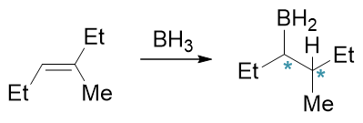

反应历程大致如下图所示：

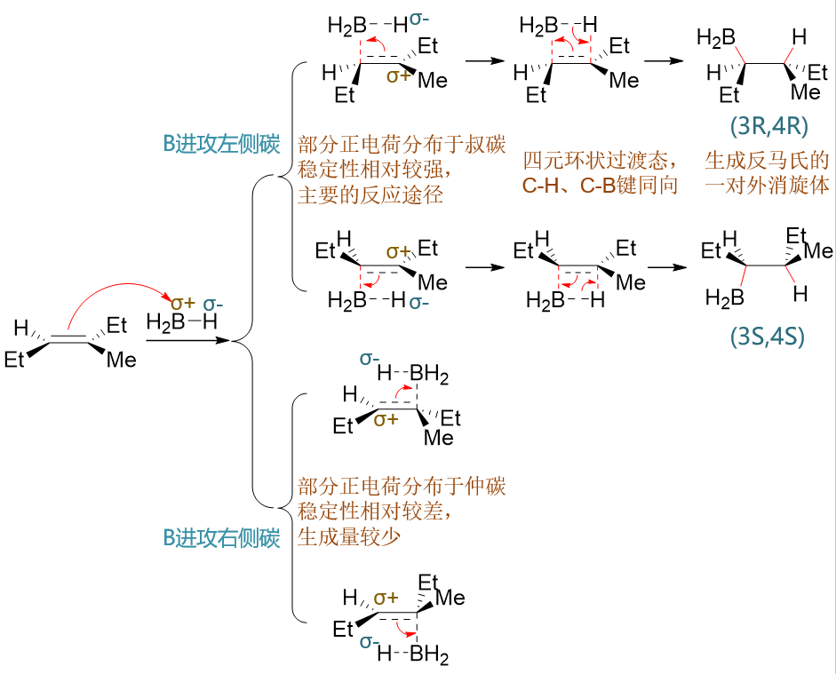

首先注意到硼烷中硼的电负性略低于氢，因此硼会带有部分正电荷而氢带有部分负电荷（刚好与HX相反！）。加成时，带部分正电荷的硼受到
富电子的双键吸引，逐渐靠拢与双键碳成键。类似地，两个双键碳都可能与硼成键，硼也存在双键平面上方、下方两种进攻方向，共计可以生成
四种不同构型的中间状态（如上图第二列所示）。在这步生成的中间状态里，C=C双键中π键正逐渐断开，一对电子被某一双键碳用来与B成键。
于此同时，未与B成键的双键碳相当于逐渐失去原先π键上的电子，将带有部分正电荷。

与B成键的双键碳不同，我们将得到上方叔碳或者下方仲碳上带部分正电荷的状态。这种部分碳正离子的稳定性与带一整个正电荷的正常碳正离子
规律相仿，也是正电荷分布在叔碳上更加稳定。于是我们反应中将主要生成上方两种中间状态，也就是B主要与连接支链较少的C原子成键。
该反应中反马氏规则的区域选择性也就来源于此。

反应继续向下推进，这时与B相连的带部分负电荷的氢又与带部分正电荷的碳相互吸引，两者间逐渐成键，于是得到四元环状的一个过渡态，如
前图第三列所示。而这种环状过渡态，保证了加成中新形成的C-B与C-H键同向，即所谓的“顺式加成”。

最终，C=C双键中π键完全断开，B-H键亦断裂而C-B、C-H键形成，形成最终的产物。由于第一步里B原子与双键靠近时存在两个反向，最终
我们也是得到一对主要产品，互为对映异构体。产品中两个不同的手性中心，理论上有四个构型异构体，但这里仅生成其中的两种，该反应的
立体选择性相当明显。

催化氢化
---------------

依然考察反-3-甲基-3-己烯的反应，这里假设它与氘分子反应。由于催化氢化双键两端都是加上相同的原子，因而反应不存在区域选择性。

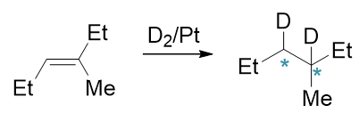

催化氢化的大致机理如下图所示（实际情况很复杂，这里的过程并不准确，只是帮助大家理解）：

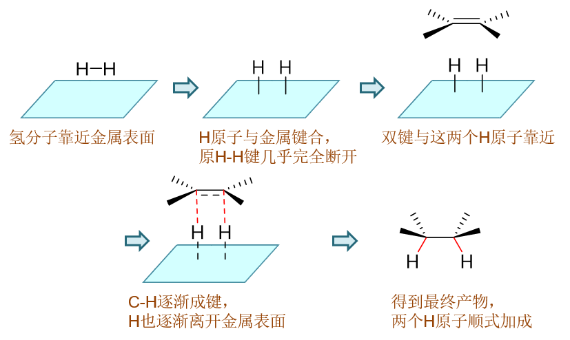

由于两个氢原子在一个方向上同时与双键碳成键，因此类似于硼氢化反应，催化氢化中立体选择性一般也非常专一，总是顺式加成。
当然，烯烃双键平面在与两个氢原子靠近时也存在两个方向（或者换个角度，一对氢原子可以从双键平面任一侧靠近碳原子），因此
前面反-3-甲基-3-己烯与氘的反应也会生成一对主要产品，如下图所示：

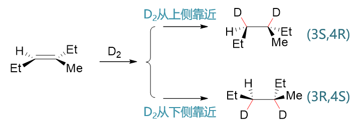

要么两根C-D键都在原双键平面上方形成，把甲基、乙基等挤到下面，得到(3S,4R)构型产物，要么C-D键都在原双键平面下方形成，
得到其对映异构体。生成物两个不同的手性中心，也是只会生成这两种构型的产品。

总结
----------

综上所述，烯烃的加成反应看似简单，但类型不同，反应特征——尤其是区域选择性与立体选择性——存在较大的差异，切勿混为一谈。
而这些反应特性我们借助反应机理，可以更容易得进行理解与记忆。

.. note::

  在当前基础有机化学的学习中，这四大类加成的机理仅亲电加成可能在考试中出现，其它反应类型的机理均无过高要求。
  但我们至少应对其有一定的了解，这有助于我们判断复杂反应中的一些现象。

