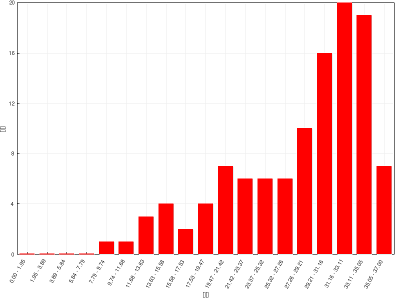

习题讲解：炔与二烯
========================

在线自动评分习题
---------------------

=======   =============
总分        37
平均分      27.8(75.1%)
最高分      36.8(99.3%)
=======   =============

  成绩分布

本章习题数量较多，但难度不算很大。错误率比较集中在命名中的构型、反应活性判定、共轭二烯的反应这些知识点上。

题5：命名（错误率55.1%）
  .. image:: ../../images/C05-Exercises/A05_00.png

  题干中是个开链烯炔，我们需要将官能团双键与叁键尽可能都放在母体当中。显然母体应是上方的六碳链。编号两种可能，
  如下图所示。从左向右或从右向左，三个官能团（不考虑双叁键差别）位置均在1-、3-、5-位，这时应尽可能使双键位次较小，
  我们从右向左取红色的编号方式。整个分子构造名称应为4-乙基-3-正丙基-1,3-己二烯-5-炔。

  .. figure:: ../../images/C05-Exercises/A05_01.png

    应取红色编号方式

  但光写出这个名称还是不够的，注意到3-位双键存在顺反异构，当前明显是Z构型，这一因素需要在命名中体现出来。因此整个
  分子最终应命名为\ **(Z)-4-乙基-3-正丙基-1,3-己二烯-5-炔**\ 。

题7：命名（错误率44.2%）
  .. image:: ../../images/C05-Exercises/A07_00.png

  还是开链烯炔，本身构造并不复杂，我们依然把双、叁键都放在母体里，取竖直碳链为母体。为保证双键、叁键位次尽可能小，
  应采取下图中红色自下而上的编号方式。构造名称为3-溴-4-己烯-1-炔。

  .. image:: ../../images/C05-Exercises/A07_01.png

  同样，本题分子中依然存在构型问题，而且构型要素还不止一个。首先是4-位双键存在顺反异构，当前应为E构型。其次注意3-位
  碳原子，连接了四个不同基团，是手性中心。当前的画法该碳原子周边单键形成了一个十字交叉，明显是Fischer投影式，
  可判定出此手性中心构型为S。

  这两个构型要素我们需在命名时列在构造名称之前，但一般别写成(S,E)或者(E,S)这样。对于含多个构型要素的分子，单纯列出
  构型标识来得话指代位次显得有些不明确，应在E/S之前写上构型中心的位次，且\ **依据位次由小至大的次序列出**\ ，整个分子应称为
  \ **(3S,4E)-3-溴-4-己烯-1-炔**\ 。

  .. note::

    如果分子中仅含单个构型要素（单个手性中心，或单根顺反双键），则此时不会引起混淆，构型标识前无需额外加注数字。

题6：命名（错误率40.2%）
  .. image:: ../../images/C05-Exercises/A06_00.png

  本题亦为烯炔，但分子中含环，因此无论如何也无法将双、叁键均置于母体之中。这里环外链不复杂，我们一般总是以环作为母体。
  当前母体实际就是个简单的环己烯，双键视作主官能团。主官能团上两个双键碳分别编在1-、2-位，如下图所示，又存在红、蓝
  两种不同的编号方式。这两种编号方式官能团双键都在1-位，没区别，但两个环外取代基位次不同。这时我们需要尽量照顾优先级
  较小的取代基，使得乙基位次较小，即取红色的编号方式。最终分子应命名为：\ **1-乙基-2-炔丙基-1-环己烯**\ 。

  .. figure:: ../../images/C05-Exercises/A06_01.png

    应取红色编号方式

  当然，如果母体是环烯烃，那主官能团双键编号总是在1-位，因此这里的双键编号我们经常可以省略，称为\ **1-乙基-2-炔丙基环己烯**\ 。

题15：排序（错误率39.3%）
  请将下列化合物按与HBr发生反应的活性降序排列：

  .. image:: ../../images/C05-Exercises/A15_00.png

  本题考查一系列单烯烃或共轭二烯烃的亲电加成活性。无论是何种烯烃，与HBr发生加成的速控步都是生成碳正离子，而得到碳正离子
  越稳定，通常速控步活化能越低越容易发生，反应速率也就越高。

  依据此原则，我们可以先写出这一系列分子各自生成的碳正离子（当然遵循马氏规则）：

  .. image:: ../../images/C05-Exercises/A15_01.png

  这一系列碳正离子首先可以分为两大组：(a)与(b)生成的碳正离子相同，均为烷基碳正离子。(c)-(d)则生成主要生成旁侧有一根
  双键可参与共轭的烯丙基型碳正离子（注意d这里看起来存在生成两种结构不同的主要碳正离子的可能性）。明显，有共轭的(c)-(d)稳定
  性要强得多，换句话说原本一系列分子中的共轭二烯烃反应速率总会高过单烯烃。

  而在三个二烯烃生成的碳正离子中，(e)得到的碳正离子旁侧较(c)、(d)生成的还额外多了一个给电子的烷基，因此它的稳定性最高。二烯烃
  中也就是(e)的反应速率最快。

  但问题是看起来(c)、(d)的碳正离子看起来结构类似：都是有一根双键共轭，都是仲碳正离子，稳定性应当相仿，这下反应速率该如何比较呢？

  仔细看(c)、(d)形成的碳正离子结构上还是存在一点儿区别的，(d)相当于在(c)的基础上还额外多了个甲基。这个甲基虽说距离碳正中心比较
  远，但多多少少总会有点儿影响，总能推一点儿电子过来。因此，(d)形成碳正离子的稳定性将略高于(c)。

  此外，亲电取代的反应速率除了与生成的碳正离子稳定性相关外，还有另外一个显著的影响因素：双键上电子云密度。毕竟进攻试剂是缺电子的，
  双键上电子云密度越高对进攻试剂吸引力越大。而(c)、(d)两种共轭二烯两相比较，(d)在双键上还多了一个具有+I效应的甲基，因而双键上
  电子云密度将高过(c)。从这个角度而言，反应活性上(d)也将较(c)略高。

  同理，同为单烯烃的(a)、(b)，(b)双键同时连接了两个个电子甲基，(a)只连接了一个乙基，因而(b)双键的电子云密度更高，反应活性也更强。

  综上所述，这一系列烯烃分子亲电加成反应活性次序应为：\ **(e)>(d)>(c)>(b)>(a)**\ 。

题16：排序（错误率42.0%）
  请将下列化合物按Diels-Alder反应活性的降序排列：

  .. image:: ../../images/C05-Exercises/A16_00.png

  这一系列分子均为共轭二烯，均可与亲双烯体发生Diels-Alder反应。而共轭二烯参与D-A反应时，我们知道共轭双键体系电子云密度越高
  对反应越有利（反过来亲双烯体双键上电子云密度越低越有利），因此本题说白了相当于是考查共轭双键上连接基团的电性效应。各基团的
  电性效应情况大致如下图所示：

  .. image:: ../../images/C05-Exercises/A16_01.png

  分子(a)为1,3-丁二烯，(b)~(d)相当于是在1,3-丁二烯的2-位额外连接了甲基、甲氧基和氯原子。这三个基团的电性效应在我们之前的
  学习过程中实际都接触过。

  (b)中的甲基，很单纯的诱导给电子效应。与双键之间不存在共轭，无共轭效应。总体上是个弱给电子基团。

  (c)中的甲氧基，氧电负性较强，-I，但同时氧原子p轨道上一对电子可以参与共轭，与四个双键碳形成五中心六电子共轭体系，粗略里看
  每个碳原子差不多可以分到6/5个π电子，较1,3-丁二烯每碳一个π电子明显来得高，相当于通过共轭甲氧基向双键碳一侧提供了电子，具有
  明显的+C效应。对于杂原子而言，一般总是共轭效应要强于诱导效应，这里两相叠加，甲氧基是个相对较强的个电子基团，共轭双键上电子云
  密度也较2-甲基-1,3-丁二烯更高。

  (d)旁侧连接的是Cl，情况与甲氧基相仿，诱导吸电子，共轭给电子。但卤素原子比较特殊，当其与电中性碳相连时，往往-I比+C效应更强，
  整体上是个弱吸电子基团（常见杂原子中唯独卤素具有这个特殊的特性）。因此(d)的反应速率将较1,3-丁二烯为低。

  综上，这四个二烯分子Diels-Alder反应活性次序应为\ **(c)>(b)>(a)>(d)**\ 。

  .. note::

    关于含杂原子基团共轭/诱导效应的更详细讨论，可参见芳烃一章的
    :doc:`重难点小结：苯环上已有基团对后继亲电取代的影响<../C06/KeyPoints01-EffectOfSubstituentsInElectrophilicAromaticSubstitution>`\ 。

题17：反应（错误率29.4%）
  .. image:: ../../images/C05-Exercises/A17_00.png

  本题其实特简单，无非是叁键还原为双键。留意到Lindlar催化剂催化氢化一定是生成顺式烯烃，反应具有鲜明的立体选择性。
  虽然题干里因为疏忽没有提醒，但绘制键线式时，顺式双键其实很容易表达出来：

  .. image:: ../../images/C05-Exercises/A17_01.png

题22：反应（错误率29.5%）
  .. image:: ../../images/C05-Exercises/A22_00.png

  两步串联反应。第一步无疑是烯烃与溴的亲电加成，需要注意的是溴的加成存在明显的立体选择性（题干中也特别强调了这一点），反式加成将得到一对对映异构体，
  我们可以利用楔线式表达出它们的构型，如下图所示。而后无论哪种异构体，第二步强碱性条件下都会消除得到相同的炔烃。

  .. image:: ../../images/C05-Exercises/A22_01.png

题24：反应（错误率78.2%）
  .. image:: ../../images/C05-Exercises/A24_00.png

  明显是Diels-Alder反应。这儿由于共轭二烯分子里有个五元环，很多同学就画不准最后的产物了。其实特简单，D-A反应只是发生在共轭二烯两根双键四碳区域与
  亲双烯体双键两碳区域之间，分子里的其它部分都不涉及，也不发生变化。找出这两个反应区域，端头连键（下图中蓝色虚线）关出六元环，如是而已。原本五元环，
  反应过程中又新生成了六元环，最终我们将得到一个桥环分子。

  .. image:: ../../images/C05-Exercises/A24_01.png

  此外，注意到原亲双烯体双键是个顺式构型，我们也知道D-A反应立体选择性上是顺反保持的，反应结束后，两个羧基依然也是顺式。生成的分子里存在对称面，不具有手性，
  顺式结构也只有这一种。

题25：反应（错误率34.4%）

  .. image:: ../../images/C05-Exercises/A25_00.png

  与前一题类似，也是考察D-A反应的立体选择性。这里反应结束后，两个酯基将在六元环上处于反式。此外，反式构型的生成物里不存在对称面与对称中心，
  是个手性分子，反应中将生成一对对映异构体。

  .. image:: ../../images/C05-Exercises/A25_01.png

在线手动评分习题
---------------------

本章中还有两组手动评分习题。其中名词解释不用多说，三道合成题都可以使用我们之前介绍的逆合成分析的手段倒推思路。

.. note::

  关于逆合成分析的讨论，请参见本章
  :doc:`重难点小结：合成题与逆合成分析<./KeyPoints02-RetrosyntheticAnalysis>`\ 。

合成：请以丙烯为主要有机原料合成(E)-1,4-己二烯。
  .. image:: ../../images/C05-Exercises/B01_00.png

  目标分子如上图所示，明显注意到目标分子中存在一根立体构型确定的双键。以我们当前已有的知识，合成这种确定的反式双键几乎只有
  一个手段：利用炔在Na液氨体系下的低温还原。因此依据逆合成分析，目标产品应当来自于下图中右侧的烯炔：

  .. image:: ../../images/C05-Exercises/B01_01.png

  该烯炔总共六碳，而原料丙烯三碳，这也暗示我们，合成过程中势必涉及C-C键的生成，从小分子合成大分子。相应地逆合成分析时我们
  需要断开大分子中C-C键将其剖开为小分子。断键位置实际非常确定，肯定是叁键左侧，如下图所示。将六碳分子分为3+3两个小片段。
  叁键旁侧的切断，反过来合成时我们刚好就可以利用炔钠与卤代烃的亲核取代反应。

  .. image:: ../../images/C05-Exercises/B01_02.png

  这步我们得到的两个三碳分子，还得往原料丙烯那儿转化。3-溴丙烯很简单，从丙烯出发很容易通过自由基α-卤代生成。至于丙炔，经典
  的合成方式是来自于1,2-二溴丙烷这种邻二卤代烃的消除。而1,2-二溴丙烷，刚好又可以由丙烯与溴的亲电加成得到：

  .. image:: ../../images/C05-Exercises/B01_03.png

  至此，我们的逆合成分析结束，合成思路完成。剩下的任务无非返回头，顺次写出反应：

  .. image:: ../../images/C05-Exercises/B01_04.png

  本题是很典型的涉及炔的合成。确定构型的顺式或反式双键，合成里往往来自与叁键，而一旦碳链中有叁键，就可以考虑炔钠与卤代烃
  的反应。这是我们合成里两个常用的技巧。

合成：请以乙炔为主要有机原料合成丁烯酮。
  .. image:: ../../images/C05-Exercises/B02_00.png

  目标分子如上图所示。本题的暗示也非常明显：目标分子中含有一个特别显眼的羰基。到目前为止，我们学习到的能够生成羰基的反应也
  就那么几个：烯烃臭氧氧化或是炔烃的水合/硼氢化氧化。合成里一般不会使用烯烃臭氧氧化的手段：毕竟这个反应会断开C=C双键，导致
  大分子变成小分子，与一般合成增长碳链的目标相反。因此目标分子中的羰基，应当是来自于叁键：

  .. image:: ../../images/C05-Exercises/B02_01.png

  注意到当前是在叁键内侧碳原子上生成羰基，这步合成我们实际需要使用炔烃水合的方法。

  当前我们逆推到这么一个四碳烯炔。有些同学又会考虑利用炔钠与卤代烃的反应拼合C-C键：

  .. image:: ../../images/C05-Exercises/B02_04.png

  但这其实行不通，毛病主要出在1-溴乙烯身上。我们到后面卤代烃一章就会了解，类似这种卤素直接与双键碳相连的卤代烃，反应活性很低，
  是很难与炔钠发生亲核取代的。

  事实上我们真要合成1-丁烯-3-炔有个更简单的方案：乙炔的二聚反应，而乙炔刚好就是题目中的原料：

  .. image:: ../../images/C05-Exercises/B02_02.png

  到这儿，我们整个思路完成，最后顺次写出具体反应，一共也就两步：

  .. image:: ../../images/C05-Exercises/B02_03.png

合成：请以乙炔为主要有机原料合成如下分子：
  .. image:: ../../images/C05-Exercises/B03_00.png

  看起来比较复杂，目标分子长得比乙炔大得多。但前两题的铺垫一定程度上可以帮助大家找到本题的思路。

  目标分子的结构里实际存在两个能够给我们提供思路的结构特征。首先，一个羰基，类似于上一题，这应当又是来自于叁键。
  除此之外，分子中还存在一个六元环。目前为止，我们能够合成六元环的手段只有一个：Diels-Alder反应。在逆合成分析
  时，我们就可以先从这儿入手。

  比如我们先考虑Diels-Alder反应。D-A反应正向进行是4+2得到六元环，而且环上还有一根双键。目前我们的环上都是单键，
  但好在双键很容易通过催化氢化的方式转变成单键，没有任何问题。逆合成分析我们就反其道而行之，先补上双键，再断开环上两根
  C-C键，切成四碳、两碳两个部分。比较适宜的切法如下图所示：

  .. image:: ../../images/C05-Exercises/B03_01.png

  之所以在这两个特定位置切开，主要是这样得到的亲双烯体双键旁侧刚好又个吸电子的乙酰基，对Diels-Alder反应相对比较
  有利。

  切成这两个四碳分子后，我们先考虑丁烯酮一边。与前一题完全相同，丁烯酮可以来自于1-丁烯-3-炔，又来自于乙炔的聚合。
  而1,3-丁二烯，如果与1-丁烯-3-炔对照一下，我们发现，它其实也可以由这个烯炔利用Lindlar催化剂还原得到。如下图
  所示，我们的思路就此完成。

  .. image:: ../../images/C05-Exercises/B03_02.png

  最终顺次写出具体反应如下：

  .. image:: ../../images/C05-Exercises/B03_03.png

  这里还需要小心，最后一步双键还原催化氢化需要控制一下条件，否则羰基也会受到影响，被还原成羟基——这个反应我们将在后面醛酮一章涉及。

课本习题
-------------

课本习题中有几道相对有趣的，我们也大致讨论一下。

习题4(9)：反应
  .. image:: ../../images/C05-Exercises/C01_00.png

  明显是Diels-Alder反应，共轭二烯与亲双烯体内本身都具有环系结构，而这些环在反应过程中不会受到影响，将保持原状外加反应生成
  的六元环，最终我们将得到一个含有三个环的新分子：

  .. image:: ../../images/C05-Exercises/C01_01.png

习题4(10)：反应
  .. image:: ../../images/C05-Exercises/C02_00.png

  其实还是Diels-Alder反应，反应物两个共轭二烯，其中有一个实际在反应中担负着亲双烯体的角色。究竟谁是亲双烯体我们也不难判断：
  D-A反应中亲双烯体双键上电子云密度越低越好，而当前明显右侧分子双键上额外连接了腈基（-CN），该基团诱导、共轭效应均为吸电子，
  叠加起来吸电子能力挺强，因此右侧分子双键电子云密度必然较1,3-丁二烯为低，更适宜成为反应中的亲双烯体。

  当然，右侧分子中还存在两根双键，究竟哪一根与1,3-丁二烯关环呢？其实也容易判断，我们看到吸电子的腈基与上方双键之间距离更近，
  对上方双键的影响理应比下方更大。因此，上边双键电子云密度更低些，将优先于1,3-丁二烯发生反应。

  得到这些结论后，我们不难写出最终4+2环加成的结果，如下图所示：

  .. image:: ../../images/C05-Exercises/C02_01.png

习题5(1)：反应
  .. image:: ../../images/C05-Exercises/C03_00.png

  共轭二烯的催化氢化反应。我们知道共轭二烯亲电加成时将存在1,2-、1,4-加成两种主要产物，但这里催化氢化的反应机理与亲电加成
  完全不同，压根儿不涉及碳正离子中间体。其反应过程可参见前一章
  :doc:`重难点小结：烯烃的四类加成反应<../C04/KeyPoints04-AdditionReactionsOfAlkene>`\ 。两个基本游离的氢原子与
  双键碳加成成键时，互相之间距离不远，不可能跨越1-位至4-位这么长的距离。因此催化氢化时，共轭二烯与普通烯烃的产物没有太大的
  区别，一般不会发生1,4-加成。

  .. image:: ../../images/C05-Exercises/C03_01.png

习题7：排序
  请比较以下碳正离子稳定性：
  .. image:: ../../images/C05-Exercises/C04_00.png

  别的都好办，需要小心的是(4)，正电中心旁侧连接了氯原子。我们之前已经了解了，卤素具有-I效应，当其参与共轭时，又会有+C效应，
  诱导与共轭效应相反。前面我们看到，卤素与电中性碳原子相连时，-I>+C，整体吸电子。但这里卤素与碳正中心相连，情况将发生变化，
  反而会+C>-I，整体给电子。这一点非常特殊，大家一定小心。具体原因可以参见下一章
  :doc:`重难点小结：苯环上已有基团对后继亲电取代的影响<../C06/KeyPoints01-EffectOfSubstituentsInElectrophilicAromaticSubstitution>`\
  里靠末尾关于卤素原子作为芳环旁侧取代基的讨论。

  .. image:: ../../images/C05-Exercises/C04_01.png

  因此，这里(4)的稳定性将最强，次序应为\ **(4)>(3)>(5)>(1)>(2)**\ 。

