炔烃与烯烃的反应比较
=================================

炔烃的结构，尤其是碳碳叁键的结构与双键有很大的相似性，二者都存在p轨道侧面交叠形成的键能较低的π键。
因此，大量的反应，尤其是一系列加成与氧化反应，这两种化合物间存在明显的关联。

亲电加成
-------------

炔烃叁键两个C原子间也有密度较高的电子云分布，因此同样可以与HX、X\ :sub:`2`\ 等亲电试剂发生亲电加成，
反应过程也与烯烃类似，区域选择性上也一样遵循马氏规则。

需要小心的是，表面看起来炔烃叁键两个C原子间有6个电子，电子云密度似乎较烯烃双键更高，更容易吸引亲电试剂的进攻，亲电加成反应活性应当较烯烃更强。
但实际情况恰恰相反，\ **通常的亲电反应炔的反应活性大大低于烯烃**\ 。这主要是由两个因素造成的：

  * 炔烃叁键碳sp杂化，杂化轨道中s成分更多，距离原子核距离较近，导致核对电子的束缚能力增强，不易向亲电试剂给出电子；

  * 炔烃亲电加成过程中，一般会生成烯基碳正离子，其稳定性也较普通的烷烃碳正离子为低。

与HX加成
~~~~~~~~~~~~

如以下化合物与1mol HBr的反应：

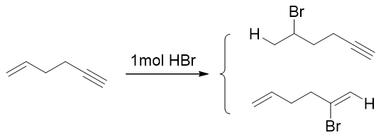

底物分子中同时存在C-C双键、叁键两个可反应的官能团，各自都有可能与HBr加成，生成上下两个不同的产品。实验发现该反应的主要产物
将是上方的产品，即双键加成的产物。从反应机理大家其实也可以得到结论：

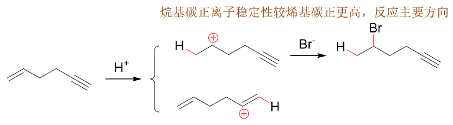

无论是双键还是叁键与HBr加成，首先都是先形成C-H键得到碳正离子。双键加成生成上方的烷基碳正离子，而叁键加成将得到下方的烯基碳正离子
（注意生成这两种碳正离子的过程区域选择性都是遵循马氏规则的）。烷基碳正离子我们很熟悉，中心碳原子sp\ :sup:`2`\ 杂化，而烯基碳正
离子sp杂化。后者杂化轨道中s成分又是比较多，导致核对电子束缚能力增强，换句话说丢了一个电子带上正电荷自个儿就觉得特别不满意，稳定性
自然也就比sp\ :sup:`2`\ 杂化的烷基碳正离子差不少。因此反应主要生成烷基碳正离子，最终生成以双键加成为主的产品。

既然双键亲电加成反应活性强于叁键，我们也很容易理解炔与HX的反应一般情况下难以停留在得到卤代烯烃的第一步，通常会继续加成，直至生成二卤代烷烃
（注意这第二步反应的区域选择性）：

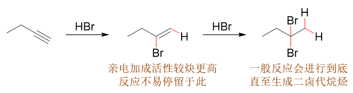

当然，如果真想让反应停留在第一步得到卤代烯烃，实验室中也有特殊的办法：可以投入HgX\ :sub:`2`\ 并控制反应条件：

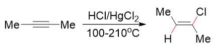

注意该反应产品存在顺反异构，一般以空间斥力较小、热力学稳定性较高的反式异构体为主要产品。

.. note::

  加入汞盐后，反应机理也会发生改变。

与X\ :sub:`2`\ 加成
~~~~~~~~~~~~~~~~~~~~~~~~

炔与卤素分子加成时的情况与加HX类似，也是活性不及烯烃，但值得注意的这个反应倒是比较容易控制其仅发生一步加成，得到二卤代烯烃。
主要原因是生成的二卤代烯烃两个卤素原子直接处于双键旁侧，较强的吸电子效应使得双键上电子云密度大大下降，使得二卤代烯烃亲电加成
的活性一般弱于炔烃。若想继续加成生成四卤代烷烃，通常需要进一步提高反应温度：

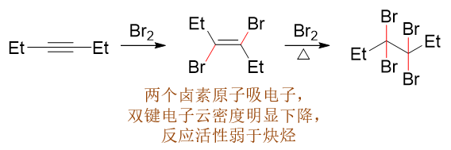

与水加成
~~~~~~~~~~~~

烯烃可以通过直接水合法生成遵循马氏规则的醇，由于活化能较高，通常需要高温高压的条件：

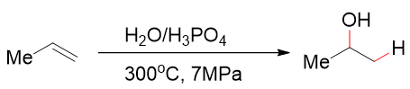

  烯烃的直接水合生成醇

同烯烃的直接水合法类似，炔也可以与水发生加成，反应过程中通常需要加入二价汞盐作为催化剂。有了这个特殊的催化剂后，活化能大大降低，
反应条件反而比烯烃要温和很多，一般无需高压，温度也可以大大下降。需要留神的是，加成得到遵循马氏规则的烯醇后，
通常会迅速通过互变异构，转变成醛酮。

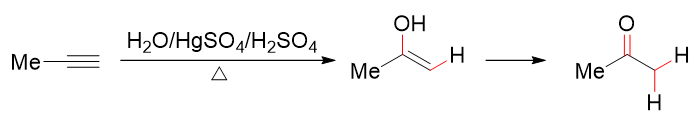

  加入汞盐后炔烃的水合显得更加容易

催化氢化
-------------

与亲电取代不同，催化氢化反应与不饱和键的电子云密度关系不大，也不会生成碳正离子，再加上叁键附近位阻较小，炔烃的催化氢化反而较烯烃更容易些。
当然这个更容易也是相对而言，烯烃的催化氢化反应活性其实也不差。因此，如果不加以控制，炔的氢化一般难以停留在得到烯烃的一步，而是会一路进行下去，
最终生成烷烃。

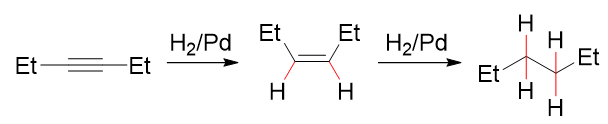

若想停留在得到烯烃的一步，我们也知道通常可以使用降低催化活性的Lindlar催化剂：

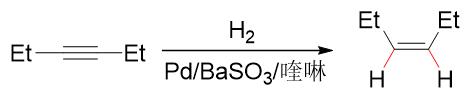

注意这里催化氢化的立体选择性同之前烯烃的反应相同，两个氢原子总是从同一方向靠近底物分子的叁键，因此最终得到的主要产品将是顺式烯烃。

硼氢化-氧化
-------------

炔烃的硼氢化-氧化反应与烯烃亦无本质差别，区域选择性亦为反马氏，立体选择性则是顺式加成：

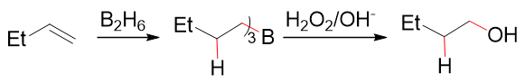

  烯烃的硼氢化-氧化

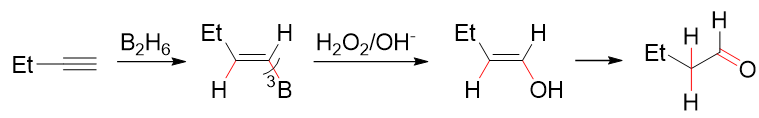

  炔烃的硼氢化-氧化

注意这里炔烃氧化之后得到的又是一个烯醇，因此接互变异构，迅速转变成醛或者酮。

氧化
-------

炔的氧化反应也与烯烃有很大的相似性。KMnO\ :sub:`4`\ 、臭氧等氧化剂也都可以氧化炔中的叁键。

高锰酸钾氧化
~~~~~~~~~~~~~~~~~~

我们知道在酸性或加热条件下，氧化剂的氧化能力明显较低温、碱性条件下更强。像我们熟知的烯烃的反应，酸性或加热条件下
高锰酸钾可以将烯烃中的碳碳双键整个打断，首先得到两分子羰基化合物。当然，生成的醛酮如果羰基上还连接有氢原子，则
氧化可以继续进行，一路氧化到中心碳原子上连接的氢全都消失为止，如下图所示。

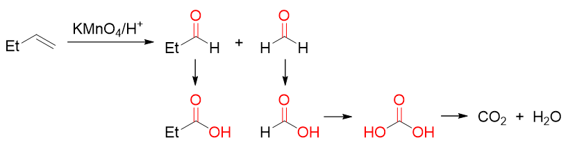

  烯烃酸性或加热条件下的高锰酸钾氧化

炔烃在这种条件下的氧化情况与烯烃类似，碳碳叁键也会被整个打断。值得注意的是，这里相对于烯烃相当于多断开了一根π键，
因此初始的氧化产物较烯烃得到的醛酮氧化态要更高一级，一上来就会生成羧酸。当然羧基碳上如果连有氢，氧化也会一路向下进行：

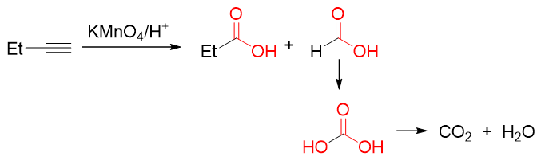

  炔烃酸性或加热条件下的高锰酸钾氧化

低温碱性条件下，高锰酸钾氧化能力下降，这时它只能断开π键而无法影响键能较高的σ键。像烯烃，我们知道该条件下将会被氧化成邻二醇：

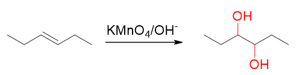

  烯烃低温碱性条件下的高锰酸钾氧化

至于炔烃，也是π键断开σ键保留，但同样由于多断开一根π键，产品中官能团氧化态升一级，通常会生成邻二酮类化合物：

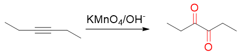

  炔烃低温碱性条件下的高锰酸钾氧化

臭氧氧化
~~~~~~~~~~

烯烃臭氧氧化再接金属还原，双键亦将断开生成两分子羰基化合物，如下图所示。明显我们注意到氧化生成的产品结构与高锰酸钾酸性氧化得到的初始产物实际相同，
只是臭氧条件下即便是生成醛，也不会再继续往下氧化成酸乃至二氧化碳。

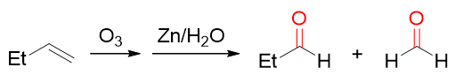

  烯烃的臭氧氧化

炔的臭氧氧化情况也是类似，断开叁键，生成氧化态较醛酮更高一级的酸。同样，即便是得到羧基旁侧连接氢原子的甲酸，氧化反应也不会继续进行下去。

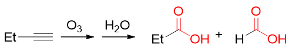

  炔烃的臭氧氧化

.. note::

  留神烯烃或炔烃臭氧氧化的第二步条件略有差异。烯烃与臭氧反应后我们通常需接一步金属还原，而炔只需要再进行一步水解即可。

综上，除个别如炔氢的反应外，炔烃的大量的化学性质其实都与烯烃类似。我们在学习的时候，不妨将这两类化合物关联起来，注意异同，往往能起到事半功倍的效果。