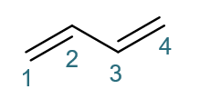
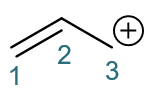
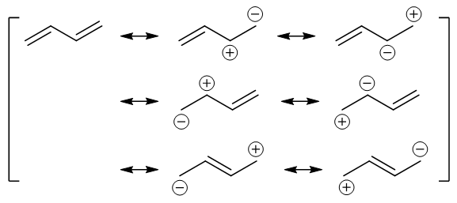

共振论(1)
=======================

在共轭二烯这一节的学习里，我们接触了所谓的“\ **共振论**\ ”。这是传统有机化学家处理电子离域体系的一个常用方法。鉴于课本包括教学视频中
对它的介绍有些模糊，我们这里对共振论专门进行一些讨论。

基本原则
--------------

共振论从某个角度上说，是为传统结构理论打的一个“补丁”。这个补丁专门为处理共轭的电子离域体系而设计。

我们知道，在纸面上描绘有机分子的结构，我们通常会使用键线式、缩写式这样的所谓“经典Lewis结构式”，原子原子间通过共价键相互连接，一根共价键等同于一对电子。
而在Lewis经典结构式中，无论是单/双/叁键，成键都是局限于两个原子之间的。换而言之，成键原子固定在两个原子的范围之内，是所谓的“定域”的。
比如下图中1,3-丁二烯的经典结构式，从纸面上看，C1-C2与C3-C4之间都是双键，这两组原子间各有四个电子，而C2-C3间是单键，原子间有两个电子成键。

类似的，下图中的烯丙基碳正离子，纸面看C1-C2间四电子，C2-C3间两电子，正电荷完全分布在C3上。

但事实上，我们知道实际情况并非如此。如下图所示，像1,3-丁二烯，所有四个碳原子sp\ :sup:`2`\ 杂化，四个p轨道侧面交叠可以形成四中心四电子大Π键，
π电子可以在四个原子的大范围内自由流动，不再局限于两个原子之间，也即所谓的“离域”。此外，C2-C3间由于有p轨道的侧面交叠，实际也不仅仅是单键，
而是具有部分双键的性质。类似的，烯丙基碳正离子，三个碳原子也都是sp\ :sup:`2`\ 杂化，形成三中心两电子大Π键，π电子也是离域的，C2-C3间同样具备部分双键的性质。
这些结构上的特征，在经典结构式中完全体现不出来。换句话说，\ **使用电子定域的经典结构式，无法表征电子离域体系的实际结构**\ 。

.. figure:: ../../images/C05-KeyPoints/Resonance03.png

  1,3-丁二烯与烯丙基碳正离子中均可形成电子离域的共轭体系

.. note::

  关于共轭与电子离域的更多讨论，请见前一章的
  :doc:`重难点小结：诱导效应与共轭效应、碳正离子的稳定性<../C04/KeyPoints02-InductiveAndConjugatedEffects>`\ 。

基于这样的缺陷，“共振论”补丁出现了。共振论说白了就一个基本原则：

  **对于这种无法用单个经典结构式表达的电子离域体系，可以使用多个经典结构式（也即共振极限式）去表征。体系的实际结构相当于多个共振极限式的平均化。**

非常直白也非常暴力的做法，一个经典结构式不行，就多上几个。

比如我们看到对1,3-丁二烯，可以用底下这么一大堆共振极限式来表达实际结构：

  表达1,3-丁二烯实际结构式的一系列共振极限式

分子的实际结构被视作这些共振极限式的平均。而最后一行的两个极限式，纸面上C2-C3间是双键，平均之后，1,3-丁二烯的实际
结构里，C2-C3间也就带有了部分双键的成分。

共振论的大致原则就是如此。规则很简单，但这么一大堆极限式看起来挺晕，很多同学也不明白这些极限式是怎么得到、怎么画出来的。
接下来我们就专门来解释这个问题：如何从一个经典式得到一系列共振极限式。

共振极限式的画法
-------------------

欲从经典结构式得到一系列共振极限式，其实说起来也就一个基本做法：\ **人为地令π电子发生转移**\ 。

注意到我们当前用共振论处理的是电子离域的体系，π电子本身就是可以自由流动的，人为地令π电子转移，某种意义上说就是在模拟这种流动。
需要小心的是，这里令其流动的只是π电子，也就是经典结构式中π键及参与共轭的p轨道上的电子。反过来σ键上的电子不参与共轭，原本就是定域的，
在写共振极限式的时候切勿移动（换而言之，\ **不要改变σ键**\ ）。

这么说还是比较抽象，我们不妨用一个具体的实例来说明。1,3-丁二烯的共振式比较复杂，我们先放到一边。咱们就以烯丙基碳正离子为例，
看看从下图中的经典结构式出发，如何画出它的共振极限式。

例：烯丙基碳正离子的共振式
  .. image:: ../../images/C05-KeyPoints/Resonance02.png

  首先，我们拎出这个结构中的π电子来。明显左侧C1-C2间纸面上的π键有一对π电子。此外从这个经典结构式上看，右侧C3碳正中心，有参与共轭的
  p轨道，但这个p轨道是空的，没有电子。加到一起，这个结构总共也就是两个π电子。

  接下来我们人为地令这一对π电子发生转移，从C1-C2间转移至C2-C3间：

  .. image:: ../../images/C05-KeyPoints/Resonance05.png

  这样的转移，相当于C1-C2间π键一对电子移走了，双键会变成单键；而C2-C3间多了一对电子，单键变双键。正常共价键是每人出一个电子，
  现在C3没出电子，平白生成了这么一根双键，相当于自己多接受了一个电子，正电荷刚好消失。于此同时C1-C2间旧的π键上两个电子现在全被C2拿去
  成新键，自然C1相当于失去了一个电子，将带有正电荷。这两个电子转移后，我们将得到一个新的经典结构式：

  .. image:: ../../images/C05-KeyPoints/Resonance06.png

  .. note::

    这里我们还是用双钩弯箭头来标识一对电子的转移，但与之前在书写机理时的弯箭头含义略微有所不同。写机理的电子转移箭头，是
    反应过程中实际发生的变化。而共振论这里，只是为了推衍新的共振极限式而作的人为的假定，并非实际的电子转移。写出的\ *单个*\ 共振极限式
    也并非分子或离子的实际结构。

  好，这个新结构实际就是烯丙基碳正离子的又一个共振极限式。我们把原结构与新结构用共振箭头联系起来，如下图，这基本就是共振论
  对烯丙基碳正离子结构的处理：

  .. figure:: ../../images/C05-KeyPoints/Resonance07.png

    烯丙基碳正离子的一对共振极限式

烯丙基碳正离子的这个例子比较简单，使用同样的做法，我们可以来处理更复杂一些的1,3-丁二烯。

例：1,3-丁二烯的共振式
  .. image:: ../../images/C05-KeyPoints/Resonance01.png

  同样，我们首先还是先找出离域的π电子。明显C1-C2、C3-C4间的π键上，总共有两对离域的电子。老办法，我们人为令其发生转移。比如，先令
  当前(a)式的C1-C2间一对电子转移到C1上，如下图所示。

  .. image:: ../../images/C05-KeyPoints/Resonance08.png

  注意我们这是令一对电子从原子间转移到其中某一个原子上，相当于令π键发生异裂。这将导致C1带负电荷而C2带上正电荷。如是，我们将得到如下
  电荷分离的一个共振极限式(b)：

  .. image:: ../../images/C05-KeyPoints/Resonance09.png

  共振极限式(b)中，留意C2-C4这三个原子，我们看到这个区域其实就类似于之前的烯丙基碳正离子。同样的处理方式，我们可以人为令C3-C4间π键
  上一对电子转移到C2-C3间，得到共振式(c)：

  .. image:: ../../images/C05-KeyPoints/Resonance10.png

  共振式(b)(c)，可以说都是我们在(a)的基础上人为令电子转移到C1，使C2带正电荷一路衍生出来的。当然，我们也可以一开始就反过来，令C1-C2间的π电子反向转移，
  全部转移到C2上，这么一来C2将带负电荷而C1带正电荷，又生成共振式(d)：

  .. image:: ../../images/C05-KeyPoints/Resonance11.png

  在共振式(d)中，C2-C4不再是烯丙基碳正离子的结构了，而是相反，接近于烯丙基碳负离子。而C2带负电荷，又位于双键旁侧，实际上它的杂化形态也是
  sp\ :sup:`2`\ ，一样能参与共轭。

  在(d)的基础上我们继续变换。现在C2带负电荷，相当于其未参与杂化的p轨道上有一对电子（想想自由基碳p轨道1个电子，碳正0个，碳负自然是2个）。
  我们人为令这对电子转移到C2-C3之间，使得这两个原子间由单键变成双键。于此同时，C3为了维持4价，需要断开一根旧键。σ键在写共振式的时候不能
  发生变化，我们这儿也只能拆开C3-C4间的π键，令这对电子全部转移至C4，也即C4多接受一个电子，带上负电荷。这么一来我们又得到新共振式(e)：

  .. image:: ../../images/C05-KeyPoints/Resonance12.png

  好，到目前为止我们在(a)的基础上首先拆开的都是C1-C2间的π键。类似的，我们也可以一上来就拆开C3-C4间的π键。比如先令一对电子都转移至C4，
  同样可以衍生出共振式(f)与(g)：

  .. image:: ../../images/C05-KeyPoints/Resonance13.png

  反过来令C3-C4间一对电子都转移至C3，又可以衍生出共振式(h)(i)：

  .. image:: ../../images/C05-KeyPoints/Resonance14.png

  到这儿看起来我们一共得到了从(a)至(i)共九个共振极限式，但注意其中明显有几对重复的，如(c)与(i)、(e)与(g)。剔除重复，最终，
  我们得到了1,3-丁二烯的共计七个比较重要的共振极限式：

  .. image:: ../../images/C05-KeyPoints/Resonance15.png

  .. note::

    在这个例子中我们人为地将起始结构中的一根双键拆成单键，得到正负离子对。而1,3-丁二烯中经典结构式有两根双键，有些同学会有疑问，能否把
    第二根双键也拆开，形成如下图中右侧的新共振式：

    .. image:: ../../images/C05-KeyPoints/Resonance15_1.png

    包括之前的烯丙基碳正离子，似乎也能拆开双键：

    .. image:: ../../images/C05-KeyPoints/Resonance15_2.png

    这样得到的新共振式行不行呢？答案其实是肯定的，但上面两个新共振式我们一般不用写出来，在讨论结构的时候也不必考虑。具体原因在
    :doc:`重难点小结：共振论(2)<./KeyPoints03-ResonanceTheory2>`\ 中会进行解释。

上面的例子里我们基本都是令一对电子发生转移，而后一路衍生。但实际上写共振式时，也可以令单电子转移。如下例中烯丙基自由基的共振式。

例：烯丙基自由基的共振式
  .. image:: ../../images/C05-KeyPoints/Resonance16.png

  这个自由基的结构与烯丙基碳正离子相似，C3也是sp\ :sup:`2`\ 杂化，只不过p轨道上不是空的，而是有一个电子。于是这个结构中，
  参与共轭可以离域的π电子总共是三个：C1-C2间π键上一对，外加C3的p轨道上一个。

  我们还是令电子发生转移。注意到当前C3上有单个的一个电子，我们不妨先令这未成键的一个电子转移到C2-C3之间。当然，光这单个电子
  没法儿形成共价键，咱们还得再找个电子与它配对。当前其它碳原子上其实都没有多余的电子了，我们只能拆东墙补西墙，比如把C1-C2间
  的π键断开，这么一来可以解放出两个电子。当然，前面咱们只需要一个，我们就令C1-C2间π键的一个电子转移到C2-C3间，刚好配对形成
  一根新的π键。剩下一个电子不需要了，它只能留给C1，于是C1带上一个未成键电子，相当于自由基中心从C3转移到了C1上。整个过程大致
  如下图所示：

  .. image:: ../../images/C05-KeyPoints/Resonance17.png

  .. note::

    在上面的过程中，发生的都是单电子的转移，因此这里使用的都是单钩箭头。

  最终，烯丙基自由基的一对主要的共振极限式如下图所示：

  .. image:: ../../images/C05-KeyPoints/Resonance18.png

写共振式，大致就是这么一个过程，其实并不复杂。

.. note::

  注意，我们书写共振式转移电子时，从不涉及σ键。而σ键保留，意味着分子/离子中原子的拓扑连接情况在所有共振式中都相同。
  如以下的一对结构，σ键情况不同（C-H键连接情况发生了改变），绝不会是一对共振极限式。

  .. image:: ../../images/C05-KeyPoints/Resonance18_1.png

