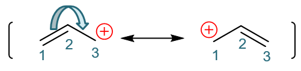
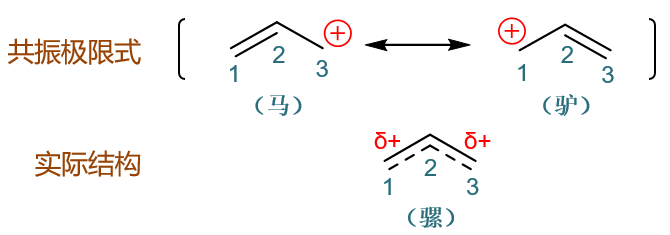
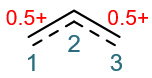
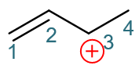
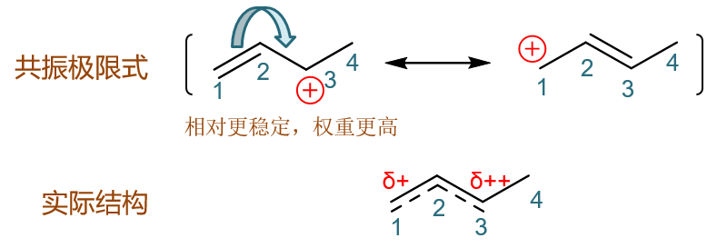
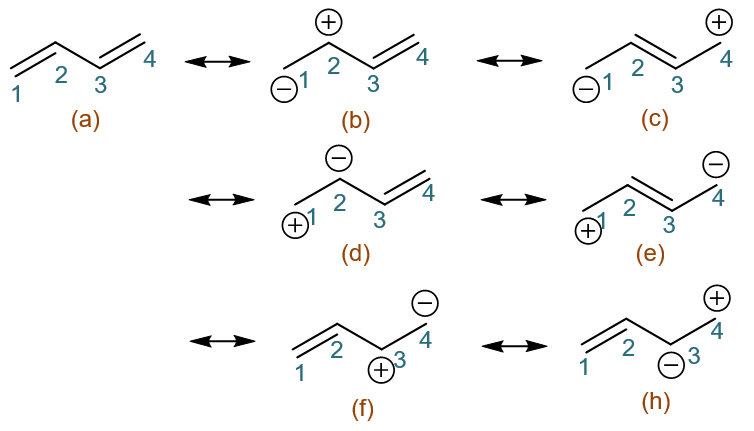
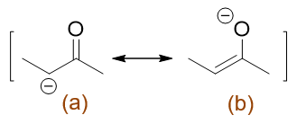
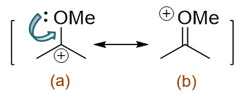

共振论(2)
=======================

共振极限式与实际结构
-----------------------

前面我们已经能够写出电子离域结构的一系列共振极限式了。像烯丙基碳正离子，我们有如下的两个主要的共振极限式：

而这烯丙基碳正离子的实际结构，并不是其中某个共振极限式，也并非这两个共振极限式变来变去，而是所有这些共振极限式平均化后的单一结构。

如下图所示，烯丙基碳正离子的真实结构实际是两个共振式的平均，或者说中间状态。C1-C2间的共价键左侧共振式看是双键，右侧是单键，实际结构就是介于
单双键之间。类似的C2-C3间也是如此。至于正电荷，左侧共振式在C3右侧在C1，实际结构这个正电荷也就被C1、C3分担，两个碳原子上各带有部分正电荷。

打个不是特别恰当的比方，上面俩共振极限式，假设左侧的是马，右侧是驴，那烯丙基碳正离子的实际结构非驴非马，更不是一会儿变驴一会儿变马，
它的实际结构可以被看成是骡子。

需要说明的是，实际结构看作是共振极限式的平均化，但这是个加权平均，各个共振极限式经常有着不同的权重。从纸面上看，能量较高的共振式权重低，
而\ **能量较低的、更稳定的共振式权重高**\ 。换句话说，\ **体系的实际结构更接近于较稳定的共振极限式**\ 。

对于烯丙基碳正离子的两个共振极限式而言，很明显两者都是一根双键加一个碳正，稳定性没有区别，因此在做平均时，这俩共振式的权重应当完全相等。
因此，该离子的实际结构，C1-C2、C2-C3间的共价键键级可以视作是1.5，而C1与C3各带0.5个正电荷，如下图所示：

.. note::

  另外类似烯丙基碳正离子这样，最稳定的共振极限式不只一个且能量完全相同，则体系整体稳定性一般会相对较高。

如果在烯丙基碳正离子的基础上多加一个碳原子，即如下的正离子：

我们同样可以写出它的一对共振极限式，如下图所示。但这两个共振极限式稳定性上存在区别，由于左侧极限式碳正旁侧多了一个甲基（C4位），
而甲基又具有给电子诱导效应，因此左式稳定性将高于右式，做平均的时候占的权重也更大。因此这个正离子的实际结构中，3-位碳原子
所带的正电荷密度将高于1-位碳。

类似的，像我们之前讨论的1,3-丁二烯，它有七个主要的共振极限式：

明显电中性的共振式(a)的稳定性高于其它所有电荷分离的共振式，因此1,3-丁二烯的实际结构也是最接近于(a)，C1-C2、C2-C4间相对
更加接近于双键，而C2-C3间虽然具有部分双键的性质，但结构上还是更加接近于单键。

.. note::

  在前面\ :doc:`重难点小结：共振论(1)<./KeyPoints03-ResonanceTheory1>`\ 中，我们还曾进一步拆开双键，
  似乎还可以画出烯丙基碳正离子与1,3-丁二烯的新共振极限式：

  .. image:: ../../images/C05-KeyPoints/Resonance15_2.png

  .. image:: ../../images/C05-KeyPoints/Resonance15_1.png

  但类似这样的极限式一般无需过多关注。原因也很简单，这两个共振极限式相对于我们之前画出的，都是进一步发生了电荷分离。
  很明显电荷分离越多，共振极限式的稳定性也会越差，相应地，平均化生成实际结构时权重也会越小。类似这样的极限式由于权重
  过小，一般情况下我们都无需考虑。

共振式稳定性的判断
----------------------

前面在判断共振极限式平均化的权重时，我们提到了共振式的稳定性。共振式稳定性的判断，与正常的分子/离子/自由基其实区别不大，
依然遵循一些普遍的原则。我们课本上提到了不少，其中有几条相对更为重要：

  1. 电中性共振式较电荷分离的更加稳定（电荷分离程度越高越不稳定）

  2. 满足八隅体规则的共振式更加稳定

  3. 电负性较大的原子带负电荷电而负性较小的原子带正电荷比相反的情况更加稳定

这三条规则中，1、3都不难理解。其中规则1，像之前我们看到的1,3-丁二烯就是如此，电中性的共振式比其它所有电荷分离的都更稳定。
而规则3，如下图两个共振式中的(b)，负电荷处于电负性较高的氧原子上，稳定性将强于(a)。

  负电荷处于电负性较高的氧原子上，共振式(b)的稳定性更高

至于规则2，典型的如下图中的例子。共振式(a)相当于是碳正离子与甲氧基直接相连，而单键氧原子上又存在两对未成键的孤对电子，
这里我们可以令其中一对孤对电子转移到C-O之间，相当于形成一根π键。正常共价键一人一个电子，现在两个都来自于氧，相当于C上多
接受一个电子，正电荷消失，而O上丢失了一个电子，将带有正电荷，于是我们得到右侧共振式(b)。

  由于满足八隅体规则，共振式(b)的稳定性反而高于(a)

表面看起来，(b)中电负性较高的氧带正电荷，似乎稳定性应当不如(a)，但由于(b)中所有的C、O原子都满足八隅体规则，反而稳定性较(a)更高。

关于共振论的讨论，我们大致到这里告一段落。作为一种相对直观的对离域体系处理的方式，今后我们讨论很多反应机理的时候，共振论都可以成为一个强有力的武器。

