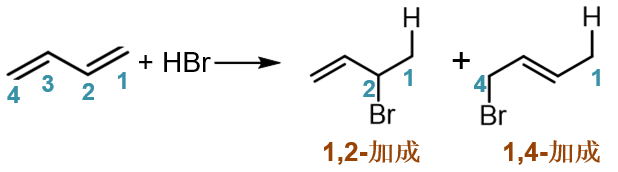
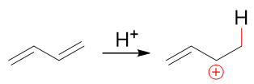
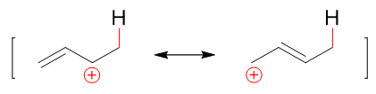
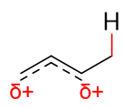
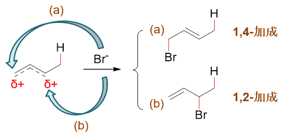
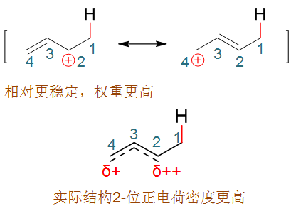
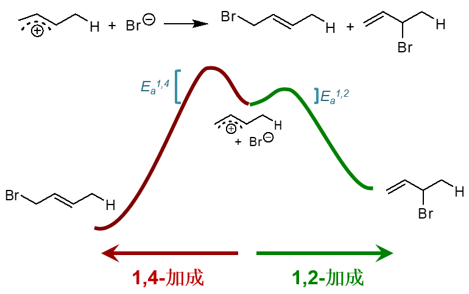
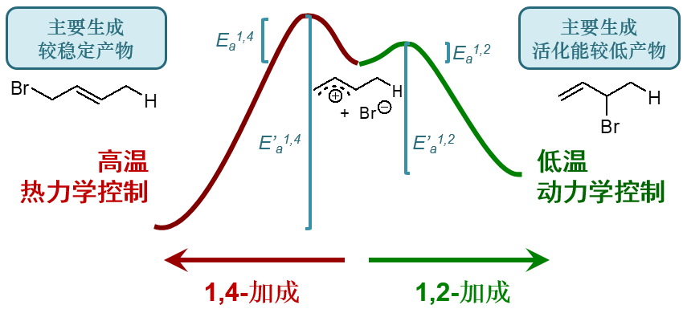

共轭二烯的亲电加成
===============================

共轭加成
--------------

共轭二烯——典型的如1,3-丁二烯——发生亲电加成时，我们知道与普通烯烃存在明显区别，常具有两种主要的途径，1,2-加成或1,4-加成，
相应地生成两种可能的主要产品，如下图所示（此处与HBr加成）。

之所以出现这两种产物，我们知道，还是与反应机理有关。反应首先还是质子与双键碳成键，形成碳正离子。1,3-丁二烯中两根双键化学环境
相同，我们不妨设质子先与C1-C2间双键反应，根据马氏规则，将得到如下碳正离子：

而该碳正离子明显正电中心碳可以与旁侧双键共轭，是一个电子离域体系。根据共振论的观点，我们可以用一对共振极限式的平均化来表达它的结构：

平均化后的实际结构大致如下图，原2-、4-位都会带有部分正电荷：

.. note::

  关于共振论尤其是共振极限式的画法，请详见
  :doc:`重难点小结：共振论(1)<./KeyPoints03-ResonanceTheory1>`\ 。

既然这两个位置上都缺电子，接下来Br\ :sup:`-`\ 的进攻自然存在两个可能的靶点，如下图所示。如果进攻2-位，某种意义上我们可以理解为与左侧的
共振式结构反应，则得到1,2-加成产物；反之进攻4-位，则相当于与右侧的共振式反应，将生成1,4-加成产物。

  Br\ :sup:`-`\ 的进攻自然存在两个可能的靶点

热力学控制与动力学控制
--------------------------

当然，我们也知道，1,2-与1,4-两种产品究竟谁占的比例更高，实际与反应温度有关。低温下将是1,2-加成为主；反之高温下则更容易发生1,4-加成。
之所以出现这么个情况，实际与反应的动力学特征及生成物的热力学稳定性有关。

首先，1,2-与1,4-加成，可以视作是一对竞争性的反应，而这两条反应途径的活化能是存在明显区别的。前面关于反应机理的讨论，我们
已经知道加质子后形成的碳正离子中，因为共轭，两个位置都带有部分正电荷，可以成为卤负离子进攻的靶点。而这两个位置上带的正电荷密度
实际存在差别——之前共振论的讨论里我们其实已经涉及了这个问题。如下图所示，由于左侧共振式的正电中心多连接了一个给电子的甲基，因此
稳定性要强于右侧的共振极限式，在做共振极限式的平均化时所占权重也相应较高。因此我们可以下结论，虽说这个正离子实际结构里2-、4-位
都带有部分正电荷，但2-位带的正电荷密度明显较高，更容易吸引卤负离子的进攻。换句话说，加成反应第二步，卤负离子进攻2-位发生
1,2-加成的活化能要低于进攻4-位的1,4-加成。

.. note::

  关于共振式稳定性对实际结构的影响，详见
  :doc:`重难点小结：共振论(2)<./KeyPoints03-ResonanceTheory2>`\ 。

其次，我们再注意观察两种最终产物的结构，无论哪一种，分子内都还有一根双键。1,2-加成产品双键处于碳链端头而1,4-加成产物双键处于中间。
在烯烃稳定性的讨论里，我们也已经了解了一个较普遍的规律：一般双键上连接烷基数目越多，超共轭效应越明显，相应的烯烃稳定性也会越高。
就这一角度，明显1,4-加成产物的热力学稳定性应当较强，能量较低。

综合以上两点，我们其实可以定性地画出这一对竞争性反应的能线图了，大致如下图所示。中间是反应的起始状态，
碳正离子卤负离子开始接近，向左则是发生1,4-加成，向右1,2-加成。1,2-加成活化能（图中\ E\ :sub:`a`\ :sup:`1,2`\ ）
较1,4-加成（图中\ E\ :sub:`a`\ :sup:`1,4`\ ）来得低。而热力学能量上，1,4-产物又较1,2-产物来得低。

现在假设我们在较低的温度下进行反应。低温下我们知道，分子热运动能量比较低，打个不是特别恰当的比方，不是特别活跃不是特别能蹦跶。
在这种情况下，它能蹦跶过1,2-加成这个小坡就算不错了，而1,4-加成要克服的能垒\ E\ :sub:`a`\ :sup:`1,4`\ 显得有点儿难以逾越。
既然如此，1,4-始终翻不过去，只能跳过1,2-这边，毫无疑问，这时的主要产物将是1,2-加成的产品。

类似这样的情况，反应的主要产品由活化能决定，我们称其为“\ **动力学控制**\ ”。

但反过来在高温下，情况大为不同。分子热运动能量大大升高，显得特别能蹦跶，不但翻过1,2-的活化能很轻松，1,4-的坡也不在话下。甚至
还远不止于此，生成产品之后，它还能往回翻，也就是发生逆反应，显得特别调皮。

.. note::

  原则上，所有的化学反应都是可逆的，困难程度不同而已。

当然，1,2-与1,4-这两条路线如果真发生逆反应的话，逆反应的活化能也是明显不同的。1,2-这边正反应活化能低而产品热力学能量高，明显
逆反应的活化能要低于1,4-，这个坑比较浅。高温下发生1,2-加成后，整个体系相对比较容易又翻回来恢复成碳正离子与卤负离子的
初始状态。而1,4-加成这边，逆反应的活化能较高，或者说1,4-的这个坑比较深，分子翻过去之后再想爬出来就不是那么容易了。

一个坑易进易出，另外一个深一些，进去了就没那么容易出来，随着反应时间的推进，我们很容易想象，掉在1,2-这个坑里的分子将逐渐减少
而掉在1,4-坑里的将越来越多。

最终，高温下我们主要得到的将是1,4-加成的产物。这里主要产品由热力学稳定性决定，我们自然称为“\ **热力学控制**\ ”。

.. note::

  类似共轭加成这样，存在动力学/热力学控制的竞争反应还有很多。一般来说，\ **高温、长时间反应容易导致热力学控制；
  而低温、短时间反应容易发生动力学控制**\ 。

更复杂共轭烯烃的亲电加成
------------------------------

前面我们的讨论里使用的底物分子都是1,3-丁二烯，最简单的一种共轭二烯。但在实验室或是练习题中，我们经常也会遇到
更复杂共轭烯烃的加成。以下我们来讨论两个例子。

例：请写出2-甲基-1,3-丁二烯与HBr加成的主要产品。
  .. image:: ../../images/C05-KeyPoints/ConjugateAddition09.png

  和1,3-丁二烯相比是多了一根侧链，情况略有不同。

  我们还是从反应历程来考量。反应第一步还是质子加到双键碳上，但这里两根双键不对称。如下图所示，若质子先与右侧双键反应，
  根据马氏规则，我们将生成上方的碳正离子；反之若质子与左侧双键反应，将得到下方碳正离子（注意这里都是遵循马氏规则的）。
  明显下方碳正比上方稳定性更强，反应过程中主要也是生成底下这种碳正离子中间体。

  .. image:: ../../images/C05-KeyPoints/ConjugateAddition10.png

  接下来下方这种碳正离子依然存在共轭结构，我们又可以继续写出它的两个共振极限式来，原先碳链的2-、4-位都带部分正电荷，
  可能被卤负离子进攻。最终我们也是生成1,2-与1,4-两种加成产物。根据温度不同，主要产品也相应地发生变化。

例：请写出1,3,5-己三烯与HCl加成的主要产品。
  .. image:: ../../images/C05-KeyPoints/ConjugateAddition11.png

  这次不是共轭二烯了，而是又多了一根双键，共轭三烯。

  依然从机理入手，当前底物分子中存在两种化学环境不同的双键，第一步加质子可能形成两种碳正离子中间体。如下图所示，
  如果质子先与中间双键反应，将得到上方的碳正离子；反之与两侧双键反应，将得到下方的碳正离子。上下方这两种碳正离子
  正电中心碳与双键间都存在共轭。但上方，正电中心与左侧双键间隔开了一个sp\ :sup:`3`\ 杂化的饱和碳，只有右侧
  一根双键能参与共轭，形成三中心两电子的共轭体系。而下方，两根双键都能参与共轭，形成五中心四电子的共轭体系。一般来说
  共轭体系越大能量越低，这里也是如此，反应过程中将主要生成底下这种中间体。

  .. image:: ../../images/C05-KeyPoints/ConjugateAddition12.png

  而下方这个存在共轭的碳正离子，根据共振论的观点人为地令电子对顺次发生转移，我们可以写出三个主要的共振极限式，
  如下图所示。实际结构中也是三个原子上都会带有部分正电荷，都可能成为Cl\ :sup:`-`\ 进攻的靶点，分别得到
  1,2-、1,4-与1,6-加成产品。

  .. image:: ../../images/C05-KeyPoints/ConjugateAddition13.png

  这三个产物中，相对而言1,2-与1,6-一般生成的会多些，而1,4-加成产物无论是高温还是低温，生成量都相对较少。
  为什么会出现这个现象，有兴趣的话大家可以自个儿琢磨一下原因。

