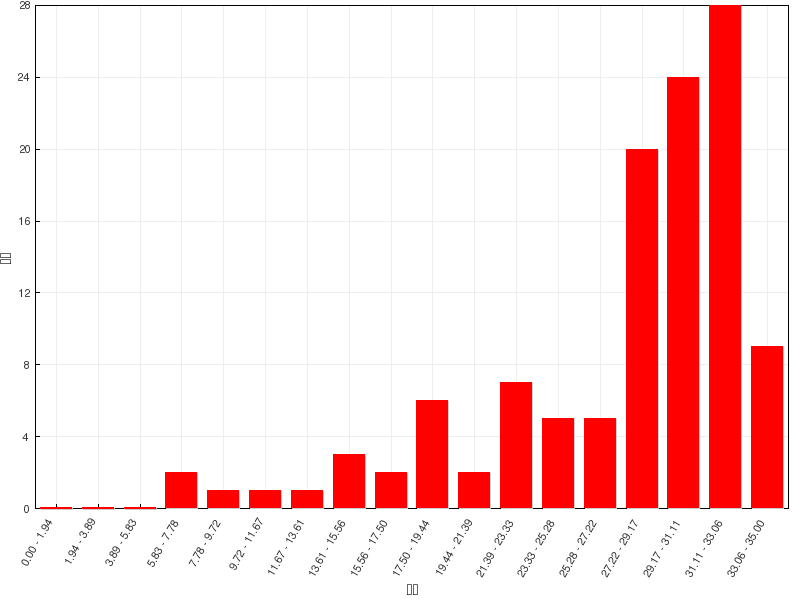

习题讲解：芳烃
========================

在线自动评分习题
---------------------

=======   =============
总分        35
平均分      27.5(78.6%)
最高分      35(100.0%)
=======   =============

  成绩分布

题5：命名（错误率48.3%）
  .. image:: ../../images/C06-Exercises/A05_00.png

  苯环旁侧连接了羟基、乙氧基、叔丁基三种基团。根据官能团优先级，明显这里羟基是主官能团，我们编号时需要尽可能使两个羟基位次较小，其次再考虑
  取代基（乙氧基与叔丁基），应当如下图进行：

  .. image:: ../../images/C06-Exercises/A05_01.png

  此外，分子中两个羟基都连接在苯环上，地位、化学环境均相同，应当都视作主官能团，母体称为1,3-苯二酚，而不应叫作3-羟基苯酚。连同剩余两个取代基，
  整个分子命名应为\ **5-叔丁基-2-乙氧基-1,3-苯二酚**\ 。

题6：命名（错误率44.0%）
  .. image:: ../../images/C06-Exercises/A06_00.png

  萘衍生物，环旁侧连接了羧基、羟基、硝基，明显是个多官能团化合物。依然根据官能团优先级，判断出主官能团是羧基。萘环编号固定从某个α-位开始，
  这里需要保证羧基位次尽可能小，因此编号应当如下图进行，整个分子因之称为\ **5-硝基-8-羟基-2-萘甲酸**\ 。

  .. image:: ../../images/C06-Exercises/A06_01.png

题7：命名（错误率72.8%）
  .. image:: ../../images/C06-Exercises/A07_00.png

  该分子如果以苯环作为母体的话，右下角的烯基显得过于复杂了，难以称呼。因此这里我们可以灵活些，反过来以烯烃碳链作为母体，苯环连同甲基整体看作
  一个取代基。

  若以烯烃碳链为母体，编号无非两种方式，如下图中蓝色与红色所示：

  .. image:: ../../images/C06-Exercises/A07_01.png

  这两种编号方式官能团双键的位次一致，都是2-位没区别，因此这儿我们还得考虑取代基的位次，使之尽可能小。蓝色编号方式两个取代基分处
  2-,4-位，而红色则是1-,3-位，明显这里应当取红色编号。

  3-位取代基氯很简单，1-位苯环那块儿则略显复杂。这里甲基在苯环上处于同母体相连碳的对位，一个简单的做法，我们可以称之为对甲基苯基。或者
  也可以按照复杂取代基的处理方法，给取代基中的苯环编号，同母体烯烃碳链相连处算作1-位，甲基则明显在4-位，整体也可称作4-甲基苯基。

  最后，注意到这根双键存在顺反异构（命名时一定绷紧构型这根弦），当前容易判定出是Z构型。于是，整个分子我们命名为
  \ **(Z)-1-对甲基苯基-3-氯-2-丁烯**\ 或\ **(Z)-1-(4-甲基苯基)-3-氯-2-丁烯**\ 。

题8：命名（错误率31.5%）
  .. image:: ../../images/C06-Exercises/A08_00.png

  与前一题情况类似，本题也可以烯烃碳链作为母体。位保证母体上主官能团双键位次最小，编号应如下图所示：

  .. image:: ../../images/C06-Exercises/A08_01.png

  此外，通过Fischer投影式，我们明显判定出手性中心构型为R。最终整个分子称为\ **(R)-4-苯基-3-溴-1-丁烯**\ 。

题16：请在下列分子或离子中选出具有芳香性的体系。（错误率24.0%）
  .. image:: ../../images/C06-Exercises/A16_00.png

  判断芳香性的有无当然少不了Hückle规则。规则分三条：环上原子共面、形成共轭回路、π电子总数4n+2。三条均需满足，环才具有芳香性。
  其中共面一条有些时候不太容易判断，但若体系满足后两条规则，通常情况下共面条件也会满足（当然也有少量例外）。

  .. note::

    关于环芳香性判断的具体步骤，请参见
    :doc:`重难点小结：Hückle规则<./KeyPoints03-HuckleRule>`\ 。
    其中本题中不少分子在文中有详细讨论。

  这一组分子可以明显分成数组，我们逐行看起。

  第一行三个分子或离子，环上原子均为碳。不论是双键碳还是双键旁侧的碳负中心，均为sp\ :sup:`2`\ 杂化，原则上说均可形成环状共轭回路。
  电中性双键碳每人提供一个π电子，碳负则是两个，分别计算出三个结构的π电子总数情况如下（其中第三个分子是最外圈大环的π电子数），视其是否
  满足4n+2，不难判定出各自的芳香性来。

  .. image:: ../../images/C06-Exercises/A16_01.png

  第二行两个分子，是[10]轮烯极其衍生物。看起来环上也可以形成共轭回路且π电子总数10个，满足4n+2，如下图所示。但[10]轮烯由于其内侧氢原子的斥力，
  使得环上原子无法处于同一平面上，不满足Hückle规则中的第一条。而右侧，中间两个碳上没有连接氢，而是共同连接了另一个碳原子，相较于[10]轮烯，
  反而使得斥力减小了，环也基本可以处于同一平面上，整个分子也就因之具有了一定的芳香性。这两个分子在\ :doc:`重难点小结：Hückle规则<./KeyPoints03-HuckleRule>`\
  中\ *单环体系的特例：轮烯*\ 部分有详细的讨论。

  .. image:: ../../images/C06-Exercises/A16_02.png

  第三行，环上均有杂原子。一般而言，处于双键旁侧或与双键直接相连的杂原子也均为sp\ :sup:`2`\ 杂化，可以参与共轭体系。当然环境不同的杂原子
  提供的π电子不尽相同。若是直接与双键相连，通常提供一个π电子，若是周边经典结构式上都是单键，则提供两个π电子。

  由此，我们不难判断出这一行各杂环分子的共轭π电子总数，如下图所示。其中第一个分子喹啉，计算的是最外圈大环的电子数。

  .. image:: ../../images/C06-Exercises/A16_03.png

  易见前三个分子（喹啉、噻吩、呋喃并[2,3-d]嘧啶）均满足4n+2的要求，皆具有芳香性。

  第四个分子吡喃，看起来共轭体系电子数是6，也满足4n+2，但注意环上左下角是个饱和碳，sp\ :sup:`3`\ 杂化，无法参与共轭。因此整个分子里实际
  不存在共轭回路，不满足Hückle规则里的第二条，自然不具有芳香性。

  第五个分子（苯并[e]吡喃），看起来似乎右下角也有饱和碳，导致大环无法形成共轭回路。但别忘了，除去大环，分子里还有小环。其中左侧明显是个苯环，
  就凭这一点，分子也就应当具有芳香性了。

  接下来最后一行分子。这一系列分子结构上有个共同点：均存在环外的双键。在判定环的芳香性时，我们需人为令环外双键发生电子对转移，改写成电荷分离的共振式
  进行判定（具体做法可见\ :doc:`重难点小结：Hückle规则<./KeyPoints03-HuckleRule>`\ *环外双键的处理*\ 一段）。这几个分子改写后情况
  大致如下图：

  .. image:: ../../images/C06-Exercises/A16_04.png

  显见除第一个分子外，其它各环均满足4n+2条件，具有芳香性。

  .. note::

    这组分子中的第三个，结构上实际是个内酯，虽然看起来满足4n+2，但由于其它原因，芳香性通常并不强，因此往往被视作是非芳香性的分子——当然
    以我们目前已有的知识其实很难从纸面上判断出这点。考试中如果遇上这种满足4n+2的环状内酯，答有芳香性或无芳香性，都不会算错。

题19：反应（错误率37.0%）
  .. image:: ../../images/C06-Exercises/A19_00.png

  看反应物与条件，本题明显是傅克烷基化反应。这里有些同学认为反应发生在两分子之间，但注意到分子内部有卤代烃部分，也有芳环部分，因此，反应
  也可能发生在分子之内。而且分子间反应需要两个分子以适当的能量、适当的角度碰撞后才能发生，通常总要比分子内困难。因此这里我们基本可以判断，主要
  进行的应当是分子内的反应。

  判断出分子内反应后，有些同学给出了如下结果：

  .. image:: ../../images/C06-Exercises/A19_01.png

  相当于是卤代烃部分与所在的同环发生反应。但这么一来，明显会生成张力很大稳定性欠佳的三元环，因此可能性并不高。

  主要到底物分子是个联苯衍生物，而我们知道联苯中间的一根单键是可以自由旋转的（尤其当前环上位阻还不大）。其中右环旋转180度后，我们其实可以得到
  如下的新构象：

  .. image:: ../../images/C06-Exercises/A19_02.png

  这么一来，卤代烃部分就可以与邻环发生烷基化反应，生成如下产品：

  .. image:: ../../images/C06-Exercises/A19_03.png

  而这样得到的产物，关出的都是相对稳定的五元环。于是我们可以判断，该反应的主要产物即如上图所示。

题21：反应（错误率33.6%）
  .. image:: ../../images/C06-Exercises/A21_00.png

  本题反应也明显是傅克烷基化。只是需要特别小心，傅克烷基化过程涉及碳正离子，因此有可能出现碳正离子重排（涉及碳正离子的反应大家也一定绷紧这根弦）。
  像本题中的卤代烃，在三氯化铝催化下首先得到的实际是一个相对不太稳定的伯碳正离子，因此特别容易通过1,2-氢迁移，生成下图中的叔碳正离子：

  .. image:: ../../images/C06-Exercises/A21_01.png

  因此，最终大量与苯环发生亲电取代的，将主要是叔丁基碳正离子。考虑到叔丁基本身的大位阻，反应将主要发生在原本苯环旁侧乙基的对位：

  .. image:: ../../images/C06-Exercises/A21_02.png

题25：反应（错误率27.6%）
  .. image:: ../../images/C06-Exercises/A25_00.png

  明显是硝化反应，这里需要判断硝化究竟在两个苯环中的哪一个上发生。

  作为亲电取代，自然是哪边苯环上电子云密度高哪边就更容易发生硝化。现在夹在两个苯环中间有个酰胺的结构单元，这块儿结构无疑会影响两个环上电子云密度。

  其中与左环直接相连的是酰胺中的羰基（C=O）部分，这部分毫无疑问，是具有吸电子作用的（-C）。左环与它的距离较近，受其影响较大，无疑电子云密度
  会低于正常苯环。

  而与右环直接相连的是酰胺中的氨基（-NH-）部分，我们知道氨基氮原子可以提供两个电子参与芳环的共轭，+C > -I，具有较强的给电子能力。当前它直接连在
  右环上，对右环影响较大，导致右环的电子云密度将显著升高，高于正常苯环。

  .. image:: ../../images/C06-Exercises/A25_01.png

  如上图所示，一降一升，无疑接下来的硝化反应更容易发生在右环上。此外，给电子基总是邻对位定位基，再考虑到位阻，这里硝化将主要在氨基对位发生：

  .. image:: ../../images/C06-Exercises/A25_02.png

题27：反应（错误率24.1%）
  .. image:: ../../images/C06-Exercises/A27_00.png

  明显是自由基溴代反应。此外反应题中如果没有特别注明，我们通常认为反应物以1:1的比例进行反应，换而言之认为主要发生的是单取代。对于底物烷基苯分子，
  无疑自由基卤代应当发生在侧链α-位。问题是当前底物分子烷基侧链有两个α-位（夹在两个苯环中间的，右侧苯环下方的），究竟哪个优先发生反应。

  要判断这点我们还是可以通过反应历程。自由基卤代时，链增长的第一步我们知道是卤素自由基夺取碳上的氢，形成烷基自由基中间体。这里我们假定溴自由基
  分别夺取两个侧链α-位的氢，将得到如下两种自由基中间体：

  .. image:: ../../images/C06-Exercises/A27_01.png

  这两种自由基中间体中，自由基中心碳都可以与旁侧苯环形成共轭体系，稳定性都不错。但右侧结构明显共轭体系更大，稳定性理应更强，反应过程中将优先生成。
  于是我们可以判断，该反应自由基卤代将主要在两环间的共用α-位发生，得到如下产品：

  .. image:: ../../images/C06-Exercises/A27_02.png

题28：结构推断（错误率22.4%）
  化合物A(C16H16)能使Br2/CCl4和冷KMnO4溶液褪色。A能与等摩尔的氢发生室温低压氢化，用热的KMnO4氧化时，A生成一个二元酸B(C8H6O4)。
  B\ **只能**\ 生成一个单溴代物。请推测A和B的结构。

  本题其实并不困难，大家很容易推断出B这个二元酸应是苯环上连接两个羧基的结构，关键问题是两个羧基的相对位置。有些同学认为B是间苯二甲酸，理由
  是羧基是间位定位基，再发生溴代，两个羧基定位位置一致，于是将生成5-溴-1,3-苯二甲酸。但注意我们所谓邻对位或间位定位基，只是针对主要产物的定位，
  并不能保证其它位置上的亲电取代完全不发生。即便是间位定位基，发生后继取代时，事实上也有可能在邻对位上进行，只是生成量相对较少而已。因此间苯二甲酸
  再行溴代，除了5-溴-1,3-苯二甲酸这种主要产物之外，我们实际还会生成像4-溴-1,3-苯二甲酸甚至2-溴-1,3-苯二甲酸这样的副产品，与题干中只能生成
  一个单溴代物的条件不符。

  排除了间苯二甲酸，我们不难推断出B只能是如下图的对苯二甲酸了。除去两个羧基外，环上剩余四个位置化学环境相同，无论溴取代在哪儿得到的都是相同结构
  的2-溴-1,4-苯二甲酸。

  .. image:: ../../images/C06-Exercises/A28_01.png

  确定了B的结构后，我们也不难倒推，A的结构应如下图所示：

  .. image:: ../../images/C06-Exercises/A28_02.png

在线手动评分习题
---------------------

本章中三道合成题实际都涉及亲电取代定位规则，大家需要小心反应次序。

合成：请以苯为主要有机原料合成4-磺酸基-2-氯苯甲酸。
  .. image:: ../../images/C06-Exercises/B01_00.png

  当前我们需在苯环上引入三个基团。其中磺酸基无疑可以使用浓硫酸磺化，氯则自然是三氯化铁催化的亲电卤代。至于羧基，亲电取代反应不能直接引入，但
  好在可以通过烷基苯侧链的高锰酸钾氧化得到，而侧链烷基当然可以利用傅克反应引入。

  由于傅克反应对苯环电子云密度有相当的要求，而磺酸基或氯都是吸电子基，因此这里烷基应当最先被引入芳环：

  .. image:: ../../images/C06-Exercises/B01_01.png

  得到甲苯后，接下来无非就两种选择，要么先卤代再磺化，要么反之先磺化再卤代。前者实际欠妥，甲苯卤代，氯也很可能进入甲基对位生成对氯甲苯，影响
  最终产物的收率。而若先做磺化则情况将大大改善，我们知道由于磺化反应本身的特性，若苯环上已有邻对位定位基，磺酸基几乎总是进入定位基的对位：

  .. image:: ../../images/C06-Exercises/B01_02.png

  接下来再卤代。甲基邻对位定位基，磺酸基间位定位基，两者刚好定位也一致：

  .. image:: ../../images/C06-Exercises/B01_03.png

  最终将甲基氧化成羧基，即可得到目标产品。整条合成路线如下：

  .. image:: ../../images/C06-Exercises/B01_04.png

合成：试由苯合成邻硝基甲苯（合成中不得生成对硝基甲苯）。
  本题需要引入两个基团：硝基（明显通过混酸硝化）与甲基（傅克）。同样，由于傅克反应对苯环上电子云密度的要求，我们自然还是先做傅克，生成甲苯：

  .. image:: ../../images/C06-Exercises/B02_01.png

  在甲苯的基础上，我们如果直接硝化，则还会遇到类似前题的问题：对位也可能被硝基取代——而这又是本题所禁止的。因此这暗示我们，甲苯甲基的对位，
  我们需要事先用其它基团占位。这里对位占位的最常见选择，无疑还是磺酸基。有了这样的思路后，整个合成路线也就跃然纸上了：

  .. image:: ../../images/C06-Exercises/B02_02.png

合成：请以苯为主要原料合成如下分子：
  .. image:: ../../images/C06-Exercises/B03_00.png

  本题目标分子两个苯环通过中间一个亚甲基相连。烷基与苯环相连，无疑需要利用傅克反应。我们不妨先从这一点入手进行逆合成分析。亚甲基左右两根与苯环
  相连接的单键，我们分别假定这两根键通过傅克反应生成，逆合成分析时相应地拆开，将分别得到如下两种思路：

  .. image:: ../../images/C06-Exercises/B03_01.png

  但这里明显第一条思路行不通。一方面硝基苯中硝基强吸电子，实际会导致傅克反应难以发生，此外硝基也是间位定位基，就算发生也不会得到对位取代的结果。

  于是我们只能沿着第二条思路继续推导。对硝基苄氯中，明显氯处于侧链烷基的α-位，这暗示我们，该分子应当可以来自于对硝基甲苯的自由基卤代：

  .. image:: ../../images/C06-Exercises/B03_02.png

  而从苯出发合成对硝基甲苯，已经几乎没有任何困难了：

  .. image:: ../../images/C06-Exercises/B03_03.png

  至此逆合成分析思路完成。最后我们写出正向的具体反应：

  .. image:: ../../images/C06-Exercises/B03_04.png

.. note::

  关于苯衍生物合成的一些技巧讨论，可参见
  :doc:`重难点小结：利用定位规则合成苯衍生物<./KeyPoints02-SynthesisOfBenzeneDerivative>`\ 。