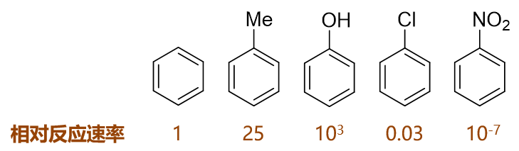
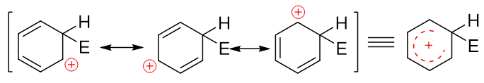
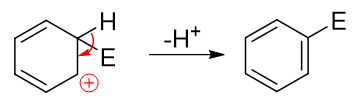
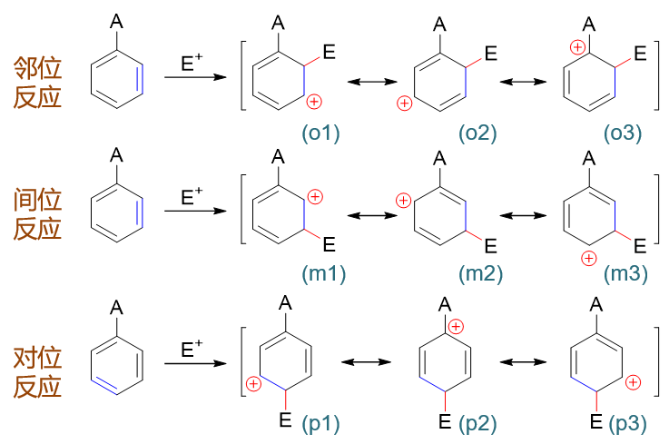
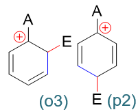
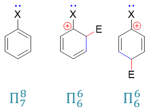
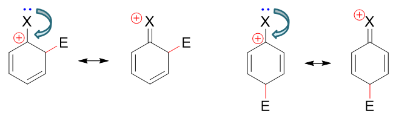

苯环上已有基团对后继亲电取代的影响
====================================================

我们知道，苯环（包括其它芳环）上若事先已经连接了基团，则这个基团会对后继的亲电取代反应造成明显的影响。
这影响大致分两个方面：

  * 活性：对后继亲电取代反应速率的影响，较无此基团时更快（致活）还是更慢（致钝）；

  * 定位：对后继亲电取代位置的影响，主要发生在此基团的邻对位（邻对位定位基）还是间位（间位定位基）。

这两方面的影响具有强烈的关联性，因此在很多教材，包括我们的教学视频中经常混在一起介绍。但事实上这两方面的影响也存在一些不同，
分而治之也许更容易令大家理解。

从反应机理的角度，我们实际可以通过如下原则判断特定基团这两方面的效应：

  * 活性：\ **（反应前）**\ 基团使得苯环上电子云密度发生了怎样的变化，升高抑或降低？

  * 定位：\ **（反应中）**\ 基团对邻、间、对位取代后各自生成的正离子中间体稳定性如何？

注意，这里决定活性与定位这两种效应的时机不同，前者主要看反应前的底物分子，后者主要与反应中生成的正离子中间体有关。

以下我们对这两种效应分别进行讨论。

对活性的影响
-----------------

已有基团对后继亲电反应活性的影响其实很简单。注意到我们接下来要发生的是亲电取代，进攻试剂缺电子，奔着芳环上较高密度的电子云过来，
因此我们也很容易想象，若既有基团推电子，能使芳环电子云密度进一步升高，则后继反应速率上升，该基团致活；反之若既有基团吸电子，使得
芳环电子云密度下降，则将增大后继反应的困难，该基团致钝。归根结底，还是看基团的电性效应。

而经过之前的学习，我们知道一个基团的电性效应又分为诱导、共轭两个方面。基团连接在芳环旁侧时，通常总会有诱导效应。某些基团首原子
又有垂直于芳环的p轨道，也能与芳环形成共轭，则同样会具有共轭效应。考查给/吸电子能力时，我们经常需要综合考虑I/C这两方面的影响。

口说无凭，我们来看一组实例。

如下图，苯及其一系列单取代衍生物进行硝化反应，相同条件下若以苯的反应速率为基准，则甲苯、苯酚速率均较苯高而氯苯、硝基苯均较苯为低：

这些单取代苯反应活性上呈现出明显的区别，毫无疑问，与取代基团的电性效应直接相关，以下具体分析。

甲苯
  作为烷基，甲基明显具有给电子诱导效应+I。而甲基碳sp\ :sup:`3`\ 杂化，与苯环间并无共轭，因而不存在共轭效应。总体电性效应上，
  甲苯中的甲基是个不太强的给电子基团（\ **单纯通过诱导效应给/吸电子，通常强度都不会特别大**\ ），因而其反应速率稍高于苯。

苯酚
  羟基与苯环直接相连。诱导效应上，O的电负性较高，明显吸电子（-I）。但同时需要留神，羟基O原子这里会采取sp\ :sup:`2`\ 杂化，
  与苯环之间存在共轭，因此我们还需要考虑共轭效应。

  .. note::

    有机分子中，若经典结构式上原子直接连接单根双键（如C=O中的O），则该原子一般总会采取sp\ :sup:`2`\ 杂化。

    此外，经典结构式中只连接单键的杂原子，很多情况下杂化形态也会是sp\ :sup:`2`\ 。
    由于共轭形成电子离域体系后能够使整个分子能量下降，因此当此类杂原子与双键、芳环碳相邻时（如此例中的羟基O），
    一般也会采取sp\ :sup:`2`\ 杂化状态， 使自己的p轨道能够参与到共轭中去。

  对于O而言，外层6电子，采取sp\ :sup:`2`\ 杂化后这六个电子的排布如下图所示，sp\ :sup:`2`\ 杂化轨道中有两根轨道存在未成对电子，
  这两根刚好分别于氢及苯环上的碳原子形成两根σ键（也就是结构式中的O-C、O-H单键）。除此之外，还有两对孤对电子，其中sp\ :sup:`2`\ 杂化轨道
  上的那对与O-C、O-H键共面，也就是与苯环共面，无法与苯环碳的p轨道侧面交叠。但未参与杂化的另有一对电子的p轨道，恰好垂直于sp\ :sup:`2`\
  及苯环的平面，刚好与苯环碳的p轨道平行，能够侧面交叠参与到共轭中去。因此这儿氧原子两对孤对电子里只有一对能参与到共轭里去，
  如下图所示。

  .. image:: ../../images/C06-KeyPoints/SubstitutionEffects02.png

  .. note::

    通常单个原子无法使自己的两根轨道同时处于平行状态，因而最多只能提供一根轨道参与共轭，共轭的电子数目不会超过两个。

  氧提供了两个共轭的π电子，而苯环上六个碳，我们很熟悉，每人一个π电子，凑到一块儿这七个原子总共会有八个电子形成共轭体系，也即
  形成了Π\ :sub:`7`\ :sup:`8`\ 。粗略里看，每个原子差不多分到8/7个π电子。而氧参与共轭之前，如果光是苯环，明显是
  Π\ :sub:`6`\ :sup:`6`\ ，每个碳平均只有一个π电子。两相比较，在O参与共轭后，苯环的碳原子上电子云密度明显上升了，
  相当于O通过共轭作用，把自己的两个π电子推向了苯环。这其实也就是我们之前就已经了解的给电子共轭效应（+C）。

  当前羟基氧的诱导、共轭效应刚好是相反的，一个吸电子一个给电子。\ **在绝大多数场合下，共轭效应都是要强于诱导效应的**\ ，
  而且往往是远强于（当然也有例外，我们马上就能看到）。因此两相叠加，整体上羟基连接在苯环旁侧时是个很强的给电子基团，
  会使得苯环上亲电取代反应活性大大升高，不单强过单纯的苯环，甚至较甲苯的反应速率也高得多。

  .. note::

    电中性杂原子参与共轭时提供的p电子数目一般可依据如下原则计算：

      * 若其直接连接双键（如羰基C=O中的氧原子），此时形成的一般是π-π共轭，则一般提供一个π电子；

      * 若与其直接相连的仅有单键（如上例中的羟基氧），此时形成的一般是p-π共轭，则一般提供两个π电子。

氯苯
  氯连接在苯环旁侧的效应与刚才的苯酚相仿。诱导明显还是吸电子，而共轭依然是给电子。Cl外层7个电子，采取sp\ :sup:`2`\ 杂化
  后的电子排布如下图所示，其中sp\ :sup:`2`\ 杂化轨道上的未成对电子用来与苯环碳间形成单键，而也仅有未参与杂化的p轨道可以
  加入共轭，提供一对电子，同样形成Π\ :sub:`7`\ :sup:`8`\ 共轭体系。

  .. image:: ../../images/C06-KeyPoints/SubstitutionEffects03.png

  但与之前的氧相比，卤素原子电负性通常更强，当其与电中性的碳共轭体系（如这里的苯环）相连时，往往诱导效应要强于共轭效应。
  两相叠加，卤素原子这里总体上会体现出弱吸电子的特征。氯苯的亲电反应活性也就因之略低于苯。

  .. note::

    对绝大多数与碳原子相连的杂原子而言，如果存在共轭，则共轭效应强度会高于诱导效应。但与电中性碳相连的卤素是个例外。
    至于为什么要强调电中性碳，后面对定位效应的讨论中大家会进一步理解。

硝基苯
  诱导效应依然容易分析，N、O电负性较高，明显-I。

  同时，硝基中的N、O原子实际也都采取sp\ :sup:`2`\ 杂化，也能参与共轭。此处硝基与苯环共轭的情况较为复杂，我们只做
  简明的讨论。硝基苯中硝基的结构基本如下图所示，它的经典结构式较为特殊，右侧一根N-O键上一对电子由N提供，而非正常共价键
  一人出一个电子的模式。因此这里氧相当于多接受一个电子，带负电荷，而氮多提供一个电子，带正电荷。

  .. image:: ../../images/C06-KeyPoints/SubstitutionEffects04.png

  既然是这么一个电子状态，明显硝基中N原子极度缺电子，具有强烈的从别处拉来电子的趋势，尤其与苯环共轭之后。我们知道共轭体系
  π电子不是定域而是可以离域自由流动的，流动性非常高，当前N又特别能拉，电子云无疑会从苯环向氮原子处移动。也就是说，通过共轭，
  氮上电子云密度上升而苯环电子云密度下降了，因此这儿硝基将具有相当强的共轭吸电子效应-C。

  诱导、共轭均吸电子，整体上硝基也是个极强的吸电子基团——在常见电中性基团中基本是最强的一个。这一组分子里，硝基苯自然反应活性最低。

这组分子的电性效应、反应活性情况，归纳起来大致如下表所示。

===========   =================== ==========  ============  ====================  ===========================
分子            取代基              诱导效应      共轭效应      总电性效应              硝化反应相对速率
===========   =================== ==========  ============  ====================  ===========================
苯               \-                  \-            \-            \-                     1
甲苯             -Me                 +I            \-          弱给电子                  25
苯酚             -OH                 -I             +C        +C > -I，强给电子          10\ :sup:`3`
氯苯             -Cl                 -I             +C        -I > +C，弱吸电子          0.03
硝基苯           -NO\ :sub:`2`       -I             -C         强吸电子                  10\ :sup:`-7`
===========   =================== ==========  ============  ====================  ===========================

除了这四种基团外，其它常见的芳环旁侧给/吸电子基团情况可见参底下这张大表，从上向下，总体上给电子能力渐弱吸电子能力渐强：

========================== ==========  ============  ========================  ===========================
   取代基                   诱导效应      共轭效应        总电性效应                   活性影响
========================== ==========  ============  ========================  ===========================
-NH\ :sub:`2`\ 、-OH          -I             +C        +C >> -I，强给电子          强致活
-OR、-NHCOR                   -I             +C        +C > -I，中强给电子         中等致活
-R                            +I             \-        +I，弱给电子               弱致活
-Ar、-CH=CHR                 \-              ~0        基本可忽略                 弱致活
-X                            -I             +C        -I > +C，弱吸电子          弱致钝
-CH\ :sub:`2`\ X              -I             \-        -I，弱吸电子               弱致钝
-CN、-SO\ :sub:`3`\H          -I             -C        -I/-C，中强吸电子           中等致钝
-CONH\ :sub:`2`\ 、-COOR      -I             -C        -I/-C，中强吸电子           中等致钝
-CHO、-COOH                   -I             -C        -I/-C，强吸电子             强致钝
-CF\ :sub:`3`\               -I             \-         三个F叠加，极强吸电子         极强致钝
-NO\ :sub:`2`\               -I             -C         -I/-C，极强吸电子            极强致钝
-N\ :sup:`+`\ H\ :sub:`3`    -I             \-         带正电基团，超强吸电子         超强致钝
========================== ==========  ============  ========================  ===========================

.. note::

  这里比较有趣的是表中第四行-Ar、-CH=CHR这样的基团，主体都是碳原子，也都采取sp\ :sup:`2`\ 杂化，诱导效应基本可以忽略。
  与芳环共轭时，每个碳也都是出一个p电子，通常也不会使得芳环电子云密度上升（表中用~0标记）。既然其基本不影响芳环上的电子云密度，
  为何还是弱致活的基团呢？主要原因是它们可以扩大反应中间体的共轭体系，使得中间体稳定性上升进而使反应活化能下降。具体可参见下面
  定位效应中对反应中间体的讨论。

.. note::

  关于芳环旁侧基团共轭给/吸电子的判断，一般来说有如下规律：

  * 基团中原子提供2个电子参与共轭（典型如-NH\ :sub:`2`\ 、-OH、-OR），提供的π电子数高于原本芳环的平均值（每原子1个），通常+C；

  * 含杂原子的基团中每原子平均提供1个电子参与共轭（典型如羰基-C=O，碳氧间π键一对电子与芳环共轭，碳氧两个原子平均一人一个），由于
    杂原子电负性的关系，共轭体系离域电子容易向杂原子一侧集中，通常-C；

  * 不含杂原子的基团中每原子平均提供1个电子参与共轭（典型如烯基-C=C），通常既无+C也无-C；

  * 基团中原子提供0个电子参与共轭（既仅有空的p轨道，硝基接近于此情形，但不完全一样），低于原本芳环的平均值，通常强烈的-C。

对定位的影响
--------------------

既有基团对苯环上后继亲电取代反应的位置也有影响，一部分基团会使后继反应主要发生在自己邻对位，即所谓的邻对位定位基；而另一部分基团相反，
使后继反应主要发生在自己的间位，我们称为间位定位基。

在课程的学习中，我们也知道，给电子的致活基团都是邻对位定位基，而吸电子的致钝基团大多数都是间位定位基，活性与定位之间似乎存在着
明显的关联性。之所以如此，还是与反应机理有关。

我们知道苯环上发生的亲电取代反应实际分两步走，首先发生的是类似于烯烃的亲电加成，缺电子试剂对苯环中某个碳原子进攻，导致经典结构式中
一根双键打开，形成碳正离子：

.. image:: ../../images/C06-KeyPoints/SubstitutionEffects05.png

注意到当前的这种碳正离子明显可以和旁侧两根双键形成共轭体系，我们还是可以写出一系列共振极限式表达其结构，其实际结构如右侧所示，是个五中心共轭的正离子：

.. note::

  经过了前一章的学习后，共振论大家应当不陌生了。如果还是不太清楚共振式的写法，请参阅前一章的
  :doc:`重难点小结：共振论(1)<../C05/KeyPoints03-ResonanceTheory1>`\ 。

而后第二步相当于发生消除，脱除该碳原子上的H，C-H间一对电子转移到C-C之间，仿佛是恢复了经典结构式中的双键：

这两步的串联反应，第二步从正离子变成电中性的分子，而且恢复了苯环这么个具有芳香性的结构，明显较易发生，活化能低。反之第一步
需要破坏芳香性结构，生成正离子，活化能较高，是整个反应的速控步。亲电取代反应的各种特征也就主要与第一步反应，尤其是第一步
生成的正离子中间体有着极为密切的关联。

以上是孤立苯环的反应情况。若事先环上已连接有一基团A，进攻试剂进攻A的邻、对、间位（即相当于与下图中经典结构式蓝色标记处的双键发生亲电加成），
第一步形成的正离子中间体及其共振式情况如下图所示：

在这一系列共计三组九个共振极限式中，请大家特别注意邻位取代的\ *(o3)*\ 与对位取代的\ *(p2)*\ ：

这俩共振极限式结构上有个明显的特征：正电中心与环上的原有基团A紧挨在一起，受A的影响特别大。而间位取代的三个共振极限式中均不会出现类似的情况。

接下来我们引入电性效应。如果原有基团A具有给电子效应，则当其与正电中心相邻时，把电子向正电中心推，无疑会使\ *(o3)*\ 与\ *(p2)*\
的稳定性上升。而我们也知道，分子、离子实际结构相当于多个共振式的平均化，现在\ *(o3)*\ 与\ *(p2)*\ 的能量下降了，无疑会使邻、对位
取代生成的中间体实际结构能量也因之降低。反过来间位取代中间体的正电中心总是距离给电子基A较远，享受不到这个待遇，实际结构能量上要比邻对位的来得高些。
换而言之，反应过程中邻对位的中间体更容易形成，反应也就大量生成邻对位取代产品。所以我们看到，\ **只要是给电子基团，无一例外，
都是邻对位定位基**\ 。

反过来如果A具有吸电子效应，则情况恰好相反，\ *(o3)*\ 与\ *(p2)*\ 的稳定性将下降，导致邻对位取代中间体的能量上升。而间位取代中间体
由于正电中心与吸电子基相对较远，反而会更为稳定，反应也更容易延着间位取代的途径进行。于是我们看到，\ **绝大部分吸电子基都是间位定位基**\ 。

当然这里也有个例外：卤素原子。之前讨论活性的影响时，我们已经了解它的-I>+C，整体吸电子。但在定位上，偏偏它又是邻对位定位基。这看起来似乎
有些矛盾，但其实我们也不难理解。这里不妨将卤苯分子以及亲电取代反应第一步形成的共振极限式\ *(o3)*\ 、\ *(p2)*\ 列在一起比较：

之前的卤苯，形成的是电中性的Π\ :sub:`7`\ :sup:`8`\ 共轭体系，粗略里看共轭后平均每个原子分到8/7个π电子（当然实际电子云分布不会这么平均，
只是粗略看）。而共轭之前，卤素p轨道上是两个电子，也就是说它在这里相当于给出了(2 - 8/7) = 6/7个电子。

而亲电取代形成的正离子中间体\ *(o3)*\ 与\ *(p2)*\ ，我们不难计算出它们各自都是Π\ :sub:`6`\ :sup:`6`\ 共轭体系，平均每个原子
1个π电子。卤素在这儿相当于给出了(2 - 1) = 1个电子。通过+C效应，明显这里比电中性的卤苯分子里给出的电子更多。尤其当前两个共振式
卤素都是与正电中心直接相连，电子更是容易向正电中心流动。

原本电中性卤苯分子里-I也就是略大于+C，卤素与电中性碳相连时仅仅是一个弱吸电子基团。现在在与碳正相连时，卤素通过共轭效应给出了更多的电子，情况自然
也就发生了翻转，这里相当于+C反过来大于-I了。\ **与正电中心相连时，卤素原子反倒会转变成一个给电子的基团**\ ，能够帮助正离子提高稳定性。

此外我们课本上引入了第四个共振极限式解释这个现象。如下图所示，在\ *(o3)*\ 与\ *(p2)*\ 的基础上，我们可以人为地令卤素上一对孤对电子转移到
C-X之间形成π键。由于这根π键两个电子都来自于卤素，比起正常共价键相当于碳原子多接受一个电子，于是碳上的正电荷消失，而卤素相当于多给出一个电子
带有正电荷。得到的新的卤素带正电荷的共振极限式里所有的C、X原子均满足八隅体结构，因而稳定性相对较强。

这种共振论的解释与之前我们通过电性效应的理解基本是一体两面，同一个现象的不同解释手段。尤其稳定性较强的共振极限式，卤素带正电荷，其实也是在暗示
与碳正中心相连时，卤素的共轭效应会给出更多的电子。

从卤苯的例子，我们也应该更能理解本文一开始提出的观点：\ **致活致钝看反应前的分子体系，而定位效应则关注反应中的形成的正离子中间体**\ 。

.. note::

  卤素原子给/吸电子效应的变化其它一些反应中也同样能够体现出来。比如烯烃的亲电加成，下图中两个结构类似的烯烃，右侧2-氯-2-丁烯电中性双键碳上连接了氯原子，
  而此时Cl整体体现出吸电子效应，导致双键电子云密度下降，其亲电加成活性也就低于左侧的烯烃：

  .. image:: ../../images/C06-KeyPoints/SubstitutionEffects12.png

  但2-氯-2-丁烯发生反应时，碳正离子却更容易在2-位氯原子旁侧形成，原因我们也已经了解了，与正电中心相连时，卤素将转而具有推电子效应，有利于碳正离子稳定，
  最终主要产品也将是2,2-二氯丁烷：

  .. image:: ../../images/C06-KeyPoints/SubstitutionEffects13.png

最后，我们再来解释之前的-Ar、-CH=CHR这样的芳基或者烯基为什么是弱致活的基团，同时也是邻对位定位基。其实原理上与卤苯类似。
这儿我们就以最简单的乙烯基为例，同样还是把焦点放在正电中心与定位基紧挨着的\ *(o3)*\ 与\ *(p2)*\ 这样的共振极限式上，
这里把它们和反应前的电中性底物分子列在一起，计算共轭体系的π电子数目：

  .. image:: ../../images/C06-KeyPoints/SubstitutionEffects14.png

反应前的电中心分子，Π\ :sub:`8`\ :sup:`8`\ 共轭体系，平均每个原子分到一个p电子，与单纯的苯或者单纯的乙烯相比，各原子上电子云密度
基本没发生什么变化。而反应形成正离子中间体后，我们注意到形成的是Π\ :sub:`7`\ :sup:`6`\体系，粗略里看平均每人6/7个，乙烯基的两个碳原子，
这里相当于都给出了(1 - 6/7) = 1/7个电子。也就是说，类似于之前的卤素，当与正电中心相连时，乙烯基通过共轭相当于给出了电子。于是
这两个正电中心与乙烯基直接相连的共振极限式能量也因之显著下降，反应过程中更易形成。烯基或芳基，定位效应上也就是邻对位定位基。

此外，这里若没有乙烯基，单纯就是苯环，亲电取代时形成的是Π\ :sub:`5`\ :sup:`4`\共轭体系。我们知道一般共轭体系越大能量上也越低，这里同样
也是如此。乙烯基苯亲电取代时的Π\ :sub:`7`\ :sup:`6`\中间体能量要更低些，相应地，乙烯基苯这一步反应的活化能也较单纯的苯来得低，速率更快。
因此烯基或芳基，虽说反应前基本不改变芳环上的电子云密度，但依然具有弱活化作用。

