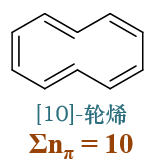
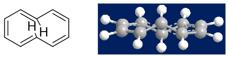
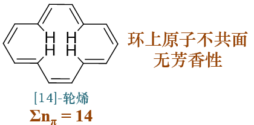
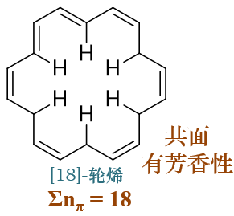
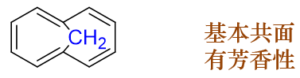

Hückle规则
==========================

芳烃一章中，我们接触到了所谓的“\ **芳香性**\ ”——某些具有特定结构的高度不饱和环状化合物特殊的稳定性。
它大致有四方面特征：

  * 环结构上存在共轭的不饱和键（一般是双键）

  * 但却不易发生类似烯烃的加成与氧化反应

  * 相反更易进行亲电取代

  * 此外相对于开链共轭结构热力学稳定性更强

芳香化合物中总是有环，最常见的就是苯环，除此之外多个苯环可以稠合形成萘、蒽、菲这样的稠环芳烃。
当然我们也知道，某些环状化合物与苯无关，甚至模样长得奇形怪状，但偏偏也具有（一定的）芳香性——这类分子我们称为“非苯芳烃”。

在目前的学习阶段，我们无需过多关注非苯芳烃反应性质，但必须掌握判断非苯芳烃的方法，也即大名鼎鼎的“\ **Hückle规则**\ ”。
这是判断共轭环系有无芳香性的一个\ **经验规则**\ ，言下之意不是特别精密特别完备，但已经能够满足一般情况下的使用需求。
规则基本有三条，满足如下三个条件的环系即具有芳香性：

  1. 成环原子共平面

  2. 形成共轭回路

  3. 环上π电子总数4n+2

条件1看着最简单，但很多情况下我们在纸面上其实不好判断。一般可以从条件2、3入手，满足2、3，一般来说1也是成立的。

条件2形成共轭回路，意味着环上原子所有通常均需sp\ :sup:`2`\ 杂化（偶有sp杂化，但极少见），有垂直于环可参与共轭的p轨道。从分子的纸面结构上，
我们一般能够比较轻松地判断出此条件是否满足。

条件3最为显眼，要求共轭体系中离域电子总数满足4n+2（n为非负整数）。这需要我们能够计算出环上单个原子参与共轭p轨道上电子的数目，
最后进行加和。应用Hückle规则最大的难点可能也就在这里。

参与共轭单个原子p轨道电子数目的计算
------------------------------------

好在在基础有机化学的学习中，我们接触到的分子通常都还比较简单，参与共轭的电子数目也不难计算。前面讨论取代基对芳环上亲电取代反应
活性、定位影响时，我们已经涉及到了共轭体系电子数目的计算。这里再归纳、复习一下。

  * sp\ :sup:`2`\ 杂化碳原子，n\ :sub:`π` = 1

      其外层电子在轨道中的分布情况如下图所示，p轨道上未成对的单个电子参与共轭。譬如像苯，环上六个碳原子均为sp\ :sup:`2`\ 杂化,
      共轭体系π电子总数6个。

      .. image:: ../../images/C06-KeyPoints/Huckle01.png

  * sp\ :sup:`2`\ 杂化杂原子（O、S、N等），分两种情况

    - 若经典结构式中杂原子直接连接双键，则n\ :sub:`π` = 1

        如下图中吡啶分子中环上的氮原子，其外层五个电子在轨道中分布如下，p轨道上也是一个电子。连同环上另外五个sp\ :sup:`2`\ 杂化
        碳原子，整个共轭体系π电子总数6个，具备芳香性。

        .. image:: ../../images/C06-KeyPoints/Huckle02.png

    - 经典结构式中杂原子旁侧仅有单键，则n\ :sub:`π` = 2

        如下图中吡咯分子中环上的氮原子，其外层五个电子在轨道中分布如下，p轨道上会排布一对电子。连同环上另外四个sp\ :sup:`2`\ 杂化
        碳原子，整个共轭体系π电子总数也是6个，同样具备芳香性。其它如下右的噻吩，情况也是类似。

        .. image:: ../../images/C06-KeyPoints/Huckle03.png

  * 若原子上带有电荷，则π电子数目较中性原子相应增减，但单个原子π电子数目总在0-2范围之内

      这也很容易理解。如我们熟悉的碳正离子，sp\ :sup:`2`\ 杂化，可以参与共轭。相对于电中性的碳原子，碳正少了一个电子，
      丢失的这个电子其实就是来自于参与共轭的p轨道，因而碳正在参与共轭时提供0个电子。

      类似的像碳负离子，多了一个电子，这个电子无处可排，也只能挤在p轨道里与原先的一个电子配对，于是共轭使可以提供2个电子。

      此外，通常单个原子只能提供一根轨道参与环上的共轭，其π电子数目不会超过2，也当然不会小于0。

      比如下图中左侧的环丙烯碳正离子，三个碳原子明显都是sp\ :sup:`2`\ 杂化可以形成共轭回路，三个碳也肯定共面，
      计算π电子总数，两个双键碳每人一个电子，碳正中心0个，加一块儿2，刚好是4n+2中n=0的情形。因此别看这个
      分子又是张力大又是带电荷，偏偏它还具有一定的芳香性。此外由于共轭的缘故，正电荷其实也不是集中在最上方
      的碳原子上，而是被整个环系均分，因此书写结构的时候，我们经常画成下图中右侧的样式，中间一个圈儿。这个
      圈儿是芳香性的体现，也暗示了环上所有原子的等性。

      .. image:: ../../images/C06-KeyPoints/Huckle04.png

      再如下图中的环戊二烯负离子，环上各碳原子也都是sp\ :sup:`2`\ 杂化可以形成共轭回路。四个电中性碳每人出一个π电子，
      碳负出两个，凑在一块儿六个，于是它也具有芳香性，加上整个分子特别匀称，负电荷被整个环均分，书写结构的时候它也享受了画圈儿的待遇：

      .. image:: ../../images/C06-KeyPoints/Huckle05.png

掌握了这三条规律，计算共轭环系中的π电子总数一般也不是难事，再结合Hückle规则中的另两个条件，我们就可以对环系芳香性的有无下结论了。

单环体系的判断
---------------------

例1：如下四个环状分子或离子，请判断其芳香性的有无。
  .. image:: ../../images/C06-KeyPoints/Huckle06.png

  正如我们之前所提到的，Hückle规则中的共面条件从纸面上一般不太容易判断，因此我们姑且先放到一边，先判断是否可能有共轭回路
  及π电子数目是否为4n+2。若满足后两个条件，则共面条件通常也会满足。

  首先，该系列分子、离子环上均为碳原子，且原子均为sp\ :sup:`2`\ 杂化，因此都具有形成共轭回路的可能性（注意是可能性，而非一定形成共轭回路）。

  其次计算共轭的π电子总数（如果共轭回路的话）。第一个分子环丁二烯，四个sp\ :sup:`2`\ 杂化碳原子每人一个π电子，总数是4，
  明显是4n，不满足规则，因此不具有芳香性。类似的，第二个分子环辛四烯，π电子总数是8，也不具备芳香性。

  但后两个离子情况发生了变化。环丁二烯二价正离子，带两个正电荷，相当于有两个碳原子各缺一个电子形成碳正离子，只提供空p轨道，我们再计算
  π电子总数就变成了2，刚好是n=0的情形。因此相对于环丁二烯，这个二价正离子的芳香性反倒增强了。

  最后的环辛四烯二价负离子也是类似的情况，相当于两个碳原子转变成碳负离子，各提供2个π电子，最终共轭电子总数变为10，满足规则，
  也就具有了一定的芳香性。

  这四个分子、离子的情况总结如下表：

  .. image:: ../../images/C06-KeyPoints/Huckle07.png

  .. note::

    由于不具有芳香性，事实上环丁二烯与环辛四烯环上原子并不共面，也无法形成共轭回路。而它们的二价正、负离子反而空间上反而会转变为平面结构。

例2：如下三个杂环分子，请判断其芳香性的有无。
  .. image:: ../../images/C06-KeyPoints/Huckle08.png

  除碳原子外，这三个环上都有杂原子参与共轭。计算π电子数时需考虑杂原子周边的成键情况。

  嘧啶中两个氮原子均与双键直接相连，各提供一个π电子，连同剩余四个sp\ :sup:`2`\ 杂化碳，环上π电子总数为6，具有芳香性。

  呋喃中氧原子旁侧只有单键，共轭时提供两个π电子，连同剩余四个sp\ :sup:`2`\ 杂化碳，环上π电子总数也为6，具有芳香性。

  吡喃中氧也是提供两个π电子，再加上四个双键碳，似乎π电子总数亦为六个。但注意环右下角存在一个sp\ :sup:`3`\ 杂化碳，
  该原子无法参与共轭，换而言之这个分子的共轭体系没有形成回路，是链状的。无疑这不满足Hückle规则的条件2，因此整个分子不具备芳香性。

  .. image:: ../../images/C06-KeyPoints/Huckle09.png

单环体系的特例：轮烯
------------------------

所谓轮烯，指的是如下类型的分子：

  * 单环

  * 具有偶数碳原子

  * 经典结构式环上单双键间隔分布

像我们前面例子里的环丁二烯、环辛四烯，乃至于苯，都可以归于轮烯之列。

轮烯中所有碳原子经典结构式上均与双键直接相连，因此均为sp\ :sup:`2`\ 杂化，具备形成共轭回路的可能性。但值得特别注意的是，
并非所有的满足4n+2条件的轮烯都具有芳香性。

典型的如下图中环上十个碳原子的[10]轮烯，看起来就像是萘环少了中间的稠合边。

该分子若形成共轭则π电子总数为10，满足4n+2。但注意到分子中间两个碳原子之间距离很近，且各自连接了一个氢原子（如下图左所示），
如果整个环处于同一平面的话，这俩氢原子将紧紧地挤在一起，斥力过大。因此该分子实际空间结构从侧面看大致如下图右，环会出现扭曲，
保证两个氢原子能够错开。既然环上原子并不共面，整个分子自然也就不具有芳香性。

类似的下图中的[14]轮烯，同样由于指向环内部的四个氢原子斥力的缘故，导致环非共面，也不具有芳香性。

但更大的[18]轮烯情况又有所不同，如下图所示，环足够大，明显指向环内部的氢之间距离足够远，斥力也不大。因此整个环可以保持
共面的状态，加之18个π电子满足4n+2，因此该分子将具有芳香性。

在轮烯结构的基础上，有时我们还能见到一类变形分子。如在[10]轮烯基础上衍生出的下图中的结构，中间两个碳上不再连接有氢，
而是连接同一个亚甲基：

之前[10]轮烯，中间这俩碳原子之间那点儿空间需要塞进去\ *两个*\ 独立的氢原子，斥力极大。而当前这个分子，俩碳原子之间只需塞进去
另外\ *一个*\ 原子了（亚甲基中的碳，注意亚甲基中的氢原子与环并不共面，并不存在多少斥力），位阻情况明显好上很多。因此这个变形的分子
环上十个碳原子反而基本能处于同一平面上，也就具备一定的芳香性了。

稠环体系的判断
--------------------

含有稠环体系的分子，结构中会存在多个环系（各自的小环、外圈的大环等）。严格意义上说，芳香性是针对某个特定环的，但很多情况下（尤其是习题、考试中）
经常会要求大家笼统地判断整个分子有无芳香性。如遇到这类问题，大致可采取如下做法：

  * 先判定最外圈大环有无芳香性

  * 若大环无芳香性，再针对各小环判定

  * 各环中只要有一个芳香环，则可认为是具有芳香性的分子

例3：请判断如下三个分子有无芳香性。
  .. image:: ../../images/C06-KeyPoints/Huckle15.png

  这三个分子都是两个小环共用一条边形成的稠环体系。依据前述的原则，先大环再小环我们挨个儿判断。

  第一个分子薁，大环上所有十个原子均为sp\ :sup:`2`\ 杂化，可以形成共轭回路。每个原子一个π电子，共轭体系电子总数为10，刚好均有芳香性。

  第二个分子吲哚，外圈大环八碳一氮，均为sp\ :sup:`2`\ 杂化，可以形成共轭回路。结构式中氮原子旁侧均为单键，提供两个π电子，共轭体系电子总数为10，也具有芳香性。

  第三个分子，外圈大环九个原子，注意到其中右下角碳原子明显是sp\ :sup:`3`\ 杂化，这导致大环中无法形成共轭回路。单就最外圈大环而言，
  它并没有芳香性。

  大环没芳香性也不碍事儿，我们再考查分子中的小环。注意到左侧六元环明显是苯环，不用说了，这个分子肯定也具有芳香性。

  .. image:: ../../images/C06-KeyPoints/Huckle16.png

环外双键的处理
---------------------

在判定芳香性时还有最麻烦的一种情况：在环外还有其它原子通过重键（一般是双键）连接环上原子，此时原则上说这个环外原子也可以参与共轭体系。
撞上这类分子在应用Hückle规则的时候我们需要做一个特殊的处理：人为令环外双键中π键一对电子转移到某一个成键原子上，写出双键变单键电荷分离的共振式，
而后在此无环外双键的共振式结构基础上进行判断。

例4：请判断环丙烯酮分子有无芳香性。
  .. image:: ../../images/C06-KeyPoints/Huckle17.png

  上图中分子，三元环最上方的碳原子通过一根环外双键连接了氧原子，欲判断该三元环有无芳香性，我们需对此双键进行前述的处理，
  写出电荷分离的共振式。注意到这里氧原子电负性远较碳高，因此为了追求稳定，我们令双键里π键一对电子转移到氧上，
  如下图所示，此时双键变单键氧带负电荷而碳原子带正电荷。

  .. image:: ../../images/C06-KeyPoints/Huckle18.png

  写出上图中右侧的共振极限式后，我们注意到这个极限式里已经不存在环外双键了。接下来环外原子一律不管，单看三元环。环上两个电中性sp\ :sup:`2`\ 杂化
  碳外加一个正电荷碳，实际类似环丙烯正离子的情况，π电子总数为2，该分子将具有一定的芳香性。

例5：请判断如下分子有无芳香性。
  .. image:: ../../images/C06-KeyPoints/Huckle19.png

  与前例类似，存在一根环外C=N双键。判断芳香性时我们也一样将其拆开，令一对电子转移到氮原子上得到右侧的共振极限式。
  右侧极限式中环上六个电中心碳外加一个碳正，刚好也是6个π电子，具有一定的芳香性。

  .. image:: ../../images/C06-KeyPoints/Huckle20.png

例6：请判断如下分子外圈大环有无芳香性。
  .. image:: ../../images/C06-KeyPoints/Huckle21.png

  该分子相对复杂，是全由碳原子构成的三环稠合的体系，现要求判断最外圈11个碳原子形成的大环（图中用蓝色标记）芳香性的有无。
  注意到当前经典结构式中红色的那根双键明显不在外圈大环上，当然也算是环外双键。判断芳香性时我们又得把这根双键拆开。

  之前的两个例子都是碳与杂原子形成的双键，由于电负性的差异，电子转移时的方向非常明确。现在这根环外双键处于碳原子之间，
  两端电负性相同，略微有些疑惑，究竟这对电子向何处转移呢？

  一时确定不了方向其实也没太大关系，我们把两种可能的情况都画画看。如果环外双键上一对电子转移至外侧（左上角碳），我们将
  得到下图中间的共振极限式。反之如果转移至内侧（中心碳），我们将得到下图右侧的共振极限式。如此一来我们得到了两个满足无环外双键条件
  的共振极限式。

  .. image:: ../../images/C06-KeyPoints/Huckle22.png

  这两个共振式我们分别判断。中间这个外侧碳上带负电荷，提供两个π电子，连同其它十个电中性碳，外圈环上总共是12个共轭电子，应当不具有芳香性。

  而右侧共振式，外侧碳上带正电荷，提供0个π电子，连同其它十个电中性碳，外圈环上总共是10个共轭电子，应当又具有芳香性。

  这下看起来有麻烦了，一个共振式有芳香性，一个又没有，彼此矛盾。那究竟有没有芳香性呢？

  答案是有。原因也很简单，我们经过之前共振论的学习，知道分子实际结构是共振极限式的平均化，而各共振极限式平均化时的权重又与其稳定性相关。
  而具有芳香性的共振极限式，明显稳定性要强于非芳香性的电荷分离式，权重自然来得更高。换句话说整个分子的实际结构其实更加接近于具有芳香性
  的极限式。因此类似这种情况，两个看起来差不多的电荷分离式，其中只要有一个满足Hückle规则，整个环系也将具备一定的芳香性。

