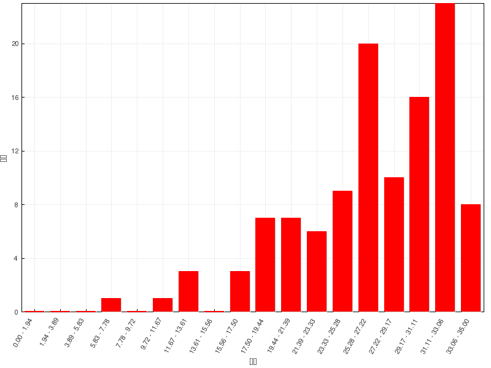

习题讲解：卤代烃
========================

在线自动评分习题
---------------------

=======   =============
总分        35
平均分      26.8(76.4%)
最高分      35(100.0%)
=======   =============

  成绩分布

题3：命名（错误率34.2%）
  .. image:: ../../images/C07-Exercises/A03_00.png

  题干中环简单而链相对复杂，因此我们可以将碳链作为母体，氯及两个环丙基作为取代基。部分同学对链采取了如下编号方式，称分子为1,5-二环丙基-3-氯戊烷：

  .. image:: ../../images/C07-Exercises/A03_01.png

  但这样明显不正确，编号1-、5-位碳原子现在相当于被母体与取代基共用，这在命名时是不允许的。因此正确编号方式如下图，主链也只有三碳：

  .. image:: ../../images/C07-Exercises/A03_02.png

  整个分子应称为：\ **1,3-二环丙基-2-氯丙烷**\ 。

题5：命名（错误率61.8%）
  .. image:: ../../images/C07-Exercises/A05_00.png

  这里命名时最好别用十氢萘的俗名，毕竟那只是个俗名，且当前有个氯，也不足十氢了。我们其实可以使用常规桥环化合物的系统命名方式，再注意到当前
  两环反式拼合，因此整个分子可称为；\ **反-1-氯二环[4.4.0]癸烷**\ 。

题9：排序（错误率44.2%）
  请将下列化合物按SN1反应活性由强至弱排序：

  .. image:: ../../images/C07-Exercises/A09_00.png

  SN1单分子亲核取代两步进行，速控步将生成碳正离子。毫无疑问，生成碳正离子的稳定性决定了SN1的反应速率。

  题中三种卤代烃分别生成的碳正离子结构如下图所示：

  .. image:: ../../images/C07-Exercises/A09_01.png

  其中(a)得到的第一个碳正离子明显碳正中心可以与双键共轭，较为稳定；而(b)生成的是普通的仲碳正离子，稳定性
  自然不及(a)；(c)生成的第三个碳正离子虽说结构内也存在一根双键，但双键与碳正中心间还存在一个饱和碳，隔断
  了共轭途径，因此就相当于是个普通的伯碳正离子，稳定性将不及(b)。于是这三种碳正离子的稳定性递降，相应的，
  原本三种卤代烃的反应活性也就是\ **(a)>(b)>(c)**\ 。

本章的在线习题中有大量的反应题涉及亲核取代、消除反应间的竞争。在目前基础有机的学习阶段，欲判断竞争的主要产物，
大部分情况下我们可以利用如下的流程图：

.. figure:: ../../images/C07-KeyPoints/Competition21.png

  判断卤代烃反应主要方向的基本流程

.. note::

  关于亲核取代、消除间四种历程竞争的更多讨论，请参见
  :doc:`重难点小结：卤代烃亲核取代与消除四种历程的竞争<./KeyPoints01-CompetitionOfSnAndE>`\ 。

题14：反应（错误率39.5%）
  .. image:: ../../images/C07-Exercises/A14_00.png

  首先看底物卤代烃的种类，这里无疑是叔卤代烃，再注意到反应条件中有甲醇钠，这是强亲核试剂，但也同时具有强碱性。
  从流程图不难看出，由于叔卤代烃消除倾向较大，此处主要发生的将是消除而非亲核取代，最终生成烯烃：

  .. image:: ../../images/C07-Exercises/A14_01.png

题16：反应（错误率36.3%）
  .. image:: ../../images/C07-Exercises/A16_00.png

  与题14类似，叔卤代烃与醇钠的反应，当然还是消除。注意卤代烃的消除反应存在区域选择性，遵循扎依采夫规则，
  主要生成连接烷基较多较为稳定的烯烃，因此这里主要是与环外异丙基上的β-H消去：

  .. image:: ../../images/C07-Exercises/A16_01.png

题25：反应（错误率37.7%）
  .. image:: ../../images/C07-Exercises/A25_00.png

  依然叔卤代烃，同时体系中又有NaCN，具有较强的亲核性但也有弱碱性。由于叔卤代烃消除倾向过大，
  因此这里即便NaCN的碱性不算特别强，主要发生的也还是消除：

  .. image:: ../../images/C07-Exercises/A25_01.png

题17：反应（错误率35.5%）
  .. image:: ../../images/C07-Exercises/A17_00.png

  底物分子仲卤代烃，条件又是NaCN。但与前一题的叔卤代烃不同，仲卤代烃的消除倾向远没有那么高，加上这里没有加热，更何况CN\ :sup:`-`\ 的
  碱性相对较弱，因此这里主要发生的将是亲核取代反应。考虑到CN\ :sup:`-`\ 的亲核能力挺强，主要发生的将是SN2，产物中原本与Br相连的手性中心构型
  将发生反转。此外，底物分子中五元环上还存在另两个与甲基相连的手性中心，但这俩手性中心不参与反应，构型也不发生变化。

  .. image:: ../../images/C07-Exercises/A17_01.png

题18：反应（错误率30.3%）
  .. image:: ../../images/C07-Exercises/A18_00.png

  底物分子仲卤代烃，条件中醇钠既可作碱也可作亲核试剂。注意到当前加热反应，因此我们基本可以确定，主要发生的
  是消除。当然，还可以再进一步判断消除机制。醇钠的碱性相当强，因此不难看出主要发生的将是E2。

  既然判断出是E2反应，我们知道双分子消除对底物分子的立体构象存在一定的要求，通常必须是β-H与离去基团反式共面
  消除。题干中底物卤代烃给出的是Fischer投影式，可能看得不是特别清楚，我们不妨将其转换为锯架式来观察构象。
  如下图所示，先将Fischer投影式转化为左侧的重叠式构象锯架式，再分别旋转前后碳原子，保证反式共面消除的要求。
  注意到当前卤素的β-位存在两个氢原子（H与D），因此上下两种构象均可以满足消除的立体化学要求。在这两种构象的基础
  上H/D与Br离去，剩余基团相对位置不变。易见当消除DBr时将生成反-2-丁烯而消除HBr生成顺-2-氘-2-丁烯。

  .. image:: ../../images/C07-Exercises/A18_01.png

  这两种产品原则上都会生成（本题也是给了两个空），但实际反-2-丁烯的生成量将更高。原因也很简单，相对于下方的构象，
  上方构象中两个体积相对较大的甲基距离较远，能量较低，更容易形成，因此消除时所占比例也将更高。

  .. image:: ../../images/C07-Exercises/A18_02.png

题13：反应（错误率26.7%）
  .. image:: ../../images/C07-Exercises/A13_00.png

  叔卤代烃的反应。但注意到这里的反应条件：没有碱，也没有负离子形式的亲核试剂，只是溶剂水。根据之前的流程图，
  我们不难判断应当是发生SN1溶剂解反应。既然SNl历程，反应涉及碳正离子，也自然不存在立体选择性，生成产品将发生
  外消旋化：

  .. image:: ../../images/C07-Exercises/A13_01.png

题19：反应（错误率29.2%）
  .. image:: ../../images/C07-Exercises/A19_00.png

  本题底物卤代烃分子比较特殊，两个卤原子，分别相当于是伯、叔卤代烃。而反应条件也较特殊，NaI明显无甚碱性，I\ :sup:`-`\
  却具有比较强的亲核活性。再加上使用了丙酮这样的非极性溶剂，我们基本可以判断，发生的将是SN2亲核取代。
  事实上NaI/丙酮这是个很典型的卤素交换反应的条件。

  既然判断出是SN2，自然伯卤代烃一端较叔卤代烃端更易反应。由此我们不难得到最终产物如下：

  .. image:: ../../images/C07-Exercises/A19_01.png

题20：反应（错误率74.6%）
  .. image:: ../../images/C07-Exercises/A20_00.png

  伯卤代烃，再加上具有亲核性的NaOH，很多同学觉得这题很简单，无非是羟基取代Cl，生成二醇。但实际情况并非这么简单。

  .. image:: ../../images/C07-Exercises/A20_01.png

  注意到底物分子内部自身就带有一个羟基，而我们也知道醇羟基是具有酸性的。虽说羟基的酸性不及水，但在碱NaOH的作用下，
  少量的羟基还是可以解离出质子，转变成烷氧基负离子。而一旦形成氧负离子，无疑就具有亲核活性，可以进攻分子内的碳卤键，
  引发分子内的亲核取代，得到环状醚。

  .. image:: ../../images/C07-Exercises/A20_02.png

  .. note::

    分子内反应比分子间反应容易得多，因此这儿即便羟基解离形成的烷氧基负离子量很少，反应也依然可以进行下去。

在线手动评分习题
---------------------

手动评分习题中有两题机理与一题合成。其中第一题机理很简单，无非是SN1亲核取代/E1消除加上伴生的碳正离子重排。
这里主要讨论剩余两题。

合成：请完成如下转化：
  .. image:: ../../images/C07-Exercises/B01_00.png

  本题目标分子最明显的结构特征是存在一个氘原子。看起来挺困难，但好在自动评分习题的第21题给了我们暗示，可以利用格氏试剂与重水的反应。
  于是不难得到如下的逆合成分析思路：

  .. image:: ../../images/C07-Exercises/B01_01.png

  接下来正向写出具体反应即可：

  .. image:: ../../images/C07-Exercises/B01_02.png

  .. note::

    活泼金属化合物与重水的反应也是实验室中制备氘代试剂的常见手段。

机理2：(1S,2S)-2-氯环己醇与NaOH反应生成环氧化合物；而(1R,2S)-2-氯环己醇在同样条件下却生成环己酮。
  首先分别画出(1S,2S)/(1R,2S)-2-氯环己醇的结构如下，环外的卤素和羟基一个相当于是反式，另一个是顺式：

  .. image:: ../../images/C07-Exercises/B03_00.png

  注意到这两个分子有点儿类似于自动评分练习中题20的底物，内部同时存在羟基与C-X键，也同样是在碱性条件下反应。因此对于反式的
  (1S,2S)-2-氯环己醇而言，它很容易发生类似的反应，羟基中质子先解离形成氧负离子，刚好从卤素原子的背面发起亲核进攻，发生分子内的SN2，
  得到环氧化合物：

  .. image:: ../../images/C07-Exercises/B03_01.png

  而顺式的(1R,2S)-2-氯环己醇则不同，固然它也有形成氧负离子的可能性，但此时氧负与卤素处于环的同侧，无法从背面进攻，因此也就
  无从发生这种分子内的取代。又由产品我们推至，它所主要发生的应当是消除，NaOH起碱的作用。消除后恰好生成烯醇，互变异构得到环己酮：

  .. image:: ../../images/C07-Exercises/B03_02.png

课本习题
-------------

课本习题中有几道相对有趣的，我们也大致讨论一下。

首先反应题中，也有大量需要判断取代/消除竞争的题目。

习题3(1)：反应
  .. image:: ../../images/C07-Exercises/C01_00.png

  伯卤代烃，AcO\ :sup:`-`\ 碱性不强，又没加热，因此不难判断主要应是SN2亲核取代：

  .. image:: ../../images/C07-Exercises/C01_01.png

习题3(2)：反应
  .. image:: ../../images/C07-Exercises/C02_00.png

  叔卤代烃，有碱EtONa，不用多想肯定是消除：

  .. image:: ../../images/C07-Exercises/C02_01.png

习题3(9)：反应
  .. image:: ../../images/C07-Exercises/C03_00.png

  伯卤代烃，无碱，自然是溶剂解反应，SN1亲核取代。注意由于涉及碳正离子，这里存在重排的可能性：

  .. image:: ../../images/C07-Exercises/C03_01.png

习题3(6)：反应
  .. image:: ../../images/C07-Exercises/C04_00.png

  仲卤代烃，CN\ :sup:`-`\ 碱性一般，亲核性较强，又未加热，主要将是SN2取代。由于是SN2，此处将发生构型翻转。

  .. image:: ../../images/C07-Exercises/C04_01.png

  .. note::

    本题纸版《学习指导》中给出的答案有误。在线练习平台的电子版答案中给予了相应的修正。

习题3(7)：反应
  .. image:: ../../images/C07-Exercises/C05_00.png

  伯卤代烃的氨解反应。首先生成伯胺nPrNH\ :sub:`2`\ 。伯胺的性质实际与无机氨类似，由于烷基给电子的缘故，N上电子云密度较无机氨更高，
  亲核活性甚至更强，因此还可以继续与卤代烃发生亲核取代，进一步生成仲胺nPr\ :sub:`2`\ NH。同理，仲胺的亲核活性更强过伯胺，
  可继续反应生成叔胺nPr\ :sub:`3`\ N。叔胺N上依然还有一对孤对电子，还能进攻C-X键，最终可生成类似于无机铵正离子的季铵盐
  nPr\ :sub:`4`\ N\ :sup:`+`\ 。此外，生成的各产物除季铵盐外，均为具有碱性的有机胺类化合物，还能与HBr结合成盐。

  .. image:: ../../images/C07-Exercises/C05_01.png

  卤代烃与氨的这类反应通常都会生成一系列混合物，合成里面价值实际不高。该反应在下学期含氮化合物一章中我们还会进一步讨论。

习题3(3)：反应
  .. image:: ../../images/C07-Exercises/C06_00.png

  类似3(7)，只不过当前分子内同时存在氨基与C-X键，因此会发生分子内亲核取代生成环状季铵盐。

  .. image:: ../../images/C07-Exercises/C06_01.png

习题4：预测反应速率
  我们需要预测一系列类似反应的速率高低。本题各反应的判定依据大致如下：

  .. image:: ../../images/C07-Exercises/C07_00.png

  .. image:: ../../images/C07-Exercises/C07_01.png

习题5：预测反应走向
  与反应题中的一些情况类似，根据底物卤代烃结构，进攻试剂碱性/亲核性强弱、有无加热等条件我们不难判断出各反应的主要走向。
  注意课本中题(4)条件中应该漏印了加热条件。

  .. image:: ../../images/C07-Exercises/C08_00.png

习题7：化学方法鉴别
  本题中分数小题，要求用化学方法鉴别一系列结构类似的卤代烃。其实答案特简单，各题均使用硝酸银即可。不同结构的卤代烃
  反应速率不同，出现AgX沉淀的时间有异。至于究竟哪个最快哪个最慢，大家通过反应机理，不难进行判断。

习题8：判定机理
  卤代烷在氢氧化钠的乙醇－水溶液中进行反应，根据现象指出哪些属于SN2机理？哪些属于SN1机理？

  （1）产物构型完全转化
    典型的SN2特征。SN1则应发生外消旋化。

  （2）有重排产物
    典型的涉及碳正离子SN1的特征。

  （3）氢氧化钠溶液浓度增加反应速度加快
    我们知道SN1动力学上是一级反应，反应速率与亲核试剂浓度无关。而SN2反之。现在既然提高亲核试剂浓度速率加快，无疑机理应是SN2。

  （4）叔卤代烷快于仲卤代烷
    无疑还是SN1的特征，卤代烃反应活性与碳正离子稳定性有关。

  （5）增加水量反应速度加快
    乙醇-水混合溶液中增加水量，相当于增大溶剂极性。而极性溶剂是利于SN1过程的，因此此处机理也应为SN1。

  （6）增加乙醇的比例反应速度加快
    与(5)相反，减小溶剂极性，机理自然是SN2。

  （7）减少碱的量反应速度不变
    改变亲核试剂浓度反应速率不变，自然是SN1。

  （8）伯卤代烷比仲卤代烷反应快
    SN2，卤代烃反应活性与烃基位阻相关。
