卤代烃亲核取代与消除四种历程的竞争
====================================================

亲核取代与消除，这是目前阶段我们学习到的卤代烃最重要的两类反应。而这两类反应又各自存在单分子、双分子两种可能的历程，
互相之间存在竞争。此外，如果我们写出SN1/SN2/E1/E2这四种历程的大致过程（如下图所示），还会发现更有意思的事儿。

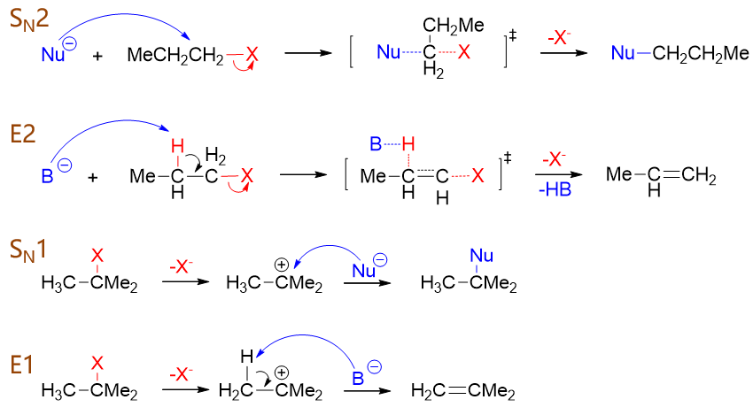

比如我们先关注SN1与E1这两对单分子历程的反应，很容易发现，这两种历程有很大的相似性。比如都是分两步完成，
第一步都是速控步。而且我们发现，这两种历程的第一步其实是一模一样的，都是卤素离去，形成相同的碳正离子。
有差别的只是第二步，主要是进攻试剂（亲核试剂或碱）进攻方向不同：进攻碳正中心，发生的就是SN1；反过来
进攻β-H，发生的就是E1。那进攻试剂究竟主要进攻哪个位点，不同条件下有不同的趋势，这两条路线间存在明显的竞争。

类似的如果我们比较SN2与E2，会发现这两者也挺相似，都是一步完成，同样也只是进攻试剂进攻方向有差异。直接进攻与
卤素相连的带部分正电荷的碳原子，发生SN2；反过来进攻β-H，发生的就是E2。这两种双分子历程，同样也存在竞争。

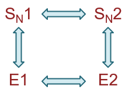

综上，亲核取代/消除的单分子/双分子历程间存在错综复杂的四对竞争路线，具体反应时究竟主要按照哪条历程进行，
与一系列因素有关，甚至很多时候会同时发生不分轩轾的数条路线的反应。这种竞争关系及相关的影响因素极其复杂，
也是我们卤代烃一章中最为困难的一个知识点。

以下我们就来简单讨论一些典型的影响反应历程的因素。

卤代烃烃基结构
-----------------

卤代烃中烃基的情况，对各反应路线均存在明显的影响。基本规律如下表所示：

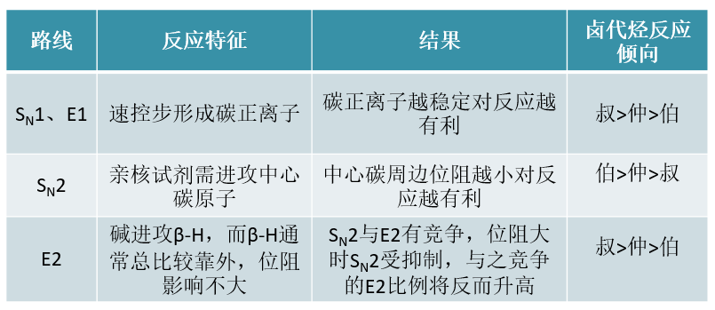

其中SN1与E1反应涉及碳正离子，不同结构卤代烃的活性与碳正离子稳定性直接相关，大家都已经非常熟悉了。
一般来说活性次序为\ **叔>仲>伯**\ 。

至于SN2，如下图所示，由于亲核试剂必须穿过三个基团才能从卤素原子背面进攻中心碳原子，因此烃基位阻
对其有决定性的影响，因此活性规律刚好相反，\ **伯>仲>叔**\ 。

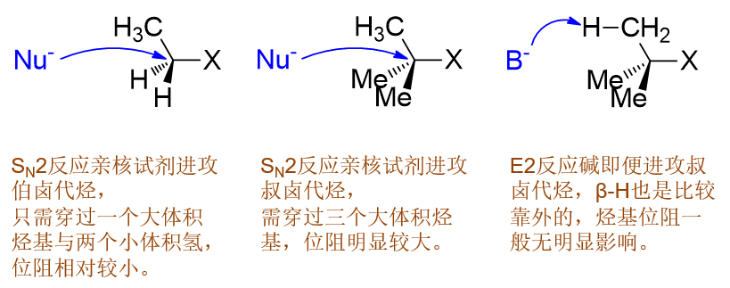

最后E2，注意到E2历程里碱进攻的不是中心碳原子，而是旁侧的β-H。而即便是叔卤代烃，这个氢原子通常也是
比较靠外的，碱进攻时不会受到太明显的烃基位阻影响，不论是哪种卤代烃，其实都差不多。

但另一方面，我们知道SN2与E2之间存在竞争。随着位阻增大，SN2越来越受到抑制，反过来它的竞争路线E2自然会像
跷跷板一样比例逐渐升高。因此从某种意义上说，不同种类卤代烃E2的反应倾向将与SN2刚好相反，\ **叔>仲>伯**\ 。

综上所述，烃基结构对四种不同反应历程的影响大致如下图所示。

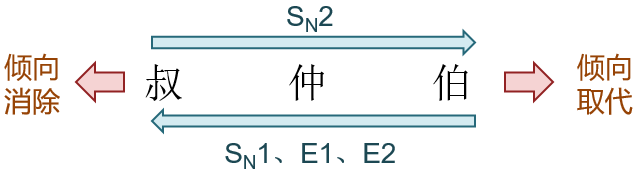

就取代与消除的整体竞争而言，叔卤代烃一般偏向于发生消除，而伯卤代烃更容易发生取代。

如下图中溴代烃在丙酮溶液中与乙酸钠的反应，不同的烃基结构将得到不同的产物比例。
这个趋势我们看得非常明显，位阻越大，越倾向于发生消除：

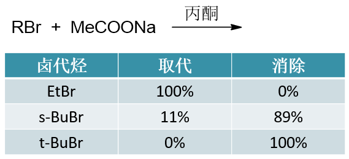

这个规律在我们自己设计反应路线时非常具有参考价值。想进行亲核取代反应，我们应当尽量使用伯卤代烃。
而反过来，叔卤代烃多半儿是与消除联系在一起的（当然，也不是说完全不可能发生取代）。

离去基团
-----------

除烃基外，卤代烃中还有另一部分：卤素原子。不论是取代还是消除，反应中C-X键最终都会断裂，卤素都会以负离子的形式
离开，也即所谓的“\ **离去基团**\ ”。离去基团对反应历程也会存在一定的影响。

.. note::

  注意，这里“离去基团”通常指的是反应断开C-X键\ **后**\ 形成的卤负离子，而非断键\ **前**\ 的卤素原子。请注意体会其中的区别。

首先，就整体而言，既然离去基团总要离去，那“好”的（较易离去的）离去基团对反应总是有利的。

此外，离去基团的离去性能对于单分子或双分子历程的竞争也存在影响。一般而言，“好”的离去基团有利于单分子历程SN1与E1，
反之“坏”的更容易导致SN2与E2。原因很显见，“好”的离去基团容易离去，C-X键容易断开，自然更容易形成碳正离子按单分子
历程进行反应。反之“坏”离去基团卤素原子就是赖着不肯走，亲核试剂或者碱只好主动进攻，容易发生的自然是双分子历程。

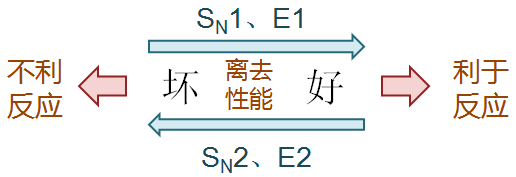

对于卤代烃而言，四种卤素离子的离去性能次序为：I\ :sup:`-` > Br\ :sup:`-` > Cl\ :sup:`-` > F\ :sup:`-`\ 。
明显这与碳卤键的键能有关。此外也容易发现，越易离去的基团，应是越弱的Lewis碱。

如果我们再把眼界放宽，亲核取代或者消除反应其实并不局限于卤代烃，醇、醚等化合物其实都可以发生同类反应。常见的离去基团离去性能
我们可以排出一张大表来：

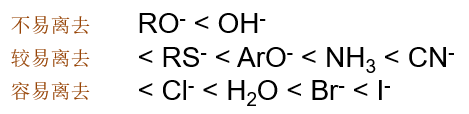

..  RO\ :sup:`-` < HO\ :sup:`-` < RS\ :sup:`-` < ArO\ :sup:`-` < NH\ :sub:`3` < CN\ :sup:`-` < Cl\ :sup:`-` < H\ :sub:`2`\ O < Br\ :sup:`-`

这么一个离去性能的次序对我们自己设计反应也很有帮助。如从醇出发，利用亲核取代反应可以制备卤代烃。但如果直接想用卤负离子取代羟基的话，
反应几乎不可能发生：

.. image:: ../../images/C07-KeyPoints/Competition09.png

原因很简单：这样直接反应的话，离去基团是HO\ :sup:`-`\ ，从上表可知这是个不易离去的基团，导致反应异常困难。

实验室中，要完成这个反应时我们通常会采取一个小伎俩：在强酸性条件下先把醇转变成[钅羊]盐正离子，而后再用卤负离子去做取代。这时离去基团就变
成了容易离去的H\ :sub:`2`\ O，反应起来自然容易很多。事实上，醇的很多反应都需要在酸性条件下进行，我们在后面醇酚醚一章中还会详细讨论。

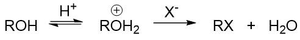

进攻试剂
------------

卤代烃外，反应中的另一个反应物：进攻试剂（亲核取代中的亲核试剂、消除反应中的碱）对反应历程自然也存在影响。

首先，进攻试剂浓度对反应过程会造成影响。对于SN1与E1，动力学上是一级反应，反应速率与进攻试剂浓度的关系不大。
而SN2与E2，我们知道动力学上是个二级反应，因此进攻试剂浓度越高，反应速率越快。因此这儿我们很容易推想，
高浓度的进攻试剂有利于发生双分子反应，反过来低浓度则对双分子历程不利，容易发生与其竞争的单分子历程。

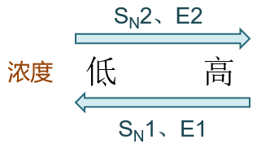

再者，进攻试剂的活性也对反应历程存在影响。亲核性强，对SN2有利，反之则利于SN1；而碱性强有利于E2，碱性弱则利于E1。
这也是很显见的，亲核性碱性强，仿佛是进攻试剂性子急，一上来就奔着卤代烃进攻过去了，自然容易发生双分子历程；反过来
亲核性碱性弱，进攻试剂是个慢性子，我就是不着急，等你卤代烃断开碳卤键生成碳正离子之后再慢慢悠悠过去，当然也就
有利于单分子历程了。

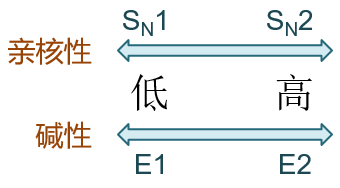

这个结论在我们实验室的实际工作中也很有价值。像卤代烃的亲核取代中我们知道有一类所谓的“溶剂解”（水解、醇解、氨解）
反应，不投加负离子类的亲核试剂，而直接让具有一定亲核活性的溶剂分子与卤代烃反应。这种电中性的水、醇、氨，亲核能力
自然要比带负电荷的OH\ :sup:`-`\ 、RO\ :sup:`-`\ 、NH\ :sub:`2`\ :sup:`-`\ 要差很多，因此此时发生的通常都是SN1
单分子历程。

此外大家也能注意到，描述进攻试剂活性的时候，我们出现了“\ **亲核性**\ ”与“\ **碱性**\ ”两个不同的名词，分别
用在亲核取代与消除两个不同的场合。这两个性质其实存在明显的关联，本质上说都是描述富电子的进攻试剂进攻缺电子中心的能力，
因此进攻试剂电子云密度越高，亲核性与碱性一般也会越强。但这两个名词之间也存在一定的区别，如下图所示，亲核性描述的
是穿过三个基团进攻中心碳原子的能力，受位阻的影响比较大；而碱性描述的进攻旁侧β-H的能力，受位阻影响较小。这个差异在很多
反应中相当重要，也导致很多碱性强的试剂亲核能力反而不一定强。

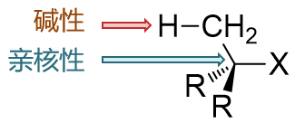

如MeO\ :sup:`-`\ 与tBuO\ :sup:`-`\ 两种负离子，
负电中心氧原子上的电子云密度明显是tBuO\ :sup:`-`\ 高，它的碱性也更强，但由于叔丁基的体积过大，较难穿过三个基团
的位阻去进攻中心碳原子，因此tBuO\ :sup:`-`\ 的亲核性反而不及MeO\ :sup:`-`\ 。

溶剂
------------

上面我们讨论了反应物对反应历程的影响。反应物之外，有机反应中通常还有一个重要的参与者：溶剂。
常见的溶剂分类如下图所示，注意极性溶剂中我们又细分为质子与非质子极性溶剂两类，这两类试剂的性质有点儿相反的意思。

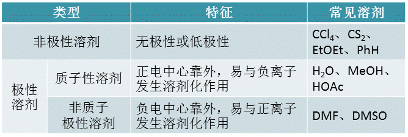

溶剂与取代或消除反应历程也有一定的关系。比如我们先从亲核取代看起。不同溶剂对两种亲核取代历程的影响大致如下表：

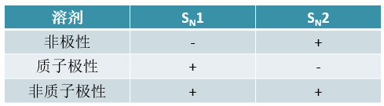

对于SN1，速控步是C-X键的断裂，由电中性分子生成了碳正与卤负两个离子，从整体看这步反应明显是个电荷分散、极性增加的过程。
因此极性溶剂对它都是比较有利的——无论是质子还是非质子极性溶剂。像质子极性溶剂这里很容易与解离出的卤负离子发生溶剂化作用，
非质子极性溶剂则容易与解离出的碳正离子发生溶剂化作用，这都能使反应生成的中间体能量下降，进而降低速控步的活化能。而反过来，
非极性溶剂相对而言自然对SN1反应不是特别有利。

而SN2历程，反应一步进行，亲核试剂（往往是负离子）进攻卤代烃，形成五元络合物过渡态，这实际是个电荷集中的过程，过渡态本身的
极性也比较低。因此与SN1相反，此时非极性溶剂将有利于反应。极性溶剂中的质子极性溶剂，将对反应尤其不利：它会与亲核试剂负离子
发生溶剂化作用，一大堆溶剂分子包裹在负离子外边妨碍负离子对中心碳原子的进攻。

但对非质子极性溶剂，情况又有所不同。它不易与负离子发生溶剂化作用，因此基本不会像质子极性溶剂那样影响到亲核试剂的进攻性。
于此同时，我们也知道亲核试剂负离子不可能凭空产生，通常都是由含活泼氢的电中性分子解离得到的：

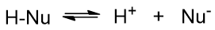

这个解离过程中，非质子极性溶剂刚好又可以与解离出的质子结合，促进解离平衡右移，实际会提高解离出的亲核试剂负离子的浓度。
进攻试剂浓度提高，无疑这对SN2反应是相当有利的。因此这儿非质子极性溶剂通常也会使SN2过程加速。

综上，我们发现非质子极性溶剂在亲核取代反应中是个挺神奇的存在，无论是SN1还是SN2，都有增加反应速度的效果。这个特性
在实验室中也有很多的应用，许多在常规溶剂中原本很慢的反应，我们换用DMSO或是DMF，经常速率都能大大加快，化腐朽为神奇。
当然，非质子极性溶剂的价格一般比较昂贵，后期分离也略微困难，因此通常情况下，我们还是尽量选用常规的非极性或质子极性溶剂
进行反应。

以上是对亲核取代反应的讨论。至于消除，情况也是类似，对于常规的溶剂，也同样是非极性有利于E2，质子极性有利于E1。

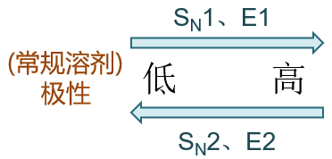

由于SN1与E1均涉及碳正离子，容易引起重排且无立体选择性，因此在实际合成中，我们更喜欢使用SN2与E2历程。单单对这两种
双分子历程的竞争而言，E2的过渡态极性通常较SN2更小，因此极性较高的溶剂有利于SN2，较低的有利于发生E2。

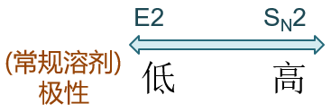

这在我们自己设计反应时也具有指导意义。如由卤代烃通过亲核取代制备醇，我们通常令其在极性较大的水中与NaOH反应。而
想从卤代烃通过消除得到烯，我们会换用极性低一些的溶剂，考虑到成本，最常见的选择是乙醇（当然醇本身也具有极性，但
不管怎么说要比水低不少）。

除了对反应历程造成直接的影响，很大程度上溶剂也会影响进攻试剂的进攻活性，尤其是在亲核取代反应中。这在我们课本中也有
专门的讨论，此处不再赘述。简而言之，由于质子极性溶剂容易与负离子结合的特性，带负电的亲核试剂受它的影响极大,
负电荷密度越高的离子越容易被溶剂分子包裹，导致其亲核活性大大下降。同族
的亲核试剂，在质子极性溶剂中亲核性次序常常是与电子云密度/碱性相反的。如四种卤素离子的碱性、不同溶剂中的亲核性次序如下：

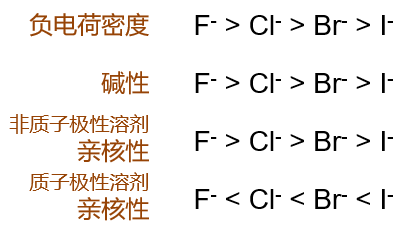

反应温度
--------------

最后，温度对反应也有一定的影响，这其中以合成中最常用的SN2与E2间的竞争最为明显。由于E2的活化能一般而言较SN2更高，
因此升高反应温度往往会导致消除产物比例的提升。反过来我们如果想进行SN2亲核取代，则一般最好在常温或低温下进行。

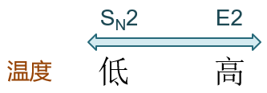

总结
----------------

以上我们讨论了一系列因素对四种反应历程的不同影响，看起来及其错综复杂，这使得很多同学学到这儿的时候感觉异常困惑，拿到一个具体反应
不知道怎么判断主要的反应方向。实际在基础有机化学的学习中我们遇到的反应相对比较简单，一般而言判断反应走向，
我们大致可以使用下面流程图里的步骤：

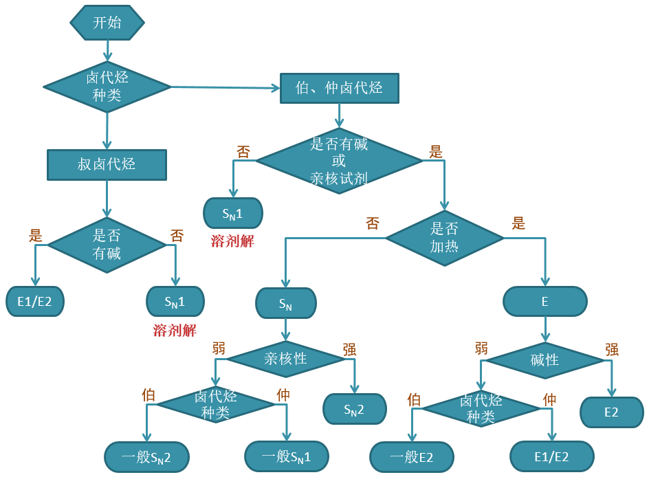

  判断卤代烃反应主要方向的基本流程

实例
----------------

以下我们就使用刚才的流程图来对一些典型的反应实例进行判断。

例1
  .. image:: ../../images/C07-KeyPoints/Competition22.png

  首先看卤代烃结构，底物分子明显是叔卤代烃，本身消除的倾向就比较大。再者注意到反应条件中我们加了OH\ :sup:`-`\ ，明显也是碱。
  因此不难判断，这个反应主要发生的将是消除。

  .. image:: ../../images/C07-KeyPoints/Competition22_2.png

例2
  .. image:: ../../images/C07-KeyPoints/Competition23.png

  还是先看卤代烃结构。当前是个仲卤代烃，介于伯、叔之间，消除或取代的可能性都不小。再注意进攻试剂，这里又是OH\ :sup:`-`\ ，
  具有碱性但同时也具有亲核性，还是没法儿判断。最后我们注意到反应当前没有加热，使用的还是极性比较高的水作为溶剂。因此到这里，
  我们终于可以断言，该反应主要将进行亲核取代，而且由于进攻试剂亲核能力较强，主要发生的还是SN2亲核取代。反应具有立体选择性，
  主要将得到下图中构型翻转的产物。

  .. image:: ../../images/C07-KeyPoints/Competition23_2.png

例3
  .. image:: ../../images/C07-KeyPoints/Competition24.png

  底物分子是伯卤代烃，按说应当倾向于取代。但注意反应条件，尤其是其中的碱、加热与醇溶剂，这实际是个明显的消除反应特征。
  这种条件下即便是伯卤代烃，主要进行的也是消除（而且不难判断主要应是E2消除）。

  .. image:: ../../images/C07-KeyPoints/Competition24_2.png

.. note::

  碱-醇-加热，这可以说是最典型的卤代烃消除反应条件。看到这三样凑在一起，几乎不用多想，多半儿发生的是消除反应。
  当然这是针对卤代烃而言，其它一些类型分子的消除，我们需要使用截然不同的条件。

总之，虽说卤代烃取代、消除四种历程间的竞争极其复杂，影响因素极多，但在我们当前的学习阶段，遇到的反应都比较简单，大家应当也不难判断。

