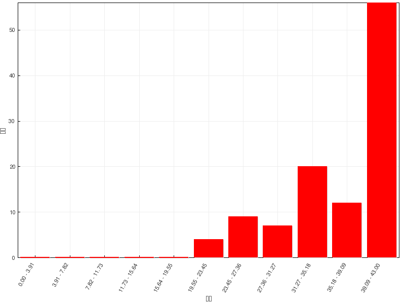

习题讲解：醇酚醚
========================

在线自动评分习题
---------------------

=======   =============
总分        43
平均分      36.8(85.6%)
最高分      43(100.0%)
=======   =============

  成绩分布

醇酚醚这章的练习题虽多，但难度看起来不大，大家的完成情况都还不错。

题6：命名（错误率31.8%）
  .. image:: ../../images/C08-Exercises/A06_00.png

  芳香醚类分子，氧原子左右两个烃基都不算复杂：右边烯丙基，左边邻甲基苯基。因此这儿我们可以简单地使用烃基名称来对醚分子进行称呼。
  注意醚中如果氧两侧是两个脂肪烃基，则一般小基团前置；若脂肪烃基与芳香烃基同时出现，通常习惯将芳香烃基前置（类似“苯甲醚”、“苯基烯丙基醚”这样的称呼）。
  因此该分子可称为：\ **邻甲基苯基烯丙基醚**\ 。

题19：排序（错误率31.8%）
  请将下列离子按稳定性降序排列：

  .. image:: ../../images/C08-Exercises/A19_00.png

  本题需比较一系列负离子的稳定性次序。常规的做法是比较带负电荷原子（前三个是O，最后一个是C）的电负性及其容纳负电荷的能力，比较离子内其它部分共轭、
  诱导效应对负电荷分散的帮助。通过常规办法，我们确实可以得到结论。

  但对于本题的一系列负离子而言其实还有个更简单的比较方式：这串负离子明显是酚、水、醇、炔这四种具有酸性的化合物解离出质子之后形成的。我们前面
  多次接触过比较化合物酸性的问题，也知道酸性与质子解离后形成负离子的稳定性直接相关——负离子稳定性越强，质子解离平衡越向右移，酸性也会相应地越高。
  反过来当然也成立，分子酸性越强，解离质子后得到的负离子理应越稳定。由此，如下图所示，这四种离子的稳定性不难判定。

  .. image:: ../../images/C08-Exercises/A19_01.png

题22：反应（错误率27.1%）
  .. image:: ../../images/C08-Exercises/A22_00.png

  看条件，明显是酸催化下醇的消除反应。有些同学一看，羟基旁侧β-H就一种，似乎没什么选择，于是给出了如下的产物：

  .. image:: ../../images/C08-Exercises/A22_01.png

  但这一答案是有毛病的。注意到酸催化下醇的消除一定是E1历程，一定会生成碳正离子，正电中心旁侧又有个稳定性很差的四元环，因此这里其实非常
  容易发生扩环重排。主要产品也应当是重排后碳正离子继续消除的结果：

  .. image:: ../../images/C08-Exercises/A22_02.png

题36：反应（错误率17.8%）
  .. image:: ../../images/C08-Exercises/A36_00.png

  与前题类似，也是醇的消除。但值得注意是，并不是所有醇消除的反应都会出现重排，本题即是此种情况。注意到这里我们使用的脱水剂不是浓硫酸之类的强酸，
  而是氧化铝，反应机制也就因之有所不同，并不经历碳正离子，重排自然也就无从发生，主要得到正常的消除产物：

  .. image:: ../../images/C08-Exercises/A36_01.png

  .. note::

    一般不重排，这是氧化铝催化醇脱水的一个优势。但反过来这种条件也存在缺点，最明显的，使用氧化铝时的反应温度通常要比浓硫酸脱水高得多，在实验室
    条件下也更难实现。

题23：反应（错误率29.0%）
  .. image:: ../../images/C08-Exercises/A23_00.png

  本题其实与前一章卤代烃的关系更为密切些。底物分子仲卤代烃，取代与消除倾向都有。而进攻试剂NaSH，碱性明显较NaOH为弱而在一般的质子性溶剂中亲核性又较
  NaOH为强。加上当前常温反应，我们不难判断这里应当是亲核取代为主。而且由于NaSH较强的亲核性，主要发生的应当还是SN2反应。既然是SN2，千万别忘了，
  立体化学上会发生瓦尔登转化，我们最终主要生成构型翻转的产品：

  .. image:: ../../images/C08-Exercises/A23_01.png

题29：反应（错误率35.5%）
  .. image:: ../../images/C08-Exercises/A29_00.png

  格氏试剂与环氧化合物的反应，考点实际是区域选择性与立体选择性。有些同学看到反应式第二个箭头上有个H\ :sup:`+`\ ，就想当然地认为是环氧酸性条件开环，
  格氏试剂中的甲基会进攻左侧连接烃基较多的碳原子。但注意，这里两个箭头分写，意思是反应分两步：先加格氏试剂，反应后再酸化（事实上酸性环境会使格氏试剂分解，
  这两者一定不可能在同一步里加入）。

  既然如此，第一步格氏试剂与环氧化合物的反应，由于格氏试剂亲核性较强，会主动进攻与氧相连的碳原子，其实更类似碱催化下环氧化合物开环的过程，亲核试剂将主要进攻
  位阻更小的右侧碳。反应过程如下图所示：

  .. image:: ../../images/C08-Exercises/A29_01.png

  这里第二步的酸性条件实际主要为把第一步生成的氧负离子转变成羟基。此外，格氏试剂一定也是从氧原子的背面进攻，立体选择性上还是反式开环。

在线手动评分习题
---------------------

手动评分习题中的机理题，是一个典型的不对称频哪醇类分子酸性条件下的重排，关键是判断哪个羟基优先发生质子化，脱水后形成什么样的碳正离子。
相关过程及思路可参见\ :doc:`重难点小结：醇的化学反应<./KeyPoints01-ReactionsOfAlcohol>`\ 中关于频哪醇重排的讨论。

合成：以甲苯及两个碳原子的有机物合成：
  .. image:: ../../images/C08-Exercises/B02_00.png

  注意到目标产品较原料甲苯多两个碳原子，还外加一个羟基。类似这种，需要制备多两碳醇的合成要求，我们往往可以利用格氏试剂与环氧乙烷的反应，
  这是我们合成里很常见的一个套路：

  .. image:: ../../images/C08-Exercises/B02_01.png

  而苄基溴化镁，自然又是由苄溴制备。至于苄溴，通过甲苯的α-卤代生成毫无压力：

  .. image:: ../../images/C08-Exercises/B02_02.png

  通过这样的逆合成分析，我们最终不难写出正向的反应来：

  .. image:: ../../images/C08-Exercises/B02_03.png

合成：以苯酚及丙烯为主要原料合成：
  .. image:: ../../images/C08-Exercises/B03_00.png

  目标分子结构看起来略复杂，但注意到分子内存在明显的结构特征：酚羟基对位有个烯丙基，而且酚羟基两个邻位还都被溴占据了。这明显暗示我们，
  目标分子实际应当是苯基烯丙基醚类化合物经过Claisen重排之后，烯丙基重排到对位的结果：

  .. image:: ../../images/C08-Exercises/B03_01.png

  而这种不对称醚，合成时自然应使用Williamson合成法：

  .. image:: ../../images/C08-Exercises/B03_02.png

  烯丙基溴，我们通过原料丙烯的自由基α-卤代反应不难制备。至于2,6-二溴苯酚，则需要从另一个原料苯酚合成。酚羟基本身是强给电子的邻对位定位基，
  但做亲电溴代时我们需要留神，必须保证对位不发生溴代，这里还是可以使用老办法：磺酸基占位：

  .. image:: ../../images/C08-Exercises/B03_03.png

  有了以上的逆合成分析思路，最后我们写出正向反应如下：

  .. image:: ../../images/C08-Exercises/B03_04.png

合成：请完成如下转化：
  .. image:: ../../images/C08-Exercises/B04_00.png

  本题其实挺难，但好在题干中给了两个额外的提示（1.经过频哪醇重排；2.羰基可以还原为醇羟基），很大程度上减轻了我们思考的负担。

  首先还是注意目标分子，螺环中存在一根双键。提示里又提到了醇羟基，因此，这儿其实暗示，这根双键是通过羟基的消除得到的：

  .. image:: ../../images/C08-Exercises/B04_01.png

  推出醇羟基后，还是根据提示2，这个醇羟基可以来自于羰基的还原，我们又推导出一个螺环酮：

  .. image:: ../../images/C08-Exercises/B04_02.png

  提示1里提到了频哪醇重排，而我们很熟悉，频哪醇重排后，生成的恰好就是酮类分子，因此上面的酮实际可以通过频哪醇重排反应得到：

  .. image:: ../../images/C08-Exercises/B04_03.png

  最后比较我们推出的这个邻二醇与原料二环烯烃的结构，不难发现，邻二醇中两个羟基，刚好是烯烃双键碱性条件下高锰酸钾氧化的结果：

  .. image:: ../../images/C08-Exercises/B04_04.png

  最终，我们写出正向合成过程如下：

  .. image:: ../../images/C08-Exercises/B04_05.png

课本习题
-------------

课本习题中有几道值得我们注意的题目，这里一并讨论一下。

习题3(1)：沸点排序。
  a. 正丁醇    b. 正戊醇    c. 仲丁醇    d. 环己醇   e. 仲丁硫醇

  五个化合物明显分两组：a-d为醇，e为硫醇。与硫醇相比，醇羟基中的氧原子电负性更强，O-H键较S-H键极性更高，因而醇分子间也较硫醇间更易形成氢键。
  一般而言，醇的沸点也将显著地高于硫醇（类似的，H\ :sub:`2`\ O的沸点也高于H\ :sub:`2`\ S）。这五个分子中，e的沸点应当最低。

  至于a-d，都是醇，但碳原子数不同，分子量也有差异。我们也知道，随着醇分子量增大，分子间作用力也相应地增强，沸点通常逐渐上升。因此这里
  d沸点高于b，又高于a/c。

  至于a、c，四碳的同分异构体，分子量相同。而a是伯醇，c是仲醇。羟基旁侧位阻明显c>a。烃基位阻增大，一定程度上会妨碍两分子醇之间氢键的形成，
  因此沸点上，c将较a为低。

  综上，五种醇的沸点次序应为：\ **d > b > a > c > e**\ 。

习题3(1)：酸性排序。
  .. image:: ../../images/C08-Exercises/C02_00.png

  题干中六个分子，后四个看起来都是苯酚衍生物，a是醇，b是羧酸，又分为三大组。我们知道，酸性上应当有羧酸>酚>醇这么个次序，a与b的位置相对容易判定。

  至于c-f，苯酚或者对位取代的苯酚衍生物，它们的酸性大小与对位基团的电性效应密切相关。我们应当也很熟悉，有吸电子集团，酚羟基的酸性应当上升；反之
  给电子基团会导致酚羟基酸性下降。因此这儿对三氟甲基苯酚e酸性明显比苯酚f强而对甲氧基苯酚d酸性应当较苯酚弱。

  略微有个小陷阱的是c，不少同学在这里会忙着判断磺酸基究竟是给电子还是吸电子。但事实上对于c而言，下方的磺酸基来自于浓硫酸，酸性实际上也与硫酸接近，
  是个极强的酸性基团（其实从这个分子的名字，对羟基苯磺酸上，我们也很容易体会到这一点）。它的酸性不但高过其它的苯酚衍生物，也要比羧酸b来得高得多。

  由此，这一系列分子的酸性次序应为：\ **c > b > e > f > d > a**\ 。

习题9(2)：由环己醇合成二环己醚。
  目标产品是个对称醚，因此可能有同学会想到使用醇分子间脱水的方式来制备：

  .. image:: ../../images/C08-Exercises/C03_01.png

  但此反应最好谨慎使用，毕竟同样的酸/加热条件下醇还很可能发生消除反应。尤其此处环己醇是个仲醇，本身消除倾向要比伯醇高得多。

  相对稳妥的合成方式，其实还是Williamson法：

  .. image:: ../../images/C08-Exercises/C03_02.png

  .. note::

    Williamson合成法是实验室中制备醚的一种通用手段，也经常在考试中出现。关于此法的更多讨论，请参见
    :doc:`重难点小结：醚的Williamson合成法<./KeyPoints04-WilliamsonSynth>`\ 。

习题9(3)：由苯酚和氯苯制备4-硝基苯基苯基醚。
  本题略超出当前我们的学习范围。待到下学期含氮化合物一章结束后，大家应该更容易理解答案中的路线。

  当前目标分子是不对称醚，因而不用多想，还是利用Williamson法来制备。逆合成分析时，从中心氧原子两侧切开C-O键，存在两条可能的路线。

  若从苯基一侧切开，如下图所示：

  .. image:: ../../images/C08-Exercises/C04_01.png

  但此路线需使用酚钠与氯苯之间的亲核取代，而氯苯又是相当于是个乙烯型卤代烃，卤素与苯环有共轭，C-X键键能较强，难以断裂。因此这条路线，
  反应起来不容易，我们首先可以排除掉。

  而从对硝基苯基一侧切开C-O键，我们将得到如下的路线：

  .. image:: ../../images/C08-Exercises/C04_02.png

  表面看起来还需要酚钠与卤苯发生亲核取代，似乎还是不容易。但当前情况其实发生了一点儿改变，注意到氯原子的对位，当前有一个强吸电子的硝基。

  由于硝基强烈的吸电子作用（尤其是主要影响硝基邻、对位的共轭吸电子效应），对硝基氯苯中氯原子旁侧碳上的电子云密度，会较单纯的氯苯大大下降，
  正电荷密度大大上升。而这种变化，无疑有利于酚钠这种亲核试剂的进攻。换句话说，有了这个硝基，卤苯的亲核取代的活性会大大增加，不再是特别困难
  的一件事儿了。

  .. note::

    酚钠与对硝基氯苯之间的亲核取代反应机理比较特殊，不是我们熟悉的SN1或SN2，而是一种特别的SNAr机理。具体下学期含氮化合物一章中会涉及。

  既然这步反应可以发生，我们就沿着这条路径继续推衍。如下图所示，酚钠无疑来自于苯酚，至于对硝基氯苯，直接用氯苯硝化即可制备。

  .. image:: ../../images/C08-Exercises/C04_03.png

  至此，逆合成分析结束。最后我们正向写出反应：

  .. image:: ../../images/C08-Exercises/C04_04.png

