醇的化学反应
=========================

醇的化学性质相对比较活泼，可能也是到目前为止我们接触到的涉及反应数目最多的有机化合物了。虽说看起来复杂，但归结起来，
它的化学反应基本都与主官能团羟基密切相关。在基础有机化学的学习里，大致有四类反应值得我们注意：

* 羟基中的O-H键是一根键能不太高的极性共价键，溶液中可能断开，解离出质子。因此醇羟基具有一定的酸性。

* 羟基与烃基相连的C-O键同样也是一根极性共价键，也存在断开的可能性，因此醇也可以发生一系列羟基离去的亲核取代或消除反应。

* 羟基氧原子电负性比旁侧的碳、氢都高，两根极性共价键的电子都会向氧原子集中，导致该原子上电子云密度较大，进而使得羟基氧
  存在进攻正电中心的可能。换而言之羟基氧具有一定的亲核性。

* 最后，羟基氧化态较低，易被氧化。氧化过程中羟基旁侧的α-H通常也会脱去。

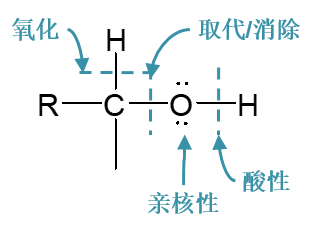

这四类反应中，酸性相对简单。与羟基的亲核性相关的反应目前我们接触的也不多，最重要的就是成酯反应，它的更详细过程我们将在
下学期羧酸一章中进一步讨论。剩余的两类反应数量较多，特别是羟基离去的亲核取代或消除反应，这是我们关注的重点。

醇的亲核取代与消除反应
------------------------

在醇的亲核取代或消除反应中，羟基旁侧的C-O键最终总要断开羟基总要离去。但值得注意的是，想让羟基直接离去，一般来说是比较困难的，
比如亲核卤代，想让卤负离子直接取代羟基基本无可能：

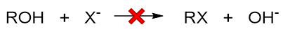

原因我们在前一章实际就已经讨论过：羟基直接断开的话离去基团OH\ :sup:`-`\ 的离去性能极差。因此在反应时，我们通常都得对羟基
进行一定程度的结构转化，使之转变成一个相对易于离去的基团。最简单的转化方式是在强酸性条件下使羟基质子化转变成[钅羊]盐，如是则
相应的反应中离去基团将变成H\ :sub:`2`\ O，离去性能远强于OH\ :sup:`-`\ 。此外[钅羊]盐中的C-O键的极性会进一步增强，也更有利于断键：

.. image:: ../../images/C08-KeyPoints/ReactionOfAlcohols03.png

我们实际也不难发现，醇的大量反应都是在酸性条件下完成的。当然由于H\ :sub:`2`\ O的离去性能相当不错，特别容易离去，这导致
醇的大量亲核取代或是消除反应都是按照单分子的历程进行（还记得前一章中离去基团对反应历程的影响么？）。

消除脱水
~~~~~~~~~~~~~~

如醇的消除——也即脱水——反应，在浓硫酸催化下加热进行，不论伯、仲、叔醇，反应历程均为E1，首先形成[钅羊]盐，再断开C-O键形成
碳正离子：

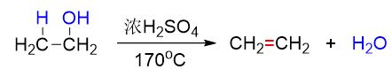

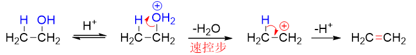

既然按照E1进行反应，速控步生成碳正离子的，毫无疑问，得到的碳正离子的稳定性与反应速率直接相关。因而不同结构的醇发生脱水时
活性通常是\ **叔>仲>伯**\ 。从以下反应中我们很容易观察到这个趋势，伯醇需要浓硫酸高温，而叔醇消除时用较稀的硫酸催化即可：

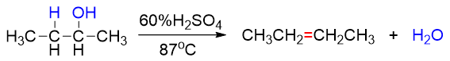

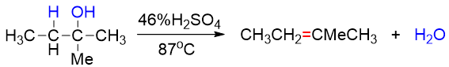

此外，由于涉及碳正离子，因此醇酸催化脱水时往往会发生碳正离子重排。如若想避免这种重排，可以改用Al\ :sub:`2`\ O\ :sub:`3`\
作为脱水剂，此时通常需加热到更高温度：

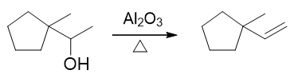

醇的消除反应基本情况可总结如下：

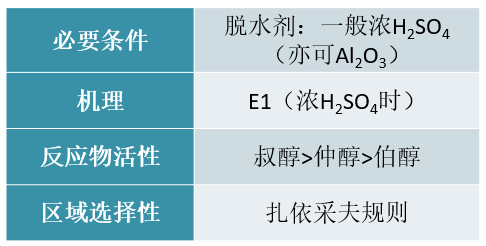

频哪醇重排
~~~~~~~~~~~~~

频哪醇重排反应，从本质上说其实就是特殊结构邻二醇的一种特殊消除。我们注意到其反应历程的头两步（成[钅羊]盐、脱水）与正常消除如出一辙，
只是随后发生重排，导致消去的不是碳上，而是相邻羟基上的氢而已。

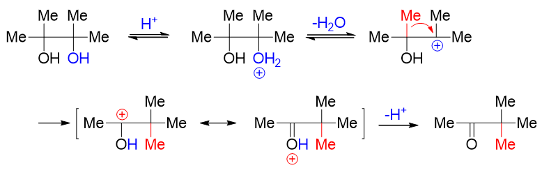

因此这儿我们也可以发现，频哪醇重排的反应条件与普通叔醇的消除极其类似，也是酸性条件。

此外，对于结构不对称的频哪醇类分子，发生反应时也存在区域选择性问题。主要的反应方向还是由[钅羊]盐脱水之后形成的碳正离子稳定性有关。
如下图中的反应，可能形成两种不同结构的碳正离子，反应自然主要沿更稳定碳正离子的方向进行：

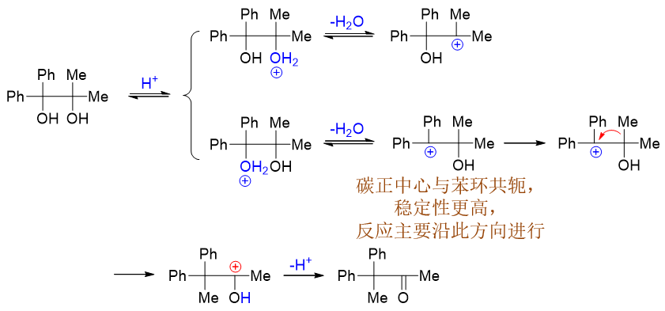

若可能生成的两种碳正离子稳定性相仿，则往往会形成混合产物：

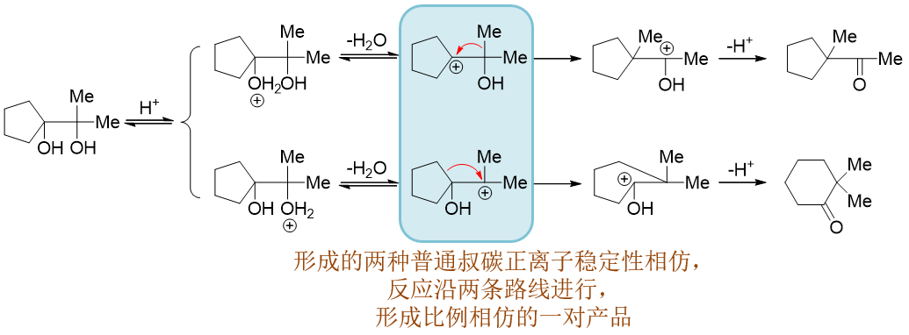

有时分子中还存在不同烃基重排的可能性。如以下反应，结构对称的底物分子脱水后形成碳正离子，此时旁侧碳原子上烃基存在甲基、苯基
两种，二者理论上均可能重排：

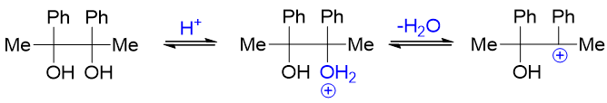

主要哪个烃基发生重排，我们这儿也有一个简单的判别原则：看谁的电子云密度相对更高。毕竟是往正电中心重排过去，烃基电子云密度越高，受
正电中心的吸引力也就越大，重排起来当然也就越容易。当前反应中，甲基与苯基都存在重排的可能性。而我们也很熟悉，芳基的电子云密度
一般要高于普通烷基，因此这里将主要是由苯基发生重排：

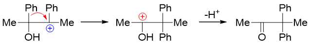

亲核取代
~~~~~~~~~~~~

与HX反应
++++++++++++

醇的亲核取代中，我们最熟悉的无非是它与HX生成卤代烃的反应。该反应通常也必须在酸性条件下进行，首先生成[钅羊]盐。
之后大部分醇（叔、仲醇以及部分大位阻伯醇）也是采取单分子SN1机理：

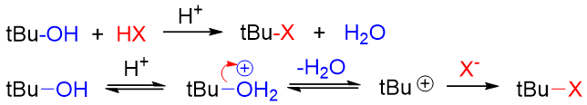

此时底物醇分子的反应速率当然还是与碳正离子稳定性相关，\ **叔>仲**\ 。

而小烃基的伯醇与甲醇，一方面由于形成的碳正离子稳定性欠佳，另一方面位阻较小便于亲核试剂进攻，因此主要采取SN2机理：

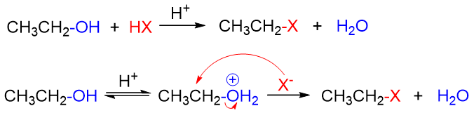

而在SN2的历程下，反应速率与醇的烃基位阻有关，位阻越大反应速率越慢，普通伯醇的反应速率将低于甲醇。

而如果将两种历程综合比较起来，一般而言伯醇较其它各类醇的反应活性都更差一些。

醇与HX反应的基本情况大致可总结如下：

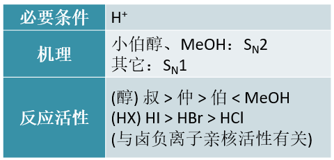

与PX\ :sub:`3/5`\ 及SOCl\ :sub:`2`\ 反应
++++++++++++++++++++++++++++++++++++++++++++++

醇与HX的亲核取代反应某些情况下可以用以制备卤代烃，但毕竟反应过程中常会涉及碳正离子，导致重排使得产率大受影响。因此，
实验室中从醇出发合成卤代烃时，更常使用另两类试剂：PX\ :sub:`3`\ 或PX\ :sub:`5`\ 以及SOCl\ :sub:`2`\ 。

PX\ :sub:`3/5`\ 通常用在溴代烃的合成上。反应机理比较复杂，一般认为至少伯、仲醇是按照SN2历程进行的，无需顾虑重排。
反应过程中同样需将羟基转化为一个相对易于离去的基团：

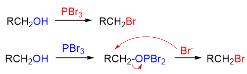

由于PBr\ :sub:`3`\ 不易保存，因此实际操作时通常是投入红磷与液溴，两者间先反应生成PBr\ :sub:`3`\ 再导致醇的亲核取代。

至于SOCl\ :sub:`2`\ 则通常用以合成氯代烃。反应机理复杂，基础有机的学习中我们可以不用在意，但反应时同样也是将羟基先转变为
易于离去的基团。此外，反应的立体选择性值得我们特别注意，通常情况下是构型保持，但若投入类似吡啶、EtN\ :sub:`3`\ 之类含氮
的弱亲核试剂，则立体构型将翻转：

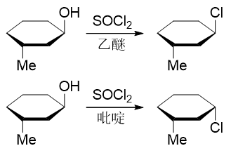

成醚反应
++++++++++++

最后，别忘了醇羟基氧本身实际具有亲核性，因此它事实上可以对另一分子醇发动亲核进攻，最终得到醚。如乙醇成乙醚的反应，机理基本是一个
SN2的亲核取代过程，当然取代之前底物醇分子依然需要首先将羟基转变为[钅羊]盐，而后另一分子未质子化的乙醇作为亲核试剂，再去进攻：

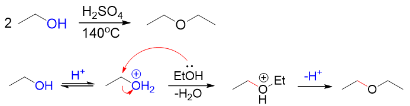

.. note::

  浓酸作用下的成醚反应并非各类醇都可以进行，一般只是烃基体积较小的伯醇较易发生。其它如仲、叔醇，由于消除活性较高，
  此条件下一般都会导致分子内脱水成烯。

醇的亲核取代与消除反应的大致情况就是如此。反应数量虽多，但互相间（尤其是机理）存在明显的相关性，大家可以在理解机理的基础上
进行关联记忆。

醇的氧化反应
------------------------

常规氧化
~~~~~~~~~~~

醇羟基可以被氧化成羰基、羧基乃至于二氧化碳。在合成中，能够氧化羟基的氧化剂数量很多，反应基本情况如下表所示：

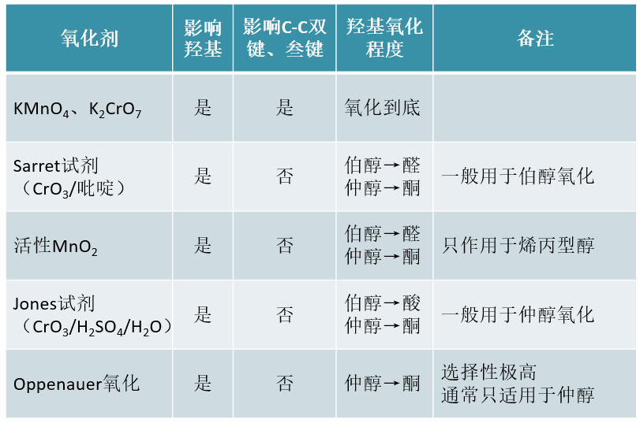

像高锰酸钾、重铬酸钾这样的强氧化剂，氧化时首先将羟基氧化成羰基，若生成的是醛羰基，则氧化还能继续进行，生成羧基乃至二氧化碳，
直至原本羟基α-碳上连接的氢原子全都消失：

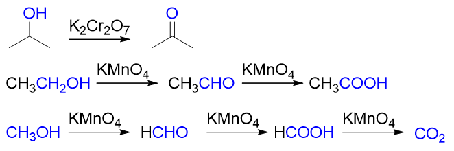

当然，如果起初羟基α-碳上就没有连接氢（如叔醇），则在非高温条件下，强氧化剂的氧化也不易进行：

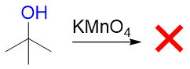

此外，强氧化剂活性强但相应的选择性较弱，氧化时也会影响很多其它的官能团（如C-C双键、叁键等）。因此合成上氧化醇时更常见
的选择是一些活性较差但选择性更强的弱氧化剂。

前面表中列出的如Sarret、Jones、活性MnO\ :sub:`2`\ 、Oppenauer氧化等反应条件均具有不错的选择性，氧化羟基时皆不影响
C-C重键。当然这些选择性氧化条件各自擅长的范围不同。

Sarret试剂与活性MnO\ :sub:`2`\ 一般用于氧化伯醇，生成物将是醛而不会继续氧化为酸。Sarret试剂相对广谱，各类伯醇基本都可
氧化，而MnO\ :sub:`2`\ 一般只能氧化烯丙型的伯醇：

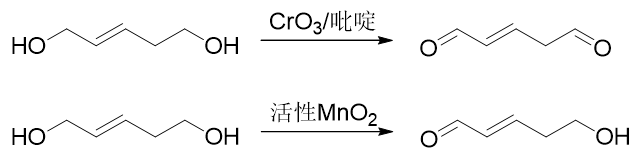

至于仲醇的氧化，我们更常用Jones试剂。与Sarret试剂类似，Jones试剂中起氧化作用的也是CrO\ :sub:`3`\ ，但由于是在稀硫酸
这样的酸性环境中，CrO\ :sub:`3`\ 的氧化性能要较碱性的Sarret试剂更强，反应起来速率也更高：

.. image:: ../../images/C08-KeyPoints/ReactionOfAlcohols25.png

当然，也由于氧化能力相对更强，如果底物是伯醇分子，则Jones试剂一般会把它氧化成酸，而没法儿停留在醛上。

此外，Oppenauer氧化也是实验室中常用的选择性极高的氧化仲醇的手段（一般不用以氧化伯醇，种种原因效果不好）：

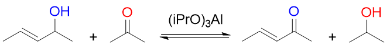

该反应实际相当于是使用丙酮作为氧化剂，在异丙醇铝的催化下，令其与仲醇间发生氢交换。仲醇羟基与α-碳上失去两个氢转变为酮，
而丙酮羰基碳氧上得到两个氢转变为异丙醇，反应物的其它位置不受任何影响，选择性特高。

值得注意的是Oppenauer氧化实际是个可逆反应，为了令平衡右移，我们通常加入过量的丙酮。但很多情况下我们也可以利用平衡左移
的逆反应（Meerwein-Ponndorf还原），实际相当于用异丙醇作还原剂将酮还原成仲醇，此时需不断地将体系中生成的丙酮蒸除。

高碘酸与四乙酸铅氧化邻二醇
~~~~~~~~~~~~~~~~~~~~~~~~~~~~~~

对于两个羟基相邻的邻二醇，高碘酸可以将两个羟基间的C-C键断开，并将羟基氧化为羰基：

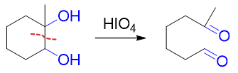

除邻二醇外，若分子中羰基与羟基乃至羰基与羰基相邻，则这些基团间的碳碳键亦可被打断：

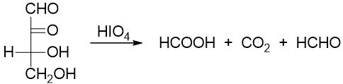

对于该反应，判断氧化后生成的产品有一个特简单的原则：每断一根C-C键，相邻基团的氧化态升一级。如上图中底物分子最上方1-位原本是羰基，
氧化过程中旁侧断开了一根C-C键，于是氧化态升一级，转变为甲酸；2-位原本也是羰基，旁侧断开两根C-C键，氧化态升两级，从酮变成甲酸再
变成二氧化碳；3-位羟基氧化态亦升两级，变为酸；4-位氧化态升一级，最终转变为醛：

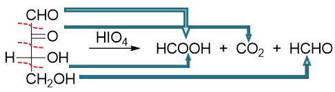

此外，我们还需要留神，由于氧化过程中邻二醇羟基与高碘酸之间需要形成五元环状过渡态，因此底物分子两个羟基必须能够转到相去不远，适于
生成五元环的构象时氧化才能发生。若不满足此条件，则此种邻二醇不会受高碘酸影响。此时我们可考虑使用四乙酸铅，亦可将两羟基间C-C键
断开：

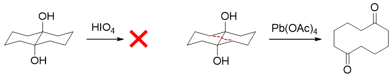

醇的氧化反应反应的大致情况如此。反应数量也比较多，但相似性较高，大家也可以关联记忆。

