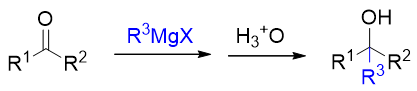
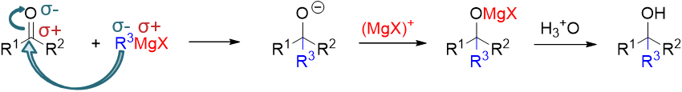

使用格氏试剂制备醇
==============================

醇的制备方法有很多，在线视频中介绍了诸如卤代烃水解、烯烃水合、硼氢化氧化等方法。通过这些手段，我们得到的都是与原料
分子碳原子数目相同的醇。但有机合成中我们经常希望在得到羟基的同时还能够延展碳链，欲完成这一要求，实验室中最常见的
方法是利用格氏试剂与醛酮的亲核加成反应。

该反应基本如下图所示，先令醛酮与格氏试剂反应，再接酸性条件水解。
反应过程中原本醛酮的羰基将转变为羟基，同时来自于格氏试剂的烃基部分将于羰基碳相连，我们得到一个碳链增长的新醇：

具体的反应历程如下图所示。首先我们注意到底物羰基化合物中的C=O键明显是一根极性共价键，氧原子上电子云密度较高，带部分
负电荷，而碳原子电子云密度较低，带部分正电荷。于此同时，格氏试剂中烃基与金属Mg原子直接相连，而Mg的电负性远低于烃基，因此
金属上带部分正电荷而烃基部分带部分负电荷。既然有这么个电子分布情况，正负相吸，格氏试剂中的烃基部分将很容易进攻醛酮中的
羰基碳，进攻过程中形成新的C-C键。于此同时，为了维持原本羰基碳四价，势必在成新键的同时，断开键能较低的C=O间的π键，一对
电子转移到氧上。经过这两对电子的转移之后，我们得到中间产品，接上一个新烃基R\ :sup:`3`\ 的氧负离子。当然这个氧负离子又可以迅速与
MgX正离子结合，生成后继的离子型化合物。从总体看，反应过程中C=O间由双键变成了单键，仿佛是个加成，缺电子的羰基碳上新连
上了富电子的来自于格氏试剂的烃基，而富电子的羰基氧则与格氏试剂中缺电子的Mg相连。整个加成又由格氏试剂对缺电子羰基碳的
亲核进攻引发，因此我们称之为“\ **亲核加成反应**\ ”。当然亲核加成结束后，我们通常会再接一步酸性条件水解，将-OMgX
水解为羟基，得到最终产品。

反应中明显生成了一根新的C-C键，上图中我们使用蓝色标记了出来。这根键的位置很固定，一定是处于新生成的羟基的α-碳旁侧。
这是这套反应的一个最典型的特征。反过来，如果做逆合成分析，我们就可以从这个位置把醇的碳链断开，断开后含羟基的部分
来自于醛酮，单独的烃基部分一定来自格氏试剂。

以下我们来看两个相关的合成实例。为节省篇幅，此处仅给出逆合成分析的过程。具体正向反应大家不难自己写出。

例：请用格氏试剂法合成如下醇分子：
  .. image:: ../../images/C08-KeyPoints/AlcoholSynth03.png

  沿用前述的思路进行逆合成分析，无非从羟基α-碳旁侧断开碳链。这里明显存在两种断键可能，若从右侧断开，则含羟基的左半边
  来自于羰基化合物，即苯乙醛。而右侧来自格氏试剂，单碳的甲基碘化镁，当然格氏试剂当然又来自于卤代烃碘甲烷。反过来若一开始
  从左侧切断C-C键，则含羟基的右半部分应来自于乙醛，左半部分来自于苄基溴化镁及苄溴。考虑到苄溴制备更为简单，且乙醛价格
  也低于苯乙醛，此处后一种合成路线相对更方便些。

  .. image:: ../../images/C08-KeyPoints/AlcoholSynth04.png

例：请从乙醇出发合成如下醇分子：
  .. image:: ../../images/C08-KeyPoints/AlcoholSynth05.png

  要求从两碳醇合成新的八碳醇，无疑合成过程中需要多次延展碳链，我们依然可以使用格式试剂法。逆合成分析还是从目标分子羟基α-碳
  旁侧断开C-C键，我们原则上存在三种选择。但断开上方甲基旁侧的C-C键明显不合适，会分割出一个比乙醇还小的单碳单元，首先可以
  排除。剩下无非是从左切成4+4两部分或从右切成6+2两部分。此处只讨论自左切开的情况：

  .. image:: ../../images/C08-KeyPoints/AlcoholSynth06.png

  注意到逆合成分析第一步切断后得到的格氏试剂-卤代烃以及醛酮分子，在合成里实际都可以来自于醇，于是我们相当于把八碳醇分解成了
  两个四碳醇。采取类似的做法继续从羟基α-碳旁断键，四碳醇最终被关联到两碳的乙醇分子。至此逆合成分析的思路结束。
