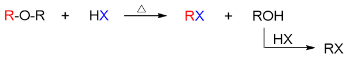

醚键的断裂
==============================

正常的醚类化合物，由于性质上比较稳定，值得我们注意的化学反应并不多。在基础有机的学习中，主要就是酸性条件下
醚键断裂的反应。

做这个反应时，我们一般是将醚与卤化氢在酸性条件下混合加热，此时醚中会断开一根C-O键，分离成两部分，一半儿生成醇，另一半儿与
卤素结合得到卤代烃。当然如果HX过量，得到的醇与HX还可以进一步发生亲核取代，最终也得到卤代烃分子：

反应历程
------------

从某种意义上看，这个醚键断裂的反应也可以视之为一个亲核取代，相当于来自于HX的亲核试剂X\ :sup:`-`\ 取代了
原本醚中的离去基团RO\ :sup:`-`\ 。当然，亲核取代可能存在SN1、SN2两种不同的历程，而醚键断裂的反应具体采取
何种历程，与醚中烃基的结构直接相关。

  * 如若醚中氧两侧是伯烃基（如乙醚），则反应一般按SN2历程进行：

    .. image:: ../../images/C08-KeyPoints/EtherBond02.png

  * 反之若氧两侧是叔烃基（如叔丁醚），则反应一般按SN1历程进行：

    .. image:: ../../images/C08-KeyPoints/EtherBond03.png

    当然，由于生成了碳正离子，因此叔丁醚的反应中往往还会同时得到E1消除的产物2-甲基丙烯：

    .. image:: ../../images/C08-KeyPoints/EtherBond04.png

    包括生成的叔丁醇，酸性加热条件下也会进而消除生成烯烃：

    .. image:: ../../images/C08-KeyPoints/EtherBond05.png

  * 若醚中是仲烃基，情况则较复杂，视反应条件，SN1/SN2均有可能。

但不论是SN1还是SN2，我们也可以注意到，这个反应的第一步总是氧的质子化，形成醚的[钅羊]盐。这一点上和我们之前学习的醇的
很多反应类似，也是为了提高C-O键的极性便于其断开，同时也使得不易离去的RO\ :sup:`-`\ 转变为易于离去的基团ROH。

不对称醚的断键方向
----------------------

以上我们看到的都是结构对称的简单醚的情况。至于两个烃基不同的混合醚，醚键断裂时往往会存在区域选择性问题，主要断开哪根C-O键，
还是与反应历程相关。以下我们来看一些典型的案例。

例1：甲乙醚的断键。
  .. image:: ../../images/C08-KeyPoints/EtherBond06.png

  甲乙醚中，氧两侧一边是伯烃基，另一边是更小的甲基，我们很容易理解，它应当是按照SN2的历程进行反应，亲核试剂X\ :sup:`-`\
  会主动进攻烃基引发C-O断键。既然是亲核试剂主动进攻，自然哪边位阻小哪边进攻更容易，因此这里主要的进攻位点将是甲基，
  也是甲基与卤素结合形成碘甲烷，而乙基一侧连同氧原子，最终得到乙醇：

  .. image:: ../../images/C08-KeyPoints/EtherBond07.png

例2：甲基叔丁基醚的断键。
  .. image:: ../../images/C08-KeyPoints/EtherBond08.png

  如果醚中含有叔烃基，我们实验中发现，一般情况下主要会按照SN1的历程进行反应，由叔烃基这侧断开C-O键形成较稳定的
  叔碳正离子。即便像本例，另一个烃基是位阻很小的甲基，一般也不会走SN2历程。了解了这点，我们不难判断断键方向，
  写出最终产物：

  .. image:: ../../images/C08-KeyPoints/EtherBond09.png

例3：苯甲醚的断键。
  .. image:: ../../images/C08-KeyPoints/EtherBond10.png

  本例底物分子为一芳香醚。这里我们其实压根儿不用去判断反应机理究竟是SN1还是SN2了，注意到当前苯环与氧之间明显存在
  共轭，这导致Ph-O键具有部分双键的性质，键能远高于Me-O键，很难断开。因此本反应中断键，只能是脂肪烃基于氧之间的
  那一根：

  .. image:: ../../images/C08-KeyPoints/EtherBond11.png

例4：二苯醚。
  .. image:: ../../images/C08-KeyPoints/EtherBond12.png

  当前氧原子两侧都是苯环，两边都能形成共轭，键能较高，因此目前条件下都难以断开，不会发生醚键断裂的反应。

总之，醚键断裂的反应本身变化不多，在考试中比较容易出现的，也就是不对称醚的反应，大家掌握上述规律即可。