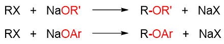

醚的Williamson合成法
==================================

Williamson合成法是实验室中制备醚的最常见手段，其适用范围广泛，对称醚、非对称醚都可以用此法合成。考试的合成题中，
该方法也是频繁出现。

从本质上说，Williamson合成法其实就是卤代烃与醇钠或酚钠间发生的亲核取代反应：

这里醇钠或酚钠作为亲核试剂，取代了底物卤代烃分子中的卤素原子，形成一根新的C-O键（上图中用红色标记）。
请注意这根新键的位置。遇上醚的合成，我们做逆合成分析时，其实就可以从这个位置，从氧的旁侧切开，
把目标醚分子断成两部分。含氧的部分来自于醇钠或酚钠，不含氧的部分自然来自于卤代烃。

当然，醚分子中总是存在两根C-O键，因此逆合成分析时总是存在两种可能，究竟哪种方式更适合，往往需要我们再
进一步判别。

例：合成甲基叔丁基醚。
  .. image:: ../../images/C08-KeyPoints/Williamson02.png

  从叔丁基一侧抑或从甲基一侧切开C-O键，逆合成分析存在两条思路。但若使用第一条路线，从叔丁基一侧切开的话，
  则合成时需使用叔丁基溴这样的叔卤代烃与甲醇钠。而叔卤代烃我们很熟悉，消除倾向极高，醇钠本身又具有强碱性。
  因此这两者相逢时，主要发生的将是消除，而不是我们希望的亲核取代成醚。故此路线不合适。

  相反，若从甲基一侧切开，则卤代烃底物将是碘甲烷，不存在消除的可能，必然发生取代。至于叔丁醇钠，从叔丁醇
  可以轻松制备。路线2将是合成目标产品的合适路线。

例：合成α-萘乙醚。
  .. image:: ../../images/C08-KeyPoints/Williamson03.png

  同样存在从萘基一侧、从乙基一侧切断C-O键的两条路线，逆推情况如上图所示。若从萘基一侧切开，则卤代烃需使用
  1-溴萘。而我们也知道芳香卤代烃卤素与芳环间存在共轭，C-X键键能较高，较难断开，实际很难与醇钠间发生亲核取代
  反应，因此这条路线并不合适。

  反之，从乙基一侧切开，通过α-萘酚钠与溴乙烷的反应，不存在任何困难。且酚钠较醇钠更易制备
  （由于酚的酸性较水强，直接使用酚与NaOH的反应就可制备），因此该路线显然更优。

