环氧化合物的反应
==================================

环氧化合物是醚中比较特殊的一种，由于有大张力的三元环的存在，性质较普通醚活泼地多。大量的亲核试剂都可以
与环氧化合物发生亲核反应，导致三元环开环。继续酸化后，最终生成醇类分子，原本环氧中的氧原子将转变成羟基：

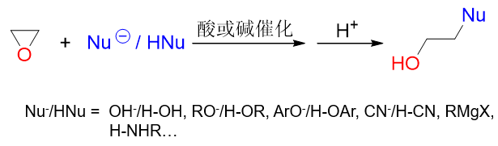

因此，这一系列反应是实验室中制备醇的一种重要方法，尤其是格氏试剂与环氧乙烷的反应：

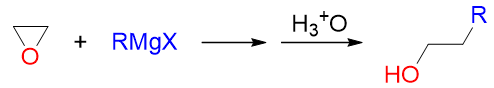

在得到羟基的同时，还形成了新的C-C键，在格氏试剂烃基的基础上，碳链增长了两个碳原子。这是我们合成多两碳醇
的常见手法。

这套反应我们其实也可以将其视为特殊的亲核取代，相当于亲核试剂取代了原本与碳原子相连的氧，导致三元环开环。
有意思的是，这种亲核取代常可以在酸性或碱性两种截然不同的条件下完成。如环氧乙烷的如下一对反应：

.. image:: ../../images/C08-KeyPoints/Epoxy03.png

使用醇钠这样的碱性条件，或者用酸性醇溶液都可以生成相同的产物。

但需要我们特别注意的是，酸或碱性条件下，这对看起来相似的反应，内部机制却完全不同，某些反应特征（如区域选择性）
也存在差异。以下我们分别讨论。

碱性条件
-----------

碱性条件下（包括格氏试剂与环氧化合物的反应），亲核试剂一般以负离子的形式存在
（如RO\ :sup:`-`\ 、HO\ :sup:`-`\ 等），直接带一个负电荷，
亲核能力显然会较强。因此这种情况下，亲核试剂可以直接对环氧化合物中与氧相连的缺电子碳直接发动亲核进攻：

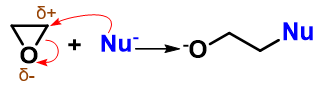

进攻过程中，亲核试剂与碳原子间成新键，同时断开旧的C-O键。C-O这根极性共价键断键时一对电子都被氧拿走，
我们得到阶段性产物烷氧基氧负离子。

接下来我们通常会接一步酸化，质子性环境下，氧负离子自然与质子结合，转化为羟基。

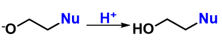

反应中最关键的无疑是生成氧负离子的第一步。这步反应中亲核试剂的进攻与C-O键的断裂同时
发生，无疑相当于是一个SN2的反应历程。

既然是SN2，碱性条件下反应的很多特征也就由此确立。如对于不对称的环氧化合物，开环方向与反应产物存在区域选择性。
下图反应中，进攻试剂醇钠存在两个进攻方向，但明显左侧碳原子旁侧支链较多，位阻较大，烷氧基负离子进攻困难。因此
主要反应方向将是醇钠进攻右侧仲碳，导致右侧C-O键断裂。

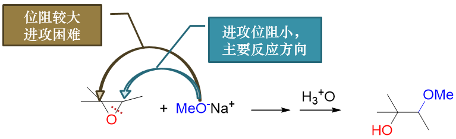

此外，同样由于SN2的缘故，亲核试剂必须从离去基团氧原子的背面进攻，这导致生成的产品往往也具有立体选择性。
如下图中反应，亲核试剂OH\ :sup:`-`\ 进攻位阻较小的右侧碳原子，且进攻必须从上方三元环氧的背面进行，
这导致主要产品里新生成的右侧C-OH键冲上，而相应地原本该碳原子上连接的甲基、氢被挤到下方。此外原本三元环氧
断键后生成的羟基继续保持原本的立体状态，处于中心C-C键下方。换而言之，进攻试剂引入的基团与环氧生成的羟基
反应结束时一定是个反式关系。

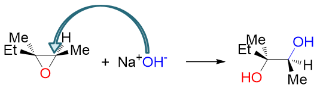

酸性条件
-----------

酸性条件下环氧化合物开环反应的历程与碱性下存在明显不同。质子性环境中，明显不会存在太高浓度的
类似RO\ :sup:`-`\ 、HO\ :sup:`-`\ 这样的负离子，亲核试剂通常只能以ROH、H\ :sub:`2`\ O这种电中性分子的形式存在。
与负离子相比，电中性分子的亲核能力无疑要差得多，这对反应其实是比较不利的。

但反过来，酸性条件下也存在对反应有利的因素。我们知道醚在酸性环境中会发生质子化形成[钅羊]盐，而环氧化合物，
作为一种特殊的醚，同样也具备这个特性，形成[钅羊]盐后，同样会使得C-O键极性增加，键能下降，更有利于断键，有利于
O的离去：

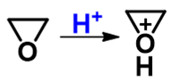

两方面综合起来看，进攻试剂的活性低了，而离去基团的离去能力又增强了，于是在酸性环境中，等不及进攻试剂过来，
底物环氧分子会主动发生变化，C-O键会先发生断键，电子对向氧转移，碳原子上正电荷密度进一步提高（相当生成一个部分碳正离子）：

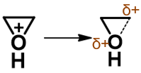

正当C-O键将断未断之际，亲核试剂才姗姗来迟，进攻当前带较多正电荷的碳原子，导致新键形成同时旧的C-O键彻底断开：

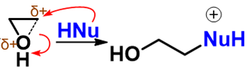

最后甩掉多余的质子，形成最终产品：

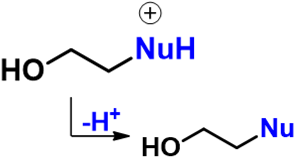

整个反应历程如下图所示：

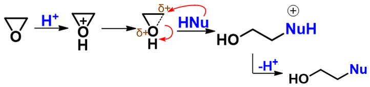

我们综合来看，这个历程相当于介于SN1与SN2之间。与SN1相比，反应也是从离去基团离去旧键断开起始，但却没有完全断开
形成碳正离子。与SN2相比，也是亲核试剂的进攻导致离去基团彻底离去，但这个进攻又来得有点儿迟，在旧键部分断裂之后
才进行。也正因为如此，酸性条件下环氧化合物开环反应的很多特征与SN1、SN2都有关联。

比如我们还是考查反应的区域选择性。和之前碱性条件下相同的底物，当前我们在酸性醇溶液中进行开环：

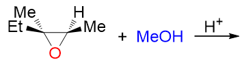

此时的断键位置就绝非由亲核试剂进攻的位阻决定了：早在进攻之前，一根C-O键就已经开始主动断开，亲核试剂实际是被动地
进攻断键位置的碳原子。当前C-O键断裂的位置实际决定了整个反应的方向。

环氧化合物中总是存在两根C-O键的，我们不妨假设左右这两根C-O键分别部分断裂，看看形成的的部分碳正离子的稳定性：

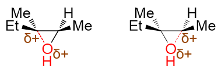

如果这种部分碳正离子不易判断，我们不妨更进一步，\ **假设**\ C-O键完全断裂，形成正常的碳正离子：

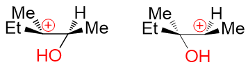

这下我们容易判断多了，左边叔碳正离子，右边仲碳正离子，明显左边稳定性更高。

而部分碳正离子的稳定性规律实际与正常碳正离子相同，也是中心碳上连接的给电子烷基越多，稳定性越强，同样是左侧的来得
更稳定些。

既然左侧的部分碳正离子更稳定，实际反应时自然也是左侧这根C-O键优先断开，继而醇作为亲核试剂再进攻左侧碳原子。我们最终
将得到区域选择性与碱性条件下截然相反的产物：

.. image:: ../../images/C08-KeyPoints/Epoxy16.png

类似地，再如下图中的反应，在右侧断开C-O键后形成的部分碳正离子可以与苯环形成一定的共轭结构，稳定性更强，因此亲核试剂
也是主要进攻右侧碳原子：

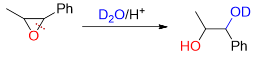

总之，断键方向的区域选择性，我们注意到酸性与碱性条件下遵循完全不同的规律，一个由位阻，一个由部分碳正离子的稳定性决定。

当然酸性条件下也有一些反应规律与碱性相同，比如立体选择性。注意到酸性下反应历程介于SN1-SN2之间，还是具有部分SN2
的特征的，亲核试剂毕竟是在C-O键未完全断裂的情况下进攻，也只能从氧原子的背面进行，因此立体选择性上，酸碱无差异，
都是反式开环。我们从之前的反应示例中也可以明显发现这一点。

小结
---------

环氧化合物碱性、酸性下的开环反应规律，我们可以大致总结如下。

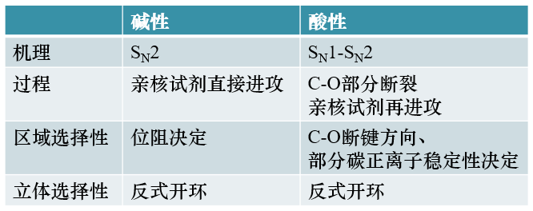

