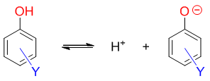

取代苯酚的酸性
==================================

酚是一类具有明显酸性的有机化合物，我们知道它的酸性一般较水、醇都来得高。而酚中最常见的，无疑是苯酚。在苯酚的基础上，
通过苯环上的亲电取代反应，我们也很容易得到一系列的苯酚衍生物，而这些衍生物通常也都是具有酸性的。当然，由于
取代的基团不同，各种苯酚衍生物的酸性也有差异。在基础有机的学习中，我们也应当掌握判断苯酚衍生物酸性
强弱的方法。

在基础有机化学中判定化合物的酸性强弱，其实有个比较固定的方法。我们知道根据质子酸碱理论，有酸性的化合物在溶剂中
可以解离出质子，存在下图的解离平衡：

在上面的解离平衡中，不同的酸性化合物，都是解离出质子，只是负离子有差异而已。而这个负离子的稳定性越强，明显
平衡就越容易向右偏，解离出的质子浓度当然会越高，相应的，该化合物的酸性也就越强。因此我们这儿可以得到个明显的
结论：\ **化合物酸性与解离质子后形成负离子的稳定性成正比**\ 。

对于取代苯酚而言，它的酸性我们也可以用同样的方式去判断。如下图所示，不同结构的取代苯酚，
解离质子后都能得到结构类似的苯氧基负离子（图中Y为苯环上的取代基团，取代位置不定）：

同样，取代苯酚的酸性就与生成的负离子稳定性直接相关。至于右侧的负离子稳定性如何，很大程度上又可以根据
取代基团Y的性质确定：如果Y具有吸电子效应，可以把电子往自己身边拉，无疑会使得氧原子上电子云密度下降，原本
较集中的负电荷将得到分散，这种取代负离子的稳定性将高于无取代的苯氧基负离子。反之若Y具有给电子效应，把电子向
苯环、向氧原子方向推，无疑会使氧上负电荷更为集中，稳定性将较无取代的苯氧基负离子下降。

总之一个基本规律：\ **连接吸电子基，取代苯酚酸性将较苯酚上升；反之连接给电子基，取代苯酚酸性将下降**\ 。

依据以上的原则，我们来看几个实例。

例：请判断如下化合物的酸性次序。
  .. image:: ../../images/C08-KeyPoints/AcidityOfPhenol03.png

  我们假设这四个分子各自解离出酚羟基上的质子，将得到下图中四种负离子。通过取代基的电性效应，这四种负离子的稳定性
  次序我们不难判断。其中第一个，对硝基苯氧基负离子，明显硝基强吸电子（-I/-C），稳定性将较苯氧基负离子更强。而第三个
  对甲基苯氧基负离子，由于甲基给电子（+I），无疑稳定性将较苯氧基负离子来得弱。至于最后的对甲氧基苯氧基负离子，
  由于对位甲氧基给电子能力较甲基更强（-C>+I），因此在四种负离子中它的稳定性应当最差。

  .. image:: ../../images/C08-KeyPoints/AcidityOfPhenol04.png

  判定了负离子稳定性，质子解离之前各取代苯酚的酸性也就随之确定，次序与稳定性相同：

  .. image:: ../../images/C08-KeyPoints/AcidityOfPhenol05.png

例：请判断如下化合物的酸性次序。
  .. image:: ../../images/C08-KeyPoints/AcidityOfPhenol06.png

  与前例类似，只不过我们当前把几个取代基团从酚羟基的对位移到了间位。

  表面看起来，取代基团甭管是在对位还是间位，给/吸电子的性质应该不会发生改变，这四个分子的酸性次序应当与前例类似。但实测
  情况略显奇怪：

  .. image:: ../../images/C08-KeyPoints/AcidityOfPhenol07.png

  我们发现，原本看起来应当酸性最弱的间甲氧基苯酚，实测酸性反而比间甲基苯酚甚至无取代的苯酚都来得更强。似乎这里甲氧基
  变成了一个吸电子基团？事实上，这与共轭效应的区域性有关系。

  我们在基础有机中接触的电性效应主要就两种：诱导效应与共轭效应。诱导效应基本不存在区域性，分子里甭管什么位置，都能受到
  取代基诱导效应的影响（当然，距离越远，影响越弱）。而共轭效应则大不相同，由于种种原因，分子中的某些特定位置，往往受到
  的影响更为强烈，另一些位置往往又几乎感觉不到共轭效应的存在，存在明显的区域性。

  对于取代苯衍生物而言，取代基团共轭效应影响比较大的是其自身的邻、对位。相反，取代基团的间位，则几乎不受共轭效应的影响。
  本例中间甲氧基苯酚酸性强于苯酚，实际就是这种区域性的结果。

  甲氧基的两种电性效应相反，-I/+C，而通常情况下我们说+C>-I，
  当它连接在苯环旁侧是，整体上应该是个中等强度的给电子基团。但注意目前间甲氧基苯氧基负离子中，负电中心氧原子刚好处于甲氧基
  间位，而这个位置偏偏又基本不受甲氧基的给电子共轭效应的影响。于是，如下图所示，没了共轭，只剩下诱导，当前的氧负离子端就基本只能感受到
  甲氧基的吸电子诱导效应，负电荷得以分散，这种负离子的稳定性也就相应地上升了，间甲氧基苯酚的酸性也就因之较苯酚更强。

  .. image:: ../../images/C08-KeyPoints/AcidityOfPhenol08.png

  类似的，间硝基苯酚中其实也存在相同的情况，酚羟基处于硝基间位，同样基本不受硝基共轭效应的影响，也只能感受到诱导效应。好在
  硝基本身的诱导效应也是强吸电子，它依然是这四个分子中酸性最高的一个。

  .. note::

    不单是取代苯酚，很多芳香衍生物中，共轭效应的区域性都会对化合物的性质造成影响，我们也需要特别留神。

例：请判断如下两个化合物的酸性次序。
  .. image:: ../../images/C08-KeyPoints/AcidityOfPhenol09.png

  都是硝基取代，一个对位，一个间位。明显本例中也存在共轭效应区域性的影响。

  如下图所示，对于对硝基苯酚，明显羟基侧能够受到硝基两种电性效应（-I、-C）的共同影响。而间硝基苯酚，
  羟基只能感受到硝基的诱导效应（-I）。两相比较，-I/-C的加和明显吸电子程度要大于单独的-I，
  于是我们可以断言，对硝基苯酚的酸性将较间硝基苯酚更强。

  .. image:: ../../images/C08-KeyPoints/AcidityOfPhenol10.png

例：请判断如下化合物的酸性次序。
  .. image:: ../../images/C08-KeyPoints/AcidityOfPhenol11.png

  本例较简单，苯环旁侧要么连接甲基，只有给电子诱导效应，不分区域；要么连接硝基，硝基还都处于羟基邻对位，共轭或诱导效应
  都可以影响到羟基。此外，不同分子中，硝基的数目不同，而我们也很容易想象，电性效应是具备叠加性的，2,4,6-三硝基苯酚
  形成的负离子由于三个硝基吸电子，稳定性自然强于2,4-二硝基苯酚得到的负离子。依次类推，这一系列分子酸性次序如下图所示：

  .. image:: ../../images/C08-KeyPoints/AcidityOfPhenol12.png

  其中，2,4,6-三硝基苯酚由于三个强吸电子硝基共同的影响，它的酸性相当之高，pKa=0.25，已经接近很多无机酸了。因此这个
  分子的俗名我们称为苦味酸——不叫酚，直接称为酸了。

关于取代苯酚的酸性，我们大致就看这么几个典型例子。这种通过负离子稳定性，通过取代基团电性效应判定酸性方法相当普适，
我们在后面的学习中还会遇到类似的情况。

