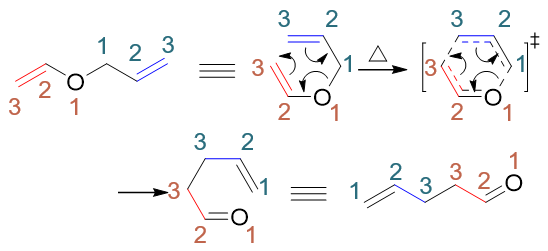
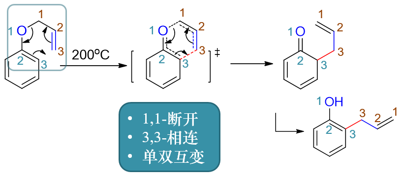
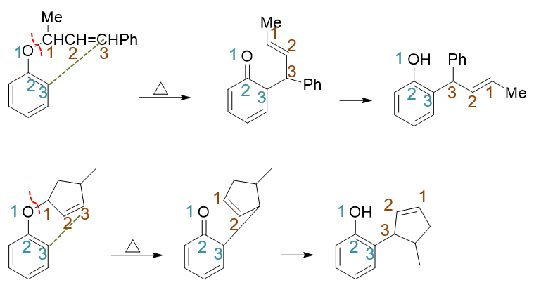
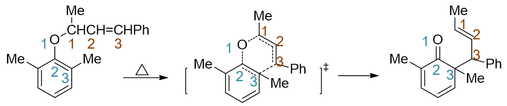
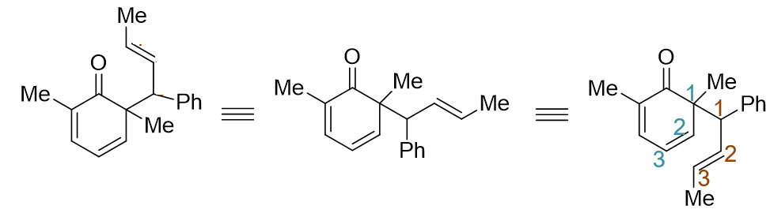
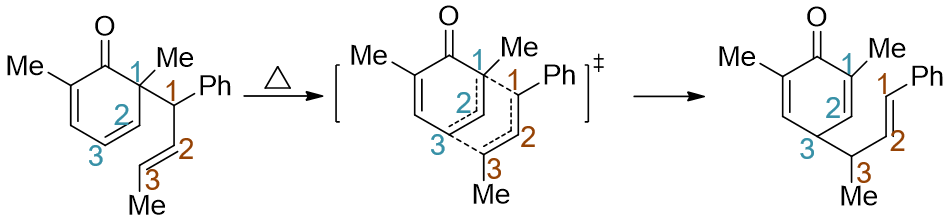
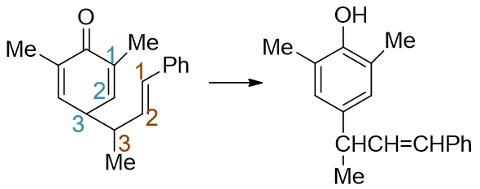
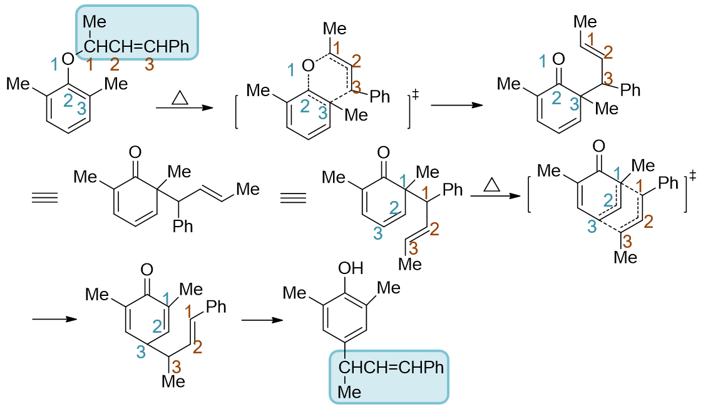

Claisen重排
==================================

酚的化学反应中，苯酚烯丙基醚的形成及相关的Claisen重排是个小小的难点与重点。但事实上，Claisen重排最早却是在另一种更简单的醚：乙烯烯丙醚的
身上发现的。

开链的乙烯烯丙醚加热时，整个分子会盘成接近六元环的形状，而后同时发生三对电子的转移（下图第二个结构），开链端头两个原子间逐渐成键，
中间C-O两个原子间的单键逐渐断开。经历一个六元环状过渡态后，最终得到产品，一个不饱和羰基化合物（如下图第二行的结构）。

该变化实际是一比较复杂的周环反应过程，具体机理在基础有机的学习阶段我们可以不用多管。但反应本身很有规律，我们可以用三句口诀概括：
\ **1,1-断开，3,3-相连，单双互变**\ 。其含义如下：

  * 1,1-断开。
    我们将涉及反应的，以两个双键为端头的六个原子从中间均分，各自编为1-3号。反应过程中，编号为1的两个原子间将断键。

  * 3,3-相连。
    相应地，端头编号为3的两个原子间将形成新键。

  * 单双互变。
    此外，整个体系中原本是单键的位置（如两组1-2之间）反应后将变为双键；反之原本是双键的位置（如两组2-3之间）反应后变为单键。

只要记住这三句口诀，Claisen重排的最终产物结构我们很容易写出。

至于苯基烯丙基醚的重排，其实与乙烯烯丙醚并无两样。如下图所示，我们不难发现，苯基烯丙基醚的经典结构式中，明显也存在一个乙烯基烯丙基醚的
结构单元。既然如此，加热时如下图所示，它也可以发生类似的重排，重排过程如出一辙，产物结构还是可以通过那三句口诀写出，我们依然得到一个不饱和羰基
化合物。值得注意的是，在这个不饱和羰基化合物中，苯环明显消失了，芳香性没有了，这对分子的稳定性自然是比较不利的。好在我们也知道，酮式
与烯醇式之间存在互变异构，绿色编号1-3这三个原子体系可以转变成烯醇式，恢复苯环结构，得到下图中第二行的分子。正常情况下烯醇式与酮式的
互变异构平衡往往是偏向于酮式的，但这里由于苯环的关系，偏偏烯醇式更稳定一些，我们也一般把最终产品写成这个结构。

总而言之，苯基烯丙醚的重排与乙烯基烯丙基醚并无本质不同，只不过最后再接一步互变异构，恢复苯环而已。

当然，我们在考试中往往还会遇到更复杂的一些结构，如下图所示，但换汤不换药，反应依然是相同的规律。

正常Claisen重排时，烯丙基单元通常会重排到酚羟基的邻位，以上各例均如此。但某些特定的情况下，有可能底物分子酚羟基的两个邻位事先都被其它基团占据了，
这时重排会遇上一个小小的麻烦。如下图中的反应，底物分子氧原子邻位上事先有两个甲基。加热条件下，重排也能发生，也还是老规则，1,1断开3,3相连
首先得到一个不饱和酮。但生成这个酮之后，我们发现，有点儿麻烦了，当前羰基的α-位上一个氢都没有，压根儿没法儿互变异构成烯醇式恢复苯环了。这个问题
该如何解决呢？

实际也挺简单，当前没法儿恢复苯环，没关系，分子会尝试再来一次重排。

我们把侧链弯折下来，贴近环的右下角，注意下图中编号的六个原子。

这六个原子的体系，不难发现其实和乙烯基烯丙基醚的体系非常类似，也是端头两个双键。
既然体系相仿，那这六个原子的区域也会发生类似的重排：

重排结果还是那三句口诀，我们看到，得到的依然是个不饱和酮的结构。另外这个不饱和酮中，羰基与旁侧的双键实际形成了共轭结构。如果把共轭结构看成
一个整体，那这个共轭结构的α-位，也就是绿色的3-位上目前有了氢。于是，这个分子的羰基-双键-α-位终于可以发生互变异构转为烯醇式了——
涉及共轭结构的互变异构比较复杂，具体过程我们可以不用多管——最终，苯环恢复，羰基转变成羟基，我们得到下图中的最终产品：

整个反应过程我们连缀下来，大致如下图所示：

这整个过程看起来比较复杂，尤其中间经历了两次重排。但事实上，对于这种邻位占据的Claisen重排，最终的产物结构其实异常容易写出。中间过程不论，
我们单单比较一下反应物与最终的生成物，仿佛就是把反应物中氧原子与烯丙基结构间的C-O键切断，而后把整个烯丙基端原封不动搬到羟基对位。因此考试时
遇上这种重排的对位情况，大家只需要把侧链部分照抄一下就成，反而比重排到邻位的反应简单得多。

.. note::

  这里我们仅讨论了Claisen重排反应。但事实上与酚有关的重要反应还有很多，如酚酯形成及Fries重排，酚芳环上的亲电取代等等。其它这些反应理解的
  难度不是特别大，大家可以在学习过程中自行总结。

