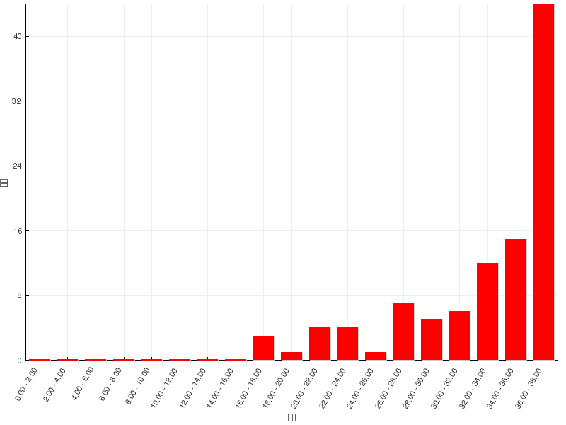

习题讲解：醛酮
========================

在线自动评分习题
---------------------

=======   =============
总分        38
平均分      32.5(85.5%)
最高分      38(100.0%)
=======   =============

  成绩分布

题3：命名（错误率36.3%）
  .. image:: ../../images/C09-Exercises/A03_00.png

  本题分子中含两个羰基，但两者又存在区别，一个醛羰基一个酮羰基。而注意官能团优先级次序，醛羰基优先级要高于酮羰基，是整个分子的主官能团，
  编号时如下图所示，应保证醛羰基位次最小，从右至左进行，整个分子母体也应是庚醛。

  .. image:: ../../images/C09-Exercises/A03_01.png

  母体庚醛的七碳链之外，分子里相当于还有两个取代基：6-位甲基自不待言，5-位还有酮羰基中的氧。注意，这里酮羰基的碳原子实际已经包含在母体中了，
  只有双键氧孤悬于外。这种情况，双键氧的这个取代基命名时我们通常称之为“\ **氧代**\ ”。整个分子因而可称为：\ **6-甲基-5-氧代庚醛**\ 。

  .. note::

    含羰基C=O双键的分子在命名时，C=O所处地位不同、位置不同也会有不同的称呼，基本情况大致如下：

      * 另有其它主官能团，羰基部分作为取代基，又可分两种情形：

          + 若羰基中碳处于母体之中，只是氧原子处于母体之外（即如上题中的情形），则该双键氧被称为\ **氧代**\ 。

          + 若羰基整体处于母体之外，则将其与旁侧的烃基部分合并称为\ **酰基**\ ，如下图中分子例。

              .. image:: ../../images/C09-Exercises/A03_02.png

      * 羰基是主官能团，则分子直接称为\ **醛**\ 或\ **酮**\ 。

        如题4中如下图的分子，分子内仅羰基一个官能团（当然也就是主官能团），整个分子应称为\ **1-苯基-1-丁酮**\ 而非“丁酰基苯”之类。

        .. image:: ../../images/C09-Exercises/A03_03.png

题5：命名（错误率40.2%）
  .. image:: ../../images/C09-Exercises/A05_00.png

  题干分子为一苯腙。腙、肟这些醛酮与氨衍生物亲核加成形成的含C=N双键的分子，其称呼通常来自于反应之前的醛酮与肼或羟胺。如本题中分子，如下图，明显
  是由丁酮与对硝基苯肼反应而来，因而可称之为\ **丁酮对硝基苯腙**\ 。

  .. image:: ../../images/C09-Exercises/A05_01.png

题25：反应（错误率14.7%）
  .. image:: ../../images/C09-Exercises/A25_00.png

  明显的碱性α-卤代条件。值得注意的是底物分子羰基两侧不对称，需要判断究竟应该是哪一侧的α-位发生反应。

  我知道碱性条件下α-卤代时，羰基旁侧具有酸性α-H首先会解离除去，形成碳负离子，而碳负离子进一步对卤素分子进攻，形成新的C-X键。这里碳负离子
  形成的位置实际也就是后继发生卤代的位置。对于底物分子而言，左右α-H解离将形成如下两种碳负离子，结构不同，稳定性也有差异。其中左侧的碳负离子，
  负电中心旁侧少了一个给电子的甲基，明显稳定性较右侧更高，反应时更易形成。因此本反应将优先取代底物左侧α-H。

  .. image:: ../../images/C09-Exercises/A25_01.png

  羰基左侧α-H有两个，我们也知道碱性条件下容易发生多取代，2mol溴，恰好将这两个氢全都取代光：

  .. image:: ../../images/C09-Exercises/A25_02.png

  此外，反应结束后这里并没有形成三卤甲基，因此不会继续断开α-碳与羰基碳之间的C-C键，不会引发卤仿反应。

题22：反应（错误率15.7%）
  .. image:: ../../images/C09-Exercises/A22_00.png

  与前一题相反，本题是酸性条件下的α-卤代。具体反应机理在基础有机的学习过程中我们无需掌握，但反应特征我们应牢记，恰好与碱性α-卤代相反：

    * 控制条件一般发生单取代；

    * 若羰基两侧不对称，一般取代在连接烃基较多的位置。

  依据以上原则，我们不难写出反应的主要产物：

  .. image:: ../../images/C09-Exercises/A22_01.png

题23：反应（错误率24.5%）
  .. image:: ../../images/C09-Exercises/A23_00.png

  简单的羟醛缩合反应。这里底物分子是小分子醛，亲核加成反应活性较高，因此反应可以在低温或常温下进行，题干中也并未加热。此时，一般会主要得到
  β-羟基醛，而并非脱水后的α,β-不饱和醛：

  .. image:: ../../images/C09-Exercises/A23_01.png

题27：反应（错误率13.7%）
  .. image:: ../../images/C09-Exercises/A27_00.png

  注意反应条件，以无极性的苯作为溶剂，又使用镁作为还原剂，此种条件下醛酮极易发生双分子还原，羰基转变成羟基的同时，两分子的原羰基碳间还会形成一根
  新C-C键：

  .. image:: ../../images/C09-Exercises/A27_01.png

  此外我们也注意到，还原之后的产物是个频哪醇类的分子，因此如果进一步提高体系酸性的话，还很溶剂继续发生频哪醇重排：

  .. image:: ../../images/C09-Exercises/A27_02.png

题28：反应（错误率11.8%）
  .. image:: ../../images/C09-Exercises/A28_00.png

  催化氢化既可以还原羰基，也可以还原C=C双键。注意到题干中并未加以控制，一般操作时氢气也是大大过量，因此这里两个官能团都会被还原掉：

  .. image:: ../../images/C09-Exercises/A28_01.png

  相反，若控制反应条件，此时由于C=C双键还原活性略高于酮羰基（但低于醛羰基），则应当是双键先被还原而羰基保留。请大家注意这两种反应条件的差别：

  .. image:: ../../images/C09-Exercises/A28_02.png

在线手动评分习题
---------------------

手动评分习题中的机理题，无非是个分子内的羟醛缩合，较为简单。而三道合成题皆有一定的难度。

合成：以苯与环己醇为主要原料合成：
  .. image:: ../../images/C09-Exercises/B02_00.png

  目标分子明显左侧环来自于环己醇，右侧来自于苯，此外相对于环己醇与苯的组合还多了一碳。更重要的，这两个结构单元我们还需要以额外的C-C键连在一处。

  在本章的学习中，我们已经知道，羟醛缩合是形成新的C-C键，将小分子连接成大分子的极为有效的手段。而羟醛缩合的产物，一定是β-羟基醛酮，
  或者是进一步脱水之后的α,β-不饱和醛酮。当前的目标分子似乎不满足这两种结构，但我们只要稍加改造，即可将其与羟醛缩合联系起来：

  .. image:: ../../images/C09-Exercises/B02_01.png

  右侧的α,β-不饱和酮催化氢化，羰基与C=C双键均被还原后，刚好可以生成目标分子。而既然出现了α,β-不饱和酮的结构，逆合成分析我们当然可以从C=C双键处
  断开，得到缩合之前的两个羰基化合物：

  .. image:: ../../images/C09-Exercises/B02_02.png

  苯甲醛无α-H，刚好可以与环己酮得到相对单一的交叉缩合产品。至于环己酮，当然可以由原料环己醇氧化生成。而苯甲醛，可以利用Gattermann-Koch反应得到：

  .. image:: ../../images/C09-Exercises/B02_03.png

  至此逆合成分析结束，整体如下图所示。正向反应大家可以自行写出。

  .. image:: ../../images/C09-Exercises/B02_04.png

  .. note::

    羟醛缩合是形成C-C键的重要手段，关于合成中使用羟醛缩合反应的一些技巧，请参阅
    :doc:`重难点小结：羟醛缩合在合成中的应用<./KeyPoints02-AldolCondensationInSynth>`\ 。

合成：以苯、甲苯及不超过四个碳的有机物为主要原料合成：
  .. image:: ../../images/C09-Exercises/B03_00.png

  明显又需要从小分子连接成大分子，又得合成C-C键。当前目标产品中存在羰基，逆合成分析时我们只需把一根C-C单键转化成双键，就又能与羟醛缩合联系起来了：

  .. image:: ../../images/C09-Exercises/B03_01.png

  接下来老办法，还是从C=C双键处拆开，恢复两分子羰基化合物结构。明显这里是1-苯基-1-丁酮与无α-H的对甲基苯甲醛发生的交叉羟醛缩合：

  .. image:: ../../images/C09-Exercises/B03_02.png

  对甲基苯甲醛，无疑从甲苯出发，通过Gattermann-Koch反应得到。而1-苯基-1-丁酮，羰基紧邻苯环，自然让我们联想到傅克酰化反应：

  .. image:: ../../images/C09-Exercises/B03_03.png

  至此，逆合成分析结束。正向写出反应时需留神最后一步，我们需要把α,β-不饱和酮中的C=C双键还原，但保留酮羰基，因此这里需要控制条件下的催化氢化：

  .. image:: ../../images/C09-Exercises/B03_04.png

合成：以丙酮和不超过2碳有机物为原料合成HOOCCH\ :sub:`2`\ CH\ :sub:`2`\ CH\ :sub:`2`\ OH。
  本题原料中有丙酮，但产品中并无羰基，两个官能团羟基与羧基分处碳链两端，似乎与丙酮2-位羰基的位置也不吻合，看起来似乎没什么头绪。

  这里其实有个小小的盲点：卤仿反应。通过卤仿反应，丙酮可以生成羧基在一端的乙酸。卤仿反应会导致碳链缩短，一般合成里其实不太受欢迎，但偶尔也可以使用。
  本题恰好就是这么一个情况。

  如果利用卤仿反应，我们不难推出，目标分子应当来自于5-羟基-2-戊酮：

  .. image:: ../../images/C09-Exercises/B04_01.png

  而5-羟基-2-戊酮中，我们明显看到了丙酮的结构单元，当然，比丙酮还多了两个碳外加一个羟基。注意多出的这部分，两碳一羟基，这不由得让我们联想到
  格氏试剂与环氧乙烷的反应：

  .. image:: ../../images/C09-Exercises/B04_02.png

  但直接用上图路线其实行不通：当前的格氏试剂中还还有一个羰基，而我们很熟悉，格氏试剂与羰基会起冲突。为了避免这一情况的发生，需要事先将羰基保护起来。
  而保护羰基的最常见方式，无非就是将其转化为缩酮：

  .. image:: ../../images/C09-Exercises/B04_03.png

  如是，格氏试剂的冲突问题被我们解决了。当然，我们知道格氏试剂肯定来自于卤代烃，而如果去保护恢复羰基结构的话，这个卤素原子刚好处于羰基α-位，
  我们可以利用酮的α-卤代反应得到：

  .. image:: ../../images/C09-Exercises/B04_04.png

  至此，整个逆合成分析完成，整体如下图所示：

  .. image:: ../../images/C09-Exercises/B04_05.png

  最后正向写出反应。值得注意的是，从丙酮出发， α-卤代生成1-溴丙酮时，明显我们只想发生单取代，因此需要使用酸性环境：

  .. image:: ../../images/C09-Exercises/B04_06.png

课本习题
-------------

课本习题中有几道值得我们注意的题目，这里一并讨论。

习题4(4)：反应
  .. image:: ../../images/C09-Exercises/C01_00.png

  看到醇与干燥HCl条件，无疑是生成半缩醛、缩醛的反应。值得注意的是底物醛分子中本身也有一个羟基，而且这个羟基位置合适，很容易与分子内羰基
  反应得到稳定性不错的五元环状半缩醛。我们也知道，分子内反应的倾向一般比分子间要高得多。本题亦是如此，也应是分子内先形成环状半缩醛后，外界
  的甲醇再参与进来，进而得到缩醛：

  .. image:: ../../images/C09-Exercises/C01_01.png

习题4(7)：反应
  .. image:: ../../images/C09-Exercises/C02_00.png

  反应条件中NaOCl其实就等同于Cl\ :sub:`2`\ + NaOH。碱性溶液中，卤素分子具备一定的氧化性，可以将反应物的醇羟基氧化成羰基，而得到的酮
  明显在此条件下可以进一步发生卤仿反应：

  .. image:: ../../images/C09-Exercises/C02_01.png

习题4(20)：反应
  .. image:: ../../images/C09-Exercises/C03_00.png

  第一步反应易见是苯甲醛与饱和亚硫酸氢钠水溶液的亲核加成，得到α-羟基磺酸钠。接下来再投入NaCN，发生的将是亲核取代，腈根负离子取代磺酸钠基，
  得到α-羟基腈。得到的这个产物其实与苯甲醛直接与HCN的加成结果相同，但通过亚硫酸氢钠与NaCN两步，可以很大程度上避免与氢氰酸加成时可能溢出
  剧毒性HCN气体的问题，操作相对更安全些。至于最后一步，当然是腈基水解为羧基。整套反应也是从羰基化合物制备α-羟基酸的常见手法。

  .. image:: ../../images/C09-Exercises/C03_01.png

习题5：反应范围
  下列一系列化合物中，分别有哪些可以(1)发生碘仿反应；(2)进行自身羟醛缩合；(3)与饱和亚硫酸氢钠水溶液加成；(4)与甲醛发生交叉Cannizzaro反应；
  (5)与Tollen试剂反应；(6)与Fehling试剂反应。

  .. image:: ../../images/C09-Exercises/C04_00.png

  本题考虑一系列与醛酮有关反应的反应范围，这类问题在考试的选择题中也是经常出现。以下分别分析。

  (1) 碘仿反应

    要求羰基化合物具有三个α-H，即必须是乙醛或者甲基酮。此外，能够被氧化成乙醛或者甲基酮的羟基化合物亦可发生反应。依据此原则，反应范围如下：

    .. image:: ../../images/C09-Exercises/C04_01.png

  (2) 自身羟醛缩合

    根据题中各醛酮结构，这里所谓“自身”羟醛缩合指的不是分子内反应，而是意味着不外加其它醛酮，只是两分子题中的羰基化合物之间的反应。而要发生
    羟醛缩合，总得先形成碳负离子，换而言之羰基化合物必须得有α-H才成。依据此原则，本题反应范围如下：

    .. image:: ../../images/C09-Exercises/C04_02.png

  (3) 与饱和亚硫酸氢钠水溶液加成

    饱和亚硫酸氢钠水溶液亲核能力不算特别强，只有一些亲核加成活性较高醛酮才能与之反应，包括几乎所有的醛、脂肪族甲基酮、八碳以下环酮等。依据
    此原则，本题反应范围如下：

    .. image:: ../../images/C09-Exercises/C04_03.png

  (4) 与甲醛发生交叉Cannizzaro反应

    与羟醛缩合相反，Cannizzaro反应要求羰基化合物必须不存在α-H，此外还得是醛才成：

    .. image:: ../../images/C09-Exercises/C04_04.png

  (5) 与Tollen试剂反应

    Tollen与Fehling试剂与酮基本无反应，但可以将醛氧化为酸。Tollen试剂相对活性较高，几乎所有的醛都能与之反应：

    .. image:: ../../images/C09-Exercises/C04_05.png

  (6) 与Fehling试剂反应

    相应地，Fehling试剂活性略差一些，一般只能氧化活性较强的脂肪醛，而不影响芳香醛：

    .. image:: ../../images/C09-Exercises/C04_06.png