醛酮的亲核加成反应
==============================

在基础有机里我们学习到的羰基化合物的化学反应中，比较重要的基本就三类：发生在羰基上的亲核加成反应与氧化/还原反应，以及由羰基旁侧活性α-H引发的相关反应。
这三大类别中，具体反应数量最多的无疑是亲核加成。

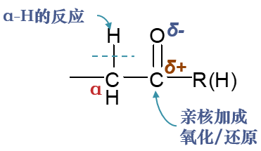

历程
----------

万变不离其宗，醛酮亲核加成反应的数量虽多，但其历程却是大致相同的，基本过程如下图所示：

.. figure:: ../../images/C09-KeyPoints/NucleophilicAddition02.png

	醛酮亲核加成典型历程A：亲核试剂直接进攻羰基碳

羰基中C=O双键明显是一根极性共价键，氧原子电负性高于碳，因而电子云会向氧原子富集，相应地碳原子上会缺电子，带有部分正电荷。
而这个缺电子碳为无疑会吸引亲核试剂（往往是负离子）向其靠拢，进而发动亲核进攻，形成一根新的共价键。由于碳原子上原本就缺
电子，新键的一对电子实际都来自于亲核试剂。

于此同时，为了维持羰基碳原子四价，新键形成的同时势必会断开旧键。这里断开的当然是相对而言键能较低的C=O间的π键，异裂后一对电子
转移到氧上，我们将得到阶段性产物：氧负离子中间体。

而这种氧负离子中间体不算稳定，一般会迅速从溶剂中夺取质子，转变为羟基，于是我们得到了亲核加成的最终产物。

如果不管中间过程，只看反应物与最终的生成物，整个反应看起来是C=O间双键变成了单键，C、O原子上各自加上了一个基团或原子。
加上新基团时又存在明显的规律：

  * 原本缺电子的羰基碳与富电子的亲核试剂相连；

  * 而原本富电子的羰基氧与缺电子的质子相连，形成羟基。

这也是整个这一系列亲核加成反应生成物结构上最典型的特征。

上边的历程中，亲核试剂是进攻能力较强的负离子。但有些亲核加成反应中，亲核试剂是电中性的分子（如醇、胺等），亲核能力稍差些。
这时我们往往需要向反应体系中加少量酸作为催化剂，反应历程也会略微发生一些改变，如下图所示。

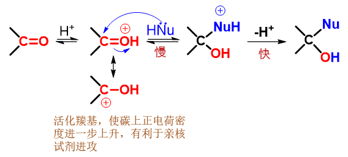

	醛酮亲核加成典型历程B：亲核试剂进攻质子化后的羰基

首先，在酸性环境中，羰基里富电子的氧会发生质子化，形成类似[钅羊]盐的结构。与醇或者醚的[钅羊]盐相仿，形成这种结构后也会
使得碳氧间共价键的极性进一步增强，使得碳原子上正电荷密度上升（参见下方的共振极限式），更有利于亲核试剂的进攻。这步质子化
相当于是进一步活化了羰基。

而后，亲核能力不太强的电中性试剂进攻活化了的羰基，引发与之前大同小异的亲核加成。最终脱除质子，得到结构如出一辙的电中性产品。

无论是哪种历程，质子化或脱质子的过程都是比较迅速的，而亲核进攻一步，涉及新键形成旧键断裂，无疑要困难得多，因此总是
反应的速控步。各种亲核加成反应的特性，也就与这一步的关系最为密切。

醛酮的反应活性
-------------------

反应的速控步，总是富电子的亲核试剂进攻缺电子的羰基碳。在亲核试剂相同的情况下，反应速率基本受到底物醛酮分子两方面的影响：

	* \ **羰基碳原子上电子云密度**\ （或者说缺电子程度）：电子云密度越低，正电荷密度越高，越容易吸引亲核试剂进攻，反应速率也就会越快；

	* \ **羰基碳旁侧烃基位阻**\ ：位阻越小，亲核试剂进攻越容易，反应速率也会越高。

依据这两个原则，我们不难判定不同的羰基化合物反应的相对活性。

比如，对于醛和酮这两种分子，我们不难发现，整体上醛的亲核反应活性会较酮来得高。原因很明显：就位阻而言，酮羰基两侧都是烃基，而醛
羰基一侧是氢原子，位阻上醛比酮要小；就羰基碳电子云密度而言，烃基一般都具有给电子诱导效应，酮羰基两侧两个烃基给电子，醛羰基只有一侧，
因而醛羰基碳的电子云密度也会较酮羰基低一些。两种因素综合，同样条件下醛的反应速率通常要明显高过酮。
而在通常结构的酮当中，羰基一侧是甲基的所谓甲基酮，反应活性通常要高过其它结构的酮——这还是由于位阻的关系。至于普通醛里，活性最高的自然是甲醛了。

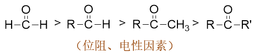

在实验室中我们还经常能遇到羰基旁侧连接芳基的所谓芳香醛酮。相对于脂肪族醛酮而言，芳香醛酮的亲核反应活性一般要差一些。这主要由于电性
方面的缘故。芳香醛酮中羰基与芳基可以形成共轭体系，羰基整体又是个挺强的吸电子基团（-I/-C），尤其是吸电子共轭效应，会把芳基上
的电子往自己身边拉，导致羰基碳上电子云密度上升，正电荷密度下降，亲核反应活性也就随之降低。

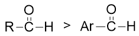

如果芳香醛酮的芳环上还连接有其它基团，则其它基团的电性效应也会对羰基电子云密度造成影响，进而影响亲核反应的活性。下图即为一些典型示例。

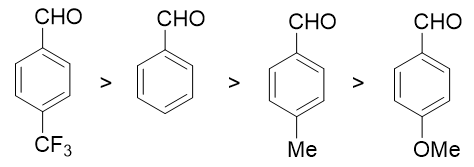

总之，无论何种亲核加成，醛酮的反应活性规律都是类似的。

典型的亲核加成反应
----------------------

目前我们学习到的较典型与醛酮发生亲核加成反应的试剂，大致有如下几类：

	* 氢氰酸

	* 饱和亚硫酸氢钠水溶液

	* 格氏试剂、烃基锂等金属有机化合物

	* 醇

	* 氨及各类氨衍生物

各类试剂与羰基化合物发生反应的过程大同小异，当然不同的试剂亲核活性存在一定的差异。其中醇、氨及其衍生物，
都是以电中性分子的形式发动亲核进攻，亲核能力相对较弱，因而反应时一般需加入额外的酸作为催化剂以活化羰基（即前述第二种历程）。
氢氰酸与亚硫酸氢钠，进攻试剂是CN\ :sup:`-`\ 与HSO\ :sub:`3`\ :sup:`-`\ 这样的负离子，但由于通常反应条件下溶液中进攻试剂负离子浓度有限，
因而整体亲核能力也不算特别强，只有活性较高的羰基化合物才能与之反应。至于金属有机化合物，亲核能力要强得多，
与各种结构不同的羰基化合物反应一般都没太大的问题。

以下列出各类亲核试剂与醛酮反应时的一些基本要素，供大家复习时参考。

与氢氰酸加成
~~~~~~~~~~~~~~~~~~~~~

* 反应

  .. image:: ../../images/C09-KeyPoints/NucleophilicAddition07.png

* 历程

  .. image:: ../../images/C09-KeyPoints/NucleophilicAddition08.png

* 亲核试剂：CN\ :sup:`-`\

* 反应条件：弱碱性最佳（促进HCN解离出CN\ :sup:`-`\ ）

* 反应范围：醛、脂肪族甲基酮、八碳以下环酮，芳香酮无法反应

* 用途：制备α-羟基酸（亲核加成后再利用腈水解反应）

与饱和亚硫酸氢钠水溶液加成
~~~~~~~~~~~~~~~~~~~~~~~~~~

* 反应

  .. image:: ../../images/C09-KeyPoints/NucleophilicAddition09.png

* 历程

  .. image:: ../../images/C09-KeyPoints/NucleophilicAddition10.png

* 亲核试剂：HSO\ :sub:`3`\ :sup:`-`\ （以S为进攻中心，如上面历程所示，亚硫酸氢根负离子存在一对共振极限式，O/S上均带部分负电荷）

* 反应条件：\ **饱和**\ 亚硫酸氢钠水溶液（不饱和的话亲核试剂浓度不足，一般不易反应）

* 反应范围：醛、脂肪族甲基酮、八碳以下环酮，芳香酮无法反应（同HCN亲核加成反应基本相同）

格氏试剂等金属有机化合物
~~~~~~~~~~~~~~~~~~~~~~~~~~~~

* 反应

  .. image:: ../../images/C09-KeyPoints/NucleophilicAddition11.png

* 亲核试剂：金属有机化合物中带部分负电荷的烃基部分

* 反应范围：进攻试剂亲核能力强，几乎所有羰基化合物皆可反应，个别位阻较大者略困难

* 用途：制备醇的同时延长碳链

.. note::

  使用格氏试剂或其它金属有机化合物从醛酮制备醇的方法，可参加醇酚醚一章的
  :doc:`重难点小结：使用格氏试剂制备醇<../C08/KeyPoints02-SynthOfAlcoholByGrignardReagent>`\ 。

醇
~~~~

* 反应

  .. image:: ../../images/C09-KeyPoints/NucleophilicAddition12.png

* 历程

  .. image:: ../../images/C09-KeyPoints/NucleophilicAddition13.png

  从醛酮得到缩醛、缩酮的过程分两大步：首先得到半缩醛酮的过程，是亲核加成。当然由于醇这种电中性分子亲和能力较差，反应时需要质子性环境，事先活化羰基。
  而从半缩醛酮到缩醛酮，实际是个SN1亲核取代，同样也需要质子性环境帮助离去基团羟基的离去。

* 反应条件：无水强酸催化（常使用干燥HCl）

* 用途：合成中保护羰基

氨及氨衍生物
~~~~~~~~~~~~~~~~~~~~~

* 氨与单取代氨的反应

  .. image:: ../../images/C09-KeyPoints/NucleophilicAddition14.png

  由于电中性氨或氨衍生物分子亲核能力亦不强，这里也需要酸活化羰基。当然氨具有碱性，这里不能用强酸，一般需要使用一些弱酸。
  在亲核加成生成α-氨基醇后，由于同一碳上连接了羟基与氨基两个相对活泼的基团，结构不稳定，羟基与氮上的氢会自发消除，得到
  C=N双键。

  单取代氨与醛酮的反应过程亦类似，同样首先得到α-氨基醇再接脱水，得到C=N双键。

  .. image:: ../../images/C09-KeyPoints/NucleophilicAddition15.png

  不同的单取代氨衍生物与醛酮反应后，生成结构类似但分类不同的分子。需要特别留神氨衍生物及反应生成物各自的名称：

  .. image:: ../../images/C09-KeyPoints/NucleophilicAddition16.png

* 二取代氨的反应

  .. image:: ../../images/C09-KeyPoints/NucleophilicAddition17.png

  二取代氨（如两个烃基取代氢的仲胺）与醛酮的反应同样是亲核取代，但生成α-氨基醇后，氮原子上不再连接有氢原子，因此羟基只能
  转而与原羰基α-碳上的氢消去，生成包含C=C双键的烯胺。

与亲核加成有关的反应
---------------------------

部分醛酮其它类别的反应，其实也与亲核加成有关。典型的如羟醛缩合与Wittig反应。

羟醛缩合
~~~~~~~~~~~~~~~~~~~~~~~~~~~~~~~~~~~

羟醛缩合，我们一般将其归类为醛酮α-H的反应。在通常的碱催化条件下，反应的起点是醛酮酸性α-H的离去，碳负离子的形成。但在此之后，
就是彻头彻尾的亲核加成过程，碳负离子作为亲核试剂，进攻另一分子醛酮的羰基碳，羰基C=O双键转变为单键：

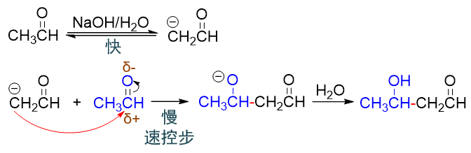

脱α-H形成碳负离子，相对比较容易，整套反应的速控步，还是亲核试剂碳负离子对羰基的进攻。因此羟醛缩合反应的很多特征也与其它的亲核加成
一般无二。

比如产物结构上，与其它亲核加成类似，也是底物分子的羰基转变成羟基，氢加到氧上。而作为亲核试剂的碳负离子，加到底物的羰基碳上。

再如反应活性上，也还是醛明显高于酮。醛的反应往往在低温或常温就可以进行，而酮，通常需要加热反应。当然加热时我们也知道，缩合产物
β-羟基醛酮将会发生脱水，得到α,β-不饱和醛酮。

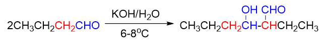

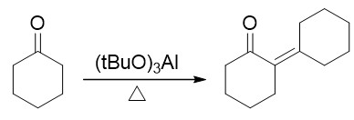

Wittig反应
~~~~~~~~~~~~~~~~~~~~~~~~~~~~

至于涉及磷叶立德的Wittig反应，从本质上说其实也是一个亲核加成。

我们知道磷叶立德的实际结构是下图中两个共振极限式的平均化，C-P键的成键情况介于单双键之间，而成键电子偏向于碳原子，碳上带有部分负电荷：

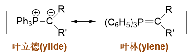

而这种电子云密度较高的碳通常都具有较强的亲核性，它可以进攻羰基中的缺电子碳，引发亲核加成，形成新C-C键的同时，断开羰基C=O间π键，形成
氧负离子：

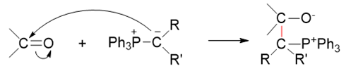

到这里，都与常规的亲核加成反应一般无二。但接下来的过程略有不同。正常亲核加成反应时，生成的氧负离子将从溶剂中夺取一个质子，转变为电中性的羟基。
而对于Wittig反应而言，我们瞅一眼生成的这个中间产物，氧负离子想转变成电中性，压根儿不需要再去找质子，它的旁侧，刚好有个磷正离子。
于是这两者之间迅速配对，形成新的O-P键，关成四元环：

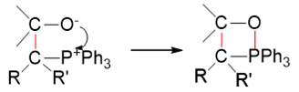

四元环本身张力较大，更何况当前环上还有O、P两个杂原子，很不稳定。几乎在形成的同时，就开始断键破裂，C-O、C-P间共价键发生异裂断开，两对
电子分别转移到O-P、C-C之间，形成O=P、C=C双键，最终，我们生成稳定的产物：三苯氧磷与烯烃。

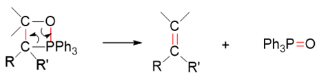

整个Wittig反应的过程连缀起来，大致如下图所示：

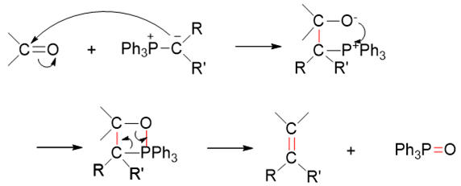

这个过程某种意义上说，我们可以把它看成是一个变形的亲核加成反应，无非是正常的亲核进攻之后，又接了成四元环及四元环破裂的变化。反应的速控步，
还是磷叶立德对羰基亲核进攻的一步，因此反应的很多特征，包括反应活性规律，也与普通的亲核加成一致。

当然，Wittig反应的整个流程看起来比较复杂，在基础有机中并不要求大家掌握。如果不管中间过程，只看头尾的反应物与生成物，其实特别简单：
无非就是醛酮的羰基碳与磷叶立德中的烃基部分，通过新形成的一根C=C双键连接在一起，如是而已：

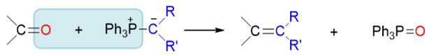

综上，羰基的亲核加成可以说涉及醛酮的最重要的一类化学性质，大量的具体反应都与之相关。我们在学习时，也可以对这些反应进行关联性的记忆。

