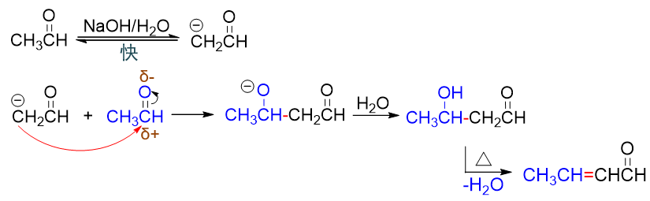
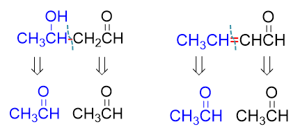

羟醛缩合在合成中的应用
========================================

羟醛缩合反应中，会生成一根新的C-C键，将两分子羰基化合物连缀为一体，使得碳链大为增长，因此这个反应在合成里相当重要，
是我们从小分子合成大分子的重要手段之一。当然，这也使得该反应成为我们考试中合成题里的常客。

我们已经很熟悉羟醛缩合的产物结构上的特征：一定是一个β-羟基醛酮，或者是进一步脱水之后的α,β-不饱和醛酮。但凡在目标
分子中看到这样的结构特征，多半儿就可以利用羟醛缩合反应进行制备。

此外根据反应机理，我们也很知道，羟醛缩合过程中，新生成的C-C键如下图中红色所示，一定处于β-羟基醛酮的羟基旁侧，
或着干脆就是α,β-不饱和醛酮双键所处的位置：

因此做逆合成分析时，我们可以反其道而行之，从这两个位置把β-羟基醛酮或者α,β-不饱和醛酮切开分成两块儿，各自恢复
成反应前羰基化合物的结构，大致就可以推断出合成所需的原料：

以下我们来看一些相关的示例。

例：请合成如下分子。
  .. image:: ../../images/C09-KeyPoints/AldolCondensationInSynth03.png

  目标产物明显是个β-羟基酮，不用多想，利用羟醛缩合。逆合成分析时从β-位羟基内侧将碳碳键切断，不难发现，两部分
  应当分别来自3-戊酮与甲醛：

  .. image:: ../../images/C09-KeyPoints/AldolCondensationInSynth04.png

  3-戊酮结构对称，有α-H可以形成碳负离子，而甲醛无α-H，两者交叉缩合，可以得到单一的产品，满足合成需求。
  具体的正向反应大家可以自行写出。

例：请合成如下分子。
  .. image:: ../../images/C09-KeyPoints/AldolCondensationInSynth05.png

  目标产物结构特征更明显，α,β-不饱和酮。逆合成分析时当然直接从C=C双键位置切开，两部分各自恢复原本羰基化合物的结构：

  .. image:: ../../images/C09-KeyPoints/AldolCondensationInSynth06.png

  不难看出，该目标分子又是可以由苯乙酮与苯甲醛的交叉缩合制备。

例：请合成如下分子。
  .. image:: ../../images/C09-KeyPoints/AldolCondensationInSynth07.png

  分子内的羟醛缩合反应经常用于制备环状化合物。如本例，环状结构的α,β-不饱和酮，我们依然从C=C双键位置切开，不难看出，
  它应由含两个羰基的2,6-庚二酮发生分子内缩合得到：

  .. image:: ../../images/C09-KeyPoints/AldolCondensationInSynth08.png

  至于类似2,6-庚二酮这样，分子内两个羰基相隔三个碳原子的二酮，我们也有特定的方法去进行制备。具体将在下学期《碳负离子的反应》
  一章中详细讨论。

  .. note::

    2,6-庚二酮中存在两种化学环境不同的α-H，可以生成两种不同的碳负离子，再对另一个羰基进攻，原则上可以得到两种不同结构的
    环状产物，但实际基本只会形成目标分子一种。为什么会出现这个现象，大家可以自己琢磨一下。

例：请以苯及不超过三碳的化合物为原料合成如下分子。
  .. image:: ../../images/C09-KeyPoints/AldolCondensationInSynth09.png

  目标分子看起来是个醇，没有羰基，似乎与羟醛缩合并无关系。但很多时候，结合其它的反应，我们可以把看似不相干的结构转化为
  β-羟基醛酮或是α,β-不饱和醛酮，进而利用羟醛缩合去延展碳链。

  当前的目标分子中最显眼的就是醇羟基。而合成醇，我们前面介绍过，一种很重要的方法就是利用羰基化合物与格氏试剂的亲核加成反应，
  一方面得到羟基，另一方面也可以增长碳链：

  .. image:: ../../images/C09-KeyPoints/AldolCondensationInSynth10.png

  格氏试剂又来自于卤代烃溴乙烷，不超过两碳，满足原料要求。至于我们推出的这个酮，碳原子数目依然很多，还需要继续往下分析，把它
  倒推成碳链更短的分子。当前结构中已经出现羰基了，和羟醛缩合的产品相比，其实就少了一根C=C双键。而我们也知道，C-C单键是可以由
  双键还原得到的，因此这里如果我们逆推出一根双键，得到的结构刚好就可以满足羟醛缩合产物的特征：

  .. image:: ../../images/C09-KeyPoints/AldolCondensationInSynth11.png

  注意上头这个不饱和酮，我们控制条件进行催化氢化，刚好可以保证双键还原而酮羰基保留。

  现在既然已经推出了α,β-不饱和酮，毫无疑问，我们又可以利用羟醛缩合反应了，它应当来自于苯甲醛与丙酮的交叉缩合。丙酮满足原料要求，
  而苯甲醛可以通过苯的Gattermann-Koch反应制备：

  .. image:: ../../images/C09-KeyPoints/AldolCondensationInSynth12.png

  到这儿，逆合成分析结束，我们的思路也整个儿完成。连缀起来，大致如下图所示：

  .. image:: ../../images/C09-KeyPoints/AldolCondensationInSynth13.png

综上所述，羟醛缩合是我们在合成中延长碳链的一种强有力的武器。与羰基有关的目标分子，在进行某些特定结构转化后，往往就能与羟醛缩合关联起来。

