醛酮的氧化/还原反应
========================================

羰基化合物的氧化态处于中不溜的位置，往上，可以再被氧化成羧酸；往下，又可以被还原成醇或者其它类型的分子。
涉及羰基化合物的氧化、还原反应数量也相对较多，这里我们做一个简单的总结。

氧化反应
-----------

醛的氧化
~~~~~~~~~~~

对于醛酮两种羰基化合物而言，由于醛的羰基碳上连接有氢原子，氧化起来相对容易。高锰酸钾、重铬酸钾等强氧化剂都没问题：

注意上面第二个反应，需要使用氧化能力稍弱一些的碱性高锰酸钾体系，若是酸性，则苯环旁侧侧链将连根被氧化为羧基生成苯甲酸。

当然，更稳妥的方式，是使用弱一些的，选择性更高的氧化剂，还可以进一步避免对其它一些官能团造成影响。实验室中最常见的方式是使用氧化银：

.. image:: ../../images/C09-KeyPoints/OxidationAndReduction03.png

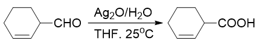

此外，Tollen或Fehling试剂也是一种选择。由于反应现象明显，这两种试剂其实更多地用于醛羰基的结构鉴定上。两种试剂存在些区别，如下表所示：

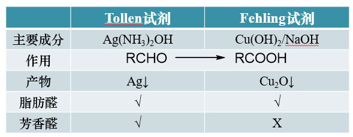

注意Tollen与Fehling试剂的氧化范围略有不同，前者各类醛基本均可氧化，后者则氧化性能稍差，无法氧化类似苯甲醛这样的芳香醛。
因此联合使用Tollen及Fehling试剂，也可以作为鉴定芳香醛的一种手段。

酮的氧化
~~~~~~~~~~~

对于羰基碳上无氢的酮，氧化起来就要困难多了，常规的高锰酸钾之类往往也拿它没办法。只有使用特定的强氧化剂长时间加热，才可能从羰基两侧断开
C-C键，形成多种小分子羧酸的混合物，合成上没有太大的价值。唯有一些结构对称的环酮，可以得到相对单一的产品，在合成中偶见使用：

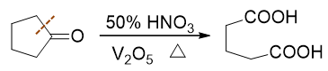

但此条件较为苛刻，除羰基外亦会影响很多其它官能团，一般不宜多用。

还原反应
-------------

无论醛酮，都不难被还原。还原存在两条途径：羰基还原成羟基，或者还原成亚甲基。两条途径手段各有不同：

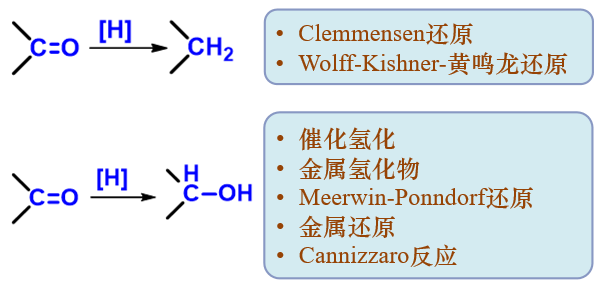

还原为亚甲基
~~~~~~~~~~~~~~~~

将羰基还原为亚甲基，常见两种方式：Clemmensen还原与Wolff-Kishner-黄鸣龙还原：

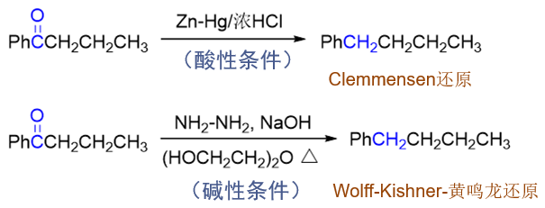

Clemmensen还原在酸性条件下进行，一般使用较多。但有时分子内可能还存在其它对酸敏感的官能团，此时即可换用
碱性环境下进行的Wolff-Kishner-黄鸣龙还原。这两种还原方式刚好互为补充。

还原为羟基
~~~~~~~~~~~~~~~~

常规方法
+++++++++++++

将羰基还原为羟基的手段更多。下表中列出了部分常见还原条件，尤其是这些条件在还原羰基的同时，对其它一些官能团的影响。

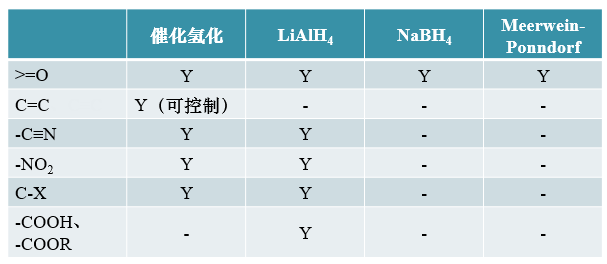

实验室中最常见还原羰基的手段是催化氢化与四氢铝锂，这两种条件还原活性都较强，反应速率较快产率较高，但相应地选择性较差，会影响不少其它的官能团。
如催化氢化时，还会影响分子内的C=C双键。当然，羰基与C=C双键还原时活性有差异：\ **醛羰基 > C=C > 酮羰基**\ 。因此通过
控制反应条件，我们可以控制某个特定基团优先被还原：

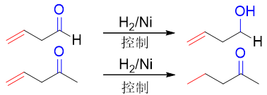

但若是C=C双键与羰基共轭的α,β-不饱和醛酮，一般总是双键优先被还原（即便是醛羰基亦是如此）：

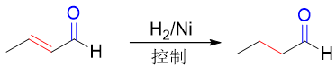

至于具体如何控制，依据不同的化合物，往往需要采取不同的做法，较为复杂，我们暂时不用详细了解。

四氢铝锂则一般不会影响不与羰基共轭的C-C间双键或叁键，也不会影响小环：

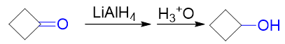

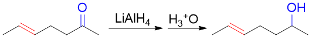

但四氢铝锂还原活性高，同样选择性不好，也会影响酯基、硝基等其它官能团。如下图中的反应，使用四氢铝锂还原，则分子中的C-X键也会
被还原为C-H键：

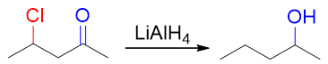

此处若要保留C-X键，可以使用硼氢化钠还原。硼氢化钠与四氢铝锂结构类似，还原历程也类似，但活性较低选择性相对高得多，温和条件下，
基本只影响到羰基：

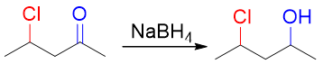

Meerwein-Ponndorf还原则是另一种选择性极高的还原酮羰基的选择，它其实是氧化仲醇的Oppenauer氧化的逆反应：

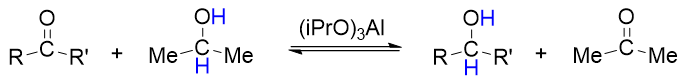

实际操作时，可不断蒸去生成的丙酮，确保平衡向右移动。该法选择性特高，即便是共轭的α,β-不饱和酮，还原时也不会影响C=C双键：

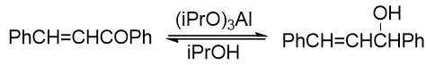

非常规方法
+++++++++++++

除以上常规还原方法外，将羰基转变为羟基，还有一些相对较少使用的场合性做法。

如亦可使用Na/EtOH、Fe/HOAc等体系，以金属作为还原剂，对羰基进行还原，其效果大略类同于四氢铝锂：

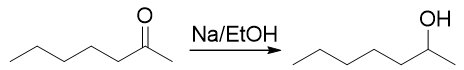

此外，如若使用Mg、Mg-Hg、Al-Hg等金属或合金，在苯、甲苯等非质子溶剂中反应，则会发生特殊的“双分子偶联还原”：

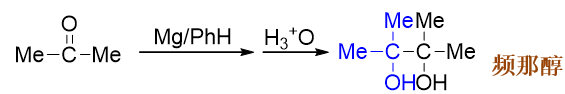

羰基被还原成羟基的同时，原本的两个羰基碳之间也形成一根新的C-C键，两分子连为一体。从某种意义上说，这也可以作为
合成中延长碳链的一个手段。

此外，注意到酮经过这样的双分子还原后，得到的总是邻二叔醇，也即频哪醇类的分子，因此该反应经常与频哪醇重排串联在一起：

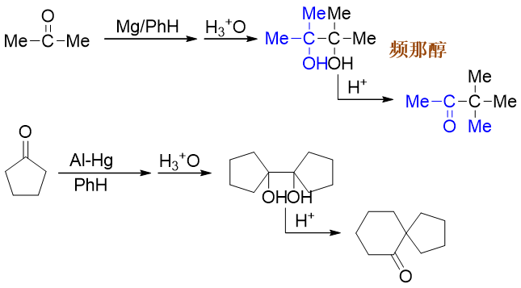

对于不含有α-H的醛，还可以利用交叉Cannizzaro反应进行还原：

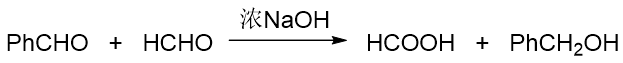

上面反应中把苯甲醛与甲醛混在一起进行交叉反应。在所有的醛中，一般而言甲醛最为活泼，发生交叉Cannizzaro反应时，枪打出头鸟，
通常总是甲醛分子被氧化，相应地另一分子醛被还原生成醇。因此这里甲醛可视作还原其它醛的一种有效的还原剂。

需要特别注意的是，必须是无α-H的醛才可以使用交叉Cannizzaro反应还原。若有α-H，则碱性条件下容易产生碳负离子，主要将发生
羟醛缩合。

以上是基础有机中我们学习到的醛酮氧化、还原反应的大致情况。反应数量不少，但很多反应比较类似，大家也可以在做好总结的基础上
进行关联记忆。

