α,β-不饱和醛酮的亲核加成
========================================

机理
----------

普通的醛酮的亲核加成反应，我们已经都很熟悉，反应的动力是富电子亲核试剂对羰基缺电子碳的进攻，进攻的位点非常确定：

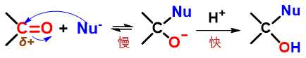

	醛酮亲核加成典型历程：亲核试剂直接进攻羰基碳

但对于结构特殊、分子内部存在共轭体系的α,β-不饱和醛酮而言，情况会略微发生一些变化。由C=C双键与羰基构成的共轭体系
中，会有两个原子带有部分正电荷，都可能成为亲核试剂进攻的靶点，分别引发\ **1,2-**\ 与\ **1,4-加成**\ ：

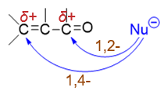

之所以如此，还是与共轭体系与电子离域有关。对于α,β-不饱和醛酮中的电子离域体系，我们可以写出下图中的一系列共振极限式。
这些共振式的写法我们也应当并不陌生，无非就是人为地令电子发生转移。如在经典结构式(I)的基础上，人为令羰基C=O双键中π键
一对电子转移至氧上（箭头a），可以得到电荷分离的共振式(II)；而(II)中C2-C4这一区域，我们放眼看过去
其实类似于熟悉的烯丙基碳正离子结构，因而接下来可以再令C3-C4间π键一对电子转移至C2-C3之间形成双键（箭头b），同时电荷也发生转移，
得到共振式(III)：

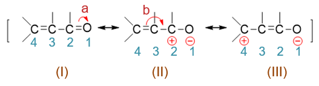

而共振式(II)与(III)中分别是C2、C4带有正电荷，最终分子实际结构是这一系列共振极限式的平均化，2-、3-位碳原子上都会
带有部分正电荷，于是它们皆可能成为亲核试剂进攻的靶点：

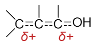

.. note::

  关于共振论的讨论与共振式的写法，若有遗忘，请参见\ :doc:`重难点小结：共振论(1)<../C05/KeyPoints03-ResonanceTheory1>`\
  与\ :doc:`重难点小结：共振论(1)<../C05/KeyPoints03-ResonanceTheory2>`\ 。

如若亲核试剂进攻2-位碳原子，反应相当于直接发生在羰基上，如下图所示，其过程与普通醛酮的亲核加成也并无二致，
最终产品结构相当于亲核端加在缺电子的2-位碳上，而质子加在富电子的1-位氧上。整个过程我们自然称之为1,2-加成：

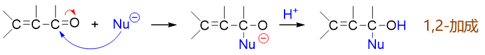

反过来如若亲核试剂进攻4-位碳原子，其过程大致可理解为下图。首先，亲核试剂与C4之间成键，为了保持C4四价，必须
断开键能较低的C3-C4间π键，一对电子转移至C3，形成碳负离子。而这个离子中明显碳负中心与右侧羰基间存在共轭，且
氧的电负性又高于碳，因而我们又可以人为地令C3上多出的一对电子转移至C2-C3之间，形成C=C双键，同时拆开C2-O1之间
的π键，一对电子转移到氧上，得到新的，也是更稳定的共振极限式。而后，质子与负电荷密度更高的氧原子结合，生成电中性
加成产物。就结果来看，亲核端与质子分别加在共轭体系两端的4-、1-位原子上，因此这个过程我们称之为1,4-加成。

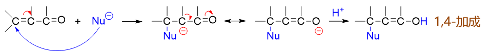

值得注意的是，1,4-加成的结果明显是个烯醇，而我们也知道，烯醇式与酮式之间存在互变异构，且通常酮式来得更加稳定，因此
我们再继续向下写，互变异构后1-位氧上的H又重排到3-位碳上，得到反应的最终产品：

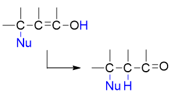

互变异构后的最终产物里，看起来H与Nu分别处于原本共轭体系的3-、4-位，似乎加成就直接发生在C=C双键上，而与羰基无关。
但究其本质，反应实际与共轭体系中所有原子都有关联，先1,4-加成再接互变异构的这么一个过程。

反应倾向
------------

既然α,β-不饱和醛酮的亲核加成存在1,2-与1,4-两条可能的途径，那究竟反应时以何种产品为主？这也是个值得深究的问题。
与之前共轭二烯的亲电共轭加成类似，此处醛酮的亲核共轭加成中，动力学控制容易引发1,2-，而热力学控制容易导致1,4-。
换而言之，反应物（亲核试剂、底物醛酮）活性较高、浓度较高，则倾向1,2-加成；反之则倾向1,4-加成。

如对底物醛酮分子，我们知道醛的亲核加成反应活性要高过酮，因此α,β-不饱和醛相对容易发生1,2-加成，不饱和酮则偏向于
发生1,4-加成。

对于亲核试剂，情况也是类似，活性越高越有利于1,2-，越低越有利于1,4-。常见的亲核试剂与不饱和醛酮发生反应的粗略情况
大致如下表所示：

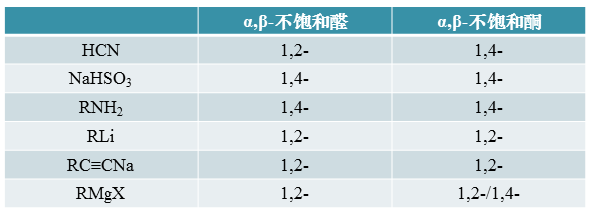

我们明显可以发现，亲核试剂里呈电中性且亲核能力相对较弱的胺（包括其它一些氨衍生物类试剂），一般容易发生1,4-加成。
类似的，活性同样不太高的饱和亚硫酸氢钠水溶液，往往主要发生的也是1,4-加成。反之活性强得多的金属有机化合物，
尤其是烃基锂及炔钠，通常只会导致1,2-加成。而格氏试剂的活性较烃基锂稍弱一些，在遇到羰基旁侧位阻较大的不饱和酮时，
则有可能转而主要进行1,4-加成。

.. note::

  上表仅反映共轭亲核加成的大致情况，实际反应走向往往会更加复杂，还与反应溶剂、温度、时间等多种其它因素等有关联。

最后列举一些典型的反应实例。

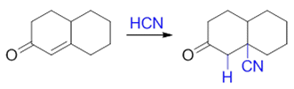

  HCN参与反应时，亲核试剂是解离出的浓度不高的氰根负离子，亲核活性不算强，在与不饱和酮的反应中主要进行1,4-加成

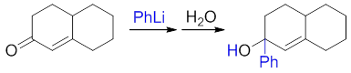

  烃基锂试剂亲核活性很强，无论是不饱和醛还是酮，通常主要都是1,2-加成

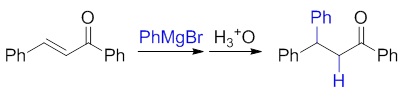

  格氏试剂活性稍弱于烃基锂，遇到羰基旁侧位阻较大的不饱和酮，往往主要发生1,4-加成

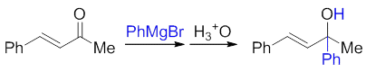

  但若羰基旁位阻不大，格氏试剂又会转而以1,2-加成为主

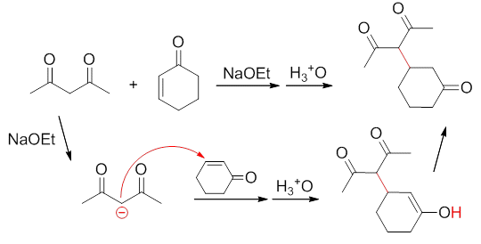

  1,3-官能团化合物解离活泼氢得到的碳负离子也具有明显的亲核活性，但解离出的碳负离子浓度一般不会很高，以1,4-加成为主

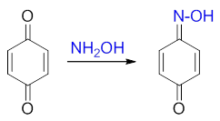

  正常氨衍生物与不饱和酮主要发生1,4-加成，但醌活性比普通的不饱和酮更强，较为特殊，与羟胺等反应时常以1,2-加成为主

