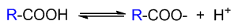
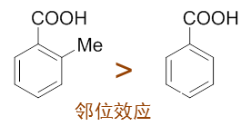

重难点小结：不同结构羧酸的酸性比较
==================================

羧酸名字里就带个酸字儿，当然是典型的具有酸性的有机化合物。不同结构羧酸酸性强弱的比较，也是基础有机化学学习过程
中的一类常见问题。处理这类问题，依然还是我们之前的惯用做法，考查质子解离后形成的负离子的稳定性。

对于羧酸而言，形成的羧酸根负离子稳定性无疑会受到旁侧基团的影响。一般来说，旁侧基团R吸电子能力越强，越能帮助羧酸根
上负电荷的分散，形成的负离子也就越稳定，解离平衡越向右偏，该羧酸的酸性也相应地越高。反之若旁侧基团R给电子能力
越强，越不利于羧酸根负离子的稳定，该酸的酸性也就越弱。

至于旁侧基团的给、吸电子能力，实际受到很多因素的影响。在基础有机化学中，我们一般只考虑其中最基本的因素：
电性效应（包括诱导效应与共轭效应）。

以下我们来看一些典型示例。

示例：请比较以下化合物的酸性强弱。
  .. image:: ../../images/C10-KeyPoints/AcidityOfAcid02.png

  这一系列化合物结构相仿，我们可以都将其视之为乙酸的衍生，一个新基团取代了乙酸α-位的氢原子：

  .. image:: ../../images/C10-KeyPoints/AcidityOfAcid03.png

  如前所述，只需考查这个基团的电性效应，即可判断该羧酸的酸性强弱。需要留神的是，当前在取代基团Y与羧基之间隔开了一个
  sp\ :sup:`3`\ 杂化的饱和碳原子，因而Y与羧基包括羧酸根之间不可能形成共轭体系。换而言之，Y的共轭效应不会对负离子的
  稳定性造成影响，这里我们只需要考虑它的诱导效应。

  单就诱导效应而言，明显甲基是+I，推电子，这将导致丙酸的酸性较乙酸要弱些。其余的-OH、-X、-NO\ :sub:`2`\ ，由于
  杂原子的电负性较强，都是-I吸电子，因而相应的取代羧酸酸性都将强于乙酸。此外-I吸电子的能力上明显有
  -NO\ :sub:`2`\ > -Cl > -Br > -OH的次序，由此这些取代羧酸的酸性高下也就不难判断：

  .. image:: ../../images/C10-KeyPoints/AcidityOfAcid04.png

.. note::

  常见的一些基团诱导效应强弱大致如下图所示：

  .. image:: ../../images/C10-KeyPoints/AcidityOfAcid00.png

示例：请比较以下化合物的酸性强弱。

  .. image:: ../../images/C10-KeyPoints/AcidityOfAcid05.png

  第三个分子实际是碳酸，但某种意义上，我们也可以将其视为羟基取代的甲酸。于是这三个分子也都具有甲酸母核，区别无非就是
  羧基碳上连接的基团（-H、-Me、-OH）不同。

  按惯例，我们还是考虑取代基团的电性效应。对于乙酸而言，取代的-Me就是很单纯的诱导给电子+I，因此不难判断，它的酸性
  将较甲酸为弱。至于碳酸，-OH诱导效应上无疑还是吸电子-I。但与前例不同，这里我们注意到羟基与羧基直接相连了（而不是
  中间隔开了饱和碳）。不难发现，从取代的羟基到右侧羧基，其实是可以形成共轭体系的，因而这里羟基的共轭效应将对羧基
  产生影响。羟基共轭时会提供一对电子，无疑具有给电子共轭效应+C。而且对于一般的杂原子基团，我们也知道通常共轭效应会
  大大强于诱导效应，整体上羟基在这里是个很强的给电子基团（+C >> -I），给电子能力也比乙酸中的甲基高得多，相应地，
  碳酸的酸性也就要弱于乙酸不少：

  .. image:: ../../images/C10-KeyPoints/AcidityOfAcid06.png

示例：请比较以下化合物的酸性强弱。
  .. image:: ../../images/C10-KeyPoints/AcidityOfAcid07.png

  这是一系列结构类似的取代苯甲酸，取代基均处于羧基对位，我们依然可以利用基团的电性效应来判定其酸性强弱。

  首先所有这些取代基团的诱导效应显然会影响羧基；于此同时，从取代基到苯环到羧基也可以形成大共轭体系，且取代基
  刚好处于羧基的对位，因而取代基团的共轭效应（如果存在的话）同样也会对酸性造成影响。

  如对甲基苯甲酸中的甲基，无法参与共轭也没有共轭效应，诱导效应单纯的+I，因而酸性上应较苯甲酸为低。

  而对羟基苯甲酸，羟基+C >> -I，整体上是个很强的给电子基团，给电子能力远强于甲基，这导致它的酸性也较苯甲酸弱不少。

  至于对溴苯甲酸，溴的诱导效应-I，共轭效应+C。但卤素原子与其它饱和杂原子不同，-I会略大于+C，因此溴这里整体上
  是个比较弱的吸电子基团，对溴苯甲酸的酸性也略高于苯甲酸。

  最后对腈基苯甲酸，诱导效应-I；共轭上，由于腈基中C、N均只各出一个电子参与共轭，没有多给，且又都是sp杂化，对
  电子的束缚能力强于sp\ :sup:`2`\ 杂化的苯环、羧基碳，因此具有挺强的-C效应。两相叠加，这几个取代基团中就
  以它的吸电子能力最高，相应的，对腈基苯甲酸的酸性也就最强。

  .. image:: ../../images/C10-KeyPoints/AcidityOfAcid08.png

.. note::

  对羟基苯甲酸中的酚羟基实际也具有一定的酸性，但其酸性远弱于羧基，因而这里基本可以将其忽略。

示例：请比较以下化合物的酸性强弱。
  .. image:: ../../images/C10-KeyPoints/AcidityOfAcid09.png

  与前例类似，但将各取代基团从羧基对位移至间位。

  无论取代基在何位置，其诱导效应的倾向不会有太大改变，但反过来共轭效应受位置的影响要大得多。对苯衍生物而言，
  取代基团共轭效应影响比较大的是其自身的邻、对位。相反，取代基团的间位，则几乎不受共轭效应的影响。因此，
  我们不难发现，这里的一串分子，羧基将基本感受不到取代基团的共轭效应，各分子的酸性基本也只与取代基的诱导
  效应相关。由此，我们也就不难理解这一系列分子实测的pKa值了：

  .. image:: ../../images/C10-KeyPoints/AcidityOfAcid10.png

示例：请比较对溴苯甲酸与间溴苯甲酸的酸性强弱。
  同样的，而间溴苯甲酸影响羧基的基本只是-I，而对溴苯甲酸中羧基可以同时感受到溴的-I、+C两种效应，两者部分抵消，
  因此间溴苯甲酸的酸性将高于对溴苯甲酸：

  .. image:: ../../images/C10-KeyPoints/AcidityOfAcid11.png

.. note::

  取代苯甲酸酸性的比较其实与取代苯酚中的类似问题如出一辙。可进一步参阅
  \ :doc:`重难点小结：取代苯酚的酸性<../C08/KeyPoints06-AcidityOfSubstitutedPhenols>`\ 。

在取代苯甲酸中，有一种比较特殊的情况是邻位取代衍生物。实验中发现，羧基邻位如若有取代基团，
不论该基团电性效应是给电子还是吸电子，往往都会使得这种取代酸的酸性较单纯的苯甲酸来得更高（所谓的邻位效应）：

这可能源于两个基团相对较近的位置。除电性效应外，位阻、分子内氢键等多种其它因素这里也会影响到羧基的酸性。
由于情况复杂，基础有机中我们对其也不作过多讨论。

